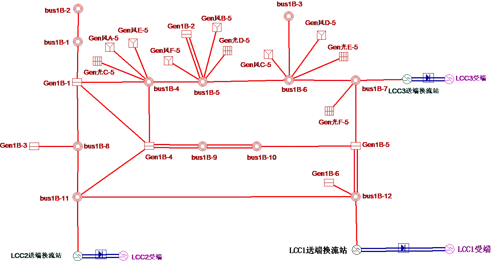
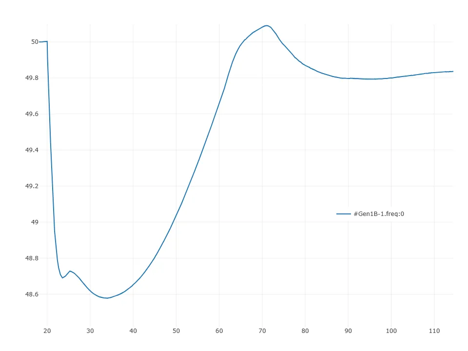

该算例对应中国电机工程学会 Github 发布算例中的 CSEE-LF-90 算例。

## 场景描述
新能源+常规电源经直流外送系统，发生掉机故障，功率缺额导致系统低频问题。

## 系统概况
根据某区域实际电网拓扑和数据，搭建如图所示的两区域交直流混联电网，所在区域编号为1B（此处区域为BPA中的分区名称）。输电网架共有102个节点（500kV主网架为42个节点），输电网架概况如表所示。系统内3条直流，LCC1直流送出功率80万千瓦，LCC2直流送出功率80万千瓦，LCC3直流送出功率80万千瓦。

## 拓扑与线路概况
系统共有交流线路26条，变压器30台、直流回路1回，线路及变压器概况如下。

## 电源概况
水电机组总装机5350MW，均位于区域1B；风电、光伏2种新能源机组总装机2400MW，均位于区域1B；新能源机组装机占比接近31%。系统电源装机概况详见下表。

## 负荷概况
全网总负荷2601.9MW，均位于区域1B。系统负荷概况详见下表。

## 故障场景
系统发生掉机故障，损失功率35万千瓦。系统暂态频率最低低于49Hz，存在低频问题，CloudPSS算例中掉机故障发生于第20s。BPA、PSASP 以及 CloudPSS 中仿真结果如下所示。

