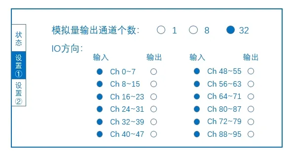
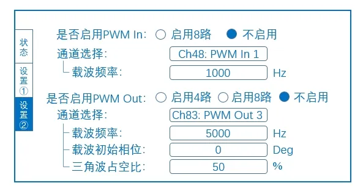
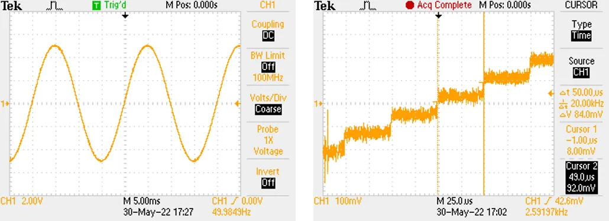
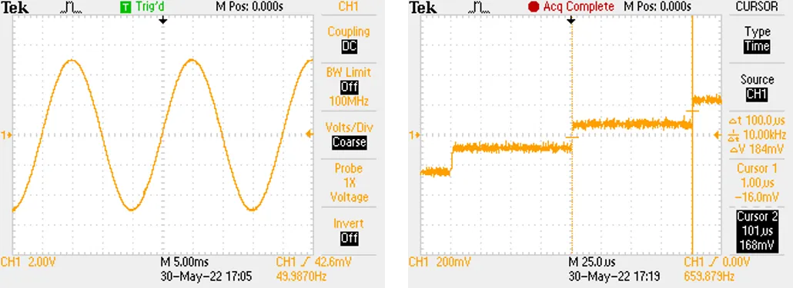
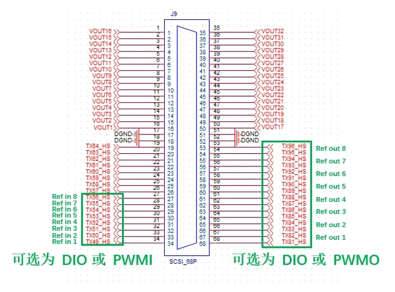

  
CloudPSS I/O Signal Hub 在默认的模拟量输入/输出、数字量输入/输出功能的基础上，通过功能按键和功能旋钮可以实现其它几个辅助功能。  

  

  

  

### 功能1. 已接收帧数与超时帧数显示  

状态页面显示**已接收帧数**和**超时帧数**。已接收帧数指 Signal Hub 接收到的数据帧数，超时帧数指数据超时的帧数。超时帧的判定逻辑为：若一个时步内，Signal Hub 没有收到任何数据，则超时帧计数加 1。  

### 功能2. 系统状态显示

状态页面显示 Signal Hub 的工作状态，分为**运行**、**等待**和**停止**状态。

- 设备启动后即进入运行状态，自动发送和开始接收数据；

- 若 5s 内未收到任何数据，则进入等待状态，此时超时帧计数不再增加，但仍正常发送数据；

- 在等待状态中，若重新收到连续数据，则进入运行状态，超时帧计数可以继续累加；

- 在等待状态中，若连续 30s 没有收到数据，系统切换为停止状态，停止发送数据，待复位后重新开始状态判定。  

### 功能3. 发送间隔控制  

控制 Signal Hub 发出数据的时间间隔，间隔范围从 **20us** 到 **200us** 每 10us 一个档，共 19 档。在状态页面可通过功能旋钮选择发送间隔，按下**确认**下发指令。  

:::warning
需要注意的是，在利用 Signal Hub 输出 CloudPSS SimStudio 的仿真波形时，为保证波形频率一致且不失真，SimStudio 仿真步长应与 Signal Hub 的发送间隔相同。
:::

发送间隔控制的效果可参考下图：

  

  

### 功能4. 超时帧清零与复位功能  

超时帧可辅助判断当前仿真的实时性，在状态页面短按**复位**可将超时帧清零，重新计数。长按**复位**直到出现“复位成功”提示，将 Signal Hub 恢复至刚启动时的状态，同时将已接收帧数与超时帧数清零，所有设置（包括发送间隔、通道数、IO 方向）均恢复到默认状态，工作状态变为启动后的运行状态，发送和开始接收数据，重新进行超时帧和系统状态的判定。

### 功能5. 模拟量输出通道数选择  

选择模拟量输出通道的个数。按下**设置**进入“设置1”页面，可通过功能旋钮选择模拟量输出通道为 1 个、8 个或 32 个。当选择 1 个通道时，只启用第 1 路模拟量输出通道，其它通道闭锁；当选择 8 个通道时，第 1、5、9、13、17、21、25、29 路模拟量输出通道启用，其它通道闭锁；当选择 32 个通道时，所有通道启用。按下**确认**下发指令。  

:::tip
需要注意的是，模拟量输出通道的数模转换速率与发送间隔同步。  

通道闭锁后仍会输出一个定值，该值为闭锁前寄存器中保存的最后一个数值，无实际意义。
:::

### 功能6. IO 方向控制  

选择数字量通道是输入还是输出。数字量每 8 路通道为 1 组，共 12 组，每组都可以单独控制数字量的方向。按下**设置**进入“设置1”页面，默认状态为数字量输入，通过**数字键盘**可快速切换对应通道的 IO 方向，按下**确认**下发切换指令。数字量输出为低电平 0V、高电平 +5V。

### 功能7. PWM IO 设置  

按下**设置**可切换至“设置2”页面，将部分 **SCSI2** 的数字量 DIO 通道设置为 PWM IO 通道。

  

SCSI2 中，TX49-TX56 可选择为普通 DIO 或 PWMI。当作为普通 DIO 时，功能与其它 IO 相同，可变换 IO 方向；当作为 PWMI 时，固定为 PWM 输入，TX49 对应 Ref in 1，TX50 对应 Ref in 2，依次类推到 TX56 对应 Ref in 8。  

SCSI2 中，TX81-TX96 可选择为普通 DIO 或 PWMO。当作为普通 DIO 时，功能与其它 IO 相同，可变换 IO 方向；当作为 PWMO 时，固定为 PWM 输出，TX81、TX82 对应 Ref out 1 和它的反置，TX83、TX84 对应 Ref out 2 和它的反置，依次类推到 TX95、TX96 对应 Ref out 8 和它的反置。  

Ref out 与 TX 的关系示意图如下：

  

在“设置2”页面可选择是否启用 PWM In，如启用，则 Ch48-55 失去 DIO 方向切换功能，变为 PWM In，Signal Hub 将对接收到的 PWM 信号进行解调，并通过对应的 Ref in 接口输入到仿真模型中。可设置 PWM In 对应的载波频率，载波幅值默认为 `[-1,1]`。  

在“设置2”页面可选择启用 4 路或 8 路 PWM Out，Signal Hub 将按照设置的载波参数将仿真模型中对应的 Ref Out 调制为 PWM 信号后输出。当启用 4 路时，Ch80-87 失去 DIO 方向切换功能，变为 PWM Out，Ch81、83、85、87 自动变为 Ch80、82、84、86 的反置。当启用 8 路时，Ch80-87、Ch88-95 失去 DIO 方向切换功能，变为 PWM Out，Ch89、91、93、95 为 Ch88、90、92、94 的反置。可设置载波的频率、初始相位及三角波的占空比，若占空比设为 `99%`，则等效于锯齿波。载波幅值固定为 `[-1,1]`。

:::tip
通过旋钮选到对应的通道后，按**确定**键可以进入当前通道的设置层级。数字键盘的 `*` 为退格或取消设置，`#` 为参数下发。在当前通道的设置层级中，必须参数下发或取消设置后才能退出当前层级，切换到其它通道。
:::

