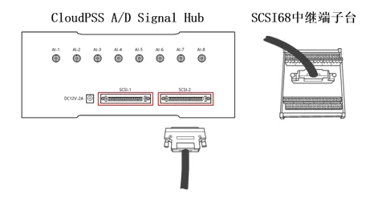
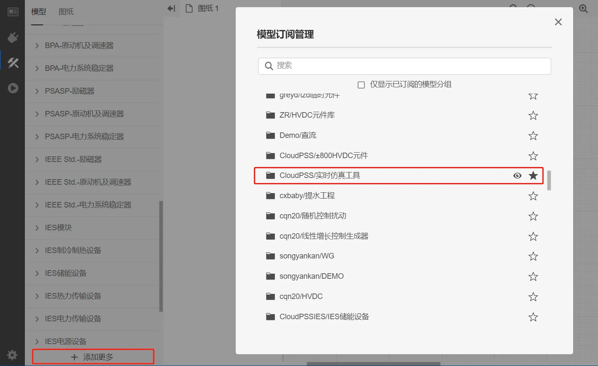
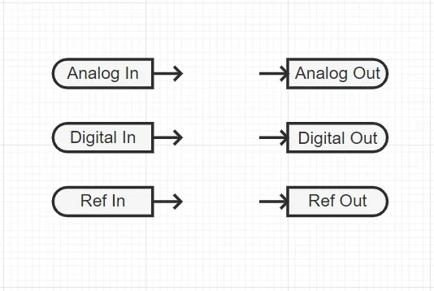
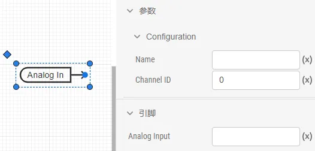
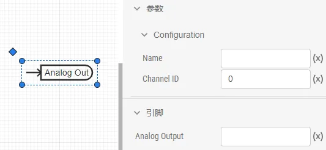
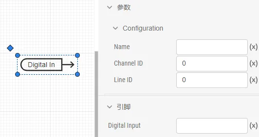
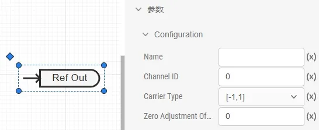
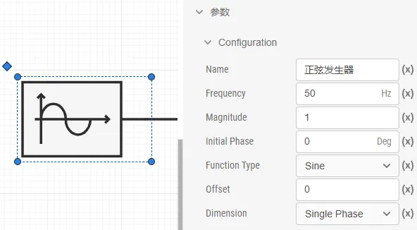
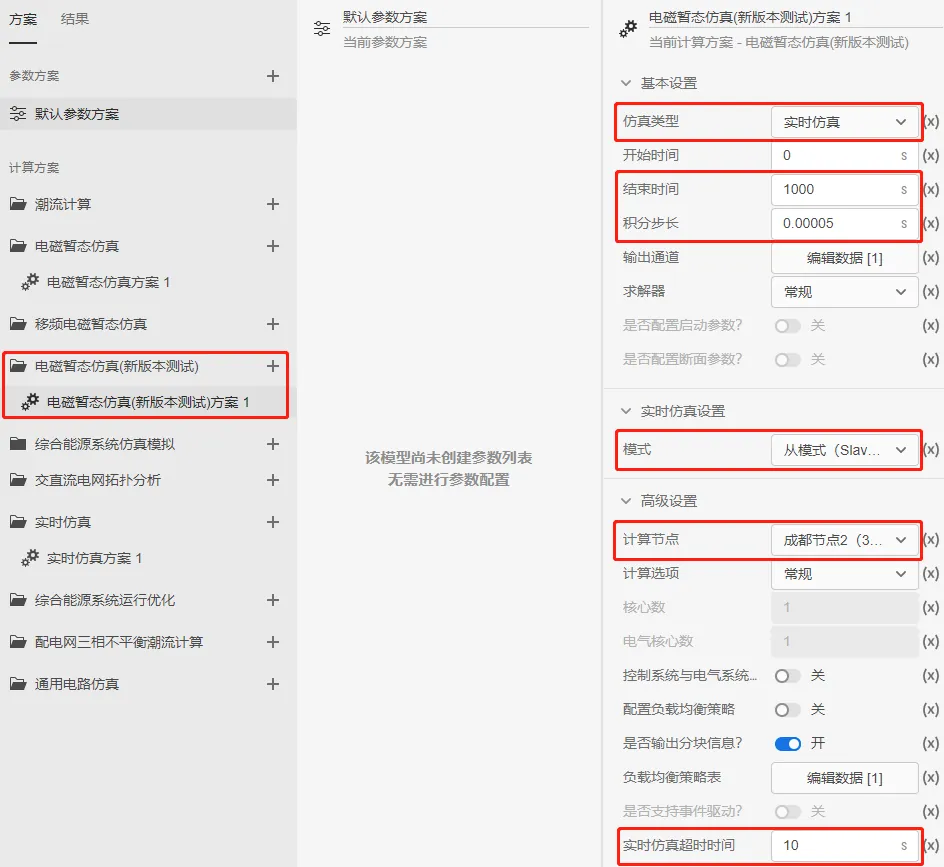
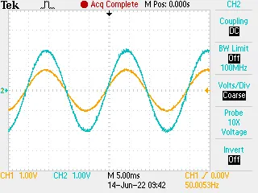

### 硬件连接

Signal Rack 作为 CloudPSS-RT 的模拟量、数字量输入/输出扩展接口，主要与 CloudPSS-RT 配合使用，以实现仿真波形的实时输出、外部信号的实时输入或控制器硬件在环等应用。它与 CloudPSS-RT 通过光纤连接，接口位置在前面板，连接示意图如下：

  

模拟量输入信号通过 Signal Rack 后面板的 8 个 BNC 接口接入，CH1-8 分别表示第 1 通道到第 8 通道；模拟量输出和数字量输入/输出信号在 Signal Rack 后面板的 SCSI 接口，可以用两个 SCSI68 中继端子台引出。  

  

### 软件模块

在 SimStudio 中，添加订阅 **CloudPSS 实时仿真工具** 的模型库。模型库中包含**模拟量输入**、**模拟量输出**、**数字量输入**、**数字量输出**、**调制波输入**和**调制波输出**元件。

  

  

#### 模拟量输入元件  

  

Channel ID：模拟量输入通道序号，0 为第 1 路，1 为第 2 路，以此类推，可填入 0-7。  

使用方法与**信号发生器**元件类似，使用时引脚可以连接到其他元件的控制输入引脚/虚拟输入引脚。

#### 模拟量输出元件  

  

Channel ID：模拟量输出通道序号，0 为第 1 路，1 为第 2 路，以此类推，可填入 0-31。  

使用方法与**输出通道**元件类似，使用时引脚可以连接到其他元件的控制输出引脚/虚拟输出引脚。

#### 数字量输入元件  

  

:::tip
仅 IO 方向设为输入时生效。  
:::

Channel ID：数字量组别序号，0 为第 1 组，1 为第 2 组，以此类推，可填入 0-11。  

- Channel 0 对应 TX17-24  

- Channel 1 对应 TX25-32  
- Channel 2 对应 TX1-8  
- Channel 3 对应 TX9-16  
- Channel 4 对应 TX49-56  
- Channel 5 对应 TX57-64  
- Channel 6 对应 TX33-40  
- Channel 7 对应 TX41-48  
- Channel 8 对应 TX81-88  
- Channel 9 对应 TX89-96  
- Channel 10 对应 TX65-72  
- Channel 11 对应 TX73-80  

Line ID：数字量在组中的通道序号，0 为该组第 1 路，1 为该组第 2 路，以此类推，可填入 0-7。  

使用方法与**信号发生器**元件类似，使用时引脚可以连接到其他元件的控制输入引脚/虚拟输入引脚。

#### 数字量输出元件  

  

:::tip
仅 IO 方向设为输出时生效。  
:::

Channel ID：数字量组别序号，0 为第 1 组，1 为第 2 组，以此类推，可填入 0-11。  

- Channel 0 对应 TX17-24  

- Channel 1 对应 TX25-32
- Channel 2 对应 TX1-8  
- Channel 3 对应 TX9-16    
- Channel 4 对应 TX49-56  
- Channel 5 对应 TX57-64  
- Channel 6 对应 TX33-40  
- Channel 7 对应 TX41-48  
- Channel 8 对应 TX81-88  
- Channel 9 对应 TX89-96  
- Channel 10 对应 TX65-72  
- Channel 11 对应 TX73-80  

Line ID：数字量在组中的通道序号，0 为该组第 1 路，1 为该组第 2 路，以此类推，可填入 0-7。  

使用方法与**输出通道**元件类似，使用时引脚可以连接到其他元件的控制输出引脚/虚拟输出引脚。

#### 调制波输入元件  

  

:::tip
仅 PWM In 启用时生效。
:::

Channel ID：调制波输入通道序号，0 为第 1 路，1 为第 2 路，以此类推，可填入 0-7。  

- Channel 0 对应 TX49  

- Channel 1 对应 TX50 
- Channel 2 对应 TX51  
- Channel 3 对应 TX52  
- Channel 4 对应 TX53  
- Channel 5 对应 TX54
- Channel 6 对应 TX55  
- Channel 7 对应 TX56  

Carrier Type：可选择调制波的幅值范围，`[-1,1]` 或 `[0,1]`。  

Zero Adjustment Offset：可设置偏置。  

使用方法与**信号发生器**元件类似，使用时引脚可以连接到其他元件的控制输入引脚/虚拟输入引脚。

#### 调制波输出元件  

  

:::tip
仅 PWM Out 启用时生效。
:::

Channel ID：调制波输出通道序号，0 为第 1 路，1 为第 2 路，以此类推，可填入 0-7。  

- Channel 0 对应 TX81、TX82  

- Channel 1 对应 TX83、TX84 
- Channel 2 对应 TX85、TX86  
- Channel 3 对应 TX87、TX88  
- Channel 4 对应 TX89、TX90  
- Channel 5 对应 TX91、TX92
- Channel 6 对应 TX93、TX94  
- Channel 7 对应 TX95、TX96  

Carrier Type：可选择载波的幅值范围，`[-1,1]` 或 `[0,1]`。  

Zero Adjustment Offset：可设置偏置。  

使用方法与**输出通道**元件类似，使用时引脚可以连接到其他元件的控制输出引脚/虚拟输出引脚。

### 实时仿真方案配置  

在**运行标签页**的计算方案列表，添加一个**电磁暂态仿真方案**。

  

在基本设置中选择仿真类型为**实时仿真**；结束时间建议设一个较大的值，如 `1000s`；积分步长默认 `0.00005s`；求解器默认**常规**。  

在实时仿真设置中，模式设为**从模式（Slave Mode）**，表示 CloudPSS-RT 的时钟同步将跟随外部时钟，即 Signal Rack 的时钟。  

在高级设置中，计算节点选择 **CloudPSS-RT** 对应的节点名称；计算选项默认为**常规**；实时仿真超时时间可设为 `10s`，当启动 SimStudio 仿真任务后，若在这个设定时间内未接收到任何数据，将判定为实时仿真超时，仿真任务会自动结束。  

### 启动顺序

Signal Rack 与 CloudPSS-RT 通信时，CloudPSS-RT 作为**从模式（Slave Mode）**，跟随 Signal Rack 的时钟并进行同步。因此，使用 Signal Rack 时需要注意 Signal Rack 与 CloudPSS-RT 的启动顺序。  

在硬件连接、模型接口设置和实时仿真方案都配置好后，设备的启动步骤及状态如下：  

[Signal Rack 与 CloudPSS-RT 建立通信的启动顺序]
|序号|操作步骤|CloudPSS-RT 状态|Signal Rack 状态|
|-----|----|----|----|
|1|Signal Rack启动电源|/|开机即进入运行状态，开始发送数据并等待接收数据；  未接收到数据时，超时帧计数每时步累加；连续 5s 未接收到数据时，进入等待状态，仍然发送数据但超时帧计数不再增加；连续 30s 未接收到数据，进入错误状态，不再发送数据。|
|2|SimStudio 运行标签页点击启动任务|5s 初始化后，提示“Start Success！”，开始接收 Signal Rack 的数据。|等待状态或停止状态|
|3|在设定的实时仿真超时时间（默认 10s）内复位 Signal Rack|接收到 Signal Rack 的数据，并开始发送数据，通信建立。|已接收帧数与超时帧数清零，进入运行状态，重新开始发送数据，并接收到 CloudPSS-RT 的数据，通信建立。|

### 案例 

import Tabs from '@theme/Tabs';
import TabItem from '@theme/TabItem';

<Tabs>
<TabItem value="case1" label="模拟量自闭环测试">
使用 CloudPSS-RT 与 Signal Rack 实现模拟量输入与输出的闭环，并用示波器实时观测结果。  

具体地，在 SimStudio 中添加一个正弦波信号发生器，通过模拟量输出元件和 Signal Rack 的模拟量输出接口输出，输出的模拟量信号再经由 Signal Rack 的模拟量输入接口与模拟量输入元件回到 SimStudio，乘以一个变比后，再由第 2 个模拟量输出通道输出。用示波器实时观测第 1、第 2 通道的模拟量信号。 

- 步骤1. 硬件连接
  参照 [硬件连接](#硬件连接) 完成 CloudPSS-RT 与 Signal Rack 的连接，以及 Signal Rack 与 SCSI68 中继端子台的连接，其中光模块插入 Signal Rack 前面板的 **SFP1** 光口，SCSI68 线缆接入 Signal Rack 后面板的 **SCSI2** 接口。

- 步骤2. 信号引入与引出
  从中继端子台引出 Pin15、Pin16 与 Pin17 的信号，它们分别对应第 2 路模拟量输出通道、第 1 路模拟量输出通道与 GND。  
  使用一根 BNC 转鳄鱼夹的转接线，BNC 头接入 Signal Rack 后面板的 CH1 接口，红色鳄鱼夹连接 Pin16，黑色鳄鱼夹连接 Pin17，从而让第 1 路模拟量输入通道采集第 1 路模拟量输出信号。  
  示波器的 CH1 和 CH2 两通道分别连接 Pin16、GND 与 Pin15、GND，从而实时观测第 1 路和第 2 路模拟量输出信号的波形。

- 步骤3. 模型接口设置
  参照 [软件模块](#软件模块)，在 SimStudio 实现标签页左侧的模型库中，点击**添加更多**，并订阅 **CloudPSS 实时仿真工具** 模型库。  
  从 **CloudPSS 实时仿真工具** 模型库中拖取 2 个模拟量输出元件、1 个模拟量输入元件到图纸上，并从 **控制-信号发生器** 模型库中拖取 1 个正弦发生器元件、从 **控制-基本数学函数** 模型库中拖取 1 个乘法器元件、从 **控制-基础** 模型库中拖取 1 个常量输入元件到图纸上，按下图所示完成连线。  
  
    
  
  然后，配置各元件的参数。正弦发生器设置为频率 `50Hz`，幅值为 `1`，初始相位为 `0`，函数类型为 `Sine`。  

      

    正弦发生器的信号输出到第 1 路模拟量输出通道，因此与它引脚相连的模拟量输出元件设置 Channel ID 为 `0`。

      

    正弦发生器的信号由模拟量输出通道输出后，再由第 1 路模拟量输入通道采集。因此，模拟量输入元件设置 Channel ID 为 `0`。  

      

    模拟量输入信号乘以 2 倍后，再从第 2 路模拟量输出通道输出。因此，常量输入元件设置常数为 `2`，与乘法器输出引脚相连的模拟量输出元件设置 Channel ID 为 `1`。

      

    

- 步骤4. 实时仿真方案设置
  在 SimStudio **运行标签页**，添加**电磁暂态仿真**方案。在基本设置中，选择仿真类型为**实时仿真**，结束时间 `1000s`，积分步长 `0.00005s`；在实时仿真设置中，选择模式为**从模式（Slave Mode）**；在高级设置中，选择计算节点为 CloudPSS-RT 对应的节点，实时仿真超时时间为 `10s`。其它设置保持默认值即可。  

        

- 步骤5. 启动 Signal Rack 并运行仿真
    参照 [启动顺序](#启动顺序)，先启动 Signal Rack，再点击 SimStudio **运行标签页**顶部的**启动任务**按钮，待出现“Start Success！”提示后，10s（设置的实时仿真超时时间）内长按 Signal Rack 的**复位**按钮进行复位。  

        

    操作后，CloudPSS-RT 与 Signal Rack 成功建立通信，可通过示波器实时观测模拟量输出 1 和模拟量输出 2 的波形。  

按照上述操作步骤，本案例可在示波器观测到的模拟量输出 1 和模拟量输出 2 的波形如图：  

       

</TabItem>
</Tabs>

