本文档介绍实时信号监视工具 CloudPSS Signal Monitor 的功能，并通过一个案例介绍它的使用方法。实时信号监视工具用于在**实时仿真**过程中查看波形或下发控制指令，需配合 CloudPSS RT 实时仿真器使用，**暂不支持**在公网试用平台使用。

## 功能定义
本工具提供基于网络通信的实时仿真结果波形查看、录波、控制指令下发等功能。

## 功能说明
### 添加实时信号监视通道

在仿真任务启动前，添加信号量测和实时信号监视通道。信号的量测方法详见 [量测和输出系统](../../software/20-emtlab/50-emts/30-meters-and-outputs/index.md#信号量测) 文档。

在**实现标签页**，将量测信号接入**虚拟输出端口**元件，该元件在**实时仿真工具**模型库中。

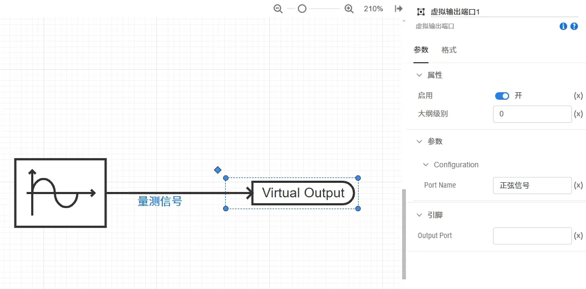   

**虚拟输出端口**元件可在实时仿真中以**数值**或**曲线**的形式显示量测信号值。需要填写的参数有：

- Port Name：虚拟输出端口的名称，将在**实时输出通道配置页面**显示。在一个算例中，名称**不可重复**。  

:::tip
**虚拟输出端口**元件只支持 1 维信号输入。若要实时监视多维信号，需结合**多路信号分离**元件使用。

   
:::

:::warning
离线仿真中，虚拟输出端口元件将被忽视。
:::

### 添加实时指令下发通道

在仿真任务启动前，添加实时指令下发通道。

在**实现标签页**，将**虚拟输入端口**元件接入其它元件的控制输入引脚或虚拟输入引脚。虚拟输入端口元件在**实时仿真工具**模型库中。

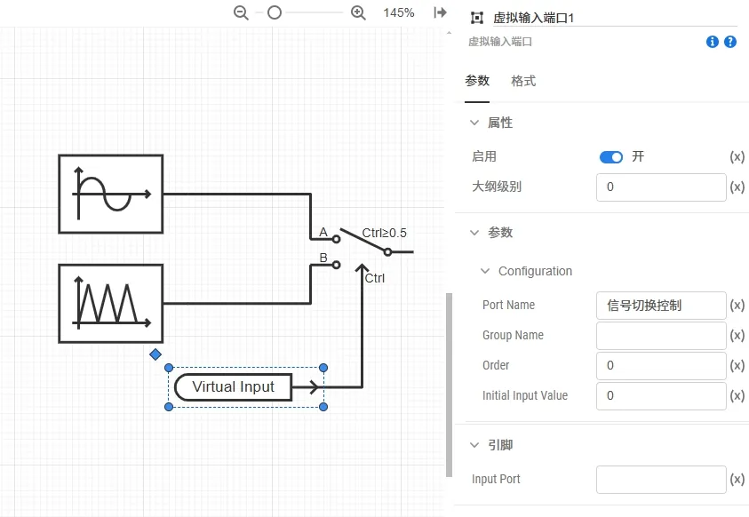   

**虚拟输入端口**元件需要填写的参数有：  

- Port Name：虚拟输入端口的名称，将在**虚拟输入通道配置页面**显示。在一个算例中，名称**不可重复**。  
  
- Group Name：虚拟输入端口的分组名称，将在**虚拟输入通道配置页面**显示其分组。不填则显示**默认**。
  
- Order：虚拟输入端口在分组内的排序。
  
- Initial Input Value：虚拟输入端口的初始值。
  
:::warning
离线仿真中，虚拟输入端口元件将被视为一个**常量输入**元件，输出等于所设置的初始值。
:::
  

### 配置实时仿真设置

完成添加实时信号监视通道和实时数据下发通道后，在**运行标签页**配置实时仿真设置。

添加一个**电磁暂态仿真方案**，并选择仿真类型为**实时仿真**。实时仿真设置仅在仿真类型为实时仿真时生效。

   

实时仿真设置中，**模式**、**实时仿真超时时间**的设置方法详见 [电磁暂态实时仿真-实时仿真计算方案](../../software/20-emtlab/80-emts-rt/index.md#实时仿真计算方案) 帮助文档。与实时信号监视工具相关的配置主要有**数值型输出通道**、**曲线型输出通道**、**曲线刷新间隔**和**曲线缓存帧数**。

- #### 数值型输出通道
    
    实时仿真结果以数值的形式显示，可设置**分组名称**、**刷新频率**、**小数位数**，并选择待观测的**输出通道**。同一个分组中可选择多个输出通道，各通道的结果将形成一个表格并在结果页面显示。每一行视为一个分组，可添加多个分组。
    
    - 分组名称：数值型输出通道窗口的名称。在结果页面，该名称将作为表格标题显示。

    - 刷新频率：数值结果刷新的频率，默认为 2Hz。刷新后，若值较上一次结果发生变化则表格将取反色高亮，若不变则呈现原色。
    - 小数位数：数值显示的小数位数，默认为 3。
    - 输出通道：选择要在分组中显示的信号，信号名称与算例中**虚拟输出端口**元件的端口名称关联。

    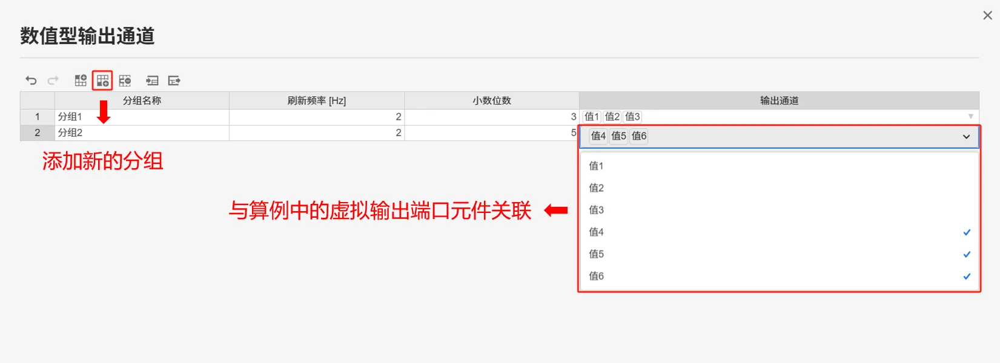    

    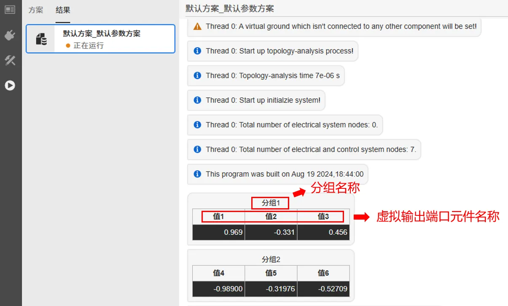    

- #### 曲线型输出通道
  
    实时仿真结果将以曲线的形式显示，可设置**分组名称**、**窗口类型**、**窗口宽度**，并选择待观测的**输出通道**。同一个分组中可选择多个输出通道。可添加多个分组。

    - 分组名称：曲线型输出通道窗口的名称。在结果页面，该名称将作为图表标题显示。  
 
        在相同的分组名称后加上 `:1`，可合并组，并在窗口中以**子曲线图**的形式显示各组波形曲线，同一组中的子曲线图将绑定并关联时间轴，可同步放大或缩小。

        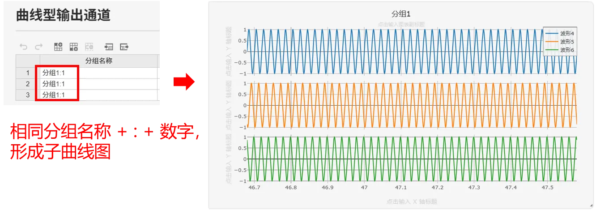 
        
        各分组冒号后的数字比值为子曲线图在示波器窗口中的高度占比。子曲线图之间的空隙默认高度为 0.1。

        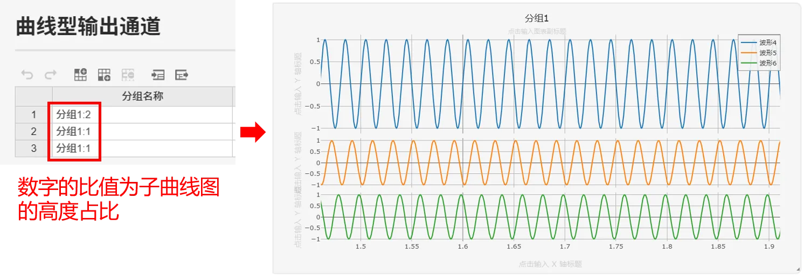 

    - 窗口类型：可选择为 `Moving Time Axis Window`（移动窗口）或 `Oscilloscope Time Axis Window`（示波器窗口）两种类型，默认为示波器窗口。  

        `Moving Time Axis Window`：时间坐标轴最大值随仿真时间变化，时间坐标轴范围为所设置的**窗口宽度**值，如下图所示。
  
        
  
        `Oscilloscope Time Axis Window`：与示波器显示模式相近，仿真窗口时间轴范围为所设置的**窗口宽度**值，如下图所示。
  
        

    - 窗口宽度：图表的时间坐标轴范围，默认为 2s。
    - 输出通道：选择要在分组中显示的信号，信号名称与算例中**虚拟输出端口**元件的端口名称关联。

        

        

- #### 曲线刷新间隔

    曲线型输出通道的刷新时间间隔，默认为 0.02s，即每 0.02s 刷新一帧，每一帧包含 0.02s 的数据。

- #### 曲线缓存帧数

    曲线型输出通道的缓存帧数，默认为 200 帧。增加缓存帧数可以提升曲线刷新流畅度，但同时会增加缓存数据量。缓存数据量为**曲线刷新间隔**与**曲线缓存帧数**的乘积，不得超过 10。

:::tip

**数值型输出通道**和**曲线型输出通道**可在仿真启动前于**实时仿真设置**中配置，也支持在仿真过程中于**操作栏**配置。  

实时仿真设置中的配置可跟随算例保存，仿真启动后默认显示实时仿真设置的配置。操作栏的配置是临时的，将不会保存，仿真任务结束后，操作栏的配置会重置。  

若在实时仿真设置中不进行任何配置，则仿真启动后默认在一个分组中输出所有**数值型输出通道**，并在一个示波器分组中输出所有**曲线型输出通道**。
:::

### 操作栏

实时仿真任务启动后，会在结果页面底部显示**操作栏**，支持在仿真过程中在线配置输出通道、实时下发指令、录波等功能。操作栏包含**配置表格输出**、**配置波形输出**、**配置虚拟输入**、**暂停/开始输出**和**开始/停止录波**按钮。

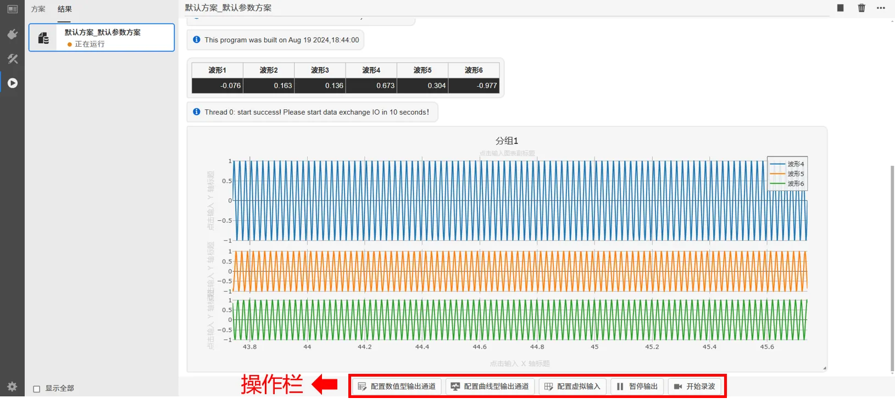    

- #### 配置表格输出

    点击按钮，会弹出**配置表格输出**页面。可配置选项与实时仿真设置中的**数值型输出通道**配置页面相同，包含分组名称、刷新频率、小数位数和输出通道。

    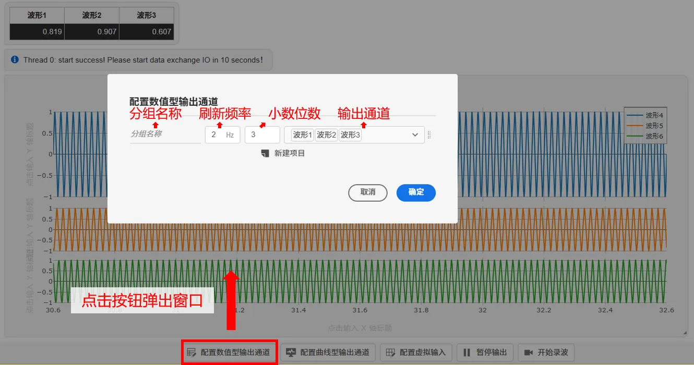    

    - 新建分组
        
        点击**新建项目**，可添加的新的分组。

          

    - 复制、删除分组
  
        右键分组右侧的**点状标记**，可对分组进行剪切、复制、创建副本或删除操作。

        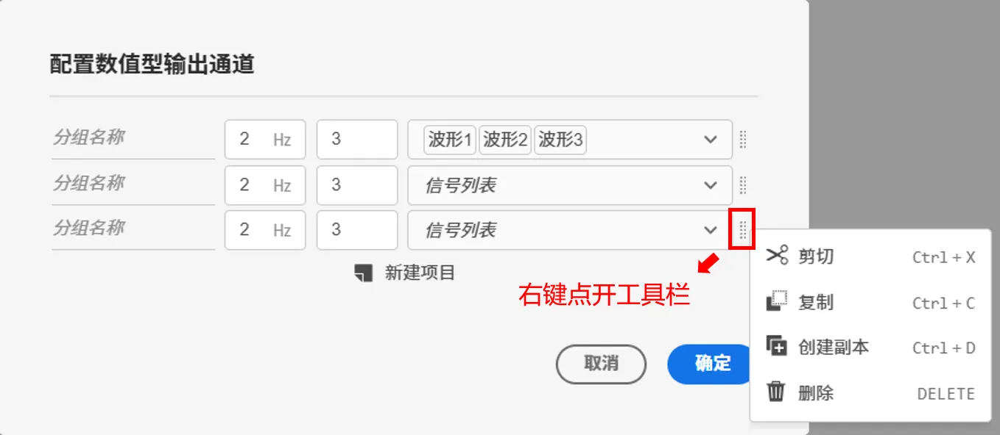  

    - 调整分组显示顺序
    
        左键按住分组右侧的**点状标记**，可拖拽移动分组，调整分组显示的顺序。

          

    点击**取消**或页面外任意空白处，可关闭页面。

- #### 配置波形输出

    点击按钮，会弹出**配置波形输出**页面。可配置选项与实时仿真设置中的**曲线型输出通道**配置页面相同，包含分组名称、窗口类型、窗口宽度和输出通道。

    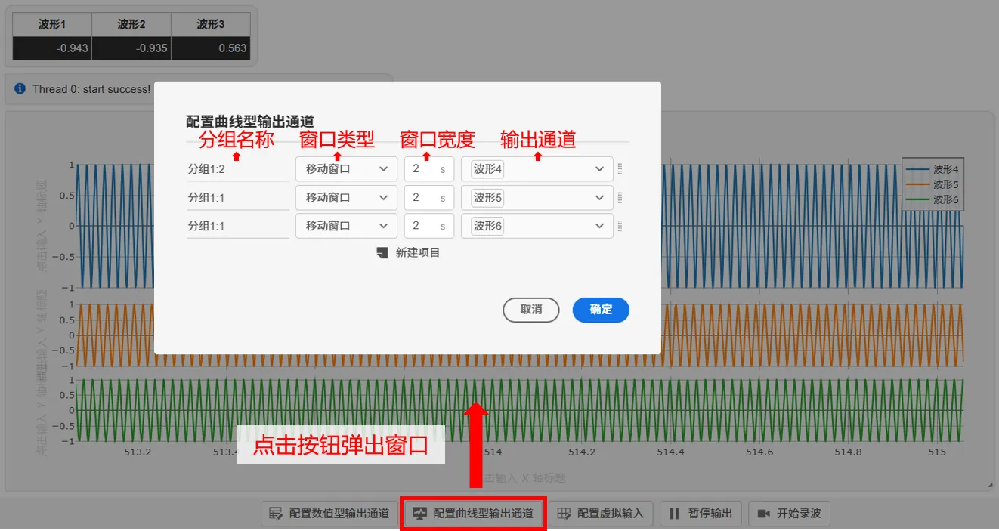    

    - 新建分组
        
        点击**新建项目**，可添加的新的分组。

          

    - 复制、删除分组
  
        右键分组右侧的**点状标记**，可对分组进行剪切、复制、创建副本或删除操作。

        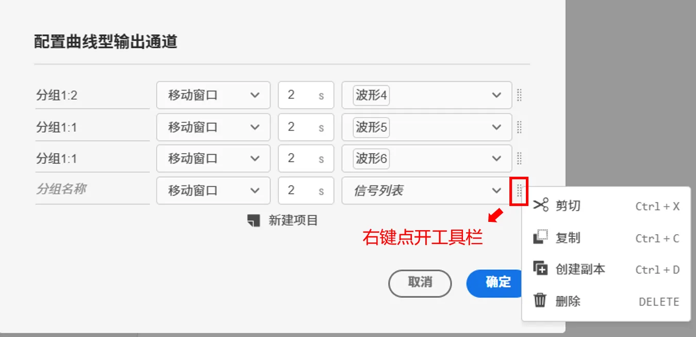  

    - 调整分组显示顺序
    
        左键按住分组右侧的**点状标记**，可拖拽移动分组，调整分组显示的顺序。

        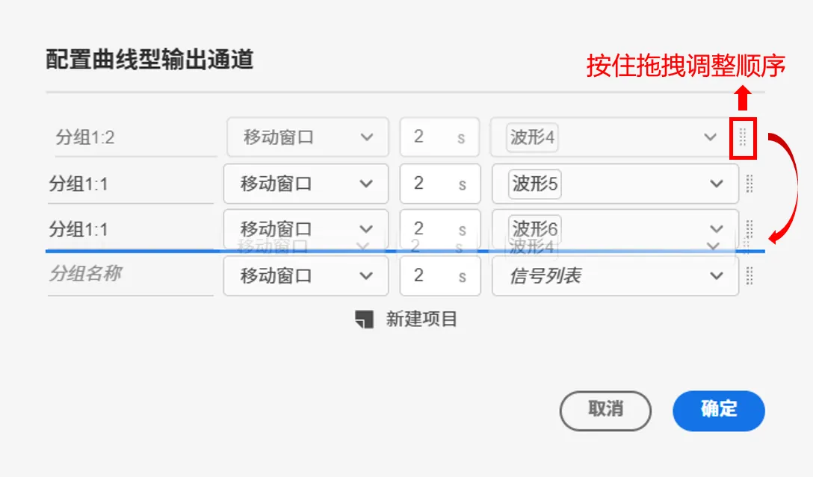  

    点击**取消**或页面外任意空白处，可关闭页面。

- #### 配置虚拟输入

    点击按钮，会弹出**配置虚拟输入**页面。页面中将显示实时指令下发通道的分组名称、端口名称、端口顺序、端口当前值（默认为初始值），与算例中的**虚拟输入端口**元件关联。

       

    在输入框中修改端口值，点击**设置**按钮，将同步下发指令，修改算例中虚拟输入端口元件的输出值。

    点击**取消**或页面外任意空白处，可关闭页面。

- #### 暂停/开始输出

    在实时仿真过程中，点击**暂停输出**按钮，**数值型输出通道**和**曲线型输出通道**将暂停刷新，但仿真进程仍在后台运行，**不会暂停**。暂停输出过程中，用户仍可配置表格输出、波形输出和虚拟输入，虚拟输入端口的实时指令下发**不受暂停输出影响**。

    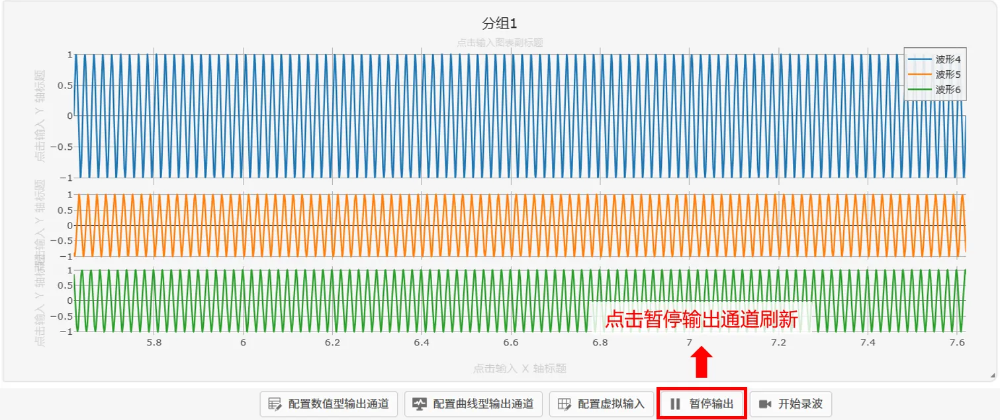   

    暂停输出过程中，曲线型输出通道的示波器窗口将显示当前仿真结果的快照，方便用户对示波器窗口进行放大、缩小等操作，详见 [量测和输出系统-仿真结果编辑](../../software/20-emtlab/50-emts/30-meters-and-outputs/index.md#仿真结果编辑) 文档。用户也可导出当前示波器窗口的波形 PNG、CSV 格式文件。

    在暂停输出时点击**开始输出**按钮，数值型输出通道和曲线型输出通道将继续刷新。

    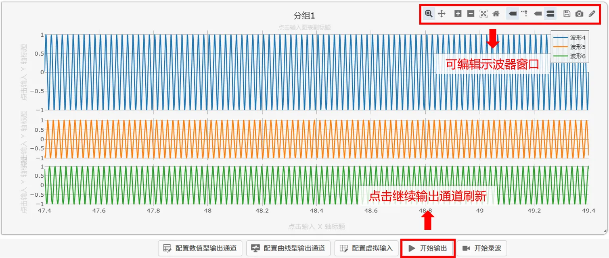   

- #### 开始/停止录波

    在实时仿真过程中，点击**开始录波**按钮，可对当前配置的所有**曲线型输出通道**进行录波。对于开始录波后才添加的曲线型输出通道，**只会记录配置后的数据**。
    
    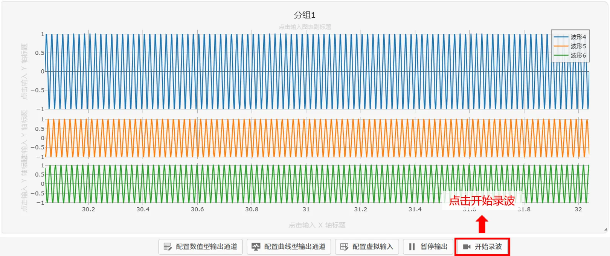   
    
    点击**停止录波**后，录波结束，将生成 CSV 格式的录波文件并下载到本地。仿真任务结束时会自动停止录波。

    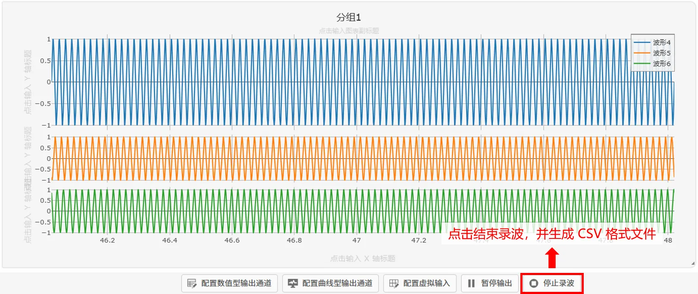   

    录波文件的第一列为时间序列，第二列开始为曲线型输出通道的波形数据。

    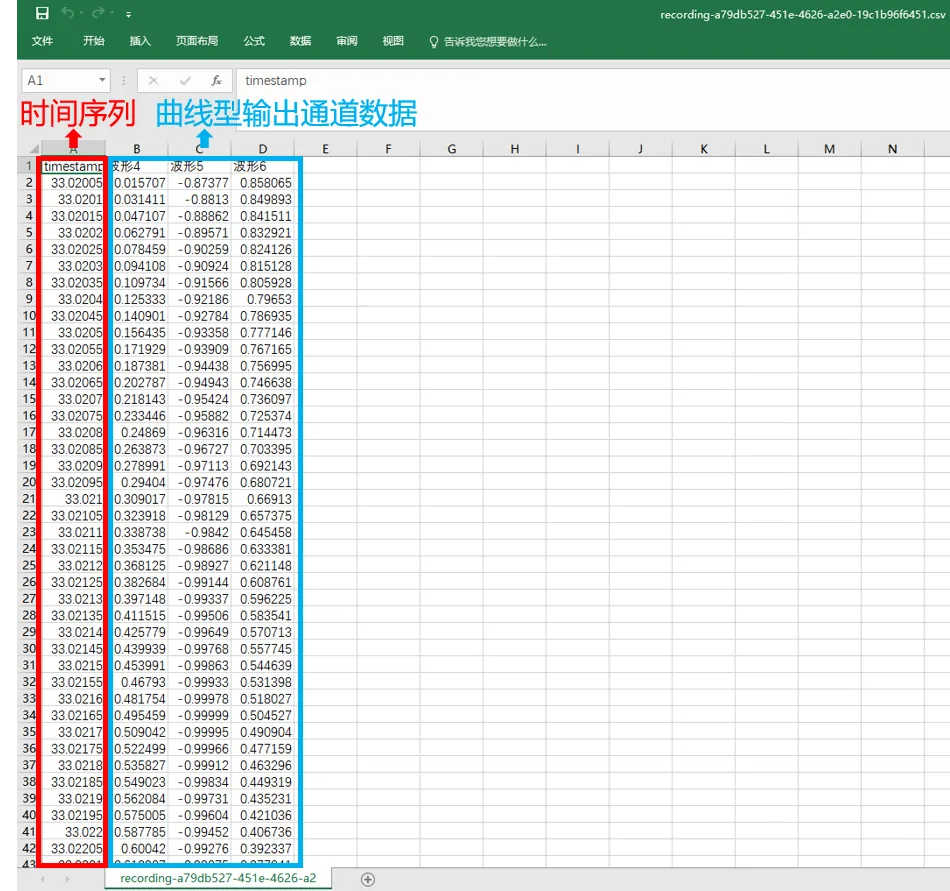   

:::warning
操作栏中修改的**配置表格输出**和**配置波形输出**是临时的，**不会保存**，每次仿真任务启动后，将默认显示**实时仿真设置**中的配置。若要保存修改，请在仿真任务启动前，在实时仿真设置中配置**数值型输出通道**和**曲线型输出通道**。
:::

## 案例

import Tabs from '@theme/Tabs';
import TabItem from '@theme/TabItem';

使用实时信号监视工具观测实时仿真结果，并下发一个故障指令，观测故障动态响应。

<Tabs>
<TabItem value="case1" label="实时故障模拟">
- 构建一个故障测试模型
  
    在工作台新建打开一个 **10 机 39 节点标准测试系统**项目模板，在其中一个母线上添加一个**三相断路器**并接地。用三相断路器模拟母线的三相接地故障：当断路器闭合时，母线短路接地。

      
    
- 在算例中添加**虚拟输出端口**和**虚拟输入端口**元件
    
    在**实现标签页**左部的模型库中找到**实时仿真工具**模型库，添加**虚拟输出端口**元件和**虚拟输入端口**元件至图纸上。

    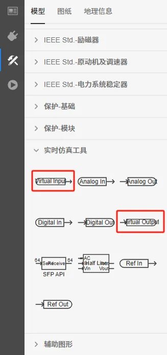  

    也可以在右上角的**搜索栏**中，搜索并添加**虚拟输出端口**元件和**虚拟输入端口**元件。

    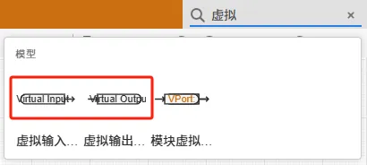  

    量测母线的三相电压，并利用**多路信号分离**元件，将三相电压的 3 维信号分成 3 个 1 维信号，填入**虚拟输出端口**元件的输入引脚。
    
    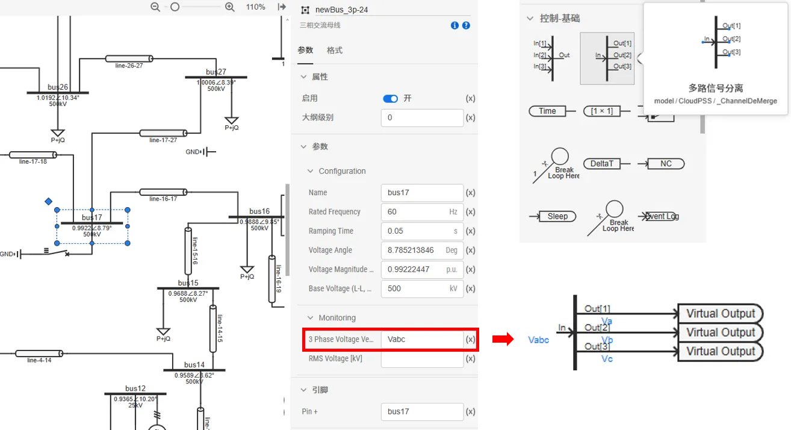  
    
    分别设置三个虚拟输出端口元件的**端口名称**。

    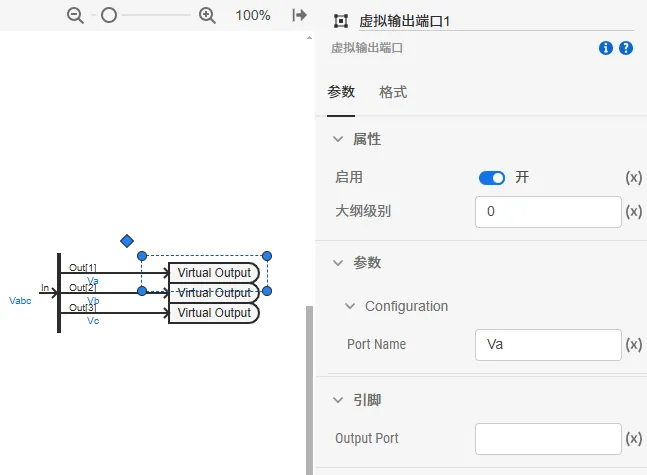  
    
    添加一个**单稳态触发器**元件，与**虚拟输入端口**元件连接，设置其脉冲持续时间为 0.1s，并将三相断路器的开关控制信号填入单稳态触发器的输出引脚。当虚拟输入端口的故障指令下发后，单稳态触发器可实现故障持续 0.1s 后恢复。
    
      
    
    设置虚拟输入端口元件的**端口名称**和**初始值**。初始值为 0 表示断路器的状态为断开。

    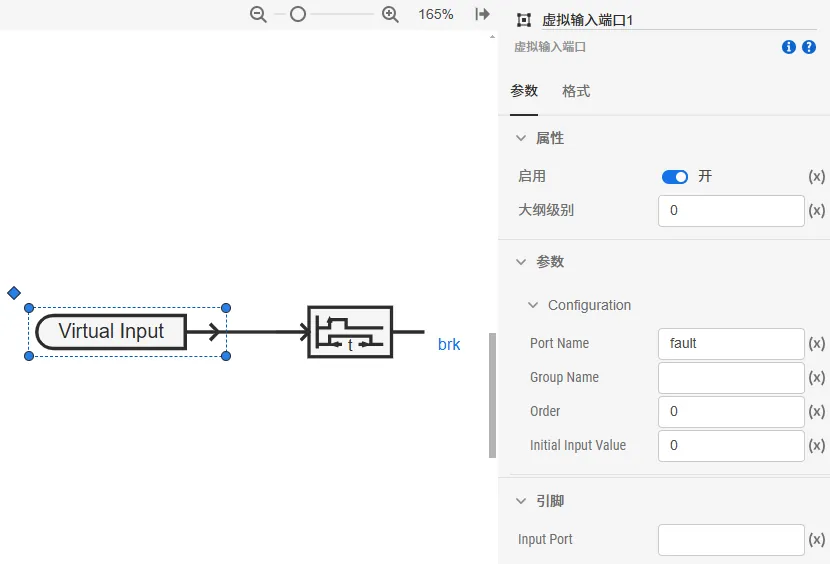  

- 实时仿真方案设置  
    
    在**运行标签页**，添加一个**电磁暂态仿真**计算方案，并设置**仿真类型**为**实时仿真**。  

    设置实时仿真的开始时间、结束时间和积分步长。**开始时间**默认为 0，**结束时间**设为 1000，**积分步长**设为 0.00005s。

       

    设置实时仿真参数。选择**模式**为主模式，**曲线刷新间隔**为 0.02s，**曲线缓存帧数**为 200。

    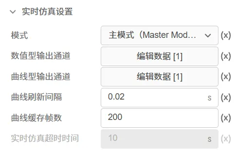   
        
    配置**数值型输出通道**和**曲线型输出通道**，如下图所示。数值型输出通道的**刷新频率**为 2Hz，**小数位数**为 3。曲线型输出通道的**窗口类型**为示波器窗口，**窗口宽度**为 5s。**输出通道**选择 Va、Vb、Vc。

       

 
- 点击启动任务运行仿真
   
    结果页面会显示**数值型输出通道**和**曲线型输出通道**的结果。

    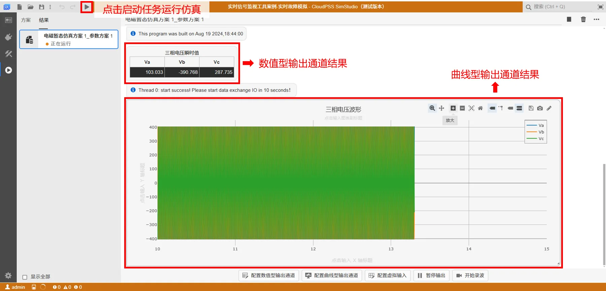   
   

- 录波与数据下发
  
    在结果页面，点击底部**操作栏**的**开始录波**。
    
    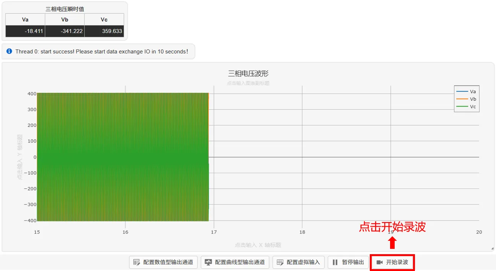       
    
    点击**配置虚拟输入**，设置 **fault** 的值为 1，闭合三相断路器。点击**设置**下发指令触发故障。

       

    可观测到母线实时的故障动态响应。

    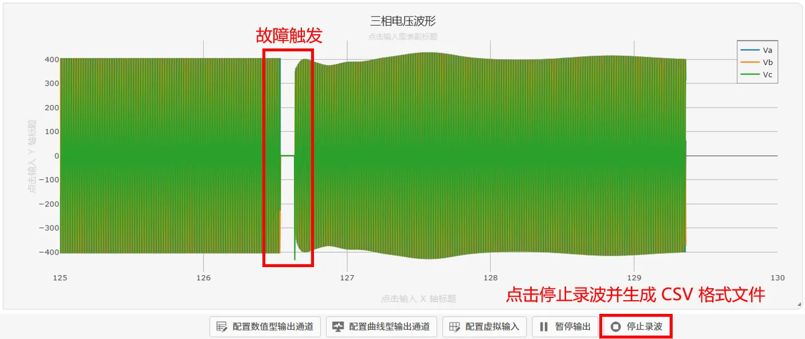          
    
    点击**停止录波**，生成 CSV 格式文件并下载到本地。录波文件会记录时间序列及对应曲线型输出通道的数据。

    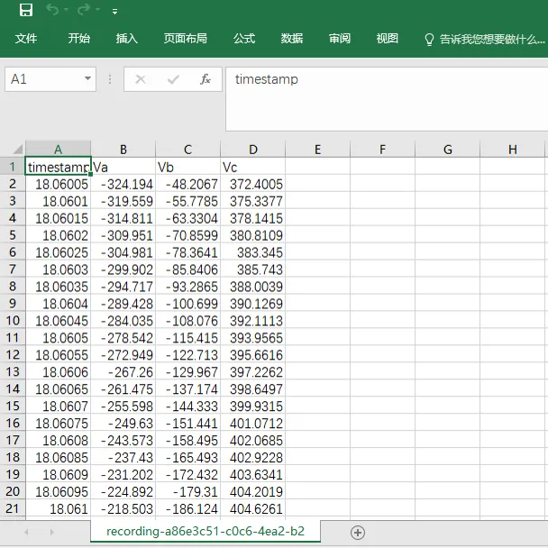   

本案例算例文件下载：[实时信号监视工具案例-实时故障模拟.cmdl](./实时信号监视工具案例-实时故障模拟.cmdl "实时信号监视工具案例-实时故障模拟算例文件")。算例导入密码：signalmonitor

</TabItem>
</Tabs>

## 常见问题
为什么曲线型输出通道的波形显示卡顿？

:   网页显示波形的流畅程度与网页内存、网速有关，数据量过大会导致波形显示滞后、卡顿问题。若卡顿严重，可尝试**减少曲线型输出通道数量**，或**减小窗长**。

点击暂停输出后，实时仿真进程会暂停吗？

:   不会。暂停输出功能是指暂停**数值型输出通道**和**曲线型输出通道**的刷新，类似于仿真快照。仿真进程仍在后台运行，不会暂停。暂停输出过程中，用户仍可配置表格输出、波形输出和虚拟输入，虚拟输入端口的实时指令下发不受暂停输出影响。

为什么点击停止录波后未生成录波文件？

:   录波功能是记录所有已配置的**曲线型输出通道**数据，若通道数量较多或录波时间较长，录波文件的数据量将会很大，需要更多时间响应。
