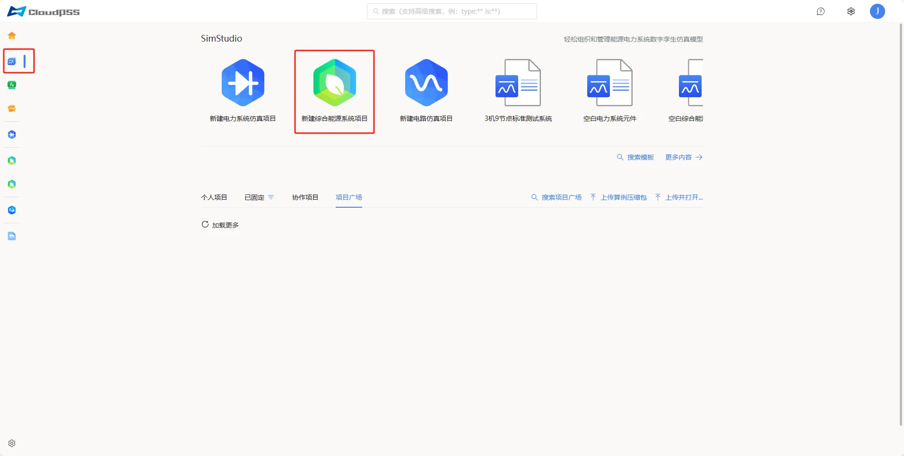
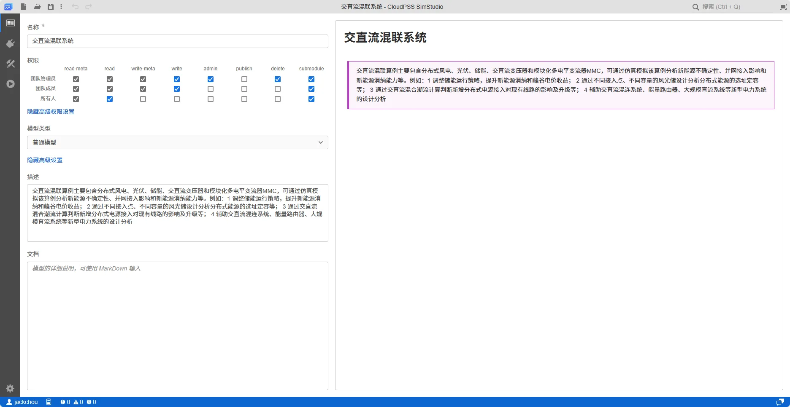
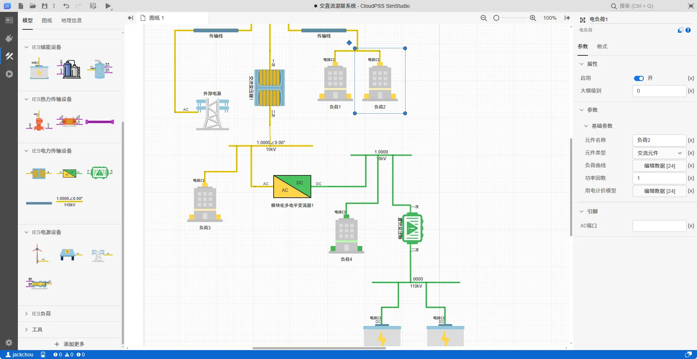
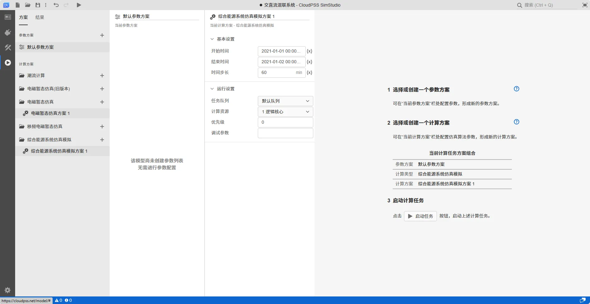
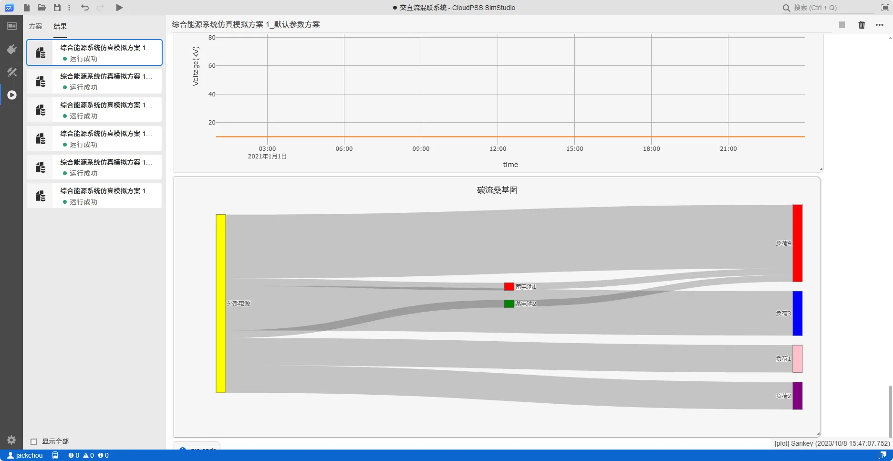

本节以**交直流混连项目**为例，介绍使用 SimStudio 平台进行综合能源系统项目的建模仿真方法。

## 打开项目

用户成功登录后，在 CloudPSS 个人中心点击 **SimStudio** 的图标后，页面跳转至 
 **SimStudio 个人中心**，并点击**新建综合能源系统项目**。

点击左上角**打开**快捷键，选择**交直流混连系统**，并打开该项目

## 项目总览

在总览页面可以编辑项目名称、项目权限（私有、作为子模块公开和完全公开）、模型类型、描述和文档。

**模型类型**

项目类型分为**简单项目、普通项目和元件**。简单项目适用于简单的小型测试项目；普通项目是最常用的构建算例方法；元件：通过参数与引脚设置，可将项目模型封装为一个模块化元件，在其它项目中直接调用。

## 拓扑实现

实现标签页用于搭建项目拓扑，设置仿真边界条件。用户在实现标签页可进行元件的选取、拓扑的连接及构建、元件参数的配置、以及页面格式/元件格式的调整。

实现标签页中具有的三个板块：模型库与图纸板块、拓扑编辑板块、属性编辑板块。
从左侧**模型库**中选择元件拖拽至**拓扑编辑工作区**并连接拓扑，选中元件，在右侧**属性编辑板块**编辑仿真边界条件和元件样式。

:::tip
SimStudio IES 无数据管理模块，因此气象参数、设备额定参数模型、负荷曲线、电价数据等均需要用户录入，较为繁琐，可以利用 SDK 进行编程处理。
:::

## 仿真模拟，检查结果

拓扑连接无误并录入仿真边界条件后，切换到**运行**模块，在**方案**页面的**计算方案**选择**综合能源系统仿真模拟方案**，设定仿真参数，并点击**启动任务**启动计算。

计算开始后，平台自动跳转到**结果**页面。

SimStudio IES 在能量流计算的基础上，进一步研发了基于图计算的**碳足迹分析**内核，碳流计算完成后会自动处理结果数据，并自动绘制出**碳流桑基图**，以清晰展示碳排放的结构，有利于分析碳减排潜力和影响碳排放的关键因素，为**碳配额管理、碳排放达标及碳排放定价**提供理论依据。

