<!-- :::warning
1. 两种输入模式下的配图不够，每张图都要包含直接引用常量、全局参数和包含参数的表达式 3 种引用方式。
2. 介绍参数、变量、引脚配置时，配图也应包含所有输入情况。
3. 全局变量应用场景**介绍太简单**，配图应采用真实案例。
4. 补充常用的 math.js 语法
5. 引脚连接规范补充配图
::: -->

SimStudio 提供了一套以**参数**、**变量**及**引脚**为核心的参数化建模系统。用户可通过配置参数、变量及引脚对元件和模型进行灵活维护和管理，实现各类复杂建模功能。

```mermaid
graph TD
A[模块] --> B[参数]
A --> C[变量]
A --> D[引脚]
B --> E[实数型]
B --> F[整数型]
B --> G[文本型]
B --> H[代码型]
B --> I[布尔型]
B --> J[选择型]
B --> K[多选型]
B --> L[表格型]
B --> M[虚拟引脚型]
M --> |仿真中可变| N[虚拟输入引脚型]
M --> |内部量量测| O[虚拟输出引脚型]
D --> P[电气引脚]
D --> Q[控制引脚]
D --> R[热力引脚]
Q --> S[输入引脚]
Q --> T[输出引脚] 
```

## 参数

参数是定义及描述元件和模型特征的度量数据，如电阻的阻值，电源的幅值、初始相位等。参数分为**实数**、**整数**、**文本**、**布尔**、**选择**、**多选**、**表格**、**虚拟输入引脚**、**虚拟输出引脚** 9 种类型。一个 SimStudio 模型中的参数又分为 **内部参数** 和 **全局参数** 两类。

### 内部参数

打开一个 SimStudio 模型，选中**实现标签页** - **图纸**上的任意元件，即可在右侧**参数卡**中查看并配置该模型中被选中元件的参数。实现标签页下的参数均为当前模型的内部参数。

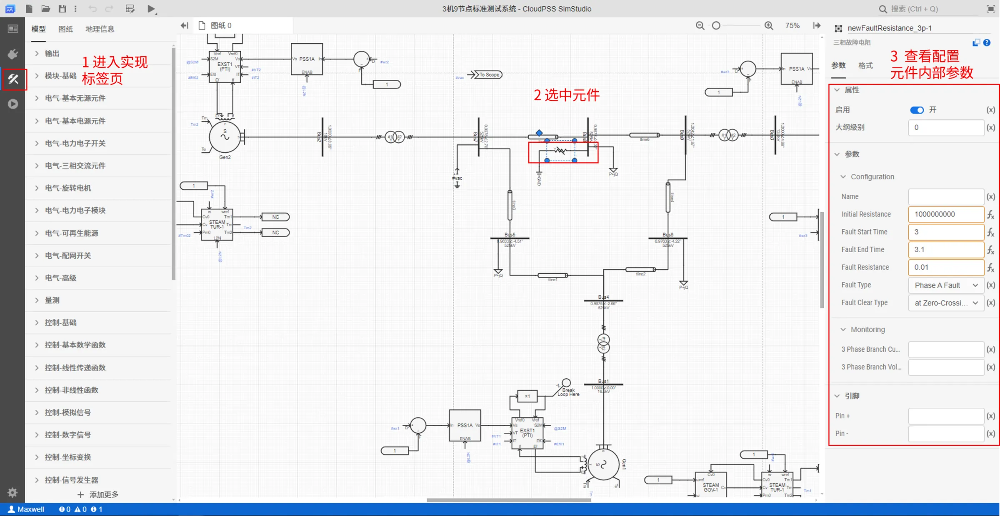

### 全局参数

打开一个 SimStudio 普通模型或元件，在**运行标签页** - **参数方案配置卡**处显示的参数即当前模型的全局参数。内部参数可引用全局参数进行赋值或计算，从而实现对模型内部参数的快速批量调整。全局参数列表可在当前模型的**接口标签页**进行定义，定义方法参见 [定义元件/模块参数列表](../40-module-packaging/10-define-module-param-list/index.md) 帮助页。

全局参数列表可在当前模型的**运行标签页**进行配置，配置方法参见 [参数方案配置](../30-param-config/index.md) 帮助页。

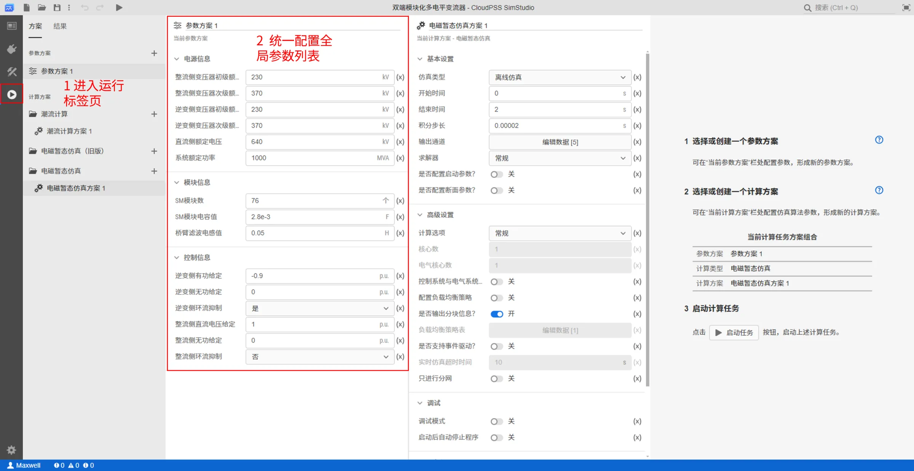

**全局参数只能在当前 SimStudio 模型项目内部使用**。

<!-- 参数主要有两种用法：

+ 用法1: 作为普通模型项目的**全局参数**，配合参数方案配置功能进行使用，用于多场景仿真等应用。具体操作方法参见[参数方案配置](../30-param-config/index.md)帮助页。
+ 用法2: 用于模块封装过程中的参数列表定义，关于每种类型参数的定义，参见[定义元件/模块参数列表](../40-module-packaging/10-define-module-param-list/index.md)帮助页。 -->

## 变量

变量，即全局变量，打开一个 SimStudio 普通模型或元件，可在当前模型的**实现标签页** - **图纸** - **全局变量卡**中进行定义，作用于 SimStudio 模型内部，可用于临时计算或赋值。变量可以引用全局参数或同一模型下的其他变量进行赋值或计算，内部参数也可引用全局变量进行赋值或计算。

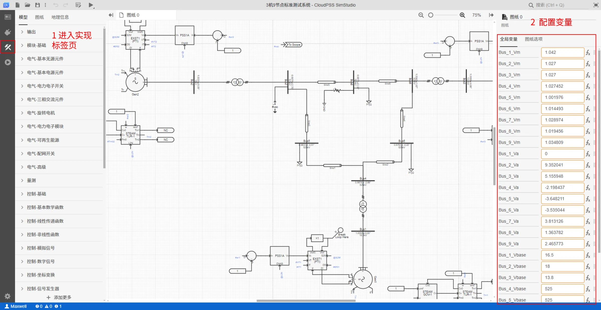

**变量只能在当前 SimStudio 模型项目内部使用**。

## 引脚

引脚是 SimStudio 元件之间的连接接口，分为**电气引脚**、**控制引脚**、**热力引脚**三类。不同类型的引脚不能相连。控制引脚为有向引脚，根据数据流方向又分为**输入引脚**和**输出引脚**两类。元件引脚的定义方法参见 [定义元件/模块引脚列表](../40-module-packaging/20-define-module-pin-list/index.md) 帮助页。

:::tip “虚拟引脚”类型参数与“引脚”的区别
需要特殊说明的是，**虚拟输入引脚**和**虚拟输出引脚**类型的参数本质上也是**控制引脚**。控制输入、输出引脚和电气引脚通常绑定显示在**元件图形**和**引脚列表**中，而虚拟引脚只会显示在元件的**参数列表**中。虚拟引脚的合理使用可以使元件图标和拓扑图更加简洁。虚拟引脚与引脚的使用方法完全一致。
:::

<!--  -->

## 输入模式

参数、变量及引脚的赋值支持 **$$(x)$$ “值”** 和 **$$f_x$$ “表达式”** 两种输入模式。通过点击赋值输入框右侧的 $$(x)$$ 或 $$f_x$$ 可随时切换输入模式。

<!--  -->

### “值”模式 

点击待编辑参数、变量或引脚的赋值输入框右侧，显示 **$$(x)$$** 时，当前为 **“值”模式** 输入框。“值”模式下，输入框内只能输入**与当前参数类型相同的常量**。系统默认选择“值”模式输入。参数、变量及引脚的“值”模式输入方式如下：

import Tabs from '@theme/Tabs';
import TabItem from '@theme/TabItem';

<Tabs>
<TabItem value="js" label="内部参数">

例如变压器元件的额定容量参数，可在“值”模式下输入实数类型的常量。

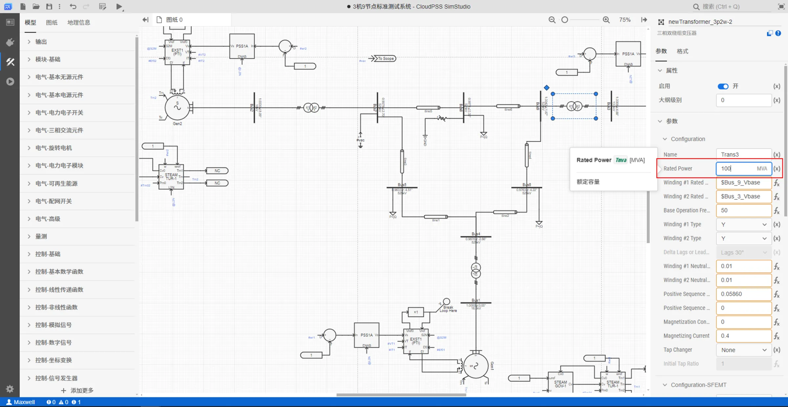

</TabItem>
<TabItem value="py" label="全局参数">

+ 定义全局参数的默认值时可在“值”模式下输入常量。

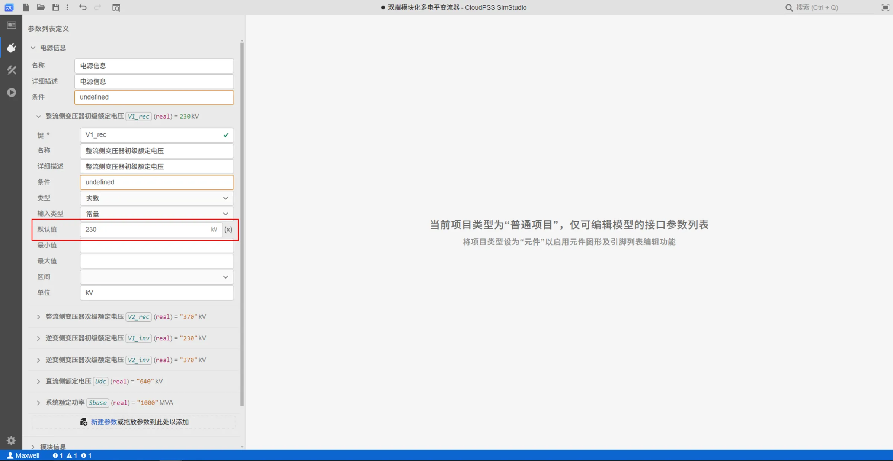

+ 配置全局参数方案时可在“值”模式下输入常量。

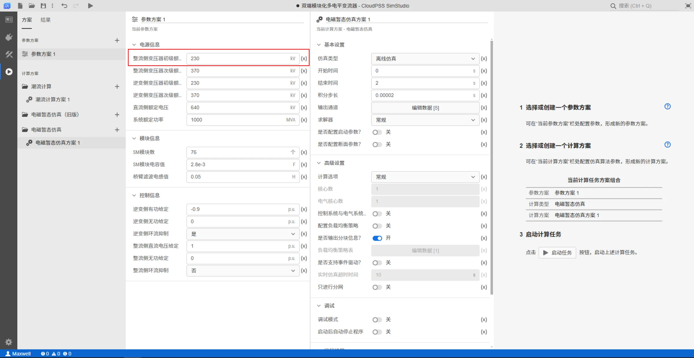

</TabItem>
<TabItem value="java" label="变量">

配置变量值时可在“值”模式下输入实数类型的常量。

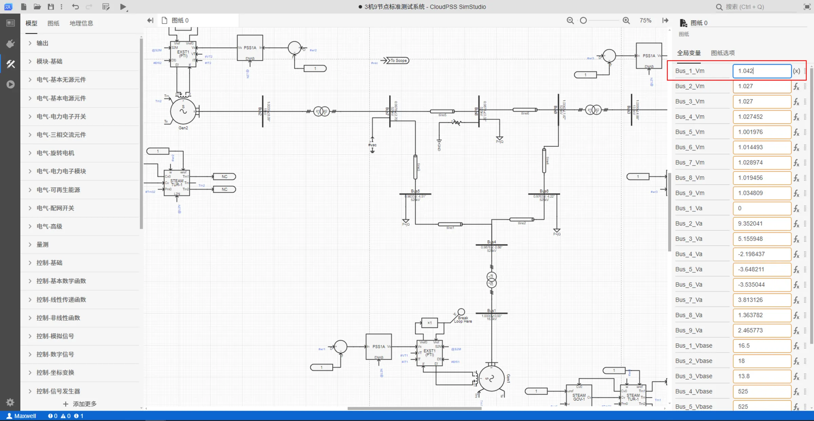

</TabItem>
<TabItem value="java1" label="引脚">

配置引脚参数时可在“值”模式下输入文本类型的引脚号。

</TabItem>
</Tabs>

### “表达式”模式 

点击待编辑参数、变量或引脚的赋值输入框右侧，显示 **$$f_x$$** 时，当前为 **“表达式”模式** 输入框。“表达式”模式下，输入框内可填入**常量**、**全局参数**、**变量**或包含这些元素的**计算表达式**，支持 [**Math.js 表达式语法**](https://mathjs.org/)。**“表达式”模式下**输入栏的边框会变成黄色。

全局参数和变量的引用格式为 **`$` + 参数或变量的键(`key`)**，例如`$R`、`$Vm`、`$var`等。

在“表达式”模式下，输入框会实时自动检查当前输入的表达式状态：
1. 若表达式输入有误，会在当前选中输入框的最右侧显示错误提示符，鼠标悬浮至错误提示符时会显示报错信息；
2. 若表达式输入正确，会在当前选中输入框的最右侧显示表达式的计算值。

从“表达式”模式切换回“值”模式时，当前输入的表达式会丢失，并将当前表达式的计算值直接回填至“值”模式下的输入框。

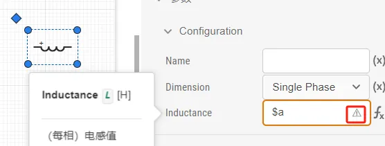

在“表达式”输入模式下，选中输入框，按下 <kbd>Ctrl</kbd> 键可呼出 **扩展编辑框**。在扩展编辑框中，可方便编辑复杂、多行表达式。

参数、变量及引脚的“表达式”模式输入方式如下：

<Tabs>
<TabItem value="js" label="内部参数">

+ 输入常量

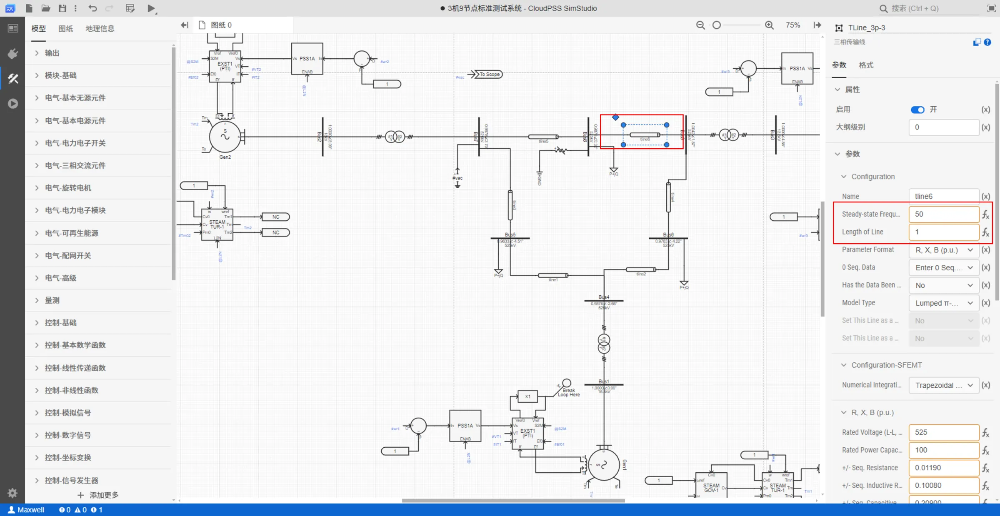

+ 引用全局参数

+ 引用变量

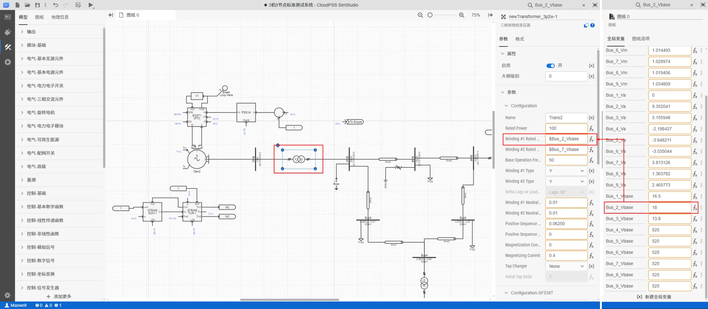

+ 输入含全局参数及变量的计算表达式

</TabItem>
<TabItem value="py1" label="全局参数">

+ 全局参数在接口标签页定义默认值是必须为"值"模式输入，切换到"表达式"模式会报错

+ 但是，配置全局参数方案时可在“表达式”模式下引用其他全局参数

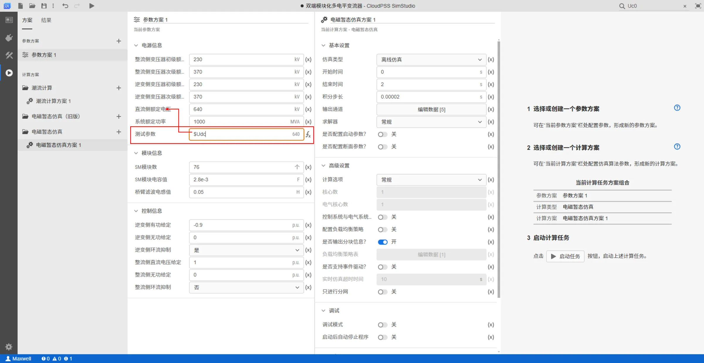

+ 配置全局参数方案时不能引用变量

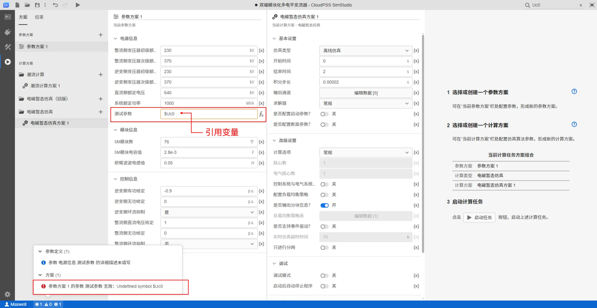
  
</TabItem>
<TabItem value="java3" label="变量">

+ 输入常量

+ 引用全局参数

+ 引用其他变量

+ 输入含全局参数及变量的计算表达式

</TabItem>
<TabItem value="java2" label="引脚">

</TabItem>
</Tabs>

## 参数、变量及引脚配置

### 参数配置

用户可通过 SimStudio **实现标签页**中的**参数卡**面板对当前模型的内部元件参数进行配置。详细使用方法参见 [参数卡](../../40-workbench/20-function-zone/30-design-tab/30-param-panel/index.md) 帮助页。

若需批量配置当前模型下的元件参数，可使用 [元件表](../20-component-table/index.md) 功能。

### 变量配置

用户可通过 SimStudio **实现标签页**中的**全局变量卡**面板对当前模型的全局变量进行配置。

在 SimStudio **实现标签页**，点击图纸空白区域（即取消选中图纸上的元素），在右侧属性栏点击**全局变量**标签，切换至**全局变量卡**。全局变量采用**键-值对**列表进行管理。

1. **新建**：点击全局变量键-值对列表末尾的 **(x)新建全局变量**，会默认在列表最下方新建一个全局变量。
2. **编辑**：在全局变量键-值对列表中，可任意修改每个变量的键 `key` 和值 `value`。变量配置要求如下：
   - 变量键 `key` 是识别变量和全局参数的**唯一标识符**，以字母或下划线 `_` 符号开头，不应与当前模型项目中已存在的变量和全局参数键`key`相同。
   - 变量赋值支持**值/表达式模式输入**，可以引用当前模型项目的全局参数和其他变量进行赋值或计算。引用格式为 **`$` + 参数或变量的键(`key`)**，例如`$R`、`$Vm`、`$var`等。
  

1. **排序**：拖动列表中的每条变量最右侧的**操作柄**，可调整列表中的变量顺序。  
2. **剪切、复制、创建副本与粘贴**：右键点击每条变量最右侧的**操作柄**，可在弹出菜单中执行**剪切**、**复制**、**创建副本**操作。执行**剪切**或**复制**后，在列表空白处右键，可执行**粘贴**操作。
3. **删除**：右键点击每条变量最右侧的**操作柄**，可在弹出菜单中执行**删除**，可删除当前变量。

:::tip 同平台项目间跨网页剪切/复制/粘贴
SimStudio 全局参数、全局变量支持同平台项目间跨网页剪切/复制/粘贴。跨网页剪切/复制/粘贴可以将所选元素在多个 SimStudio 项目之间移动，实现重复性参数、变量配置的快速复用。
:::

  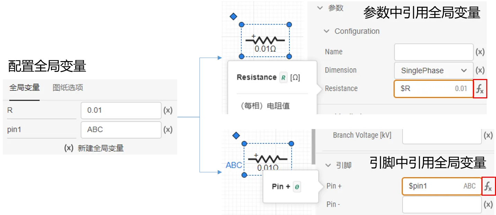

全局变量一般有两类应用场景。

1. 多个元件共用一个参数时，可将该参数定义为全局变量，通过全局变量为元件参数赋值，方便调试模型时快捷、高效地修改参数。
2. 当全局参数与内部参数不匹配时，需要对全局参数进行复杂公式换算时，可设置全局变量暂存计算结果。例如标幺值与实际值转换、变压器分接头挡位计算等。
   

### 引脚配置

在 SimStudio 中，元件具备一种可互相连接的接口（端子），称为引脚。通过引脚连接，可定义不同类型的模型拓扑。

引脚之间存在**连接线连接**、**引脚标签连接**和**混合连接**三种方式。

1. **连接线连接**：在图纸上，鼠标悬浮在元件上时，当前元件可连接的引脚会突出显示。点击某一个引脚，按住鼠标左键，移动到另一个需要连接的引脚上松开左键，即可完成两个引脚的连接；
2. **引脚标签连接**：在元件的**参数卡**-**引脚**列表中，可通过赋值输入框配置**引脚标签**。为需要连接的两个引脚配置相同的引脚标签，即可完成两个引脚的连接。
3. **混合连接**：上述两种连接方式可同时使用，常用于多个元件引脚之间的连接。

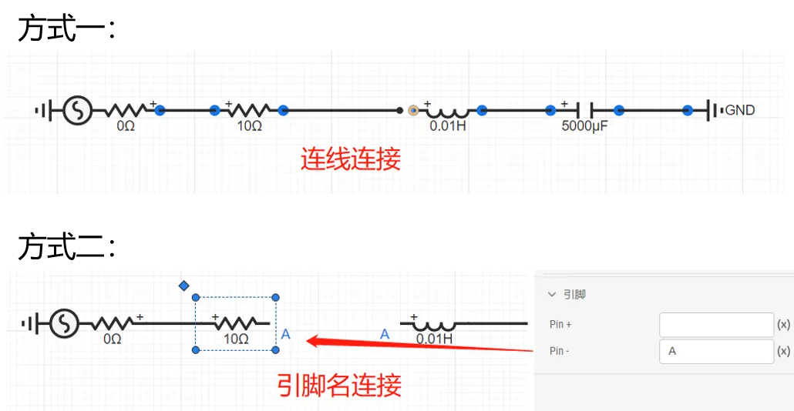

引脚赋值也支持“表达式”输入模式。使用表达式赋值元件引脚，可通过全局参数、变量控制拓扑的变化。例如：

虚拟引脚与引脚一致，但由于不显示在元件图标中，只能采用**引脚标签连接**的方式进行配置。

#### 虚拟输入引脚

虚拟输入引脚本质可以理解为元件的一个动态参数。该参数可通过**引脚标签**赋值，赋予元件内部的某个量一个持续变化的数值。虚拟输入引脚在电机元件和动态限幅元件参数中比较常见。例如：
- 电机元件启动过程中用到的**电压源-电机切换信号**`S2M`和**转子方程解锁信号**`L2N`，通过虚拟输入引脚的方式可以在仿真过程中改变电机模型的状态或控制方式;
- 限幅器的动态限幅上下限参数，可通过虚拟输入引脚的方式可以在仿真过程中动态改变幅值。

#### 虚拟输出引脚

虚拟输出引脚主要用于**输出元件内部的量测信息**，主要用于量测类元件（如电压表、电流表）和元件的 `Monitoring` 参数组。通过为虚拟输出引脚赋值**引脚标签**，可将元件的电压、电流等内部量测值输出，方便引出观测或参与控制。

:::warning 引脚连接一般规范
- 相连两个引脚的维数必须一致。
- 控制输入引脚必须与至少一个控制输出引脚相连。多个控制输入引脚之间可以互联；
- 控制输出引脚可以悬空，多个控制输出引脚之间不可互联；
- 电气引脚可连接到控制输入引脚，此时传入控制系统的数值是电气引脚处的节点电压，单位为 V。但这类连接方法很容易导致单位错误，因此 CloudPSS 不推荐使用这种连接方法，规范的电气量量测方法，详见 [电磁暂态仿真的量测与输出系统](../../../../20-emtlab/50-emts/30-meters-and-outputs/index.md)。
:::

## 常见问题

<!-- 参数与变量的区别？

:   针对某一模块，参数可以与模块外层、内层元件之间交互参数数据的方式，而变量则只能在模块内层交互数据。例
    如：SimStudio 平台提供的元件，由于用户无法看到元件内部信息，故从外部只能看到参数。 -->

<!-- 
参数、变量的作用域
：  在某一模块内定义的参数和变量，其作用域仅局限在该模块内，无法在其外层或内层的模块中进行直接引用。若必须跨层传递参数数值，只能通过在外层或内层模块中设置相应参数，实现参数值传递。
 -->