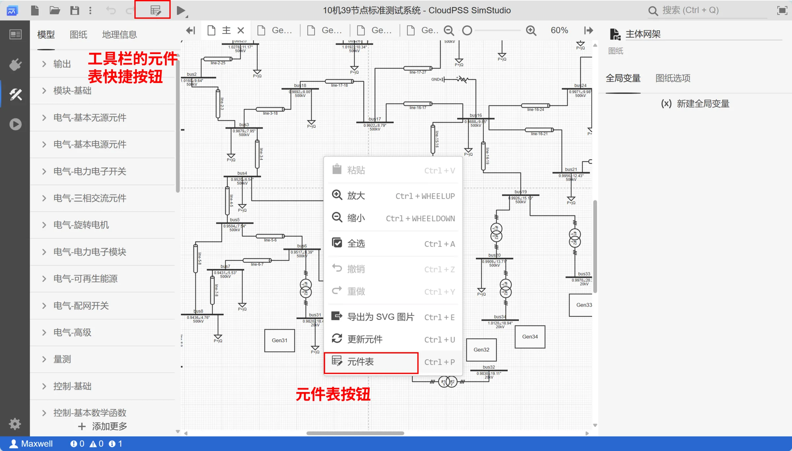
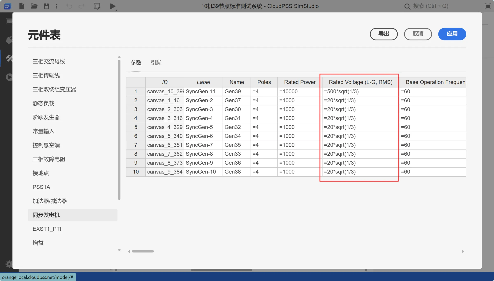
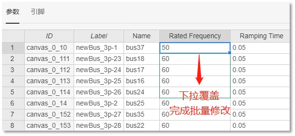
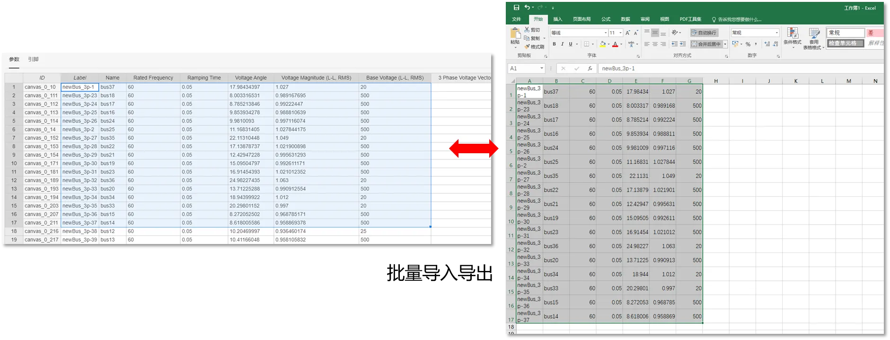

本文档介绍使用 **元件表** 快速批量配置模型内部参数和引脚的方法。

## 功能定义

**SimStudio 元件表**是利用表格形式呈现当前 SimStudio 模型内部参数、引脚信息的模型编辑页面。用户可在此页面批量查看、编辑、导入/导出元件的参数及引脚连接关系，方便管理和编辑大规模复杂模型工程。

## 功能说明

### 打开元件表

元件表有两种打开方式。
1. 在**SimStudio**-**实现标签页**中，工具栏会出现**元件表**快捷按钮，点击 **元件表** 按钮，可弹出元件表对话框。
2. 在**SimStudio**-**实现标签页**-**拓扑编辑区**中，在未选中任何元素情况下点击右键，可弹出快捷菜单（非选中状态），点击 **元件表** 按钮，可弹出元件表对话框。

:::tip 未找到“元件表”按钮
新打开一个项目时，**元件表**按钮可能会隐藏。鼠标左键点击图纸任意位置，即可加载**元件表**按钮。
:::

### 编辑元件表

元件表通过**表格控件**批量管理当前 SimStudio 项目内部的同类元件参数和引脚。

元件表左侧以**元件列表**的形式显示当前 SimStudio 项目内部所包含的全部元件种类，右侧以表格形式显示当前类别的全部元件参数和引脚信息。通过切换**参数**和**引脚**选项卡可切换显示参数列表和引脚列表。

元件表支持单元格编辑、批量复制、粘贴、撤销/重做、**自动填充**等功能。编辑完成后点击右上角的 **确认** 按钮，可保存当前参数及引脚配置并退出元件表。相关配置会同步更新至图纸上的对应元件。点击 **取消** 按钮则放弃当前修改并退出元件表，元件参数恢复至元件表打开前的状态。

:::warning
在元件表面板中，使用`表达式`对参数或引脚赋值时应在表达式前添加`=`标识符。
:::

元件表支持与`Excel`相似的**自动填充**功能。选中一个或多个单元格，点击右下角的小蓝点并拖动至待填充的单元格，可自动利用当前单元格的内容进行批量填充。

### 导出元件表

点击元件表右上角的 **导出** 按钮，可以将导出所有元件的参数及引脚信息导出为`xlsx`格式。

用户可通过导出功能，利用 **Excel** 等表格处理软件进行参数处理。

:::warning 谨慎导入
CloudPSS SimStudio 支持在元件表和 **Excel** 之间的跨软件批量复制粘贴功能。但需注意两点：
1. 通过快捷键<kbd>Ctrl+A</kbd>全选复制粘贴元件表时，存在**1000行**限制（仅复制当前元件表的前1000行）。
2. 批量复制粘贴时，需注意参数、引脚格式的规范。尽量避免利用元件表大范围修改引脚连接关系，错误的操作可能会损坏模型拓扑。如需大范围批量修改，建议使用 CloudPSS SDK 编写脚本进行自动化操作。
:::

## 常见问题

