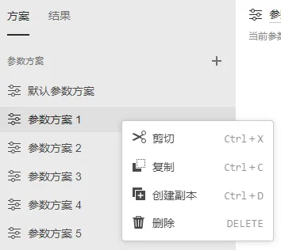
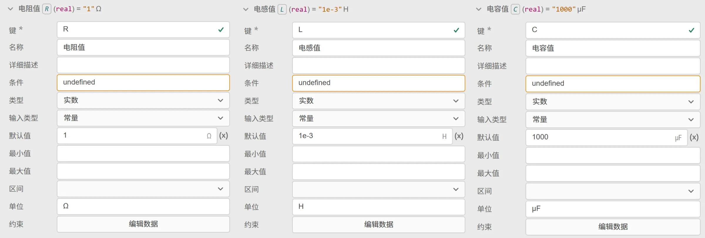
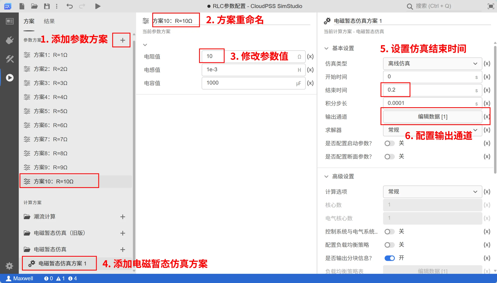
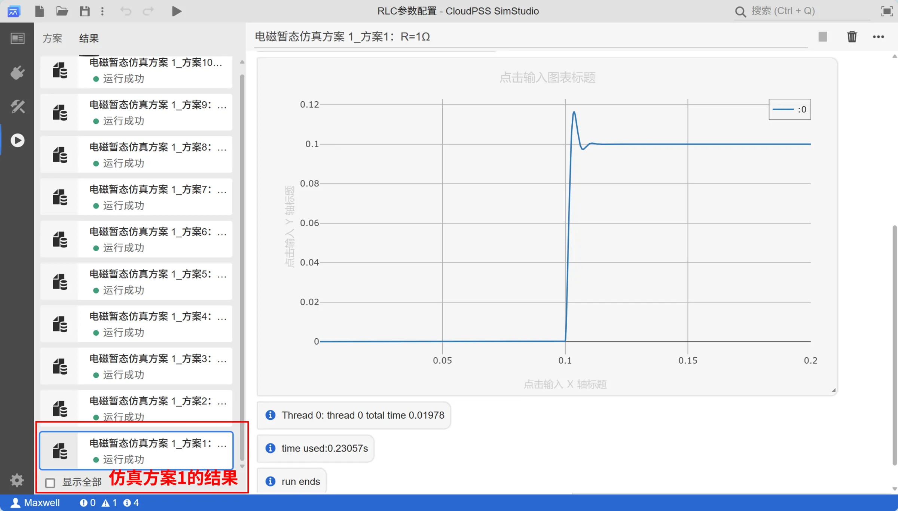
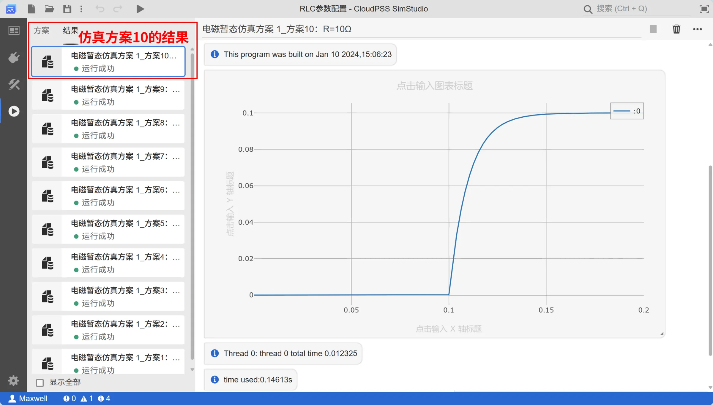

<!-- :::warning
1. 最后的案例应附上附件。（已修改）
2. 配图需要调整一下，配图上有多处错误，比如“5. 设置结束事件”。（已修改）
::: -->

本文档介绍 SimStudio 的参数方案配置功能使用方法。

## 功能定义

当 SimStudio 模型类型选择为**普通模型**或**元件**时，SimStudio 工作台提供参数方案配置功能。用户可通过配置**全局参数**，为同一套 SimStudio 模型添加多组参数方案，实现多场景仿真等应用。

## 配置流程

参数方案配置流程如下：

1. 准备好仿真算例，在 **SimStudio 工作台** - **总览标签页**，检查并确认当前项目的**模型类型**已选择为**普通模型**或**元件**。
2. 在 **SimStudio 工作台** - **接口标签页**，配置全局参数/接口参数列表。具体配置方法参见 [定义参数列表](../40-module-packaging/10-define-module-param-list/index.md) 帮助页；
3. 使用全局参数/接口参数对模型的内部参数进行赋值，确保可通过改变全局参数控制模型内部相应参数变化；
4. 在 **SimStudio 工作台** - **运行标签页** - **参数方案栏**，配置不同的参数方案进行仿真。参数方案栏的使用方法参见 [定义参数列表](../../40-workbench/20-function-zone/40-run-tab/index.md) 帮助页。
  

<!-- 
 
也可**左键常按参数方案上下拖动调整顺序**。
-->

## 案例

<!-- 

import Tabs from '@theme/Tabs';
import TabItem from '@theme/TabItem';

<Tabs>
<TabItem value="js" label="配置不同的方案进行批量仿真">

-->

现以不同参数组合下的二阶RLC电路阶跃响应测试为例，介绍参数方案配置的详细流程。

1. **搭建二阶RLC电路阶跃响应测试拓扑，选取参与参数方案配置的元件参数**
    
    新建一个**普通模型**类项目，搭建如下图所示的仿真拓扑。其中阶跃发生器在 **0.1s** 由 **0** 上升为 **100**。测量电容电压并传至**电容电压**输出通道。
    
    在实际仿真中，受控电压源将在 0.1s 时刻受外部阶跃发生器控制，由 0V 上升到 100V，导致电容电压从 0V 以不同的暂态特性到达稳态值 100V。不同的 RLC 取值组合，决定了不同的暂态特性。现选取**电阻**、**电感**、**电容**的值作为参与参数方案配置的元件参数，构造多组参数方案，分析不同参数组对暂态特性的影响。

    

2. **在接口标签页，定义全局参数列表**

    在接口标签页的参数列表内，新建一个名为**RLC参数组合**的参数组（名称可自定义），并在组内添加对应电阻、电感和电容的全局参数，键（key）分别为`R`、`L`和`C`，如下图所示。

    

3. **在使用全局参数，赋值对应内部元件参数**

    在电阻、电感、电容的元件参数面板内通过**参数键名**引用参数的值，注意切换为表达式模式进行赋值，如下图所示。

    

4. **配置不同的参数方案并仿真**

    在运行标签页，点击**新建参数方案**并创建多个参数方案，依次重命名为

    + **方案1：R=1Ω**
    + **方案2：R=2Ω**
    + ···
    + **方案10：R=10Ω**。
    
    点击不同的参数方案，将参数列表中的电阻值依次修改为 1Ω，2Ω，···，10Ω。
    
    点击电磁暂态仿真方案1，设置结束时间为 **0.2s**，选择输出通道为**电容电压**，采样频率为 10000Hz。

    

    依次选取不同的参数方案，点击**启动任务**，将会生成 10 个仿真结果，如下图所示。可在结果页面的左侧的仿真结果标签页自由查看不同参数方案下的仿真结果。

    

    

    从方案1至10的仿真结果可观察出，随着电阻增大，二阶电路由欠阻尼转变为过阻尼状态。

案例模型下载连接： [RLC参数配置](./RLC参数配置.cmdl)

<!-- 
</TabItem>
</Tabs>
-->

<!-- ## 常见问题 -->

<!-- 
全局变量可以在参数方案中配置吗？
:   参数方案只能配置接口标签页的参数列表，全局变量只能在拓扑编辑过程中配置。
-->
