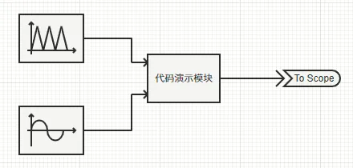
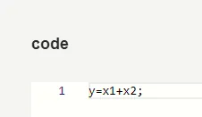
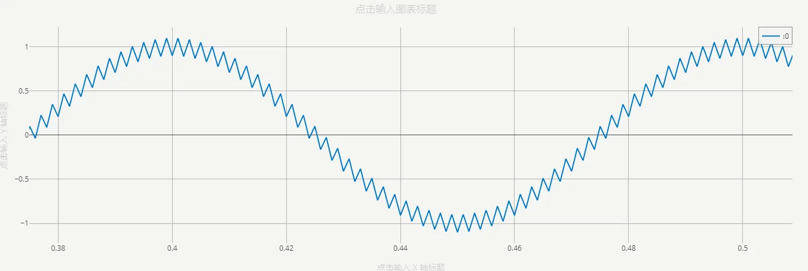

## 参数定义

定义为**代码**的参数，在传到计算内核时将以**文本**的形式进行处理，即代码类型参数的本质为**文本**。

与**文本**类型的参数不同的是，**代码**参数提供多行输入框以及语法高亮，便于输入代码形式的文本。

代码类型的参数可配置项如下表所示。

    | 配置项 | 含义 | 说明 |
    | :--- | :--- | :--- | 
    | **键** | 参数的唯一标识符 | 填写英文、数字及下划线 ```_``` 组成的字符串，不可以数字开头。参数的键为参数的唯一标识，**不可重复**。 | 
    | **名称** | 参数的显示名称 | 填写字符串，可以填写中文，可以重复。 | 
    | **详细描述** | 鼠标在参数上悬浮时，悬浮框显示的补充说明 | 填写字符串，可以填写中文，可以用 Markdown 输入，可以重复。 |
    | **条件** | 参数的可用性条件 | 填写逻辑表达式，默认为 true，可以直接调用其它参数。以调用**键**为 ```par``` 的参数为例，可以支持 ``` (par-1)>1 ```, ```sqrt(par)``` 等表达式形式。与**参数引用**的[“表达式”模式](../../../10-params-variables-pins/index.md#表达式模式)的区别在于，此处在**参数定义**时不需要使用 ```$``` 标识符。 |
    | **类型** | 参数的类型选择 | 此处选择**代码**选项。 |
    | **输入类型** | 可在**变量**和**常量**间选择其一 | 目前 CloudPSS 仅支持**常量**类型，此处请选择**常量**。如果需要实现可变的参数，请参考将**类型**改为[虚拟引脚](../90-virtual-pin/index.md) |
    | **默认值** | 参数的代码默认值，即在新调用本模块或在本模块中新建[参数方案](../../../30-param-config/index.md)时的默认值 | 在参数列表中为按钮的形式，点击后弹出代码编辑窗口，可在多行编辑器中编辑代码。 |
    | **语言** | 代码语法高亮的语言 | 只影响代码编辑时的语法高亮方法，不影响该参数的值。可以填写 **python**, **octave**, **c**, **cpp**, **javascript** 等。 |

## 案例

这里创建一个在调用时输入自定义代码进行计算的 octave 控制元件，项目下载链接：[代码形式案例](./model-code-example.zip)，可参考 [上传算例压缩包](../../../../../../50-user-center/30-cloudpss-apps/10-simstudio-cloud-space/index.md#项目管理)的**上传算例压缩包**，上传该测试项目。

1. 首先，按照[octave 元件文档](../../../../../../20-emtlab/50-emts/50-user-defined/10-octave-control/index.md)所描述的方法，创建一个自定义 octave 元件。

2. 设置共 2 个输入引脚，1 个输出引脚。元件参数设置如下：

    

3. 在octave代码中，采用 ```eval()``` 函数引用代码参数，如下所示：

    

4. 调用该封装模块构造案例，输入频率 500Hz、幅值 0.1 的三角波以及频率 10Hz、幅值 1 的正弦波：

    

5. 在代码参数中，输入加法运算的逻辑：

    

6. 测试结果：

    

    
