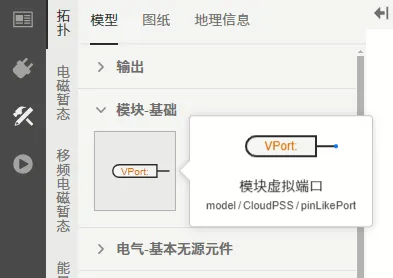
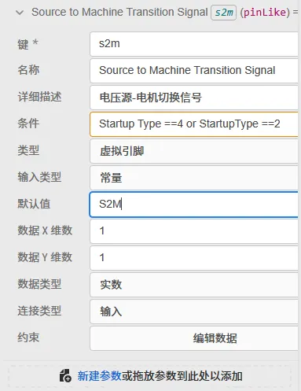

## 参数定义

- 虚拟引脚是最为特殊的参数类别，它虽然在参数列表中进行定义，但在设计逻辑上更贴近于[引脚](../../20-define-module-pin-list/index.md)的概念。

- 虚拟引脚类型的参数可配置项如下表所示。

    | 配置项 | 含义 | 说明 |
    | :--- | :--- | :--- | 
    | **键** | 参数的唯一标识符 | 填写英文、数字及下划线```_```组成的字符串，不可以数字开头。参数的键为参数的唯一标识，**不可重复**。 | 
    | **名称** | 参数的显示名称 | 填写字符串，可以填写中文，可以重复。 | 
    | **详细描述** | 鼠标在参数上悬浮时，悬浮框显示的补充说明 | 填写字符串，可以填写中文，可以用Markdown输入，可以重复。 |
    | **条件** | 参数的可用性条件 | 填写逻辑表达式，默认为true，可以直接调用其它参数。以调用**键**为```par```的参数为例，可以支持``` (par-1)>1 ```, ```sqrt(par)```等表达式形式。与**参数调用**的[“表达式”模式](../../../10-params-variables-pins/index.md#表达式模式)的区别在于，此处在**参数定义**时不需要使用```$```标识符。 |
    | **类型** | 参数的类型选择 | 此处选择```虚拟引脚```选项。 |
    | **输入类型** | 可在```变量```和```常量```间选择其一 | 目前CloudPSS仅支持```常量```类型，此处请选择```常量```。虚拟引脚类型的参数可以视为引脚，其本身就具有传入可变参数的功能。 |
    | **默认值** | 参数的虚拟引脚默认值，即在新调用本模块或在本模块中新建[参数方案](../../../30-param-config/index.md)时的默认值 | 如果**连接类型**是**输入引脚**，则需要以```@```符号开头，如果是**输出引脚**，则需要以```#```符号开头。 |
    | **数据X维数** | 虚拟引脚数据的行数 | 填写整数，用来定义虚拟引脚的纵向维数。以三相元件为例时，此处填写3。 |
    | **数据Y维数** | 虚拟引脚数据的列数 | 填写整数，用来定义虚拟引脚的横向维数，一般情况下（包括三相元件在内）均为1。 |
    | **数据类型** | 虚拟引脚的数据类型选择 | 可在[```实数```](#实数)、 [```整数```](#整数)、 [```文本```](#文本)、 [```布尔```](#布尔)之间选择其一，一般情况下选择```实数```即可。|
    | **连接类型** | 虚拟引脚的电气/控制类型选择 | 可在```输入```、```输出```之间选择其一，目前Simstudio的虚拟引脚仅支持**控制引脚**类型，**不支持**```电气```类型的引脚。|

## 虚拟引脚调用

在配置好虚拟引脚后，可在[拓扑实现标签页](../../../../40-workbench/20-function-zone/30-design-tab/index.md)中引用该虚拟引脚。

:::warning
目前，Simstudio 仅支持在[拓扑实现](../../../../40-workbench/20-function-zone/30-design-tab/index.md#拓扑实现界面默认界面)中完成虚拟引脚的调用，暂不支持[代码实现](../../../../40-workbench/20-function-zone/30-design-tab/index.md#代码实现界面)中调用虚拟引脚。
:::

- 拓扑实现情况

    用户可以在模型库的```模块-基础```栏中找到```虚拟引脚端口```元件，如下图所示。

    

- 将它添加至图纸后，可以配置其绑定的虚拟引脚，如下图所示。

    

- 调用虚拟引脚与[调用引脚](../../20-define-module-pin-list/index.md#拓扑实现)类似，这里不过多阐述。

- 代码实现情况

    暂不支持在代码实现的元件中调用虚拟引脚，请期待后续更新。


## 案例

- 在```同步发电机(model/CloudPSS/SyncGeneratorRouter)```元件中，其```电压源-电机切换信号```（键为```s2m```）和```定子端电压有效值量测信号```（键为```VT_o```）的参数类型即为虚拟引脚。

- 其中，```s2m```用来触发电机的电压源-电机转换动作，该虚拟引脚参数的连接类型为**输入**，其参数配置如下：

    

- ```VT_o```参数用来监测电机的端口电压有效值，该虚拟引脚参数的连接类型为**输出**，其参数配置如下：

    
