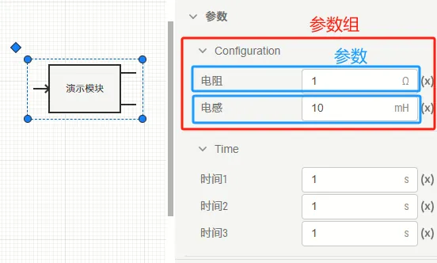
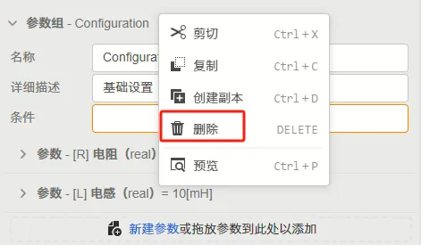
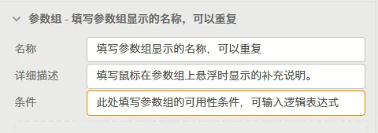
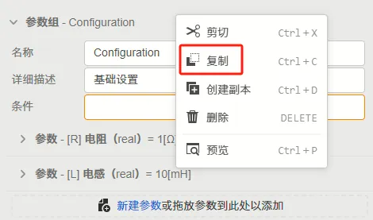
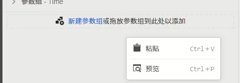
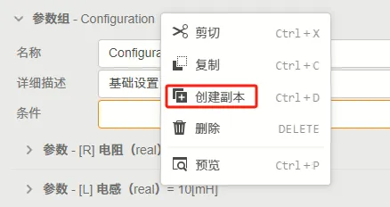
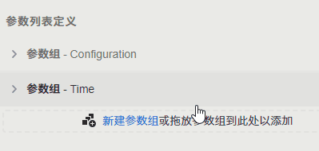
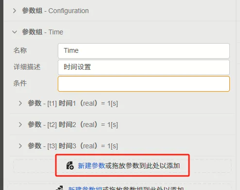

此文档主要介绍元件/模块的参数列表定义方法。

**层级关系**：在 SimStudio 中，参数列表被分为 **参数组**-**参数** 两个层级。两个层级为包含关系，即一个元件/模块可含有若干**参数组**，每个参数组可含有若干**参数**，如下图所示。



**定义步骤**：元件/模块参数列表定义的步骤主要包括[编辑参数组](#编辑参数组)、 [编辑参数](#编辑参数)两个部分。

:::info[参数引用]
在完成参数列表定义后，元件/模块的参数可在模块内部被引用，详见[参数相关文档](../../10-params-variables-pins/index.md#参数)。
:::


## 编辑参数组

一个参数组具有**名称**、**详细描述**、**条件**三个可配置项，它们的含义及说明如下表所示。

| 配置项 | 含义 | 说明 |
| :--- | :--- | :--- | 
| **名称** | 参数组的显示名称 | 填写字符串，可以填写中文，可以重复。 | 
| **详细描述** | 鼠标在参数组上悬浮时，悬浮框显示的补充说明 | 填写字符串，可以填写中文，可以重复。 |
| **条件** | 参数组的可用性条件 | 填写逻辑表达式，默认为 true，可以直接调用其它参数。以调用**键**为 ```par``` 的参数为例，可以支持 ``` (par-1)>1 ```, ```sqrt(par)``` 等表达式形式。与**参数调用**的[“表达式”模式](../../10-params-variables-pins/index.md#表达式模式)的区别在于，此处在**参数组定义**时不需要使用 ```$``` 标识符。 |

用户可自行[新建](#新建参数组)、[删除](#删除参数组)、[修改参数组](#修改参数组)，也可以[复制](#复制粘贴及创建副本)、[粘贴参数组](#复制粘贴及创建副本)以及[调整参数组顺序](#参数组顺序调整)，具体操作如下。

### 新建参数组

在[接口标签页](../../../40-workbench/20-function-zone/20-interface-tab/index.md)中，点击参数列表的最下方的**新建参数组**按钮即可新建一个空的参数组，如下图所示。


### 删除参数组

用户可右键参数组，选择**删除**可以删除整个参数组。



:::warning
注意，此时参数组下的所有**参数**也会被同步删除！
:::

### 修改参数组

用户可根据需求自行设置新参数组中的**名称**、**详细描述**和**条件**。



### 复制、粘贴及创建副本

用户可以创建已有参数组的副本，此时所有**该参数组下的参数**也会被同时复制。

共有三种方式创建参数组的副本，分别为**复制-粘贴**、**右键-创建副本**以及**按住ctrl直接拖拽**。

1. **复制-粘贴方式**

    用户可在右键参数组时找到**复制**按钮（快捷键ctrl+c），并在最下方空白处右键时找到**粘贴**按钮（快捷键ctrl+v）。

     

    

2. **创建副本方式**

    用户可在右键参数组时找到**创建副本**按钮（快捷键ctrl+d）。

    

3. **按住ctrl直接拖拽**

    用户可按住ctrl键拖拽参数组，完成参数组的复制。

    

### 参数组顺序调整

用户可直接拖拽参数组，调整参数组顺序。


## 编辑参数

一个参数具有**键**、**名称**、**详细描述**、**条件**、**类型**五个基本可配置项以及其它详细配置项，五个基本配置项的含义及说明如下表所示。

| 配置项 | 含义 | 说明 |
| :--- | :--- | :--- | 
| **键** | 参数的唯一标识符 | 填写英文、数字及下划线 ```_``` 组成的字符串，不可以数字开头。参数的键为参数的唯一标识，**不可重复**。 | 
| **名称** | 参数的显示名称 | 填写字符串，可以填写中文，可以重复。 | 
| **详细描述** | 鼠标在参数上悬浮时，悬浮框显示的补充说明 | 填写字符串，可以填写中文，可以用 Markdown 输入，可以重复。 |
| **条件** | 参数的可用性条件 | 填写逻辑表达式，默认为 true，可以直接调用其它参数。以调用**键**为 ```par``` 的参数为例，可以支持 ``` (par-1)>1 ```, ```sqrt(par)``` 等表达式形式。与**参数调用**的[表达式模式](../../10-params-variables-pins/index.md#表达式模式)的区别在于，此处在**参数定义**时不需要使用 ```$``` 标识符。 |
| **类型** | 参数的类型选择 | 可在[```实数```](./10-real/index.md)、 [```整数```](./20-integer/index.md)、 [```文本```](./30-text/index.md)、 [```代码```](./40-code/index.md)、 [```布尔```](./50-boolean/index.md)、 [```选择```](./60-selection/index.md)、 [```多选```](./70-multi-selection/index.md)、 [```表格```](./80-table/index.md)、 [```虚拟引脚```](./90-virtual-pin/index.md)之间选择其一，此处的选择将影响其余详细配置项。 |

:::info[额外配置]
除了上述基本配置项以外，根据参数的类型不同，可配置的参数也存在区别，具体的可配置项请详见[参数类型](#参数类型)中的子文档：
:::

用户可自行[新建](#新建参数)、[删除](#删除参数)、[修改参数](#修改参数)，也可以[复制](#复制粘贴及创建副本-1)、[粘贴参数](#复制粘贴及创建副本-1)以及[调整参数顺序](#参数顺序调整)。具体操作如下。

### 新建参数

在[接口标签页](../../../40-workbench/20-function-zone/20-interface-tab/index.md)中，展开待添加参数的参数组，点击该参数组最下方的**新建参数**按钮即可新建一个空的参数，如下图所示。



### 删除参数

用户可右键参数，选择**删除**可以删除参数；或点击参数，按 ```DEL``` 键删除参数。

### 修改参数

对于已创建的参数，用户可直接修改参数的键、名称、类型、默认值等可配置项。

注意，如果已用此模块构建过其它项目，在更新此模块后，请参考[模块的查看与修改](../../50-module-reuse/index.md#模块的查看与修改)更新其它项目中的此模块参数。

### 复制、粘贴及创建副本

用户可以创建已有参数的副本，共有三种方式，分别为**复制-粘贴**、**右键-创建副本**以及**按住ctrl直接拖拽**。

1. 复制-粘贴方式

    用户可在右键参数时找到**复制**按钮（快捷键 ```ctrl+c```），并在参数组最下方空白处右键点击**粘贴**按钮（快捷键 ```ctrl+v```）。

2. 创建副本方式

    用户可在右键参数时找到**创建副本**按钮（快捷键ctrl+d）。

3. 按住ctrl直接拖拽

    用户可按住 ```ctrl``` 键拖拽参数，完成参数的复制。


### 参数顺序调整

用户可直接拖拽参数，调整参数顺序，也可以直接将参数拖拽到其它参数组下。

## 参数类型

以下文档展示了可设置的参数类型，每种类型均具有不同的可配置项。

import DocCardList from '@theme/DocCardList';

<DocCardList />
