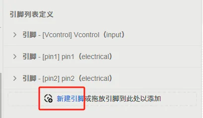
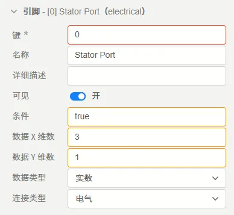
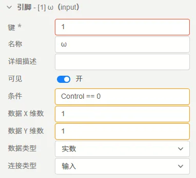
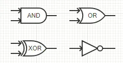
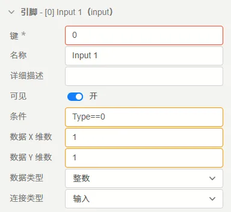
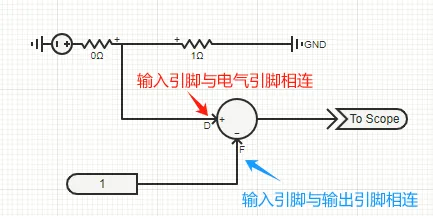
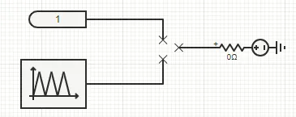
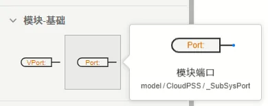
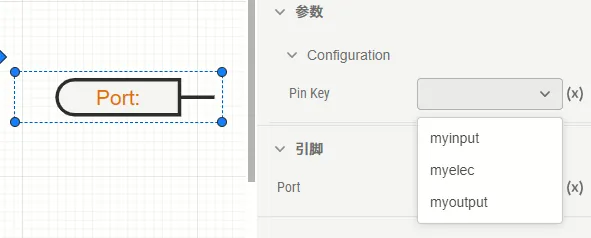
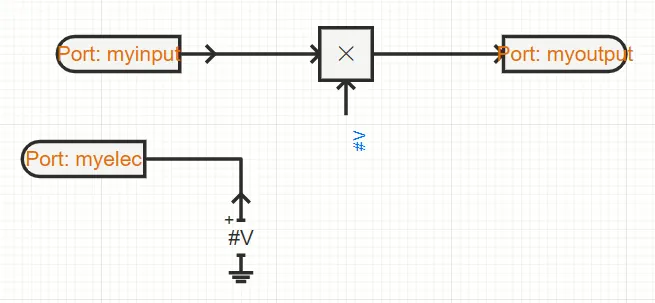

此文档主要介绍元件/模块的引脚定义方法。

引脚是模块内外区域交互的接口。通过本文档介绍的引脚配置过程，用户将能定义模块内部实现与模块端口之间电气与控制的实际连接关系。

元件/模块引脚列表定义的步骤主要包括[编辑引脚](#编辑引脚)、[在模型实现中添加引脚并绑定](#在模型实现中添加引脚并绑定)两个部分。

## 编辑引脚

用户可自行新建、删除、修改引脚，也可以复制、粘贴引脚以及调整引脚顺序。具体操作如下。

### 新建引脚

在[接口标签页](../../../40-workbench/20-function-zone/20-interface-tab/index.md)中，点击```引脚列表定义```最下方的**新建引脚**按钮即可新建一个空的引脚，如下图所示。



### 删除引脚

用户可右键引脚，选择**删除**可以删除引脚；或点击引脚，按```DEL```键删除引脚。

### 修改引脚

对于已创建的引脚，用户可直接修改引脚的键、名称、类型、维数等可配置项。

注意，如果已用此模块构建过其它项目，在更新此模块后，请参考[模块的查看与修改](../../50-module-reuse/index.md#模块的查看与修改)更新其它项目中的此模块引脚。

### 复制、粘贴及创建副本

用户可以创建已有引脚的副本，共有三种方式，分别为**复制-粘贴**、**右键-创建副本**以及**按住ctrl直接拖拽**。

- 复制-粘贴方式

用户可在右键引脚时找到**复制**按钮（快捷键ctrl+c），并在引脚列表最下方空白处右键点击**粘贴**按钮（快捷键ctrl+v）。

- 创建副本方式

用户可在右键引脚时找到**创建副本**按钮（快捷键ctrl+d）。

- 按住ctrl直接拖拽

用户可按住ctrl键拖拽引脚，完成引脚的复制。

### 引脚顺序调整

用户可直接拖拽引脚，调整引脚在列表中的顺序。

## 引脚定义

一个引脚具有**键**、**名称**、**详细描述**、**可见**、**条件**、**数据X维数**、**数据Y维数**、**数据类型**、**连接类型**共8个配置项，其含义及说明如下表所示。

| 配置项 | 含义 | 说明 |
| :--- | :--- | :--- | 
| **键** | 引脚的唯一标识符 | 填写英文、数字及下划线```_```组成的字符串，可以数字开头。引脚的键为引脚的唯一标识，**不可重复**。 | 
| **名称** | 引脚的显示名称 | 填写字符串，可以填写中文，可以重复。 | 
| **详细描述** | 鼠标在引脚上悬浮时，悬浮框显示的补充说明 | 填写字符串，可以填写中文，可以用Markdown输入，可以重复。 |
| **可见** | 切换选择引脚是否在图标上可见 | 可选择开/关，当选择**开**时，需要在[```元件图标绘制```](../30-design-module-icon/60-pin/index.md)的引脚配置部分，在模块图标上布置引脚位置；当选择**关**时，无需在图标上配置引脚位置。 |
| **条件** | 引脚的可用性条件 | 填写逻辑表达式，默认为true，可以直接调用其它引脚。以调用**键**为```par```的引脚为例，可以支持``` (par-1)>1 ```, ```sqrt(par)```等表达式形式。与**参数调用**的[“表达式”模式](../../10-params-variables-pins/index.md#表达式模式)的区别在于，此处在引脚**定义**时不需要使用```$```标识符。 |
| **数据X维数** | 引脚数据的行数 | 填写整数，用来定义引脚的纵向维数。以三相母线/三相电压源为例时，此处填写3。 |
| **数据Y维数** | 引脚数据的列数 | 填写整数，用来定义引脚的横向维数，一般情况下（包括三相母线/三相电压源等三相元件在内）均为1。 |
| **数据类型** | 引脚的数据类型选择 | 可在[```实数```](#实数)、[```整数```](#整数)、[```文本```](#文本)、[```布尔```](#布尔)之间选择其一，一般情况下选择```实数```即可。|
| **连接类型** | 引脚的电气/控制类型选择 | 可在[```电气```](#电气)、[```输入```](#输入)、[```输出```](#输出)之间选择其一，其中```输入```和```输出```均为**控制引脚**类型。|


引脚的类型选择包括```数据类型```和```连接类型```，下面分别介绍其定义。

### 数据类型

数据类型主要指该引脚传递的数据的类型，包括实数、整数、布尔、文本。

#### 实数

实数类型为最常用的引脚数据类型，**通常情况下所有的电气引脚和大部分元件的控制引脚均应选择实数数据类型**。

例如同步发电机中，其三相电气端口以及转速、转矩等控制端口均选择实数类型：




#### 整数

整数类型通常用于处理数字信号，例如```逻辑门```元件中，输入输出端口均为整数类型的数据，如下图所示：

 



如果用户将实数类型的节点接在了整数类型的输入引脚上时，将采用四舍五入的方式，将实数数据转换为整数数据参与计算。

#### 布尔

布尔类型的数据可视为特殊的整数类型数据，其值只为0或1。

如果用户将实数类型或整数类型的节点接在了布尔类型的输入引脚上时，如果该值大于等于0.5，则会被转化为1参与计算；如果该值小于0.5，则会被转化为0参与计算。

#### 文本

文本类型的数据传递的是字符串，通常情况下不使用文本类型的引脚。

### 连接类型

连接类型主要配置该引脚在仿真的物理系统中，节点的类型。可在[```电气```](#电气)、[```输入```](#输入)、[```输出```](#输出)之间选择其一，其中```输入```和```输出```均为**控制引脚**类型。

#### 电气

电气类型的引脚用于模拟真实物理系统的连接关系，例如```电阻```、```电感```、```三相传输线```、```三相双绕组变压器```、```同步发电机```等元件均具有电气引脚。


电气引脚相互连接，则这些相互连接的电气引脚之间必定**等势**。

当电气引脚被直接连在控制输入引脚时，将取电气引脚的**电压值**（单位为V）传递到控制输入引脚。

#### 输入

输入类型的引脚可将外部节点的控制量数值引入模块内部，参与计算。

输入引脚可以与[```输出引脚```](#输出)或[```虚拟输出引脚```](../10-define-module-param-list/90-virtual-pin/index.md)相连，也可以与电气引脚相连。

与电气引脚相连时，将取电气引脚的**电压值**（单位为V）传递到模块内部。



#### 输出

输出类型的引脚可将模块的计算结果输出到模块外部，提供给其它元件使用。

输出引脚可与[```输入引脚```](#输入)或[```虚拟输入引脚```](../10-define-module-param-list/90-virtual-pin/index.md)相连。**不可以与电气引脚或其它输出引脚相连。**



## 在模型实现中添加引脚并绑定

在[接口标签页](../../../40-workbench/20-function-zone/20-interface-tab/index.md)中完成了引脚列表的定义后，还需要在[实现标签页](../../../40-workbench/20-function-zone/30-design-tab/index.md)中添加引脚并绑定。

根据模块的实现类型不同，在实现中添加引脚的方式也不同。

### 拓扑实现

对于采用```拓扑```类型实现的元件，可以将模型库中的```模块端口```元件添加到拓扑实现的图纸中实现引脚在模型中的绑定。



例如，在[接口标签页](../../../40-workbench/20-function-zone/20-interface-tab/index.md)中定义了```myinput```, ```myelec```, ```myoutput```三个引脚，则在```拓扑```中的```模块端口```元件处可以在这三个引脚中选择一个进行绑定，如下图所示。



进一步，可以将该模块端口元件与拓扑中的其它元件相连，完成在拓扑实现中的引脚绑定。



### 代码实现

对于octave实现的模块，请参考[octave自定义元件文档](../../../../../20-emtlab/50-emts/50-user-defined/10-octave-control/index.md)进行配置。

对于python实现的模块，请参考[python自定义元件文档](../../../../../20-emtlab/50-emts/50-user-defined/20-python-control/index.md)进行配置。


