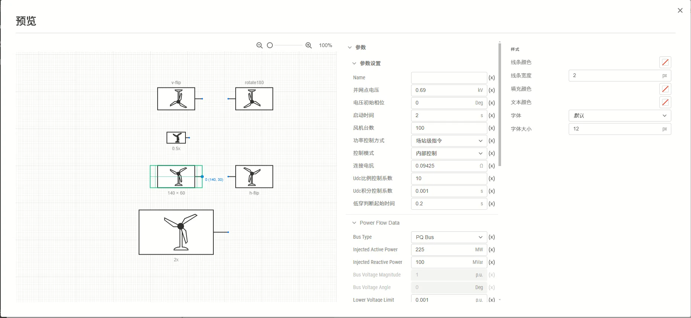

## 图标检查

用户可以随时点击上方工具栏的**预览按钮**，或使用快捷键 <kbd>ctrl+P</kbd>，打开图标的预览。

预览按钮位置如下：

弹出的预览窗口示意如下：

在这里，可以从以下方面检查图标是否规范：

图标大小：用户可以检查该图标的大小和位置，如下图所示。

主要查看灰色字体显示的宽度与长度的数值是否为 5 的倍数；并检查蓝色字体显示的引脚位置的 X 与 Y 坐标是否为 5 的倍数。详见下方[组件的位置与大小](#组件位置与大小)

缩放或旋转正确性：检查图标在缩小、放大或旋转后是否正确显示。

不同参数下的图标显示：当图标的部分组件设定了与参数相关的条件后，可以在这里预览不同参数条件下的图标样式。

样式修改：在模块调用时是可以更改填充颜色等格式的，在这里可以预览不同的线条、填充、字体设置，查看是否符合预期。

## 组件位置与大小

在 SimStudio 中，平移、连线、缩放元件时，会伴随有网格吸附，即所有图形操作都会吸附在 5px 大小的网格上。因此，在设计图标时，也需要尽量保证各个组件的位置为 5px 的倍数。

以某风机模块为例，这里用[路径](../40-path/index.md)组件实现了输入引脚的图标，其大小和位置的设置如下图所示：

可见，该组件的 **X**、**Y**、**宽度**、**高度** 均为 5 的倍数。在放置图标组件时应尽量遵守这一规则，否则可能造成连线无法对准等问题。