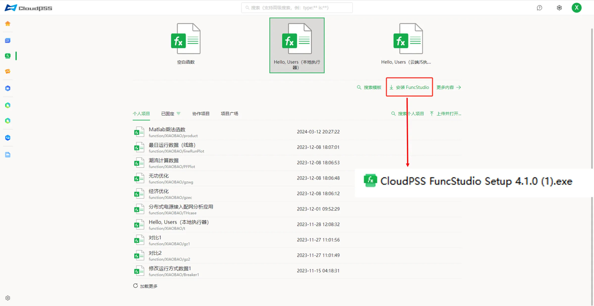
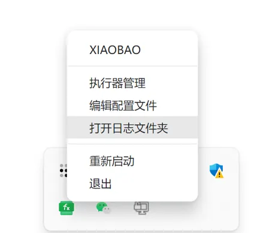
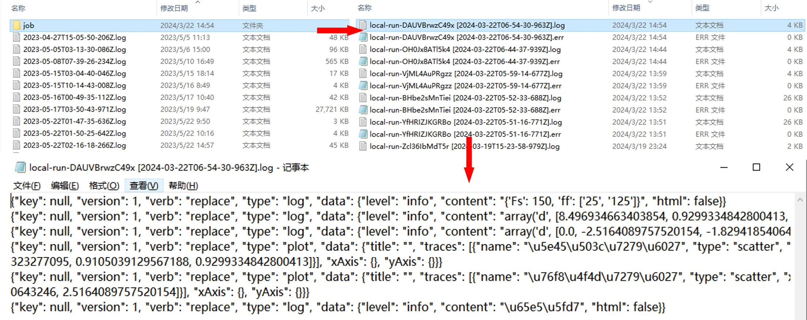

本节介绍 FuncStudio 本地执行器的安装、配置和管理方法。

## 为什么要安装执行器？

对于用户在自己**本地计算资源（个人电脑）上开发和执行的自定义算法内核**，提供本地接入方式，我们称之为 **本地：自定义命令实现**类型的函数。

用户只需在**本地计算资源（个人电脑）中安装 FuncStudio 本地执行器**，通过建立函数项目、定义函数输入和输出参数格式，指定内核在本地执行的命令行语句，即可将内核集成到 CloudPSS 云服务框架。

并且当执行器联网在线时，用户可使用任意一台终端设备登录 CloudPSS 个人账户中，在网页版中远程调用该计算内核来查看计算结果。

## 执行器安装

用户只需在本地计算资源（个人电脑）上登录[CloudPSS 公网平台](https://cloudpss.net/)，进入 CloudPSS 的主页，点击 FuncStudio 的图标，将页面跳转至 FuncStudio 个人中心，点击**安装 FuncStudio**的下载链接，下载 FuncStudio 本地执行器的安装包，根据引导逐步完成安装即可。

## 执行器配置

安装完成后，打开并登录执行器后，此时**系统状态栏**中会出现一个 FuncStudio 执行器的小图标，如下图所示：

右击执行器的小图标，弹出对话框，可以选择执行器的配置项。

### 用户名

点击对话框最上面的**用户名**，浏览器会打开该账户所在的 CloudPSS 平台（公网平台、内网平台、私有云平台）的主页。

### 编辑配置文件

点击**编辑配置文件**，会打开执行器的配置文件，用户可以编辑文件里的内容。

对于**公网平台用户（https://cloudpss.net/）**，配置文件如下图所示，安装时已默认完成配置，用户无需自行更改。

对于其他平台的用户，需要将`HOME URL`修改为当前平台的地址。

:::warning
编辑配置文件后，必须保存后才生效。
:::

### 打开日志文件夹

点击**打开日志文件夹**，会打开执行器的执行日志文件夹，`job`文件夹里面存放着执行器调试执行和启动任务的日志，当函数执行报错时，用户可以打开查看详细的报错日志调试内核。

### 执行器管理

点击**执行器管理**打开执行器管理页面，如图所示，执行器管理界面有三部分：

- 上方显示当前执行器的名称和`ID`，名称用户是可以修改的，`ID`是唯一的。

- 中间区域显示用户在当前平台下接入的全部函数的信息，包括函数的在线状态和执行位置，点击下方的**刷新**按钮，可以刷新所有函数的信息。

- 点击选中某个函数后可以在下方修改该函数的在线状态和执行位置，对于在本设备执行的函数可以点击**设为本机在线**；也可点击**取消分配执行器**让函数下线。

  :::info
  - 一个`CloudPSS`账号可以在多台设备登录来接入在不同设备中开发和执行的函数，这些函数的执行位置可以在执行器管理页面中分配。
  - 对于本地执行的项目，在网页版 FuncStudio 平台中**启动任务**（远程调用）时，必须保证该函数所分配的执行器上线。
  :::

### 重新启动

用于重启执行器。

:::warning
当用户修改配置文件后，必须重启执行器才会生效。
:::

### 退出

退出当前账号登录。

## 执行器工作台

本地执行器的工作台和网页版 FuncStudio 的工作台一致，用户可以在执行器内创建函数，也可在网页版 FuncStudio 中创建函数，保存后，两者之间的函数信息会同步。

## 案例

import Tabs from '@theme/Tabs';
import TabItem from '@theme/TabItem';

<Tabs>
<TabItem value="js" label="公网平台执行器地址配置">

对于公网平台用户，配置文件如下图所示，安装时已默认完成配置，用户无需自行更改。

</TabItem>
<TabItem value="python" label="内网平台执行器地址配置">

对于非公网用户，如：internal 用户，需要将配置文件的`HOME_URL`配置为`https://internal.cloudpss.net/`，如下图所示：

</TabItem>
<TabItem value="java" label="私有云平台执行器地址配置">

对于私有云平台，比如**CloudPSS-Mini**设备的用户，需要将配置文件的`HOME_URL`配置为 CloudPSS-Mini 的**IP 地址**如下图所示：

</TabItem>
</Tabs>

## 常见问题

函数可以在除本机外的其他设备上执行吗?

:    同一函数可以在不同的设备内执行，前提是这些设备上同时存在**完整且配置相同的运行环境**、**运行目录**和**完整的计算内核**。