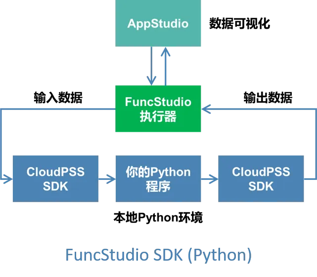
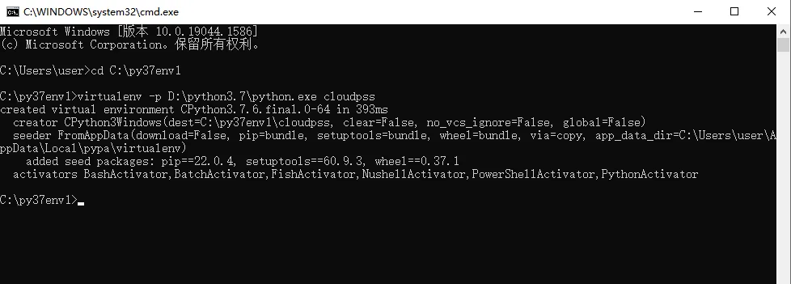

本节介绍在本地计算资源中配置 Python 环境的方法。

## 为什么要配置 Python 环境？

安装好 FuncStudio 本地执行器后，还需要在配置**本地 python 环境**，因为用户在本地执行的算法内核程序，都需要借助 FuncStudio-SDK (CloudPSS-SDK的一个类)**给内核程序封装输入输出接口**后，才能接入本地执行器，如下图所示。



FuncStudio-SDK 包括从执行器中**获取函数输入参数值的接口**以及在执行器中**格式化输出计算结果的接口**。

FuncStudio-SDK 又分为针对 Python 算法的 Python-SDK 和针对 Matlab 算法的 Matlab-SDK。

Matlab-SDK 会在Matlab中启动一个 Python解释器，并且在 Python 解释器里调用 Matlab 算法，是的一种特殊的 FuncStudio-SDK，本质上仍然是 Python-SDK。

因此，无论是使用 Python 还是 Matlab 语言编写的算法内核程序在接入本地执行器前都需要在本地安装 3.7 及以上版本的 Python，并安装 Python-SDK 包。


## 配置流程

如果用户在本地设备上安装了多个版本的 python，建议使用**虚拟 Python 环境**来管理接入 FuncStudio 的算法内核。创建虚拟 Python 环境是为了让函数项目运行在一个独立的环境中，使得不同环境下的项目互不干扰。虚拟 Python 环境的配置流程如下：

### 安装 virtualenv

本地设备中打开终端命令窗口，输入并执行如下命令来安装 Python 的 virtualenv 包。

```py showLineNumbers
pip install virtualenv 
```

### 新建虚拟环境地址

需要新建一个存放虚拟环境的目录。

### 创建虚拟环境

在命令窗口中，将当前路径切换到该目录下，并输入如下格式的命令行：

```py showLineNumbers
virtualenv -p [某一个版本的基础 Python 执行器地址] + 虚拟环境名
```
其中 virtualenv 是创建虚拟环境的指令，之后的参数用于指定当前虚拟环境所使用的 Python 基础环境的位置，即当前设备上python3.7的安装位置，最后一个参数是用户自己设定的虚拟环境名，这里取名`cloudpss`。

例如：
```py showLineNumbers
virtualenv -p D:\python3.7\python.exe cloudpss
```

执行这个命令后，可以看到在存放虚拟环境的地址下创建了一个名为`cloudpss`的文件夹。

### 激活虚拟环境

进入虚拟环境所在的目录，找到**scripts**子目录，将命令窗口的当前路径切换到该目录下，执行`Activate`命令，即可激活虚拟环境，在命令行，若左侧显示一个括号，里面写着虚拟环境名称，说明现在已进入到虚拟环境中。至此虚拟 Python 环境就建立好了。

:::info
这个环境地址在后续将内核接入执行器**配置执行计算内核的命令语句**，以及配置 Matlab 的 Python 环境时都会用到。
:::

### 安装 CloudPSS SDK

最后，还需要在命令窗口中执行如下命令，在创建虚拟 Python 环境中安装 CloudPSS SDK。

```py showLineNumbers
pip install cloudpss
```

安装成功后在命令窗口中输入如下命令，来检验是否安装成功。若安装成功，命令窗口会返回安装版本。

```py showLineNumbers
pip show cloudpss 
```

## 案例

import Tabs from '@theme/Tabs';
import TabItem from '@theme/TabItem';

<Tabs>
<TabItem value="js" label="在本地计算机上创建一个虚拟 Python 环境">

1.安装 virtualenv
   
在本地计算机上打开命令窗口，输入并执行如下命令来安装virtualenv 包。

```py showLineNumbers
pip install virtualenv 
```


2.新建虚拟环境地址
   
例如，新建一个`C:\py37env1`的目录，在命令窗口中输入并执行如下命令，将当前路径切换到该目录下。

```py showLineNumbers
cd C:\py37env1
```


3.创建虚拟环境
   
在命令窗口中输入并执行如下命令:
   
```py showLineNumbers
virtualenv -p D:\python3.7\python.exe cloudpss
```


执行后，可以看到在该目录下创建了一个名为`cloudpss`的文件夹。


4.激活虚拟环境
   
找到`scripts`子目录，将命令窗口的当前路径切换到该目录下，输入并执行`Activate`命令，即可激活虚拟环境。


至此虚拟 Python 环境就建立好了，地址为：`C:\py37env1\cloudpss\Scripts\python.exe`。


5.安装 CloudPSS SDK
   
在命令窗口中执行如下命令:

```py showLineNumbers
pip install cloudpss
```


安装成功后在命令窗口中输入如下命令，来检验是否安装成功，可以看到当前安装版本。

```py showLineNumbers
pip show cloudpss 
```


</TabItem>
</Tabs>

## 常见问题

`pip install cloudpss` 的时候显示 `time out`怎么解决？

:   出现安装超时的问题，可以通过切换其他源重新安装来解决。例如可以输入如下命令，使用清华源来安装。

    ```py showLineNumbers
    pip install cloudpss  -i https://pypi.tuna.tsinghua.edu.cn/simple 
    ```

如何在**Anaconda/Pycharm**中新建虚拟环境并安装 CloudPSS SDK？

:   如果用户已安装了**Anaconda/Pycharm**，可以按照其支持的方法新建虚拟环境，并在虚拟环境中安装 CloudPSS SDK 即可，具体方法可参见[第三方的安装教程](https://blog.csdn.net/weixin_44779079/article/details/132640227)。