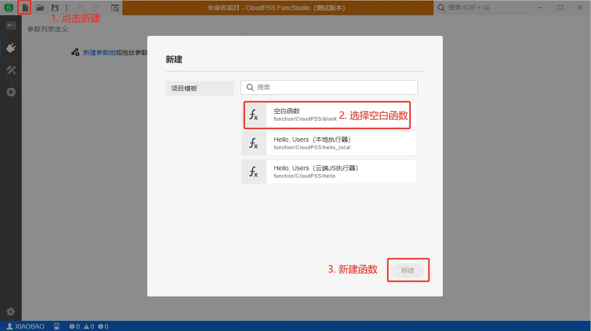
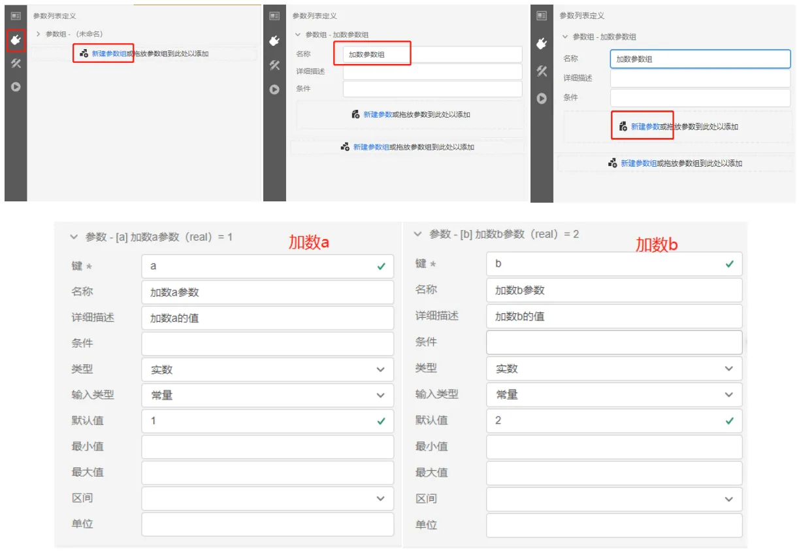
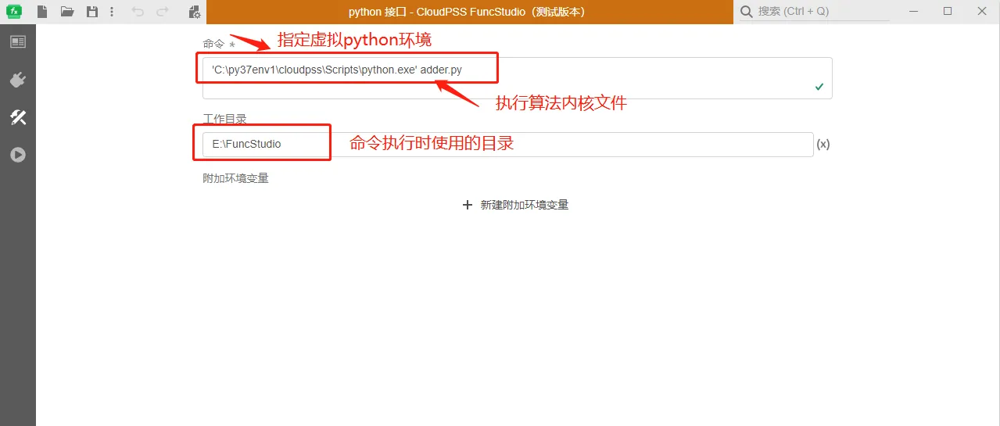
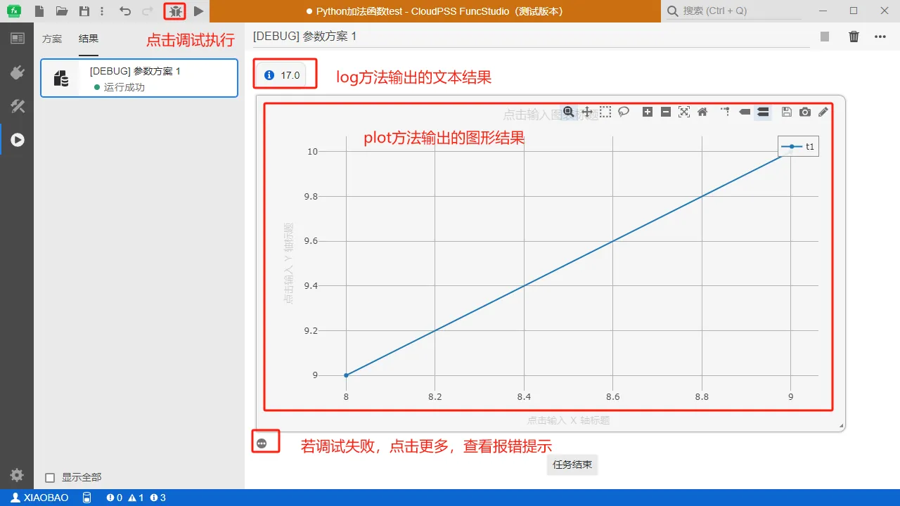
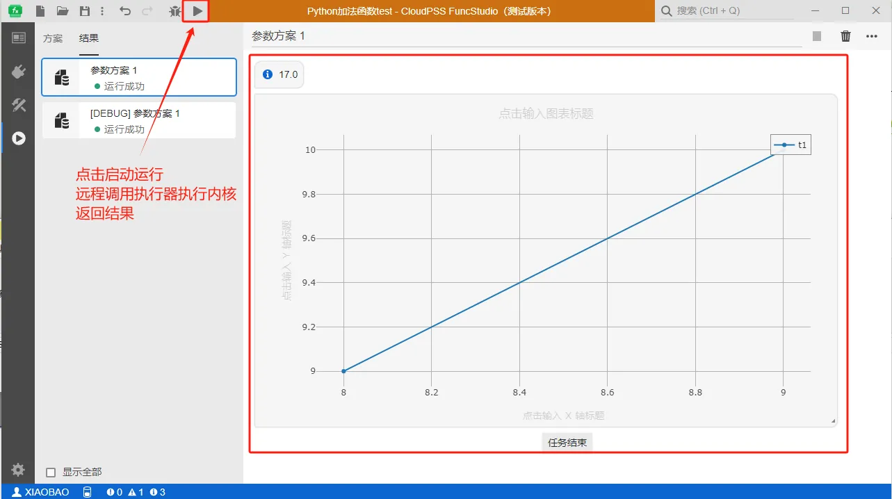

本节以一个**简单的入门案例**介绍如何将用户在自己本地计算资源上开发和执行的**Python 算法内核**接入执行器。

### 创建函数项目

首先打开下载好的 FuncStudio 本地执行器，点击**新建空白项目**，创建一个空白函数项目。



### 定义函数输入参数

在**接口**标签页配置函数的参数列表，即定义函数输入参数。以一个简单**加法器内核**为例，输入参数可简单抽象为两个参数：**加数 a 和 b**，现在我们就需要将这两个参数在列表中定义。

具体的，点击**新建参数组**，新建一个名称为**加数参数组**的参数组；接着点击**新建参数**，在该参数组内添加两个表示**加数 a**、**加数 b**的参数，如下图所示。



:::warning
参数的键是必须配置的，且是唯一的。
:::

### 实现函数内核

在完成函数的输入参数配置后，需要借助 FuncStudio-SDK 给算法程序封装输入输出接口后，接入执行器。

#### 配置 Python 环境

首先，需要在本地计算资源中配置 Python 环境来安装 CloudPSS-SDK，详见[Python 环境配置](../../30-dev-env-setup/20-python-env-config/index.md)。

#### 给算法程序封装输入输出接口

安装好 SDK 后，需要利用 SDK 给用户自定义的算法函数封装输入输出接口，即获取函数输入参数值以及格式化输出计算结果。

以一个加法程序为例，封装之后形成了一个可接入 FuncStudio 的函数内核，名为 adder.py 的 Python 文件。

具体代码如下所示：

```py title="adder.py" showLineNumbers
import cloudpss  #导入安装好的CloudPSS-SDK
if __name__ == '__main__': 
    job = cloudpss.currentJob() #获取函数在当前参数方案下的计算任务实例
    a = job.args.a #利用 SDK 提供的 args 方法根据键名获取加数 a 在当前参数方案下的值
    b = job.args.b #获取加数 b 在当前参数方案下的值
    a = float(a) #数据类型的转换，针对老版本的执行器
    b = float(b) #数据类型的转换，针对老版本的执行器
    c = a + b #加法程序（用户自定义的算法）
    job.log(a+b,key='log-1') #利用 SDK 提供的 log 方法向 FuncStudio 发送文本结果
    job.plot([{'name':'t1','type':'scatter','x':[a,a+1],'y':[b,b+1]}],key='plot-1') #利用 SDK 提供的 plot 方法向 FuncStudio 发送图形结果
```
:::warning
需要注意的是，对于老版本的执行器，不论接口参数的类型设置为整数还是实数，在默认参数方案下通过接口 SDK 获取的值都是**字符串类型**；因此，为了保参数能够计算，建议用户在计算内核中对通过接口 SDK 获取的输入参数的值再做一次**数据类型的转换**。
该问题在 4.0.0 以上版本的执行器中已修复，建议用户安装最新版本的执行器。
:::

#### 指定内核在本地执行的命令行语句

以上两个准备工作完成后，就可以在执行器中指定内核在本地执行的命令行语句。

具体的，在执行器实现标签页面的命令窗口内输入执行 adder.py 文件的命令，在工作目录内指定 adder.py 文件所在的本地目录。 以用之前创建好的虚拟 Python 环境来执行 adder.py 文件。



### 调试函数

走完以上步骤后，即可在执行器中对函数内核进行调试执行了。

具体的，进入**运行标签页**，添加多个参数方案，


通过修改参数，对函数内核进行调试执行，可以点击`···`号查看更多的调试信息（提示/报错），调试执行只在FuncStudio本地执行器里有，网页版没有。



### 保存函数

调试完成后即可对函数进行远程调用，在远程调用之前需要把函数集成到 CloudPSS 云服务框架中。

点击工具栏的保存按钮，输入函数资源 ID 和函数名称将该函数保存到个人中心。如下图所示：


### 配置执行器

在远程调用之前还需要对函数的执行器进行配置。右击系统状态栏中 FuncStudio 执行器的小图标，选择菜单中的执行器管理打开执行器管理界面。


对于刚保存的在本地执行的函数当前状态为'未分配执行器'，需要手动选中后设置为**设为本机在线**。


### 远程调用函数

选择一个配置好参数方案，点击工具栏的**启动任务**按钮，在该参数方案下远程调用函数，得到相应的输出结果。

此时，用户也可在网页版 FuncStudio 中点击**启动任务**来远程调用执行器执行该函数获取计算结果。



