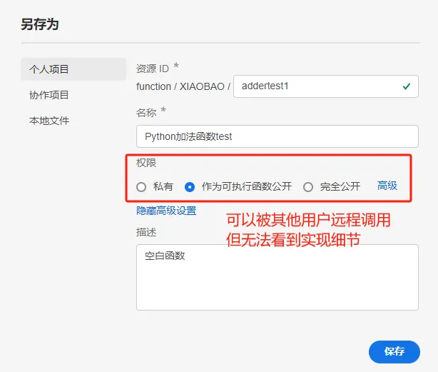
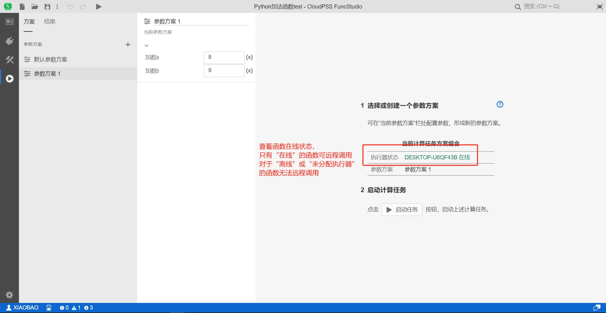

本节首先介绍 FuncStudio 本地接入函数的远程调用功能，然后通过 1 个案例展示远程调用功能的使用方法。

## 功能定义

FuncStudio 本地执行器可安装在 x86、ARM 等任意类型计算设备，不限制平台和系统，可灵活部署至各类云计算和边缘计算设备中。

当这些设备**联网在线**时，借助 CloudPSS 云服务框架，用户只需一台装有浏览器的终端设备，即可像使用 CloudPSS 其他服务一样，随时随地从远程调用该函数获取计算内核在本地设备执行的结果。并且当函数执行权限公开时，CloudPSS 的其他用户也可以远程调用该函数。

## 功能说明

### 使用前提

#### 保存函数

本地接入的函数在执行器中调试通过后需要集成到 CloudPSS 云服务框架中进行远程调用。首先需要保存函数，点击工具栏的保存按钮，输入函数资源 ID 和函数名称将该函数保存到个人中心。

对于 CloudPSS 公网平台：

- 权限选择私有时，函数将会保存在个人项目中，仅用户自己可以远程调用；

- 权限选择完全公开时，函数会同步到项目广场中，所有用户可见，并且当函数分配了执行器后，其他用户也可在自己的网页版 FuncStudio 或 AppStudio 中远程调用该函数，并且能够查看函数的内部细节；

- 如果您希望 CloudPSS 的其它用户只能远程调用您的函数，而无法看到内部实现细节，可以将函数的权限配置为**作为可执行函数公开**。

#### 配置执行器

将函数集成到 CloudPSS 云服务框架后还需要对函数的执行器进行配置，确保函数的执行器是**在线**的。

右击系统状态栏中 FuncStudio 执行器的小图标，选择菜单中的执行器管理打开执行器管理界面。

对于刚保存的函数当前执行状态为“未分配执行器”，需要手动选中后设置为“设为本机在线”。

### 远程调用函数

在网页版 FuncStudio 主页的**个人中心**中找到**在线的函数**，在运行标签页配置好参数方案后点击**启动任务**按钮，即可远程调用该函数，获取函数内核在本地设备执行的结果。

:::warning
本地执行器内的启动任务功能，也属于对**函数的远程调用**，需要保存函数、配置执行器后才能正常使用。
:::

对于公网平台项目广场内其他用户公开的函数，打开后在运行标签页**查看函数执行器的状态**，如果在线，可以远程调用。

## 案例

### 远程调用已公开的函数

## 常见问题

函数无法远程调用如何解决？

:   首先，检查函数执行器是否在线；
    然后，检查函数执行器位置是否正确；
    对于执行器位置正确，状态在线的函数需要打开本地执行器对函数内核进行[本地调试](../40-local-debugging/index.md)，排查错误。
