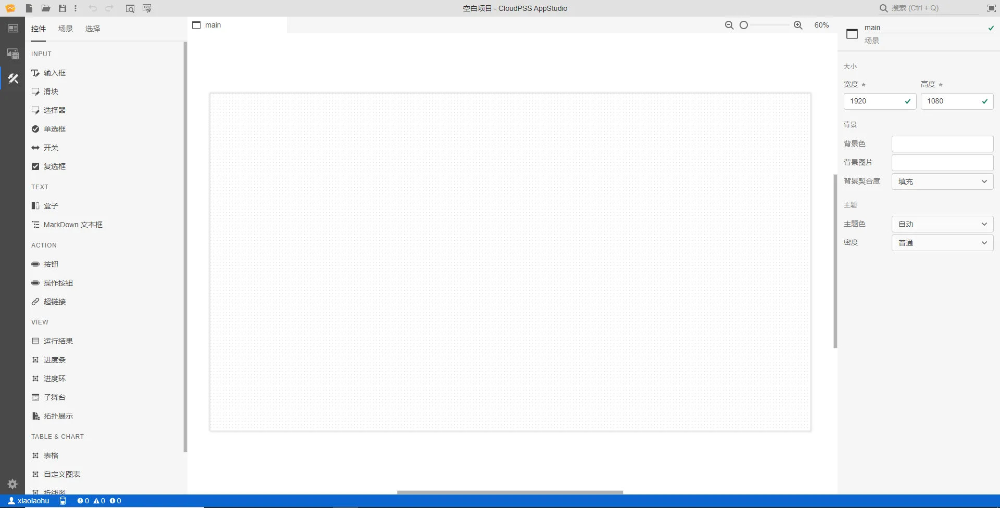
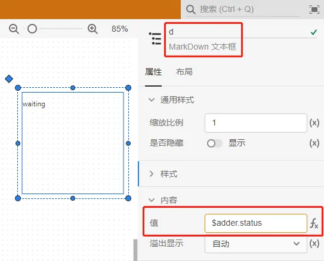
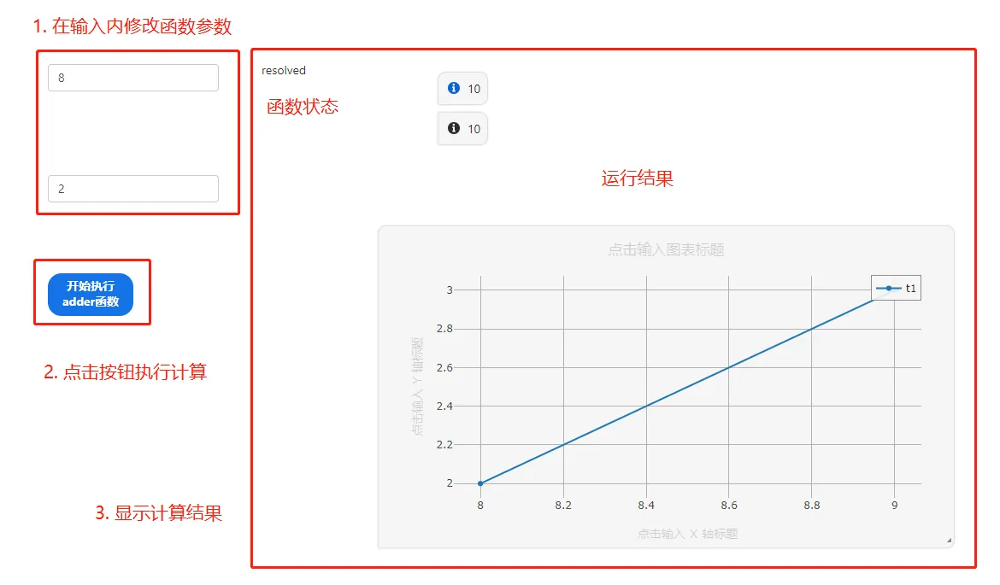

本节主要介绍利用 FuncStudio 的资源函数在 AppStudio 里面构建一个简单的加法应用场景。

## 创建函数

在 FuncStudio 创建一个加法函数，创建方法详见[FuncStudio 快速入门](../../../30-funcstudio/40-quick-start/10-create-python-function/index.md)的介绍。

## 创建应用

登录到 CloudPSS 的主页，点击 AppStudio 图标进入个人中心，点击**新建空白项目**，即创建一个空白项目，并进入AppStudio 工作台。

## 添加函数资源

点击左侧的资源按钮，进入**资源标签页**，在资源创建区点击新建资源，选择函数资源。

选中该函数，给函数命名为**adder**，并在函数 RID栏中选择在 FuncStudio 上创建的 Python 加法器函数。

:::tip
在AppStudio中使用FuncStudio函数时需要保证该函数的执行器在线。
:::

#### 搭建场景

点击左侧标签栏的**场景**按钮，进入**场景**标签页，编辑加法应用的场景。

首先，放置两个**输入框**控件，分别命名为`a`和`b`，默认值设置为`1`和`2`，

并在**事件**/**更改**属性栏内分别输入`$adder.args.a=a.value`和`$adder.args.b=b.value`的表达式，

添加一个**当输入框值变更时**触发的事件：**通过更改输入框的值对函数资源的两个参数赋值**。

其中`$adder.args.a`表示函数资源**adder**的参数 a 的值；`a.value`表示*输入框 a 的值。

接着，放置一个**按钮**控件，命名为`c`，在**内容**/**文本**栏内输入提示，

并在**事件**/**点击**栏内输入`$adder.start()`的表达式，

添加一个点击按钮时触发的事件：点击该按钮远程调用函数资源，`$adder.start()`表示启动 `adder` 函数。

进一步,放置一个**Markdown 文本框**控件，命名为`d`，在**值**栏内输入`$adder.status`的表达式，获取函数的执行状态。

此外，在控件列表区选择两个**运行结果**控件，命名为`e`和`f`，

在**内容**/**结果ID**栏内都输入`$adder.job.id`的表达式，用于显示**adder**函数的执行结果；

不同的是在运行结果 e 的**消息类型**栏内输入`log`，让运行结果 e 仅识别并显示 type 为 log 的运行结果（也就是文本结果）；

在运行结果 f 的**消息 key**栏内输入`plot-1`，让运行结果 f 仅识别并显示 key 为`plot-1`的运行结果。

#### 预览效果

在编辑好上述场景后，点击工具栏的**预览**快捷按钮，在预览模式下点击按钮，远程调用加法函数，在执行器中执行 Python 内核将结果返回给 AppStudio，在 Markdown 文本框和运行结果中即可看到相应的计算结果，并且可以通过修改输入框的值来多次执行函数，查看运行结果的变化情况。

