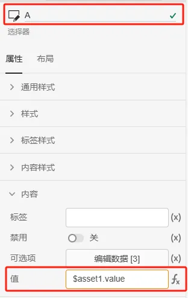
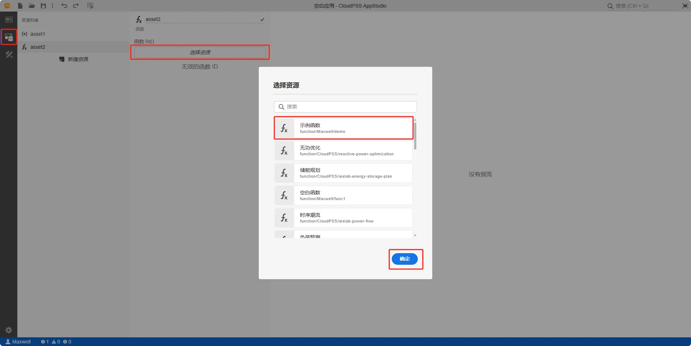
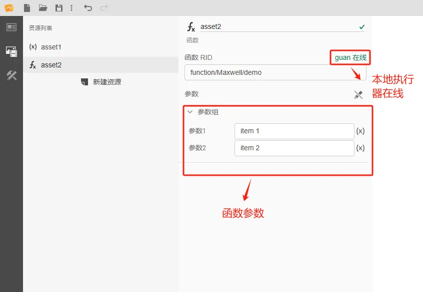
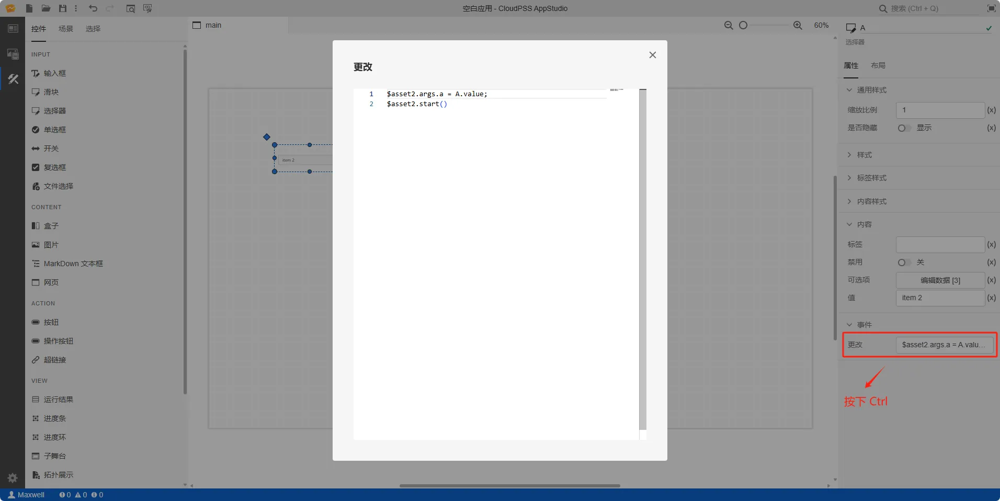

本节主要介绍 **AppStudio** 控件库里的选择器控件。

## 属性

**CloudPSS** 提供了一套统一的控件属性参数

### 通用样式

import CommonStyle from '../../60-grid/_common-style.md'

<CommonStyle />

### 样式

| 参数名 | 键值 (key) | 单位 | 备注 | 类型 | 描述 |
| :--- | :--- | :--- | :--: | :--- | :--- |
| 布局 | `layout` |  | 选择控件布局 | 选择 | 垂直或者水平布局，默认为垂直 |
| 安静 | `quiet` |  | 选择是否安静 | 选择 | 选择**是**或者**否**，默认为**否**状态 |
| 高度 | `style/--spectrum-picker-m-height` |  | 输入选择器高度 | 常量 | 选择器高度 |

### 标签样式

| 参数名 | 键值 (key) | 单位 | 备注 | 类型 | 描述 |
| :--- | :--- | :--- | :--: | :--- | :--- |
| 文字字体 | `style/font-family` |  | 选择文字字体 | 选择 | 标签文字字体样式，字体类型包括：默认、宋体、黑体、楷体、微软雅黑、Georgia、Palatino Linotype、Times New Roman、Arial、Arial Black、Verdana、Courier New、Trebuchet MS |
| 文字字号 | `style/--spectrum-global-dimension-font-size-100` |  | 输入文字字号 | 常量 | 输入文字字号 |
| 文字颜色 | `style/--spectrum-alias-label-text-color` |  | 选择文字颜色 | 颜色选择器 | 点击文字颜色，弹出颜色选择器自定义颜色 |
| 文字粗细 | `style/--spectrum-alias-body-text-font-weight` |  | 选择文字粗细 | 选择 | 选择标签文字粗细，默认、100、200、300、400、500、600、700、800、900、1000 |

### 内容样式

| 参数名 | 键值 (key) | 单位 | 备注 | 类型 | 描述 |
| :--- | :--- | :--- | :--: | :--- | :--- |
| 文字字体 | `style/--spectrum-alias-body-text-font-family` |  | 选择文字字体 | 选择 | 输入框内容文字字体样式，字体类型包括：默认、宋体、黑体、楷体、微软雅黑、Georgia、Palatino Linotype、Times New Roman、Arial、Arial Black、Verdana、Courier New、Trebuchet MS |
| 文字字号 | `style/--spectrum-picker-m-text-size` |  | 输入文字字号 | 常量 | 输入文字字号 |
| 文字颜色 | `style/--spectrum-picker-m-text-color` |  | 选择文字颜色 | 颜色选择器 | 点击文字颜色，弹出颜色选择器自定义颜色 |

### 内容

| 参数名 | 键值 (key) | 单位 | 备注 | 类型 | 描述 |
| :--- | :--- | :--- | :--: | :--- | :--- |
| 标签 | `label` |  | 输入内容标签 | 常量 | 选择器控件文字标签 |
| 禁用 | `disabled` |  | 禁用开关 | 开关 | 禁用选择**开**或者**关**，开启后控件禁止点击和交互，默认为**关** |
| 可选项 | `items` |  | 选择器控件可选项表格 | 表格 | 点击编辑数据，弹出可选项表格进行编辑，上方的图标从左到右依次是： **撤销(<kbd>Ctrl</kbd> <kbd>Z</kbd>)** 、**重做(<kbd>Ctrl</kbd>  <kbd>Y</kbd>)**、**在上方插入行(<kbd>Ctrl</kbd> <kbd>I</kbd>)**、**在下方插入行(<kbd>Ctrl</kbd> <kbd>Alt</kbd> <kbd>I</kbd>)** 、**导入 CSV**、**导出 CSV** |
| 值 | `value` |  | 选择器控件值 | 常量 | 选择器默认值，默认为 item 1 |

### 事件

| 参数名 | 键值 (key) | 单位 | 备注 | 类型 | 描述 |
| :--- | :--- | :--- | :--: | :--- | :--- |
| 更改 | `@change` |  | 输入结束时触发事件 | 函数 | 采用更新方式触发，失去焦点后控件的值才会更新 |

## 案例介绍

### 可选项

从左到右，依次是`撤销(Ctrl + Z)`，`重做(Ctrl + Y)`，`在上方插入行(Ctrl + I)`，`在下方插入行(Ctrl + Alt + I)`，`删除行(Ctrl + D)`，`导入 CSV`，`导出 CSV`

### 典型应用

1. 创建一个选择器控件，在右侧的属性配置区内给选择器命名为 A

2. 创建静态资源 asset1，值设置为 `item 2`
   
3. 将输入框 A 的内容/值属性切换到 fx 表达式模式，设置为 `$asset1.value`

4. 点击工具栏的预览快捷按钮（或者 <kbd>Ctrl</kbd> <kbd>P</kbd>），进入预览模式，在预览模式下修改选择器 A 的值

:::tip 典型应用使用详情

查看 [AppStudio 应用工坊快速入门](../../../20-quick-start/10-simple-apps/index.md)

:::

### 接入 FuncStudio 函数的典型应用

1. 创建一个选择器，在右侧的属性配置区内给选择器命名为 A

2. 创建函数资源 asset2，选择资源类型为函数

3. 配置函数资源 asset2，点击**选择资源**，绑定 `rid` 为 `function/Maxwell/demo` 的示例函数，示例函数存在两个参数 `a` 和 `b`

4. 鼠标选中选择器 A 的事件/更改属性栏，按下 <kbd>Ctrl</kbd> 输入 `$asset2.args.a = A.value; $asset2.start()`

5. 点击工具栏的预览快捷按钮（或者 <kbd>Ctrl</kbd> <kbd>P</kbd>），进入预览模式，在预览模式下修改选择器 A 的值

:::tip FuncStudio 函数使用详情

查看 [FuncStudio 函数工坊使用指南](../../../../30-funcstudio/10-user-guide/index.md)

:::

## 常见问题

import Fx from '../../60-grid/_expression.md'

<Fx />

import Event from '../../60-grid/_event.md'

<Event />