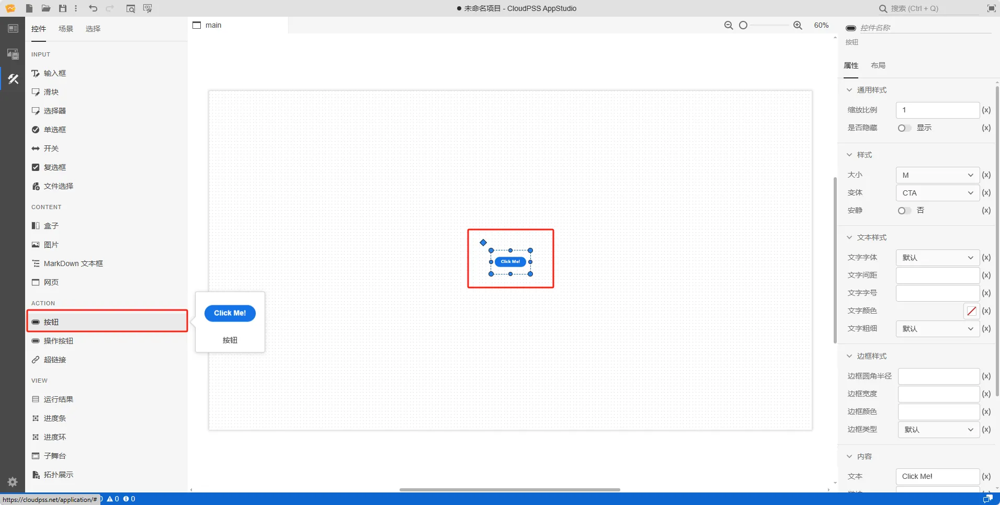
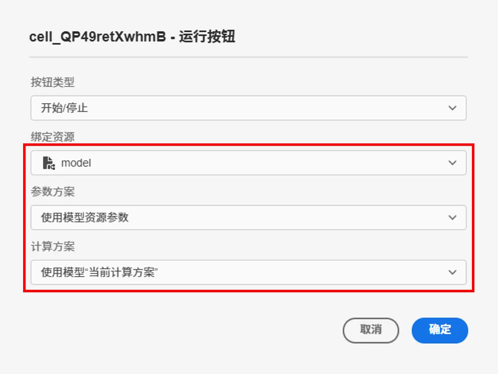
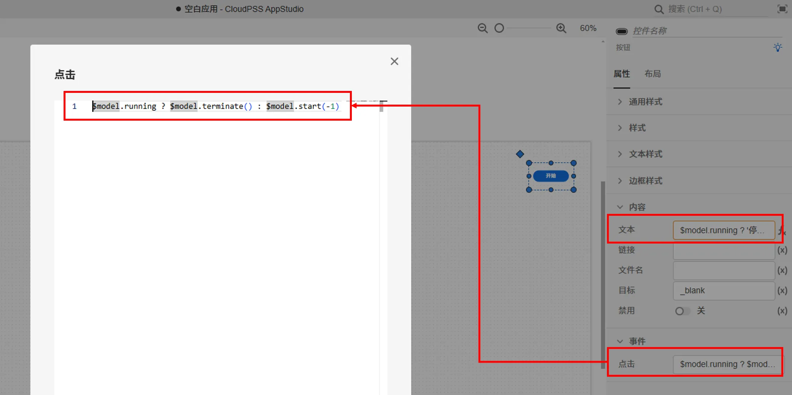

本节主要介绍 AppStudio 控件库里的按钮控件。

该控件的主要作用包括：

- 作为控制 FuncStudio 函数资源**开始/停止**的运行按钮；
- 作为控制 EMTLab 中实时电磁暂态仿真任务运行的按钮，支持实时仿真的**开始/停止、停止/恢复、开始/停止录波**等操作。

## 属性

**CloudPSS** 提供了一套统一的控件属性参数

### 通用样式

import CommonStyle from '../../60-grid/_common-style.md'

<CommonStyle />

### 样式

| 参数名 | 键值 (key) | 单位 | 备注 | 类型 | 描述 |
| :--- | :--- | :--- | :--: | :--- | :--- |
| 大小 | `size` |  | 选择样式大小 | 选择 | 样式大小：S、M、L、XL，默认为 M |
| 变体 | `variant` |  | 选择样式变体 | 选择 | 样式变体：CTA、主要、次要、否定，默认为 CTA |
| 安静 | `quiet` |  | 选择是否安静 | 选择 | 选择**是**或者**否**，默认为**否**状态 |

### 文本样式

| 参数名 | 键值 (key) | 单位 | 备注 | 类型 | 描述 |
| :--- | :--- | :--- | :--: | :--- | :--- |
| 文字字体 | `style/font-family` |  | 选择文字字体 | 选择 | 标签文字字体样式，字体类型包括：默认、宋体、黑体、楷体、微软雅黑、Georgia、Palatino Linotype、Times New Roman、Arial、Arial Black、Verdana、Courier New、Trebuchet MS |
| 文字间距 | `style/letter-spacing` |  | 输入文字间距 | 常量 | 文字间距 |
| 文字字号 | `style/font-size` |  | 输入文字字号 | 常量 | 输入文字字号 |
| 文字颜色 | `style/color` |  | 选择文字颜色 | 颜色选择器 | 点击文字颜色，弹出颜色选择器自定义颜色 |
| 文字粗细 | `style/font-weight` |  | 选择文字粗细 | 选择 | 选择标签文字粗细，默认、100、200、300、400、500、600、700、800、900、1000 |

### 边框样式

| 参数名 | 键值 (key) | 单位 | 备注 | 类型 | 描述 |
| :--- | :--- | :--- | :--: | :--- | :--- |
| 边框圆角半径 | `style/border-radius` | px、cm、em、rem | 输入边框圆角半径 | 常量 | 输入边框圆角半径 |
| 边框宽度 | `style/border-width` | px、cm、em、rem | 输入边框宽度 | 常量 | 输入边框宽度 |
| 边框颜色 | `style/border-color` |  | 输入框 | 常量 | 输入边框颜色 |
| 边框类型 | `style/border-style` |  | 边框类型 | 选择 | 边框类型分为：默认、无边框、虚线边框、实线边框、双重边框、3D 沟槽边框、3D 脊边框、3D 突出边框、3D 嵌入边框，默认为实线边框 |

### 内容

| 参数名 | 键值 (key) | 单位 | 备注 | 类型 | 描述 |
| :--- | :--- | :--- | :--: | :--- | :--- |
| 文本 | `innerText` |  | 按钮控件文本内容 | 常量 | 按钮控件文本内容，默认为：Click Me! |
| 链接 | `href` |  | 按钮控件链接 | 常量 | 按钮控件链接 |
| 文件名 | `download` |  | 下载文件的保存名称 | 常量 | 仅用作下载按钮时，下载文件的保存名称，默认为空 |
| 目标 | `target` |  | 超链接 | 常量 | 超链接打开的位置：`_blank` 表示在新窗口打开；`self` 表示在当前窗口打开；默认为 `_blank` |
| 禁用 | `disabled` |  | 禁用开关 | 开关 | 禁用选择**开**或者**关**，开启后控件禁止点击和交互，默认为**关** |

### 事件

| 参数名 | 键值 (key) | 单位 | 备注 | 类型 | 描述 |
| :--- | :--- | :--- | :--: | :--- | :--- |
| 点击 | `@click` |  | 当点击时触发 | 函数 | 采用点击方式触发函数 |

## 案例介绍

import Tabs from '@theme/Tabs';
import TabItem from '@theme/TabItem';

<Tabs>

<TabItem value="case1" label="接入 FuncStudio 函数">

1. 创建一个按钮控件，在右侧的属性配置区内给按钮命名为 A

2. 创建函数资源 asset1，选择资源类型为函数

3. 配置函数资源 asset1，点击`选择资源`，绑定 `rid` 为 `function/Maxwell/demo` 的示例函数

4. 鼠标选中按钮 A 的事件/点击属性栏，按下<kbd> Ctrl </kbd> 输入 `$asset1.start()`

5. 点击工具栏的预览快捷按钮(或者 <kbd>Ctrl</kbd> + <kbd>P</kbd> )，进入预览模式，点击按钮即可运行 `function/Maxwell/demo` 示例函数

:::tip FuncStudio 函数使用详情

查看 [FuncStudio 函数工坊使用指南](../../../../30-funcstudio/10-user-guide/index.md)

:::

</TabItem>

<TabItem value="case2" label="实时仿真输入输出">

1. 在资源标签页内添加需要进行实时仿真的 SimStudio 模型资源，具体的模型资源添加方法参见[资源标签页](../../../40-workbench/20-function-zone/20-asset-tab/index.md)。

2. 可通过元件向导进行**运行按钮**参数的设置：
   
- 可选中按钮元件，在右侧参数配置区上方点击向导图标进入向导界面。

- 点击**绑定资源**选择器，选项中会自动加载出所有函数资源和模型资源，选择需要进行实时仿真的 SimStudio 模型资源，并选择该模型的参数方案和计算方案；

- 选中模型资源后，可以选择按钮的类型，支持如下的类型：

| 类型 | 描述 | 对应的表达式 |
| :---: | :---: | :--- | 
| 开始 | 点击后函数资源/实时仿真任务开始执行 | 禁用：`$model.running` 事件→点击：`$model.start(-1)` | 
| 停止 | 点击后函数资源/实时仿真任务结束执行 | 禁用：`not $model.running` 事件→点击：`$model.terminate()` |
| 开始/停止 | 首次点击后函数资源/实时仿真任务开始执行，按钮文本从“开始”变为“停止”；再次点击后函数资源/实时仿真任务结束执行，按钮文本从“停止”变为“开始”， | 文本：`$model.running ? '停止' : '开始'` 事件→点击：`$model.running ? $model.terminate() : $model.start(-1)`|
| 暂停 | 点击后实时仿真任务暂停执行 | 禁用：`not $model.running or not is($model.value.rt_state, "Object") or not $model.value.rt_state.monitoring` 事件→点击：`$model.send({"type": "monitoring", "state": false})` | 
| 恢复 | 点击后实时仿真任务恢复执行 | 禁用：`not $model.running or not is($model.value.rt_state, "Object") or $model.value.rt_state.monitoring` 事件→点击：`$model.send({"type": "monitoring", "state": true})` |
| 暂停/恢复 | 首次点击后实时仿真任务暂停执行，按钮文本从“暂停”变为“恢复”；再次点击后实时仿真任务恢复执行，按钮文本从“恢复”变为“暂停”， | 文本：`$model.running and is($model.value.rt_state, "Object") ? ($model.value.rt_state.monitoring ? "暂停" : "恢复") : "暂停"` 禁用：`not $model.running or not is($model.value.rt_state, "Object")` 事件→点击：`$model.send({"type": "monitoring", "state": not $model.value.rt_state.monitoring})`|
| 开始录波 | 点击后实时仿真任务开始录波 | 禁用：`not $model.running or $model.emtp.recording` 事件→点击：`$model.emtp.startRecording()` | 
| 停止录波 | 点击后实时仿真任务停止录波 | 禁用：`not $model.running or not $model.emtp.recording` 事件→点击：`$model.emtp.stopRecording()` |
| 开始/停止录波 | 首次点击后实时仿真任务开始录波，按钮文本从“录波”变为“停止”；再次点击后实时仿真任务录波结束，按钮文本从“停止”变为“录波” | 文本：`$model.running ? ($model.emtp.recording ? "停止录波" : "开始录波") : "录波"` 禁用：`not $model.running` 事件→点击：`$model.emtp.recording ? $model.emtp.stopRecording() : $model.emtp.startRecording()`|

- 点击向导界面的确定按钮后，会将向导中设置的方案按照特定的表达式写入输入控件的属性输入框中。

具体的操作流程参见[实时仿真案例](../../../70-case-study/50-emt-rt-apps/index.md)。

</TabItem>
</Tabs>

## 常见问题

import Fx from '../../60-grid/_expression.md'

<Fx />

import Event from '../../60-grid/_event.md'

<Event />