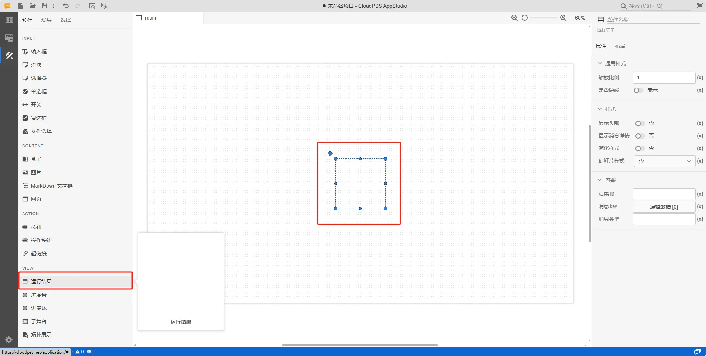
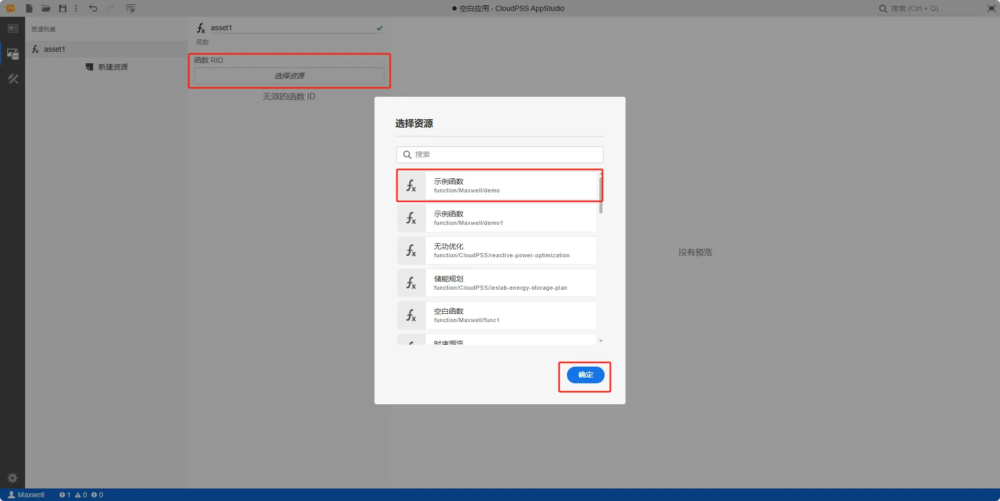
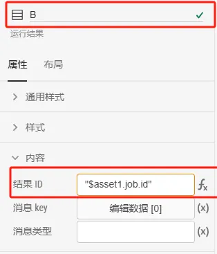

本节主要介绍 AppStudio 控件库里的运行结果控件。

## 属性

**CloudPSS** 提供了一套统一的控件属性参数

### 通用样式

import CommonStyle from '../../60-grid/_common-style.md'

<CommonStyle />

### 样式

| 参数名 | 键值 (key) | 单位 | 备注 | 类型 | 描述 |
| :--- | :--- | :--- | :--: | :--- | :--- |
| 显示头部 | `showHeader` |  | 是否显示头部 | 开关 | 是否显示头部，默认为否 |
| 显示消息详情 | `showMessageDetails` |  | 是否显示消息详情 | 开关 | 是否显示消息详情，默认为否 |
| 简化样式 | `simpleStyle` |  | 是否简化样式 | 开关 | 是否简化样式，包括不显示消息边框、背景等装饰性样式，默认为否 |
| 幻灯片模式 | `slideMode` |  | 幻灯片模式 | 选择器 | 幻灯片模式，包括否、水平滚动、垂直滚动，默认为否 |

### 内容

| 参数名 | 键值 (key) | 单位 | 备注 | 类型 | 描述 |
| :--- | :--- | :--- | :--: | :--- | :--- |
| 结果 ID | `key` |  | 输入查看的结果 ID | 常量 | 查看的结果 ID  |
| 消息 key | `messageKey` |  | 查看的消息 ID | 表格 | 查看的消息 ID，省略可以显示所有消息，默认显示所有消息  |
| 消息类型 | `messageType` |  | 输入查看的消息类型 | 常量 | 查看的消息类型，省略可以显示所有消息，默认显示所有消息  |

## 案例介绍

### 接入 FuncStudio 函数的典型应用

1. 创建一个按钮控件，在右侧的属性配置区内给按钮命名为 A

2. 创建一个运行结果控件，在右侧的属性配置区内给运行结果命名为 B，调整下运行结果控件的大小

3. 创建函数资源 asset1，选择资源类型为函数

4. 配置函数资源 asset1，点击`选择资源`，绑定 `rid` 为 `function/Maxwell/demo` 的示例函数

5. 鼠标选中选择器 A 的事件/点击属性栏，按下<kbd> Ctrl </kbd> 输入 `$asset1.start()`

6. 鼠标选中选择器 B 的内容/结果 ID 属性栏，切换到 fx 表达式模式输入 `$asset1.job.id`；

7. 鼠标选中选择器 B 的内容/消息 key 属性栏点击新增 `plot-1`；或是在 fx  表达式模式下设置为 `[plot-1]`

8. 点击工具栏的预览快捷按钮(或者 <kbd>Ctrl</kbd> + <kbd>P</kbd> )，进入预览模式，点击操作按钮运行 `function/Maxwell/demo` 示例函数，并显示出运行结果

:::tip FuncStudio 函数使用详情

查看 [FuncStudio 函数工坊使用指南](../../../../30-funcstudio/10-user-guide/index.md)

:::

## 常见问题

import Fx from '../../60-grid/_expression.md'

<Fx />

import Event from '../../60-grid/_event.md'

<Event />

