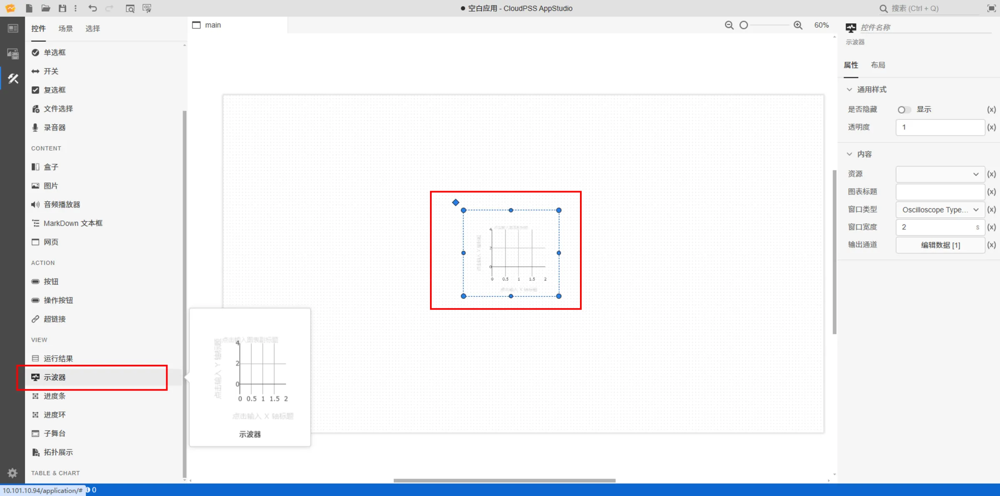
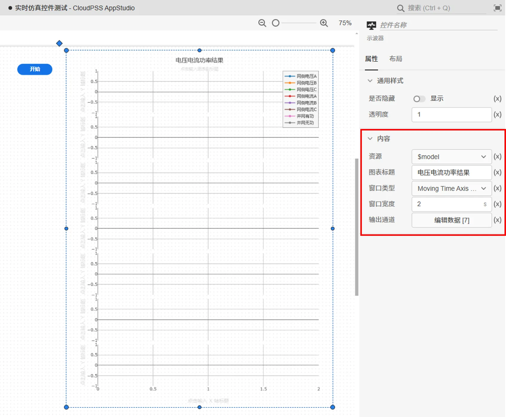
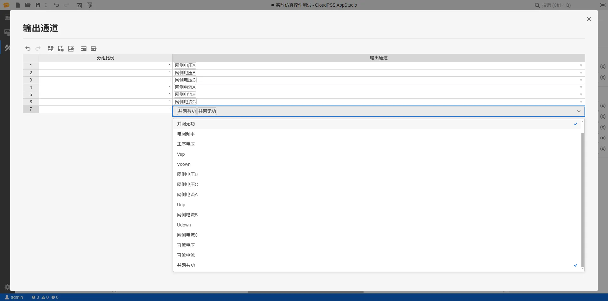

本节主要介绍 AppStudio 控件库里的示波器控件。

该控件作为 EMTLab 中实时电磁暂态仿真任务输出接口，用于**显示虚拟输出端口的波形**。

:::warning
示波器控件只能绑定实时仿真模型资源，若要展示函数资源的输出波形，需选用[运行结果控件](../10-output-viewer/index.md)。
:::

## 属性

**CloudPSS** 提供了一套统一的控件属性参数

### 通用样式

import CommonStyle from '../../60-grid/_common-style.md'

<CommonStyle />

### 内容

| 参数名 | 键值 (key) | 单位 | 备注 | 类型 | 描述 |
| :--- | :--- | :--- | :--: | :--- | :--- |
| 资源 | `asset` |  | 选择要绑定的实时仿真模型资源 | 选择 | 自动加载资源标签页下的所有模型资源  |
| 图表标题 | `title` |  | 示波器的标题 | 文本 | 示波器的标题 |
| 窗口类型 | `type` |  | 选择示波器的显示模式 | 选择 | Oscilloscope Time Axis Window：与示波器显示模式相近，仿真窗口时间轴范围为窗口宽度指示的值；Moving Time Axis Window：时间坐标轴最大值随仿真时间变化，时间坐标轴范围为窗口宽度指示的值|
| 窗口宽度 | `width` |  | 时间坐标轴范围 | 数值 | 时间坐标轴范围宽度 |
| 输出通道 | `channels` |  | 添加需要在示波器窗口显示的输出通道 | 表格 | 点击后弹出输出通道的可编辑表格 |

- 示波器支持添加多个分组，在该表格中插入 / 删除行，来添加 / 删除示波器分组
- 添加需要在每个分组中显示的输出通道，支持添加多个通道
- 填写分组比例，示波器会根据分组数量，和比例来确定每个分组在示波器中所占的宽度

## 案例介绍

示波器通过绑定**实时仿真的模型资源**，在实时仿真过程中显示每个分组内输出通道的仿真波形。

1. 在资源标签页内添加需要进行实时仿真的 SimStudio 模型资源，具体的模型资源添加方法参见[资源标签页](../../../40-workbench/20-function-zone/20-asset-tab/index.md)。   

2. 在场景标签页，添加一个按钮控件，通过元件向导进行**运行按钮**参数的设置：
   
- 可选中按钮元件，在右侧参数配置区上方点击向导图标进入向导界面。

- 点击**绑定资源**选择器，选项中会自动加载出所有函数资源和模型资源，选择需要进行实时仿真的 SimStudio 模型资源，并选择该模型的参数方案和计算方案；

- 选中模型资源后，选择按钮的类型为开始/停止

- 点击向导界面的确定按钮后，会将向导中设置的方案按照特定的表达式写入输入控件的属性输入框中

- 添加一个示波器控件，资源与实时仿真的 SimStudio 模型资源绑定，在示波器里面添加多个分组，每个分组里面添加相应的输出通道

- 进入预览模式，点击开始按钮，开始进行实时仿真，示波器会展示每个分组内输出通道的仿真波形，点击结束按钮，结束实时仿真。

具体的操作流程参见[实时仿真案例](../../../70-case-study/50-emt-rt-apps/index.md)。

## 常见问题

import Fx from '../../60-grid/_expression.md'

<Fx />

import Event from '../../60-grid/_event.md'

<Event />

