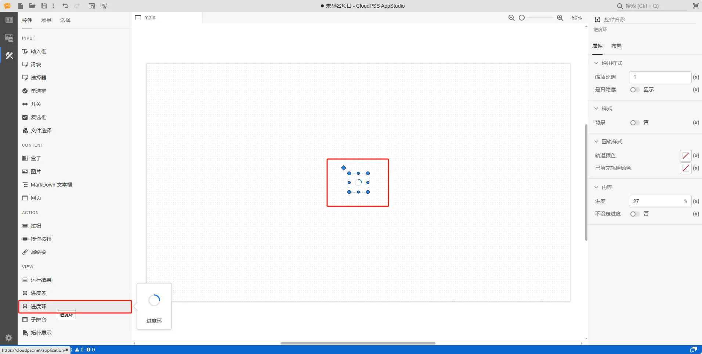
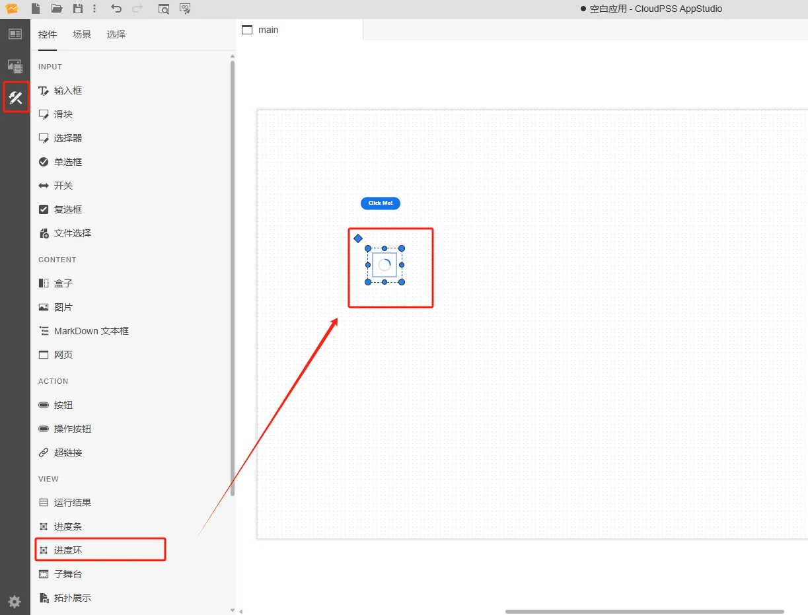
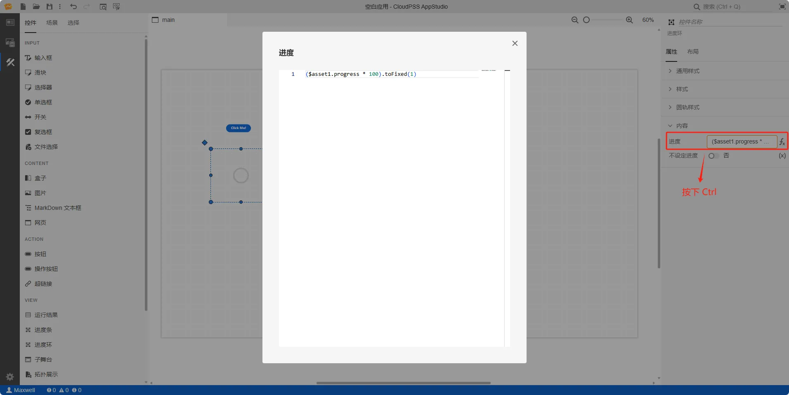

本节主要介绍 AppStudio 控件库里的进度环控件。

该控件的主要作用包括：

- 作为 FuncStudio 函数资源的输出接口，用于**接收函数输出结果**；
- 作为 EMTLab 模型资源实时电磁暂态仿真任务的输出接口，用于**接收虚拟输出端口的值**。

## 属性

**CloudPSS** 提供了一套统一的控件属性参数

### 通用样式

import CommonStyle from '../../60-grid/_common-style.md'

<CommonStyle />

### 样式

| 参数名 | 键值 (key) | 单位 | 备注 | 类型 | 描述 |
| :--- | :--- | :--- | :--: | :--- | :--- |
| 背景 | `attribute/over-background` |  | 是否显示背景 | 开关 | 是否显示背景，默认为否 |

### 圆环样式

| 参数名 | 键值 (key) | 单位 | 备注 | 类型 | 描述 |
| :--- | :--- | :--- | :--: | :--- | :--- |
| 轨道颜色 | `style/--spectrum-progresscircle-medium-track-color` |  | 轨道颜色 | 颜色选择器 | 点击轨道颜色，弹出颜色选择器自定义轨道颜色 |
| 已填充轨道颜色 | `style/--spectrum-progresscircle-medium-track-fill-color` |  | 已填充轨道颜色 | 颜色选择器 | 点击已填充轨道颜色，弹出颜色选择器自定义已填充轨道颜色 |

### 内容

| 参数名 | 键值 (key) | 单位 | 备注 | 类型 | 描述 |
| :--- | :--- | :--- | :--: | :--- | :--- |
| 进度 | `progress` | `%`  | 输入控件内容进度 | 常量 | 控件内容进度，默认显示：27（百分制） |
| 不设定进度 | `indeterminate` |   | 不设定进度开关 | 开关 | 不设定进度开关，开启后进度条始终在加载状态 |

## 案例介绍

import Tabs from '@theme/Tabs';
import TabItem from '@theme/TabItem';

<Tabs>
<TabItem value="case1" label="接入 FuncStudio 函数">

1. 创建一个按钮控件，在右侧的属性配置区内给按钮命名为 A

2. 创建一个进度环控件，在右侧的属性配置区内给进度环命名为 B，调整下进度环控件的大小

3. 创建函数资源 asset1，选择资源类型为函数

4. 配置函数资源 asset1，点击`选择资源`，绑定 `rid` 为 `function/Maxwell/demo` 的示例函数

5. 鼠标选中选择器 A 的事件/点击属性栏，按下<kbd> Ctrl </kbd> 输入 `$asset1.start()`

6. 鼠标选中选择器 B 的内容/进度属性栏，切换到 fx 表达式模式输入 `($asset1.progress * 100).toFixed(1)`；

7. 点击工具栏的预览快捷按钮(或者 <kbd>Ctrl</kbd> + <kbd>P</kbd> )，进入预览模式，点击操作按钮运行 `function/Maxwell/demo` 示例函数，并显示出运行进度

:::tip FuncStudio 函数使用详情

查看 [FuncStudio 函数工坊使用指南](../../../../30-funcstudio/10-user-guide/index.md)

:::

</TabItem>

<TabItem value="case3" label="实时仿真输出">

进度环控件提供**向导**功能，会将向导中设置的方案按照特定的表达式**自动写入**进度环控件的属性输入框中，帮助用户快速将实时仿真模型的虚拟输出端口值与**进度值**进行绑定。

1. 在资源标签页内添加需要进行实时仿真的 SimStudio 模型资源，具体的模型资源添加方法参见[资源标签页](../../../40-workbench/20-function-zone/20-asset-tab/index.md)。

2. 可通过元件向导进行**实时仿真输入输出**参数的设置：
   
- 可选中进度环元件，在右侧参数配置区上方点击向导图标进入向导界面。

<!--  -->

- 点击**绑定资源**选择器，选项中会自动加载出所有函数资源和模型资源，选择需要进行实时仿真的 SimStudio 模型资源；

- 选中模型资源后，**绑定信号**选择器的选项中会自动加载出该模型的所有虚拟输出端口名称，选择需要绑定的端口名称；
  
- 则将**绑定方向**选择器配置为输出；
  
- 点击向导界面的确定按钮后，会将向导中设置的方案按照特定的表达式写入进度环控件的属性框中
<!-- 对于熟练使用表达式的用户，也可以参照表达式自己配置 -->

进入预览模式，即可在仿真过程中通过进度环实时显示所绑定的虚拟输出端口的值。

<!--  -->

<!--  -->

具体的操作流程参见[实时仿真案例](../../../70-case-study/50-emt-rt-apps/index.md)。

  <!--  -->

</TabItem>
</Tabs>

## 常见问题

import Fx from '../../60-grid/_expression.md'

<Fx />

import Event from '../../60-grid/_event.md'

<Event />