--- 
title: 构建实时仿真应用
description: 构建实时仿真应用
tags:
- xstudio
- appstudio
- cases
- advanced
---

SimStudio 模型工坊、FuncStudio 函数工坊和 AppStudio 应用工坊之间可以实现灵活的协同交互，例如：

+ 在 FuncStudio 中，可利用 CloudPSS SDK 调用 SimStudio 的模型和仿真内核构建更复杂的应用内核
+ 在 AppStudio 中可以直接导入 SimStudio 的模型拓扑图，并直接展示仿真结果

其中利用 CloudPSS SDK 调用 SimStudio 的仿真内核，获取仿真结果详见[仿真内核调用及结果获取 SDK](../../../../80-sdk-python/40-emtlab-sdk/20-advanced/20-advanced-case2/index.md)。

本节以一个简单的案例介绍如何在不利用 SDK 构建 FuncStudio 函数的情况下在 AppStudio 里面构建一个实时仿真应用。

公网试用平台暂不支持实时仿真，公网用户可参照本应用自己构建离线仿真应用。

## 在 SimStudio 构建算例

进入 SimStudio 平台新建一个 IEEE 10 机 39 节点标准测试系统，添加一个虚拟输入端口元件，名称配置为`brk`，引脚名称配置为`brk`

给 bus26 母线元件添加三相接地断路器，将断路器的控制信号配置为`brk`，代表断路器开断由虚拟输入端口信号实时控制。

再添加一个虚拟输出端口元件，名称配置为`Vbus26`，引脚名称配置为`Vbus26`，并将 bus26 母线元件的电压均方根值量测参数配置为`Vbus26`，代表该母线的电压有效值由虚拟输出端口实时输出。

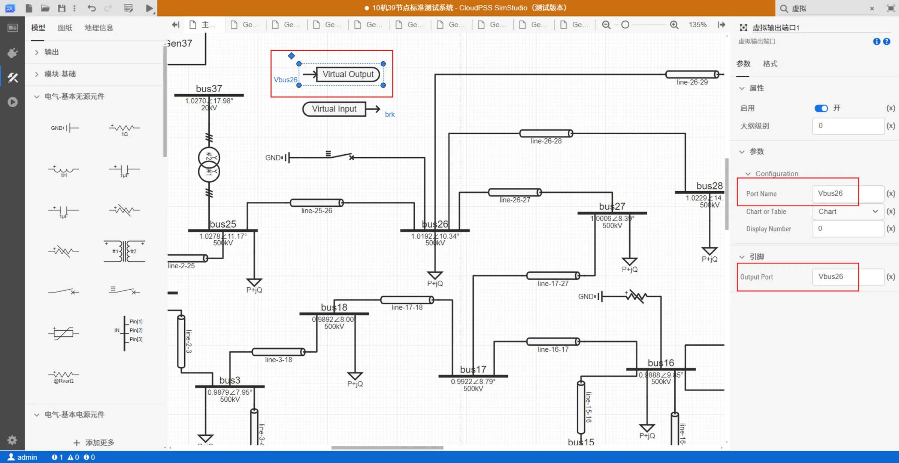

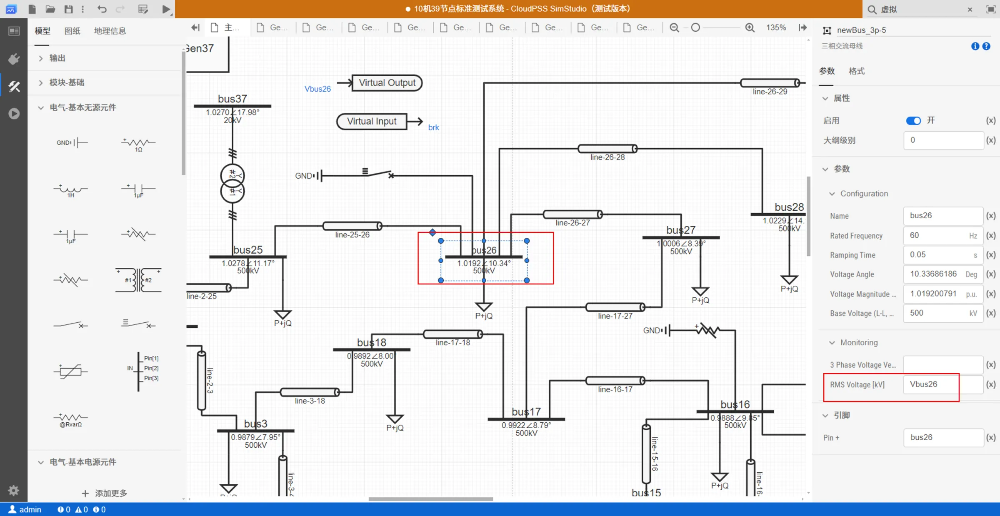

## 进行实时仿真

构建好算例后，进行运行标签页，选择电磁暂态仿真方案，将仿真类型设置为实时仿真，积分步长设置为 0.00005s,
实时仿真模式切换为主模式，在数值型输出通道和曲线型输出通道里面都添加`Vbus26`虚拟输出端口。

保存项目

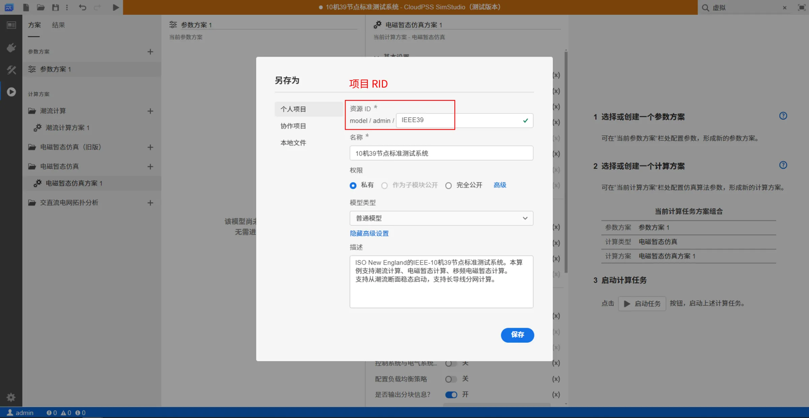

启动任务进行实时仿真，确保项目成功运行。

## 添加函数资源

进入 AppStuido 平台，新建一个空白应用。SimStudio 平台的内嵌的潮流计算、电磁暂态仿真等内核都是接入 FuncStudio 的原生函数，可直接在作为函数资源添加到应用里面。

+ 潮流计算内核函数 rid 为 `function/CloudPSS/power-flow` 
+ 电磁暂态仿真（旧版）内核函数 rid 为 `function/CloudPSS/emtp` 
+ 电磁暂态仿真内核函数 rid 为 `function/CloudPSS/emtps` 

实时仿真是电磁暂态仿真内核提供的功能，因此本应用选择添加电磁暂态仿真函数。

该函数在云端执行，命名为`f`，将此函数的参数方案按照 SimStudio 项目的电磁暂态计算方案配置，这里可以将结束时间设定的长一些。

:::tip
其中的数值型输出通道和曲线型输出通道无法通过表格控件进行输入，需要先将 SimStudio 电磁暂态计算方案中的输出通道切换到表达式模式下，复制里面的内容，然后将此函数的输出通道也切换到表达式模式，把复制的内容粘贴过来。

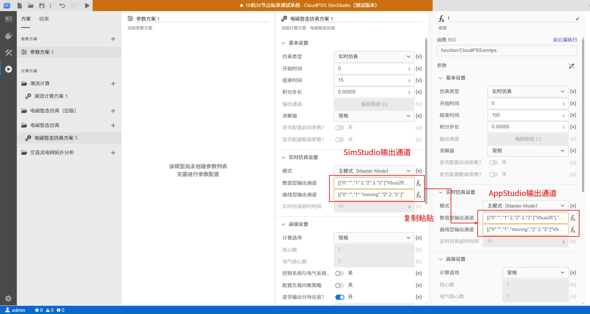

:::

## 场景搭建

### 添加拓扑展示控件

进入场景标签页，在当前场景中添加一个拓扑展示控件，将控件的大小配置为和场景大小一致。

模型 RID 填入刚才保存的 IEEE 10 机 39 节点标准测试系统的 rid 用于展示系统拓扑。

### 添加按钮控件

添加一个按钮控件，用于启动函数资源，在文本内输入开始仿真，将禁用属性切换到表达式模式，输入`$f.running`,在点击输入框内容输入如下的三个表达式：

+ `$f.args._ModelArgs = {};`配置算例的参数方案，该算例没有参数方案，用{}代替，对于有参数方案的模型需要在任务管理页面里面找到刚才在 simstudio 里面成功运行的实时仿真任务，查看任务详情，复制`_ModelArgs`参数，将其粘贴在此处即可

+ `$f.args._ModelRevision = "{_ModelRevision}";`配置算例的拓扑信息，同样在任务管理页面查看当前任务的信息，找到记录本项目拓扑信息的`_ModelRevision`参数，将其粘贴在此处即可
  
+ `$f.start()`启动函数任务

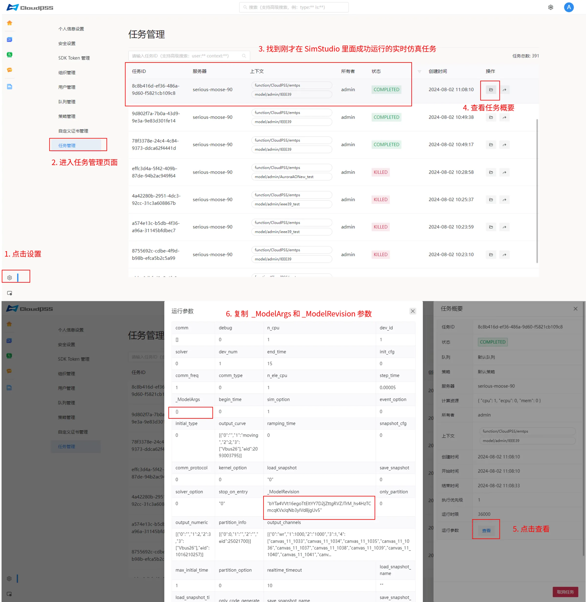

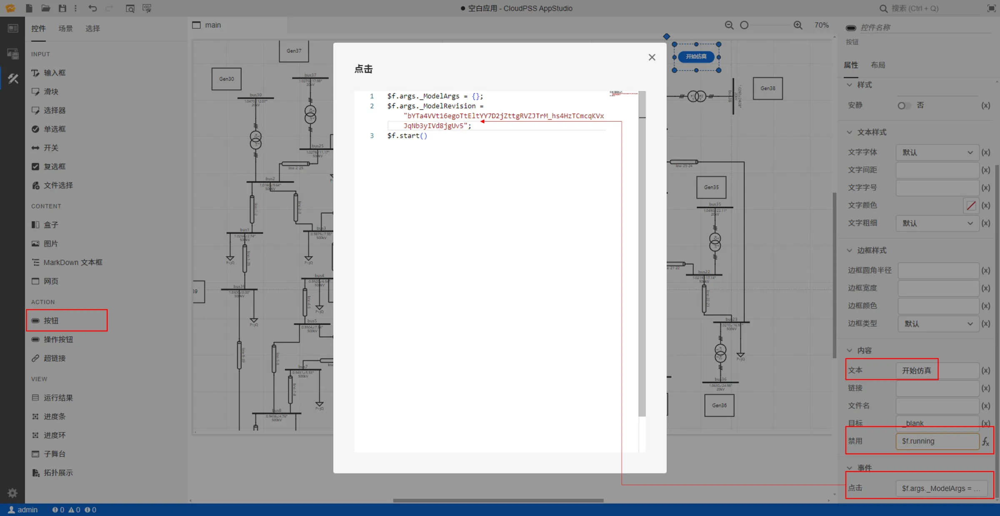

:::warning
注意：当算例拓扑和参数修改后，会生成一个新的`_ModelRevision`参数，用户得在 simstudio 中重新运行一次计算，在任务管理页面里面找到刚才在 simstudio 里面成功运行的实时仿真任务，查看任务详情，复制新的`_ModelArgs`参数，在按钮事件里面更新。
:::

再添加一个按钮控件，用于结束函数资源，在文本内输入结束仿真，将禁用属性切换到表达式模式，输入`not $f.running`，在点击输入框内容输入`$f.terminate()`，用于结束函数任务

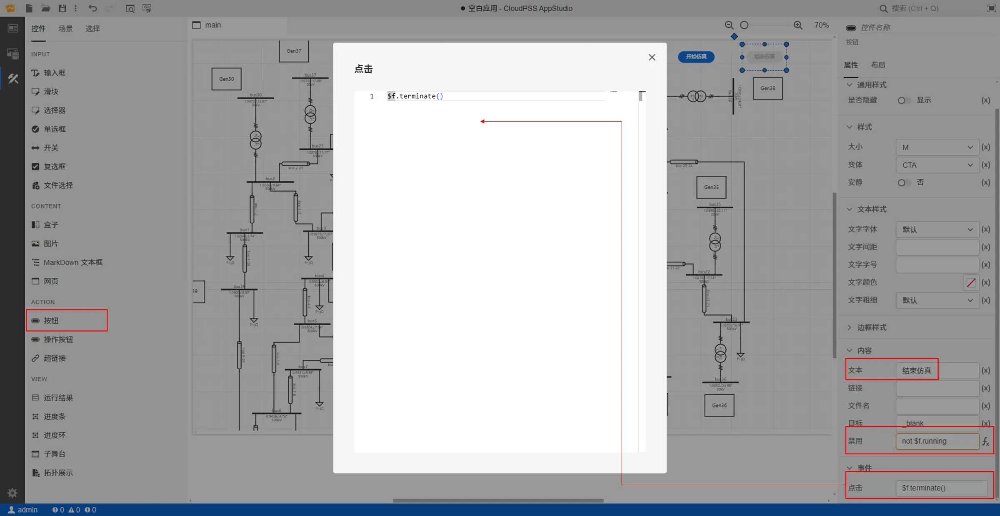

### 添加运行结果控件

添加一个运行结果控件，将结果 ID 切换到表达式模式，输入`$f.job.id`，在消息 key 里面配置数值类输出通道的示波器的 key: `table-1`。

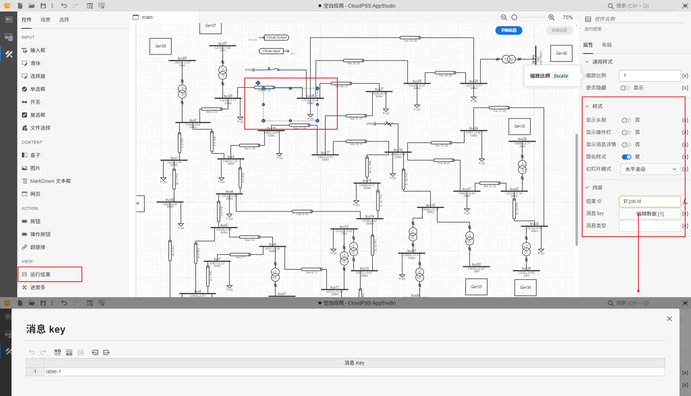

:::tip
每个示波器的 key 可以在 SimStuio 结果页面中查看：将鼠标悬停在某个示波器上面，下方会显示该条消息的 key。
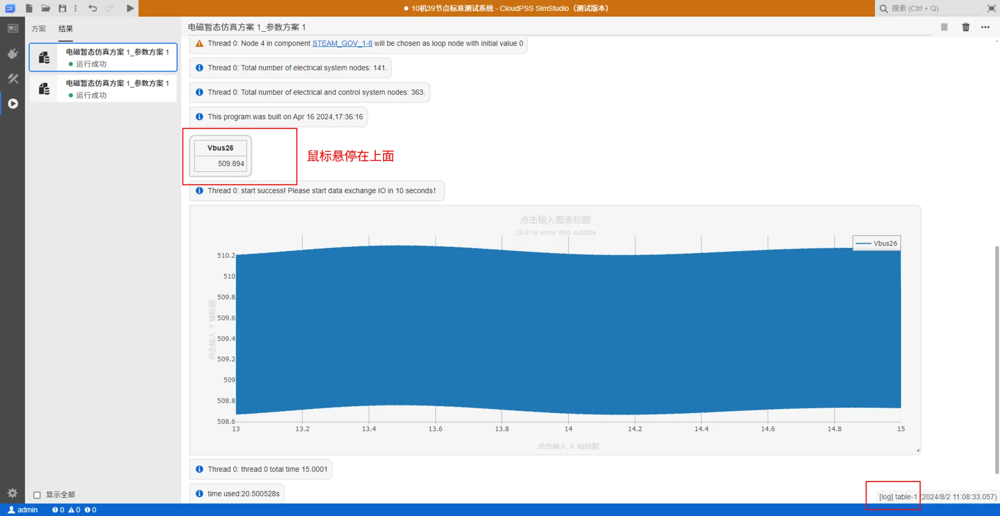
:::

添加第二个运行结果控件，将结果 ID 切换到表达式模式，输入`$f.job.id`，在消息 key 里面配置曲线类输出通道的示波器的 key: `plot-1`。

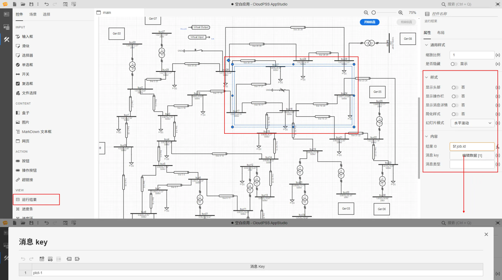

添加第三个运行结果控件，将结果 ID 切换到表达式模式，输入`$f.job.id`，不配置消息 key，将样式属性里面的显示操作栏开启，用于实时

调整虚拟输入信号的值，实现对母线接地时刻的自由控制。

## 应用预览

进入预览模式，点击开始仿真按钮，该应用会实时显示 bus26 母线电压有效值及曲线的变化

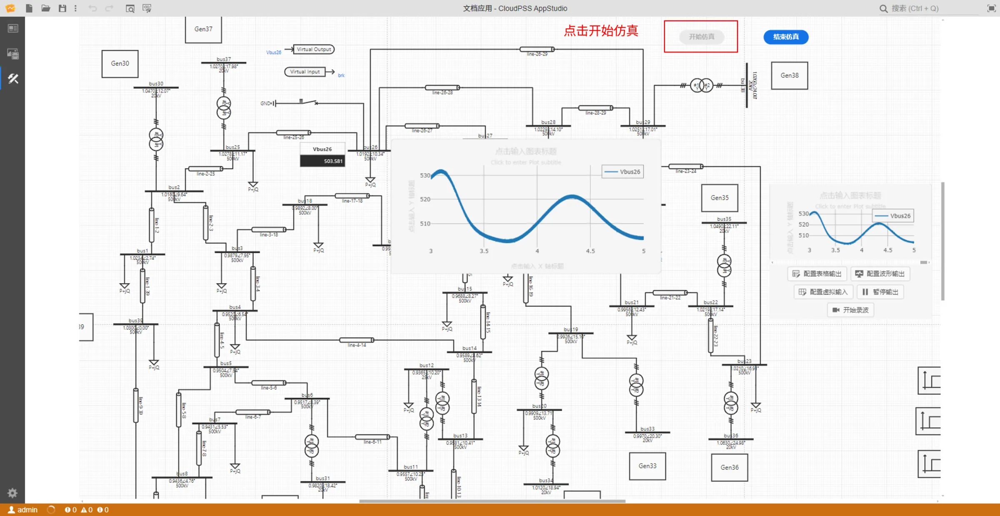

可以点击配置虚拟输入端口，随时控制母线的接地断路器的开断，1 表示闭合，0 表示断开

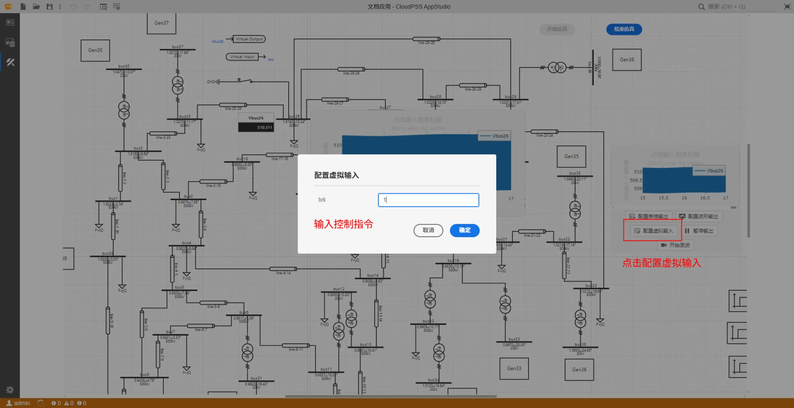

实时显示断路器开断过程中 bus26 母线电压有效值及曲线的变化情况

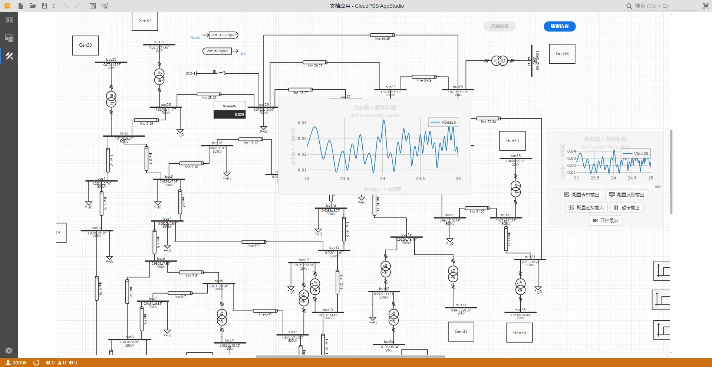