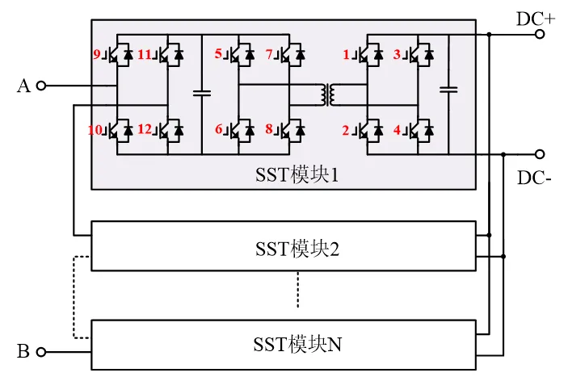
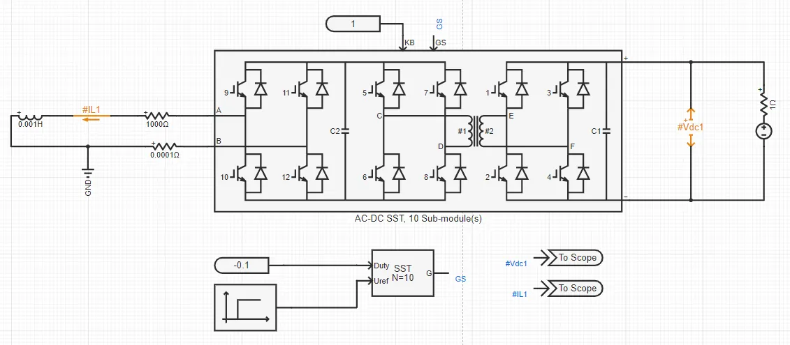

## 元件定义

该元件用于建模多模块固态变压器 (SST) 电路。通过填写模块数 N，可快速形成包含 12*N 个开关管的大型电力电子网络。该元件采用快速电磁暂态模型，可在保持与详细电磁暂态模型精度相当的同时，极大提升仿真效率，适用于大规模电力电子网络建模仿真。

## 元件说明

### 属性

CloudPSS 元件包含统一的**属性**选项，其配置方法详见 [参数卡](docs/documents/software/10-xstudio/20-simstudio/40-workbench/20-function-zone/30-design-tab/30-param-panel/index.md) 页面。

### 参数

import Parameters from './_parameters.md'

<Parameters/>

### 引脚

import Pins from './_pins.md'

<Pins/>

### 使用说明

多模块 SST 的电路图及开关编号如图所示：

下图示出了 SST 脉冲发生器的单元测试算例，算例详见 [多模块固态变压器](https://cloudpss.net/model/CloudPSS/NSSTs)。

图中 SST 脉冲发生器配置为所以模块输入 Duty、Uref 都一致，模块数为 10。该模块只需两个输入，即可产生 10 个模块 SST 对应的全部开关信号。该信号的维数为 12N*1。如果不使用 SST 脉冲发生器，则需要利用**多路信号合并**元件将所有的开关信号进行合并。合并方式如**端口列表**中 GS 的输入信号要求进行。

## 案例

## 常见问题
