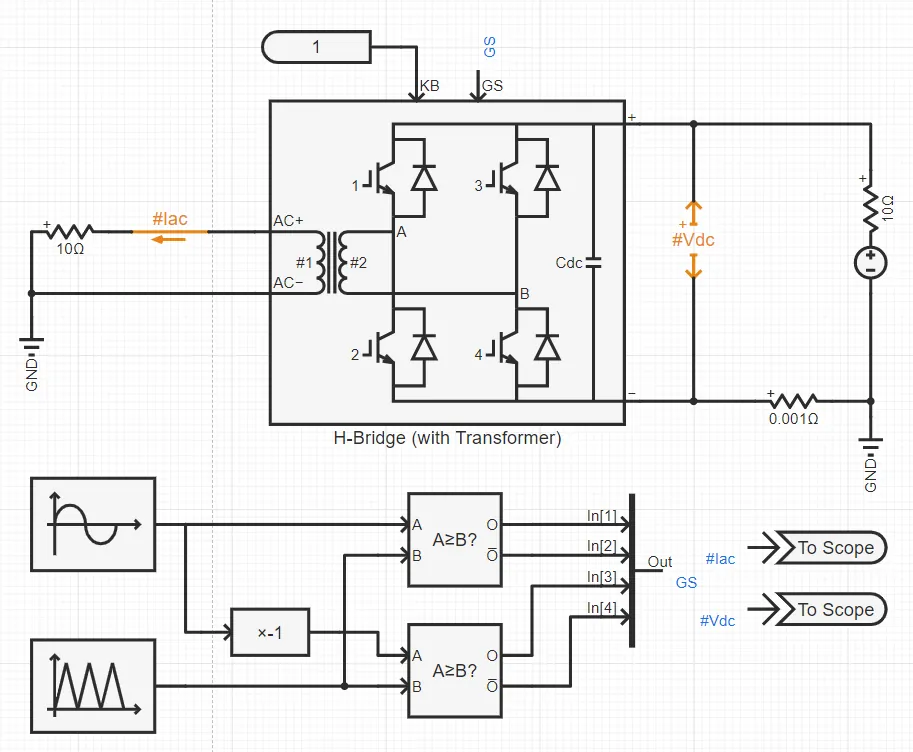

## 元件定义

该元件用于建模带变压器的单相 H 桥电路，可用于构建整流/逆变器拓扑。该元件采用快速电磁暂态模型，可在保持与详细电磁暂态模型精度相当的同时，极大提升仿真效率，适用于大规模电力电子网络建模仿真。

## 元件说明

### 属性

CloudPSS 元件包含统一的**属性**选项，其配置方法详见 [参数卡](docs/documents/software/10-xstudio/20-simstudio/40-workbench/20-function-zone/30-design-tab/30-param-panel/index.md) 页面。

### 参数

import Parameters from './_parameters.md'

<Parameters/>

### 引脚

import Pins from './_pins.md'

<Pins/>

### 使用说明

下图示出了 H 桥变压器模块的单元测试算例，算例详见 [单相 H 桥变流器（带变压器）](https://cloudpss.net/model/CloudPSS/HTModule)。

该电路为工频逆变拓扑。开关 S1\~S4 的脉冲信号分别由正弦脉宽调制逻辑实现，开关频率为 5KHz。脉宽调制器产生的 4 路 PWM 信号，经过**多路信号合并**元件合成为一个 4\*1 维的输出信号，送至 H 桥模块的 GS 端。变压器按照系统理论功率及电压等级进行配置。由于变压器漏感的滤波作用，交流负载电流为准正弦波，直流电压为 100Hz 脉动直流。

## 案例

## 常见问题
