<!--
:::warning
1. 模版案例打开的方法有所变化，现在进入工作台默认打开新建窗口。请调整。(7月底前完成)
2. 注意按照规范要求调整该文档。(优先级低)
:::
-->

本文档介绍基于 EMTLab 模板案例新建电磁暂态仿真模型的功能，并通过 3 个典型模板案例帮助用户快速熟悉 EMTLab 的基本使用方法。

## 功能定义

EMTLab 提供新建模板案例的功能，用户可打开一个模板案例并在其基础上修改拓扑或参数，快速构建一个项目。

## 功能说明

### 从主页新建模板案例

注册成功并登录后，页面会自动跳转 CloudPSS 个人中心，在页面下方有 **CloudPSS 典型案例** 功能区，选中对应的案例，点击**打开项目**即可新建一个模板案例。

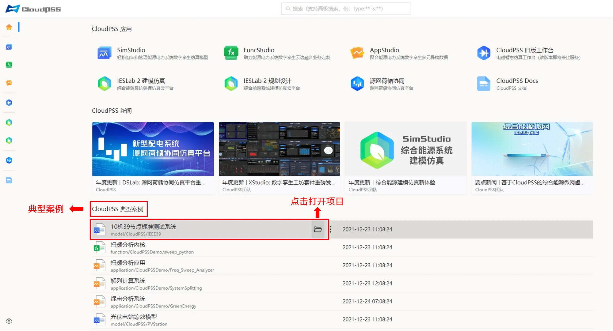

### 从工作台新建模板案例

用户也可在 CloudPSS 个人中心点击 **SimStudio** 进入 SimStudio 云空间，再点击**新建电力系统仿真项目**进入 SimStudio 工作台。

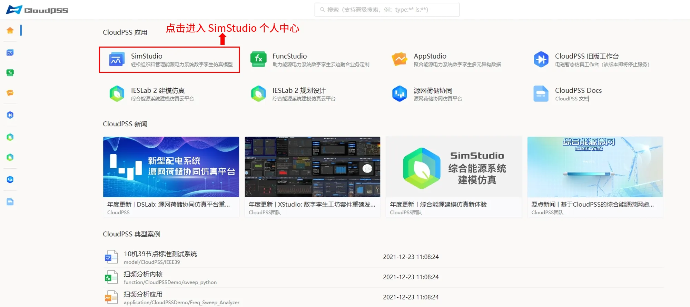

进入工作台后将默认打开**新建**窗口，显示项目模板菜单。选择对应的项目模板后，点击窗口右下角的**新建**完成模板算例新建。  

点击窗口外空白处可关闭新建窗口，点击工作台左上角的**新建**图标可重新打开新建窗口。

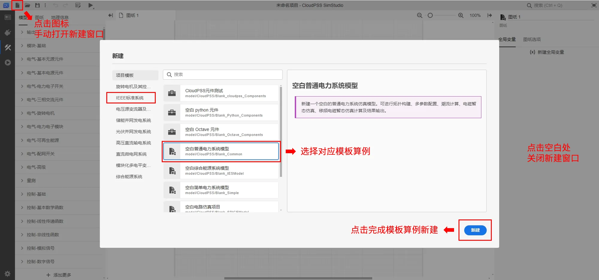

## 典型模板案例

import Tabs from '@theme/Tabs';
import TabItem from '@theme/TabItem';

<Tabs>
<TabItem value="case1" label="10 机 39 节点标准测试系统">

- **新建模板算例**

    进入工作台，在默认打开的新建窗口中选择 **10 机 39 节点标准测试系统**算例，并点击**新建**。

    

    新建成功后，会弹出一个参数设置向导，用户可进行快速的仿真参数设置。

    

- **模板算例介绍**
  
    IEEE 39 节点标准系统，是美国新英格兰地区的一个电力网络。该系统包括 10 台发电机，39 个母线，12 台变压器。所有电机均采用了励磁、调速以及电力系统稳定器 PSS 进行调控。  

    作为测试，在实例算例中，于 bus-16 母线处添加了时长 0.1s 的三相接地短路故障，用户可根据需要自行修改、删除或添加。

    该算例可用于传统暂态稳定分析，励磁、调速控制器设计，系统调频等特性分析等。

    IEEE 39 节点算例拓扑图如下，其中 39 号节点为松弛节点（Slack Bus）。除松弛节点外，各电机相连的母线（30-38）电压等级均为 20kV，另外 12 号节点为 25kV，剩下所有母线电压均为 500kV。

    

    CloudPSS 中，该算例采用单线图构建，其拓扑如下。

    

    系统中，电机模型部分采用了图纸超链接的跳转，每台电机单独放于一张图纸，拓扑如下图所示（以 30 号电机为例），每台电机包含励磁器、调速器、原动机、电力系统稳定器四种控制器模型。

    

    算例中，所有电机参数、传输线参数、变压器参数来源于文献[^1]。

    [^1]: Luc Gérin-Lajoie. IEEE PES Task Force on Benchmark Systems for Stability Controls[R]. EMTP-RV 39-bus system, Version 1.5 - Mars 04, 2015

- **启动电磁暂态仿真**
  
    在**运行标签页**下配置**电磁暂态仿真方案**。在选中的电磁暂态方案页面，可配置**输出通道**。
    
          
    
    该模板中，已选择输出所有 10 台发电机的功角、转速、端电压标幺值、端电流标幺值，以及 37 号母线所连电机的三相瞬时电流曲线，如下图所示。

          
    

    点击页面左上角的**启动任务**或按下 `ctrl` + `R` 开始仿真。

    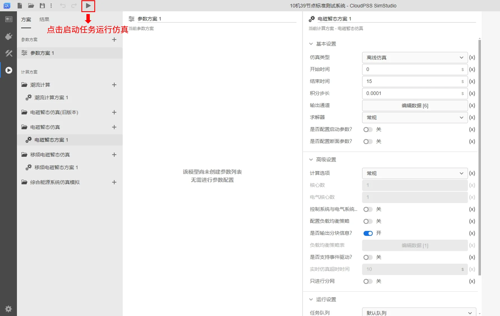      

    仿真结果如下图所示，注意在 2s-2.1s 间，16 号母线处发生了三相接地短路故障。

    所有电机的功角波形如图所示：

    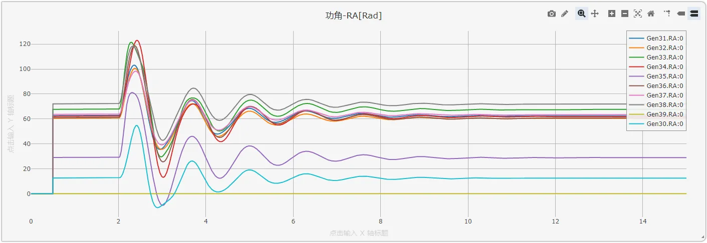

    所有电机的转速波形如图所示：

    

    所有电机的端电压标幺值仿真结果如图所示：

    

    所有电机的端电流标幺值仿真结果如图所示：

    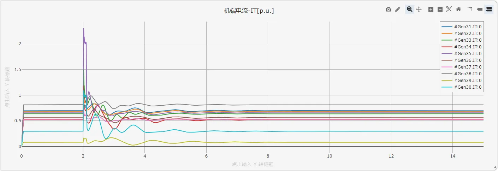

    以 37 号节点为例，在故障前后处机端电流波形的仿真结果为：

    

</TabItem>
<TabItem value="case2" label="3 机 9 节点系统">

- **新建模板算例**

    进入工作台，在默认打开的新建窗口中选择 **3 机 9 节点标准测试系统**算例，并点击**新建**。
    
    

    新建成功后，会弹出一个参数设置向导，用户可进行快速的仿真参数设置。

    

- **模板算例介绍**
  
    IEEE 9 节点标准系统是一个常用的标准测试系统，该系统包括 3 台发电机，9 个母线，3 台变压器。所有电机均采用了励磁、调速以及电力系统稳定器 PSS 进行调控。  

    作为测试，在实例算例中，于 bus-8 母线处添加了时长 0.1s 的三相接地短路故障，用户可根据需要自行修改、删除或添加。

    该算例可用于传统暂态稳定分析，励磁、调速控制器设计，系统调频等特性分析等。

    IEEE 9 节点算例拓扑图如下，其中 1 号节点为松弛节点（Slack Bus），2 号和 3 号节点为 PV 节点。

    

    系统中，每台电机包含励磁器、调速器、原动机、电力系统稳定器四种控制器模型。

- **启动电磁暂态仿真**
  
    在**运行标签页**下配置**电磁暂态仿真方案**。在选中的电磁暂态方案页面，可配置**输出通道**。
    
    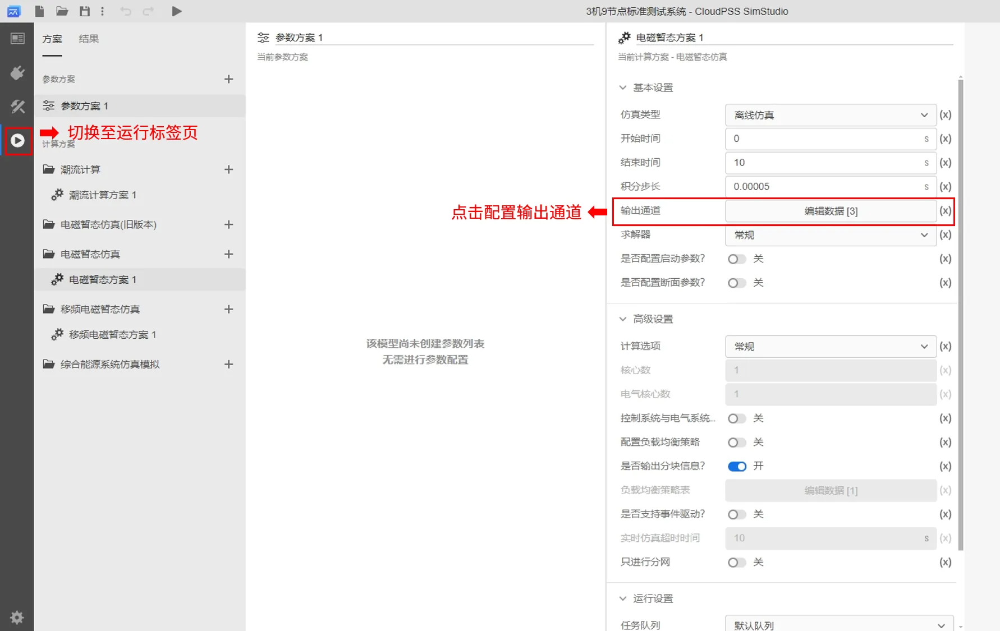      
    
    该模板中，已选择输出所有 3 台发电机的转速、端口功率，以及 7 号母线处量测的三相电压曲线，如下图所示。

          
    

    点击页面左上角的**启动任务**或按下 `ctrl` + `R` 开始仿真。

          

    仿真结果如下图所示，注意在 3s-3.1s 间，8 号母线处发生了三相接地短路故障。

    所有电机的转速波形如图所示：

    

    所有电机的端口功率 PQ 如图所示：

    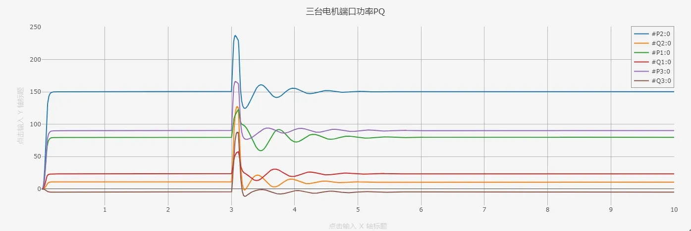

    以 7 号节点为例，在故障前后电压波形的仿真结果为：

    

</TabItem>
<TabItem value="case3" label="光伏并网发电系统">

- **新建模板算例**

    进入工作台，在默认打开的新建窗口中选择光伏并网发电系统标签下的**光伏详细化/平均化模型对比**算例，并点击**新建**。

    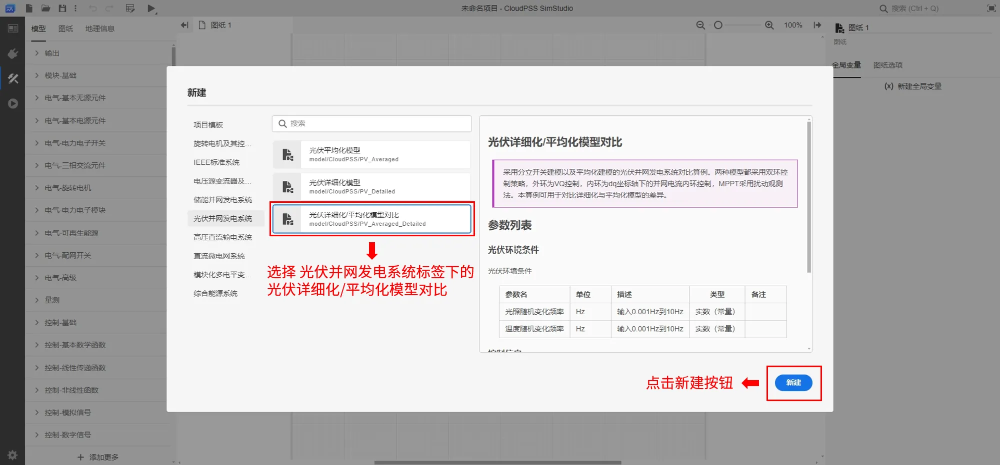

    新建成功后，会弹出一个参数设置向导，用户可进行快速的仿真参数设置。

    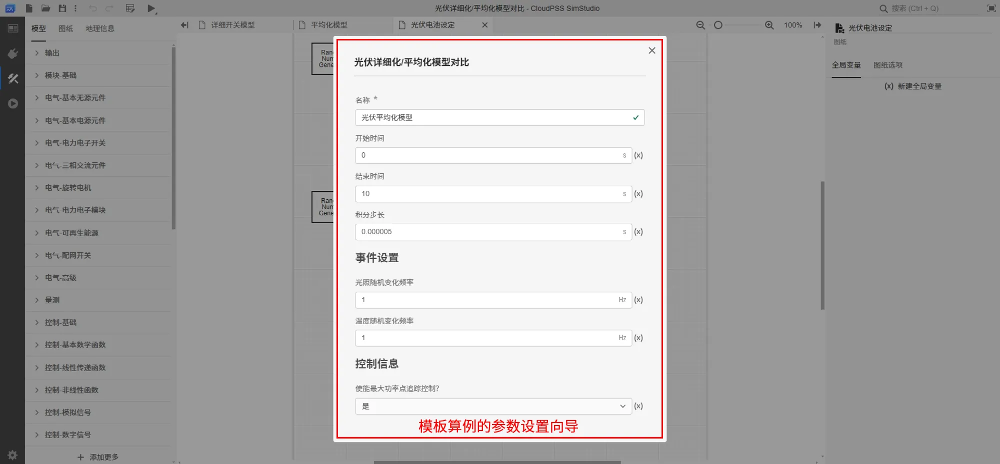

- **模板算例介绍**
  
    光伏并网发电系统由光伏电池组的工程参数模型（参数更易获取）、电压源型变流器（详细化/平均化模型）、变流器控制系统和最大功率点跟踪（MPPT）算法构成。  
    
    其中，电压源型变流器的详细模型由 6 个分立的 IGBT 及其反并联二极管组成，如下图所示。

    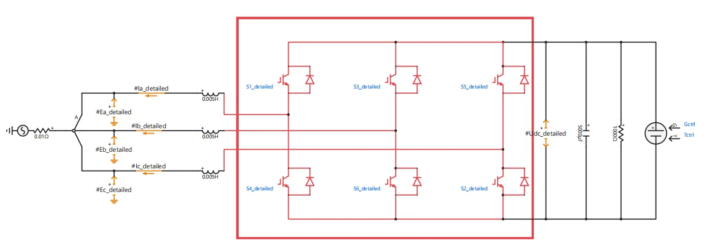

    变流器的平均模型由交流侧 3 个受控电压源和直流侧 1 个受控电流源组成，如下图所示。

    

    变流器的控制系统采用定直流电压-无功功率控制（VQ 控制）。其中，直流电压给定值由 MPPT 控制模块指定。详细模型的控制系统由电网电压定向、电压环-电流环双闭环控制、参考信号生成、SPWM 控制四部分构成。MPPT 采用扰动算法。

    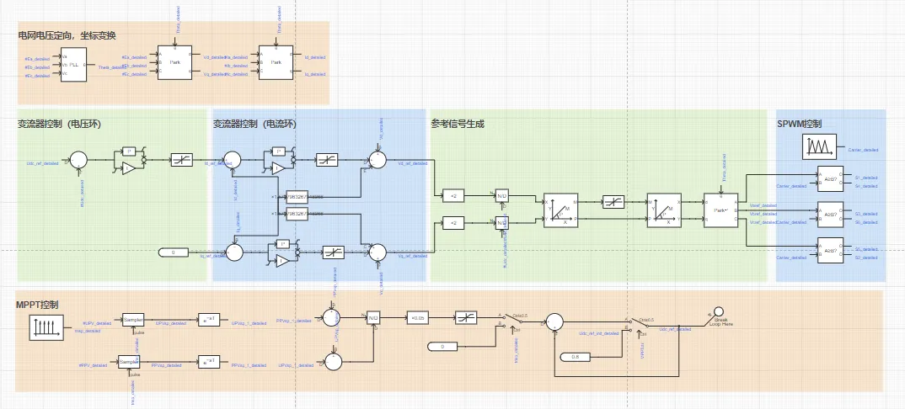

    平均模型的控制系统省略了 SPWM 控制，但增加了变流器平均化模型控制，其主要作用是保证交流侧和直流侧的功率平衡。

    

- **启动电磁暂态仿真**
  
    在**运行标签页**下配置**电磁暂态仿真方案**和**参数方案**。
    
    由于详细化模型中含有**离散开关事件**，因此必须在**电磁暂态仿真方案**的**求解器设置**处选择**开关/离散事件处理增强**选项，并采用较小的仿真步长进行仿真。若 PWM 载波频率为 $f_c$，则建议仿真步长应小于 $1/({20f_c})$。
    
    平均化模型中不存在开关事件，单独运行平均化模型时，可选择**求解器**为**常规**选项，并设置较高的仿真步长（建议 50μs，通常不超过 100μs）。 
    
    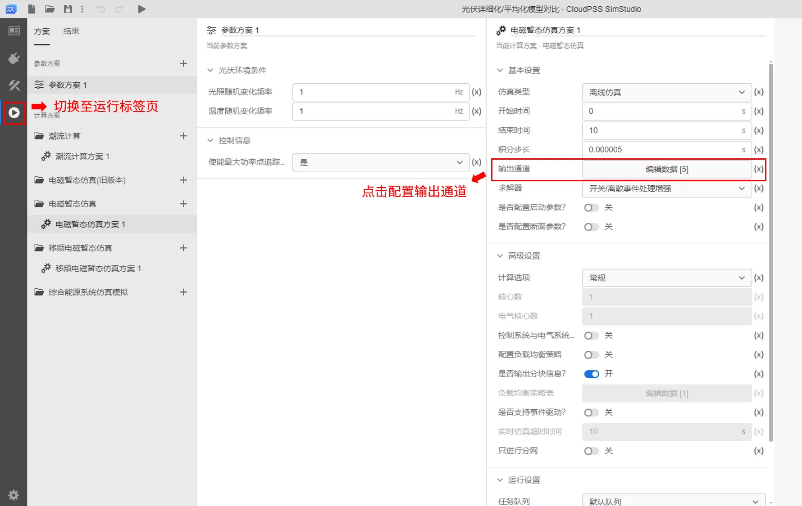      

    在选中的电磁暂态方案页面，配置**输出通道**。该模板中，已选择输出直流电压、有功功率、无功功率、交流电流以及光照、温度的变化曲线，如下图所示。

          

    配置**参数方案**，设置参数方案列表中的**光照/温度随机变化频率**为 1Hz，**使能最大功率点追踪控制**选择“否”，即禁用 MPPT 控制。

    点击页面左上角的**启动任务**或按下 `ctrl` + `R` 开始仿真。

    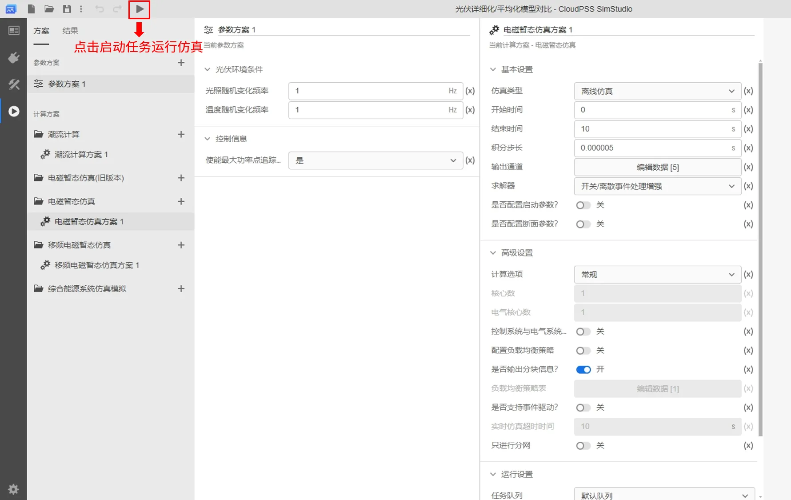      

    在禁用 MPPT 控制时，详细化模型和平均化模型的直流电压和有功功率仿真结果对比如下图所示。

    

    直流侧直流电压参考值设置为 0.8kV，直流侧电压维持在 0.8kV。

    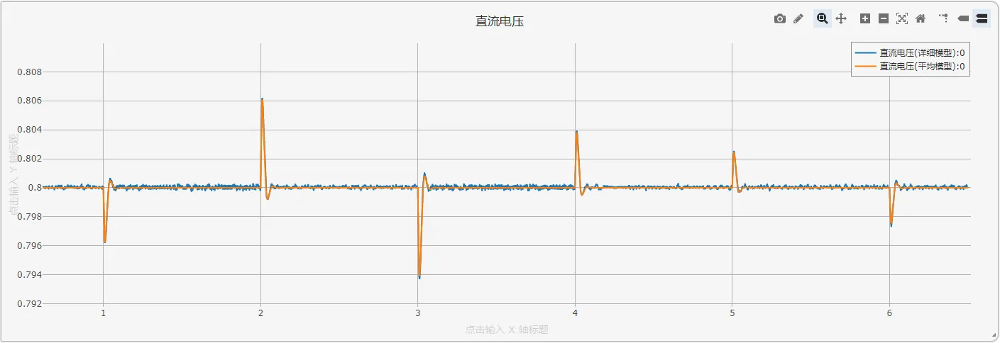

    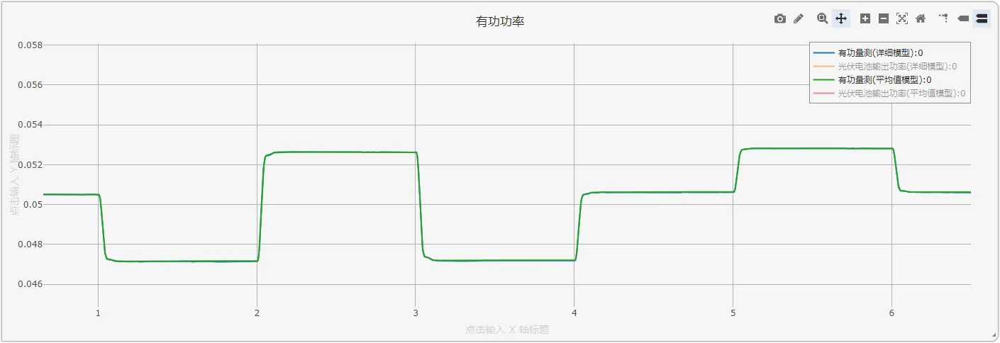

    光照/温度随机变化频率为 1Hz，环境条件发生变化时，直流电压产生波动并维持在直流电压参考值，有功功率随着环境的变化而发生变化。

    修改参数方案，**使能最大功率点追踪控制**选择“是”，即启用 MPPT 控制。

    点击**启动任务**，即可得到仿真结果。启用 MPPT 控制时，详细化模型和平均化模型的直流电压和有功功率仿真结果对比如下图所示。

    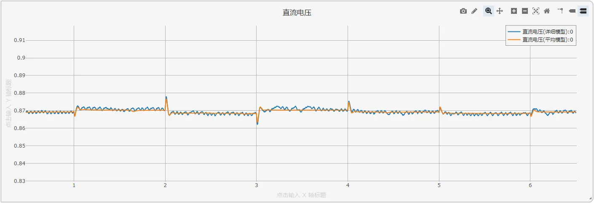

    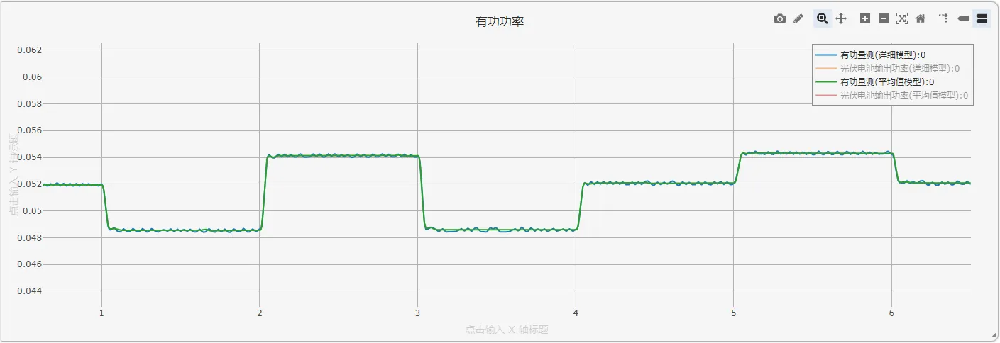

    直流侧直流电压参考值设置为该环境条件下由 MPPT 控制得到的最大功率点电压，直流侧电压维持在最大功率点电压。环境条件发生变化时，最大功率也发生变化。

    可见，详细化模型和平均化模型结果一致。在实际应用时，若需研究控制算法、系统级动态，为提升仿真效率，可采用平均化模型。

</TabItem>
</Tabs>

## 常见问题
