:::warning
1. 最好提供一个单机无穷大系统算例（包含潮流求解和电磁暂态仿真）。5节点过于复杂了，可以保留，作为第三个案例（这个算例考察重点是如何批量修改参数）。(7月底前完成)
2. 注意按照规范要求调整该文档。(优先级低)
:::

本文档介绍三个入门案例：**RLC 电路的电磁暂态仿真**、**单机无穷大系统的潮流计算和电磁暂态仿真**和**五节点电力网络的潮流计算仿真**。用户可跟随帮助文档步骤，搭建入门案例熟悉 EMTLab 的图形化建模、电磁暂态仿真和潮流计算功能。

import Tabs from '@theme/Tabs';
import TabItem from '@theme/TabItem';

<Tabs>
<TabItem value="case1" label="RLC 电路的电磁暂态仿真">
本案例主要介绍简单 RLC 串联电路的搭建及仿真过程。该 RLC 串联电路由单相交流电压源、电阻、电感、电容元件组成。

#### 放置元件
- 在 SimStudio 工作台，点击新建电力系统仿真项目。

- 在**实现标签页**，点击**电气-基本电源元件**选择单相交流电压源元件拖拽至工作空间，在**电气-基本无源元件**分别选择接地点、电阻、电感、电容元件拖拽至工作空间，即可完成对相应元件的放置。

- 可利用鼠标长按元件进行拖动或选中元件后用 <kbd>键盘方向键</kbd> 改变元件位置。可以 <kbd>鼠标右键</kbd> 点击元件进行元件的剪切、复制、粘贴、创建副本、删除、隐藏元件名称等操作，或者通过快捷键快速实现上述操作。点击元件上方的圆形箭头或利用 <kbd>Ctrl</kbd> + <kbd>R</kbd> 对元件进行旋转。元件放置结束后的工作空间如上图所示。

#### 连接元件
- 将鼠标光标移至元件引脚处，若该引脚出现蓝色圆形阴影，说明该引脚可用。此时单击该引脚，按住 <kbd>鼠标左键</kbd> 并移动光标至需要被连线的引脚处，当该引脚处出现橙色边框，松开 <kbd>鼠标左键</kbd> 即完成两个元件的连线。在连线后，选中连线并在连线路径上单击 <kbd>鼠标左键</kbd> 可以在该处设置拐点，拐点可以被拖动调整位置。元件连接示例如图所示。

- 若出现元件较多、连线不便的情况，可以通过**设置引脚**的方式对两个及以上的引脚进行连接。单击需要连接的元件，在工作空间的右侧栏会出现**参数**面板，在需要连接的引脚处填写相同的字符，即可实现连接，如下图所示。

:::tip 引脚连接注意事项
- 电气引脚与信号引脚不能互相连接；
- 信号输入引脚不能并联，信号输出引脚不能并联，即信号输出引脚需连接至另一信号输入引脚；
- 引脚连接需满足维数要求：例如**三相交流电压源**的正端为三维电气引脚，不能直接与**单相电阻**的一维引脚连接，此时可加入**分线器**进行电气引脚拆分。同理，多维的信号引脚加入**多路信号合并**或**多路信号分离**元件进行拆分/聚合。 
:::

#### 设置参数
- 点击任一元件（以电阻为例），工作空间右侧将出现如图所示的**参数**面板。**参数**面板右侧为**格式**面板，用于设置元件的图标特性，如样式、文本以及排列。各元件参数设置：单相交流电压源相电压有效值为 10kV，频率为 50Hz；电阻为 10Ω；电感为 0.01H；电容为 5000μF，其它参数为默认值。

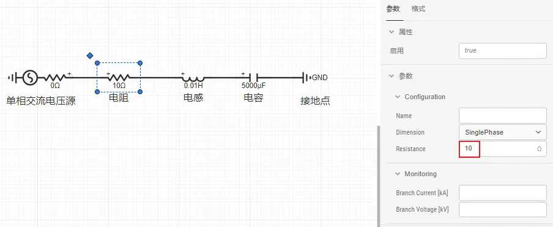

#### 添加测量元件
- 常用的量测元件有**电压表**、**支路电压表**以及**电流表**。以电压表为例，在左侧**模型**栏中点击**量测**选择**电压表**元件拖拽至工作空间，并连接至电路。点击该元件出现参数配置面板，填写该电压表测得电压信号的名称，以 `#` 号开头。

- 此外，电气元件本身支持部分内部量输出，无需外加量测元件。如在电阻元件中添加量测，点击电阻元件,在参数的 `Monitoring` 中填写以 `#` 号开头的量测信号输出名称。更多关于信号名称的信息详见 [参数及引脚体系](../../40-simstudio/30-modeling/10-params-variables-pins/index.md)。

#### 添加输出通道
- 上一步添加的量测元件对电气量进行了采集，如需输出还需要添加**输出通道**。输出通道类比于实际物理示波器的探头，计算方案中的输出通道配置类比于将探头接入示波器。
- 在左侧**模型**栏中点击**输出**选择**输出通道**元件拖拽至工作空间，单击设置参数，如下图所示。通道名称设定为：电压源端电压，输入信号维数设定为 1，因为采集得到的电压源端电压为 1 维。输入引脚填写为以 `#` 号开头的电压表测量输出信号名称 `#Vs`。

- 至此工作空间的仿真内容全部搭建完毕，总的仿真图如下图所示。

#### 仿真运行方法
- 点击左侧**运行标签页**，分别配置仿真的**参数方案**和**计算方案**。参数方案是对该项目的参数列表的参数进行配置。在计算方案中选择**电磁暂态仿真方案**，可对电磁暂态仿真方案中的仿真参数进行配置（如，基本设置、 求解器设置、启动/断面参数）。其中，示波器分组可在**电磁暂态仿真方案 - 输出通道 - 编辑数据**进行设置，点击**输出通道 - 编辑数据**，弹出输出通道页面，可以对示波器分组名称、采样频率、窗口类型、窗口宽度、示波器输出通道进行设置。
- 由于本算例为入门案例，在此采用平台预置**参数方案**，无需对其进行配置，在计算方案中选择**电磁暂态仿真方案**设置仿真结束时间为 2s，积分步长为 0.00001s，如下图所示：

- 点击**输出通道 - 编辑数据**，配置示波器输出通道如下图所示：

- 点击**启动任务**开始仿真，仿真结果如下图所示：

</TabItem>

<TabItem value="case2" label="单机无穷大系统的潮流计算和电磁暂态仿真">
本案例主要介绍单机无穷大系统的搭建及仿真流程。如下图所示，该单机无穷大系统由同步发电机、变压器、传输线、交流母线和无穷大系统组成，其中无穷大系统使用电压源表示。

#### 放置元件
- 在 SimStudio 工作台，点击新建电力系统仿真项目。

- 在**实现标签页 - 模型**栏中点击**电气 - 三相交流元件**分别选择**三相交流电压源**、**三相交流母线**、**三相双绕组变压器**、**三相传输线**元件拖拽至工作空间，即可完成对相应元件的放置。

- 可利用鼠标长按元件进行拖动或选中元件后用 <kbd>键盘方向键</kbd> 改变元件位置。可以 <kbd>鼠标右键</kbd> 点击元件进行元件的剪切、复制、粘贴、创建副本、删除、隐藏元件名称等操作，或者通过快捷键快速实现上述操作。点击元件上方的圆形箭头或利用 <kbd>Ctrl</kbd> + <kbd>R</kbd> 对元件进行旋转。元件放置结束后的工作空间如上图所示。

- **同步发电机**、控制电机所需的**励磁器**、**调速器**、**原动机**、**电力系统稳定器**、用于产生`L2N` 和 `S2M` 信号的**阶跃发生器**均可以复制3 机 9 节点标准测试系统已经搭建并设置好的 Gen1 电机部分。打开模板算例的具体步骤可参考 [从模板案例创建](../10-start-from-template/index.md#) 帮助文档。

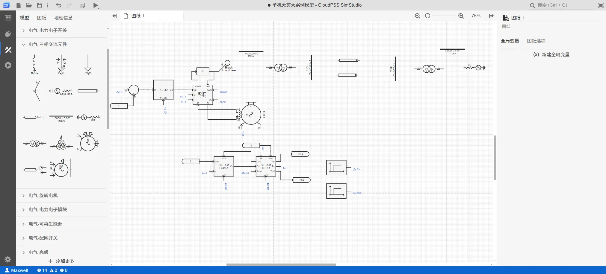

#### 连接元件
- 将鼠标光标移至元件引脚处，若该引脚出现蓝色圆形阴影，说明该引脚可用。此时单击该引脚，按住 <kbd>鼠标左键</kbd> 并移动光标至需要被连线的引脚处，当该引脚处出现橙色边框，松开 <kbd>鼠标左键</kbd> 即完成两个元件的连线。在连线后，选中连线并在连线路径上单击 <kbd>鼠标左键</kbd> 可以在该处设置拐点，拐点可以被拖动调整位置。元件连接示例如图所示。

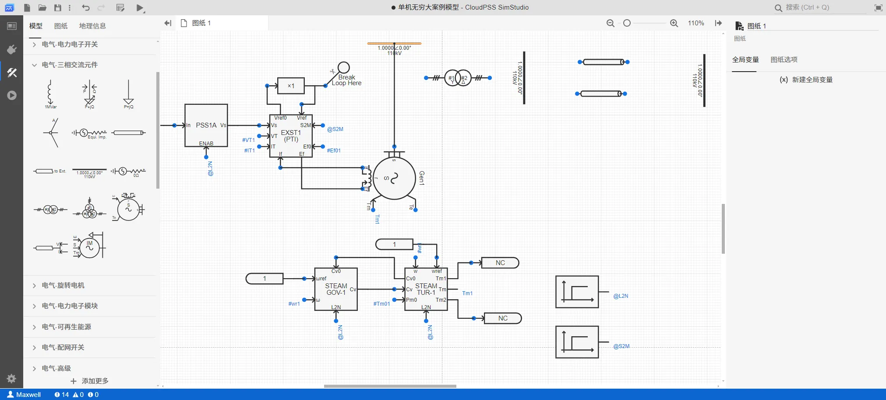

点击**图纸选项**，开启**元件标签**，连接完成后的算例如下图所示：

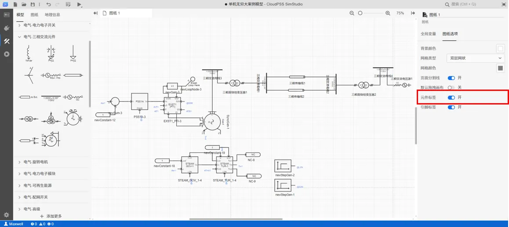

#### 设置参数
- 点击任一元件（以同步发电机为例），工作空间右侧将出现如图所示的**参数**面板。

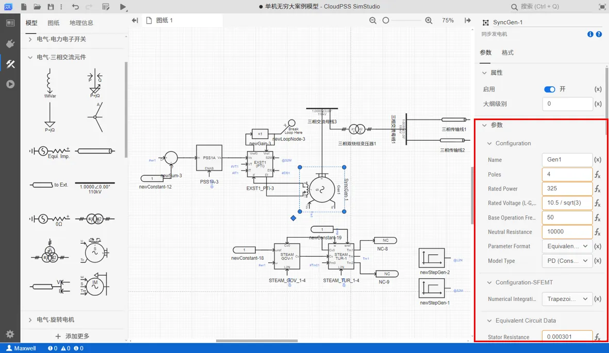

各元件需要进行设置的参数如下：

- 同步发电机： `Rated Voltage (L-G, RMS)` 设置为 10.5 / sqrt(3)。
- 三相交流母线：
  - 三相交流母线 1 和 三相交流母线 2 的 `Base Voltage (L-L, RMS)` 设置为 230。
  - 三相交流母线 3 和 三相交流母线 4 的 `Base Voltage (L-L, RMS)` 设置为 110。
- 三相双绕组变压器:
  - 三相双绕组变压器 1 的 `Winding #1 Rated Voltage (L-L, RMS)` 设置为 10.5，`Winding #2 Rated Voltage (L-L, RMS)` 设置为 242，`Winding #2 Type` 选择为星形(Y)。
  - 三相双绕组变压器 2 的 `Winding #1 Rated Voltage (L-L, RMS)` 设置为 242，`Winding #2 Rated Voltage (L-L, RMS)` 设置为 10.5，`Winding #2 Type` 选择为星形(Y)。
- 三相传输线：三相传输线 1 和三相传输线 2 需要设置 `R, X, B (p.u.)` 参数组下的参数，设置 `Rated Voltage (L-L, RMS)` 为 230，`+/- Seq. Resistance` 为 0.01135，`+/- Seq. Inductive Reactance` 为 0.06408，`+/- Seq. Capacitive Susceptance` 为 0.1328，`0 Seq. Resistance` 为 0.035635，`0 Seq. Inductive Reactance` 为 0.196854，`0 Seq. Capacitive Susceptance` 为 0.083774。
- 三相交流电压源：`Rated Voltage (L-L, RMS)` 设置为 10.5，`Function Type` 选择为 Cosine，`Frequency` 为 50，`Voltage Ramp Up Time` 为 0.06；`Power Flow Data` 参数组下的 `Bus Type` 选择为 PV Bus，`Injected Active Power` 设置为 -225。

#### 添加测量元件
- 在左侧**模型**栏中点击**量测**分别选择**电流表**和**电压表**元件拖拽至工作空间，在三相双绕组变压器 1 与 三相交流母线 1 之间添加**电流表**（需要删除原有连线，重新连接元件和电流表）。在三相双绕组变压器 2 与三相交流母线 4 之间添加**电压表**，可直接将**电压表**与原有连线相连。分别点击**电流表**和**电压表**出现参数配置面板，选择 `Dimension` 为 Three Phrase，设置 `Name for Current Signal [kA]` 为 I，设置 `Name for Voltage Signal [kV]` 为 V。

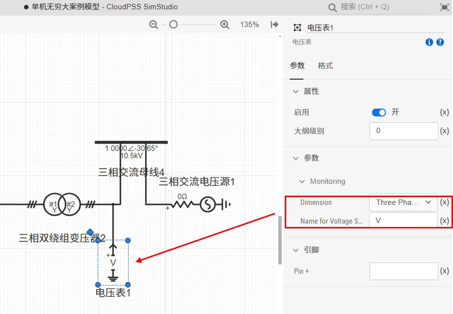

#### 添加输出通道
- 上一步添加的量测元件对电气量进行了采集，如需输出还需要添加**输出通道**。输出通道类比于实际物理示波器的探头，本案例放置了 2 个量测元件，需要添加 2 个**输出通道**元件。
- 在左侧**模型**栏中点击**输出**选择**输出通道**元件拖拽至工作空间并进行参数设置，输出通道 1 的 `Channel Name` 设置为送端电流，`Dim. of Input Signal` 设置为 3， `input` 设置为 I。输出通道 2 的 `Channel Name` 设置为受端电压，`Dim. of Input Signal` 设置为 3， `input` 设置为 V。

#### 潮流计算
- 在**运行标签页**，选择平台预置的潮流计算方案，无需进行配置。

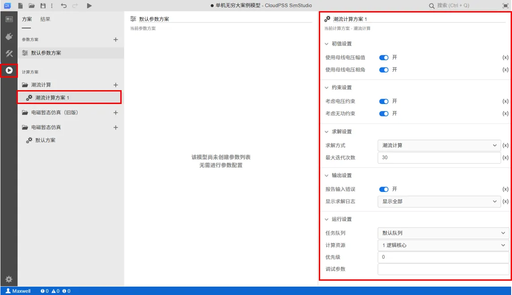

- 点击**启动任务**开始潮流计算仿真，在结果页面由 `Buses` 和 `Branches` 两个潮流数据表格显示潮流计算结果。

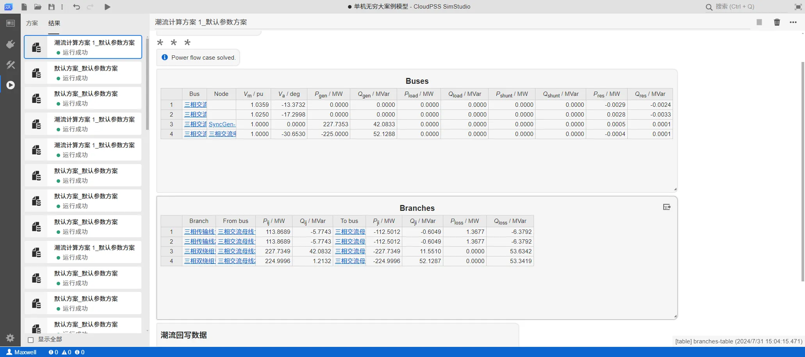

- 点击**潮流回写数据**选项框下的**修改项目文件**按钮，弹出的确认框中点击**应用**，将潮流结果回写至模型中。

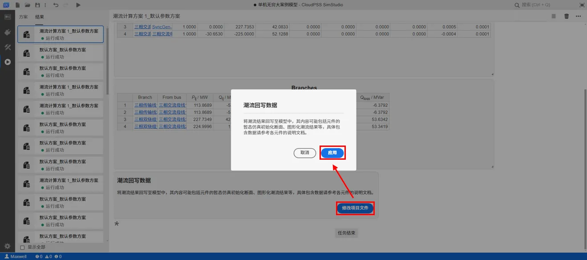

#### 电磁暂态仿真
- 在**运行标签页**，选择平台预置的电磁暂态仿真方案，设置仿真结束时间为 10s。
  
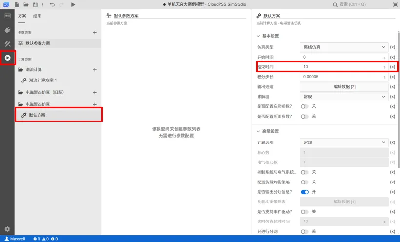

- 点击**输出通道 - 编辑数据**，配置示波器输出通道如下图所示：

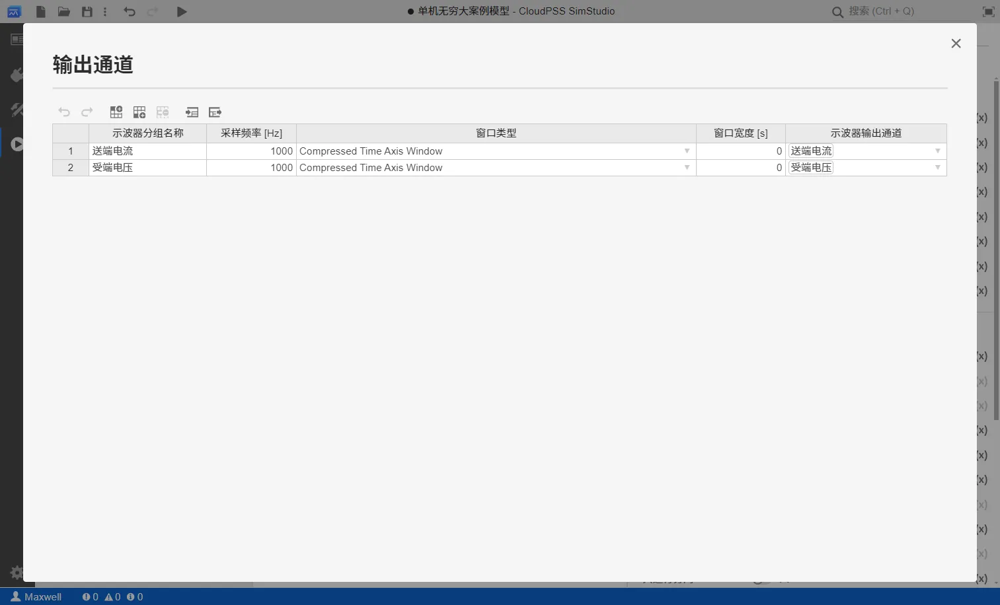

- 点击**启动任务**开始电磁暂态仿真，在结果页面可以查看到仿真结果如下图所示：
  
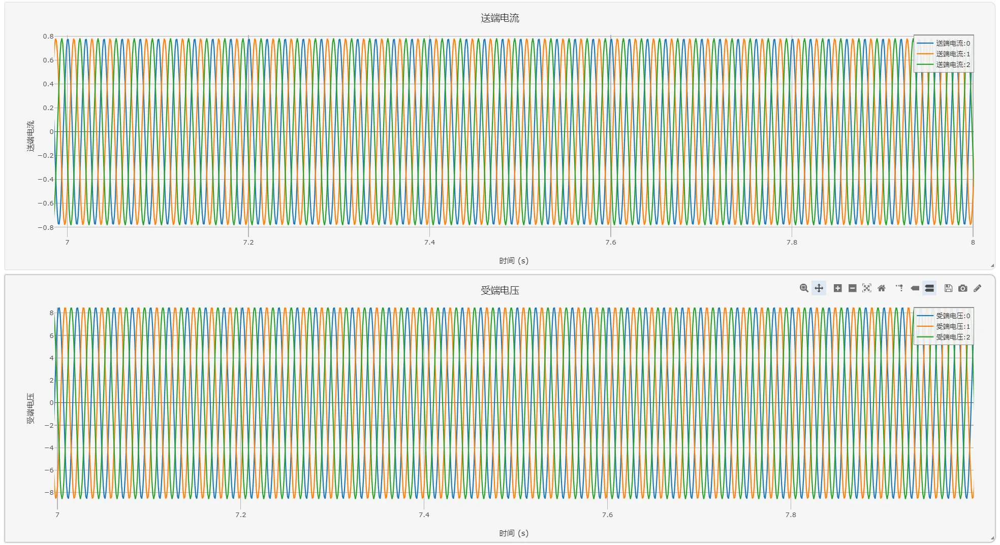

</TabItem>

<TabItem value="case3" label="五节点电力网络的潮流计算仿真">
本案例主要介绍五节点电力网络的搭建及仿真流程。该五节点电力网络由三相交流电压源、变压器、传输线、负荷及交流母线组成。

#### 五节点电力网络潮流计算原理
如图所示。母线 1、2、3 为 PQ 节点，各节点的负荷分别为：${S_1} = 1.6 + j0.8$，${S_2} = 2 + j1$，${S_3} = 3.7 + j1.3$；节点 4 为 PV 节点，给定 ${P_4} = 5$，${V_4} = 1.05$；节点 5 为平衡节点，给定 ${V_5} = 1.05 \angle {0^ \circ }$。

各 PQ 和 PV 节点已知的注入功率为 ${P_1S} = -1.6$，${Q_1S} = -0.8$，${Q_2S} = -2$，${P_3S} = -3.7$，${P_4S} = 5$。  
    
用牛顿-拉夫逊法计算潮流，当收敛指标取 ${10^{ - 6}}$ 时，需要进行四次迭代。迭代过程中各节点电压变化情况如表所示：

| 迭代次数 | ${\theta _1}$ |  ${\theta _2}$ | ${\theta _3}$ | ${\theta _4}$ | ${V_1}$ |${V_2}$ |${V_3}$ |
| :-----:| :----: | :----: | :----: | :----: | :----: |:----: |:----: |
| 1 | -1.9982 |  21.0307 | -3.6913 | 25.2051 | 0.9726 |1.0712 |1.0374 |
| 2 | -4.2545 |  19.1453 | -4.0304 | 23.1260 | 0.8813 |1.0505 |1.0196 |
| 3 | -4.6213 |  19.0733 | -4.0641 | 23.0545 | 0.8684 |1.0494 |1.0183 |
| 4 | -4.6316 |  19.0736 | -4.0649 | 23.0549 | 0.8681 |1.0493 |1.0183 |

迭代结果各节点电压大小和相位角列于下表：

| 节点编号 | ${V}$ |  ${\theta}$ |  
| :-----:| :----: | :----: | 
| 1 | 0.8681 |  -4.6316 | 
| 2 | 1.0493 |  19.0736 | 
| 3 | 1.0183 |  -4.0649 | 
| 4 | 1.0500 |  23.0549 | 
| 5 | 1.0500 |  0 | 

#### 放置元件
- 在 SimStudio 工作台，点击新建电力系统仿真项目。

- 在左侧**模型**栏中点击**电气 - 三相交流元件**分别选择**三相交流电压源**、**三相交流母线**、**三相双绕组变压器**、**三相传输线**、**静态负荷**元件拖拽至工作空间，即可完成对相应元件的放置。

- 可利用鼠标长按元件进行拖动或选中元件后用**键盘方向键**改变元件位置。可以 <kbd>鼠标右键</kbd> 点击元件进行元件的剪切、复制、粘贴、创建副本、删除、隐藏元件名称等操作，或者通过快捷键快速实现上述操作。点击元件上方的圆形箭头或利用 <kbd>Ctrl</kbd> + <kbd>R</kbd> 对元件进行旋转。元件放置结束后的工作空间如上图所示。

#### 连接元件
- 将鼠标光标移至元件引脚处，若该引脚出现蓝色圆形阴影，说明该引脚可用。此时单击该引脚，按住 <kbd>鼠标左键</kbd> 并移动光标至需要被连线的引脚处，当该引脚处出现橙色边框，松开 <kbd>鼠标左键</kbd> 即完成两个元件的连线。在连线后，选中连线并在连线路径上单击 <kbd>鼠标左键</kbd> 可以在该处设置拐点，拐点可以被拖动调整位置。元件连接示例如图所示。

#### 设置参数
- 除了使用点击元件进行参数设置外，还可以使用**元件表**快速批量配置模型内部参数。在**实现标签页**点击**元件表**按钮，可弹出元件表对话框。

元件表支持与 `Excel` 相似的自动填充功能。选中一个或多个单元格，点击右下角的小蓝点并拖动至待填充的单元格，可自动利用当前单元格的内容进行批量填充。

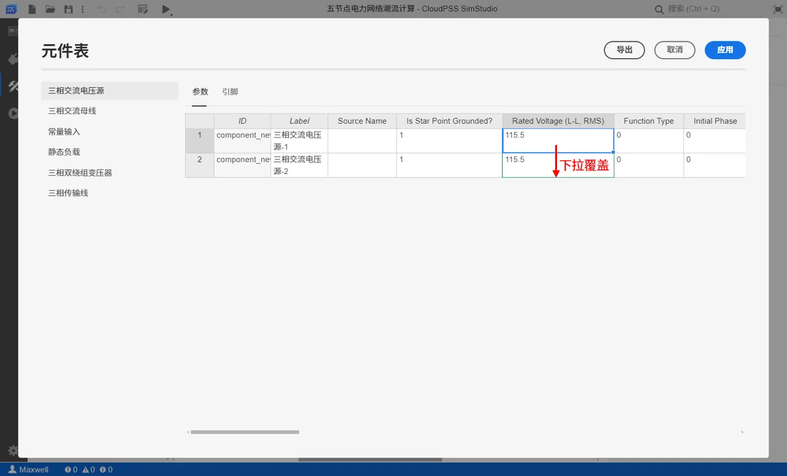

各元件参数设置如下：
- 三相交流电压源的 `Rated Voltage (L-L, RMS)` 均设置为 115.5 ，`Frequency` 均为 50。
  -  三相交流电压源-1 的 `Bus Type` 设置为 1，即 PV Bus，`Injected Active Power` 为 500，`Bus Voltage Magnitude` 为 1.05；
  -  三相交流电压源-2 的 `Bus Type` 设置为 2，即 Slack Bus，`Bus Voltage Magnitude` 为 1.05，`Bus Voltage Angle` 为 0。
- 三相交流母线的 `Base Voltage (L-L, RMS)` 均设置为 110。
- 常量输入的 `Real Constant Value` 均为 1.02。
- 静态负载的 `Rated Voltage (L-L, RMS)` 均设置为 110。
  -  静态负载-1 的 `Rated Active Power (3 Phase)` 为 160，`Rated Reactive Power (3 Phase)` 为 80；
  -  静态负载-2 的 `Rated Active Power (3 Phase)` 为 200，`Rated Reactive Power (3 Phase)` 为 100；
  -  静态负载-3 的 `Rated Active Power (3 Phase)` 为 370，`Rated Reactive Power (3 Phase)` 为 130。
- 三相双绕组变压器的 `Rated Power` 均为 100，`Winding #1 Rated Voltage (L-L, RMS)` 和 `Winding #2 Rated Voltage (L-L, RMS)` 均为 110，`Winding #1 Type` 和 `Winding #2 Type` 均为 1，即 Delta-Delta 连接，`Initial Tap Ratio` 均为 1.02。
  - 三相双绕组变压器-1 的 `Positive Sequence Leakage Reactance` 为 0.015，`Tap Changer` 为 2，即分接头选择绕组 2；
  - 三相双绕组变压器-2 的 `Positive Sequence Leakage Reactance` 为 0.03，`Tap Changer` 为 1，即分接头选择绕组 1。
- 三相传输线的 `Length of Line` 均为 1，`Parameter Format` 均为 0，即集中参数模型并使用标幺值输入，`Rated Voltage (L-L, RMS)` 均为 110，`Rated Power Capacity` 均为 100。
  - 三相传输线-1 的 `+/- Seq. Resistance` 为 0.08，`+/- Seq. Inductive Reactance` 为 0.3，`+/- Seq. Capacitive Susceptance` 为 0.5；
  - 三相传输线-2 的 `+/- Seq. Resistance` 为 0.04，`+/- Seq. Inductive Reactance` 为 0.25，`+/- Seq. Capacitive Susceptance` 为 0.5；
  - 三相传输线-3 的 `+/- Seq. Resistance` 为 0.1，`+/- Seq. Inductive Reactance` 为 0.35，`+/- Seq. Capacitive Susceptance` 为 0.5。

至此工作空间的仿真内容全部搭建完毕，总的仿真图如下图所示。

#### 仿真运行方法
在**运行标签页**，配置**计算方案**：由于本案例为入门案例，在此采用平台预置**计算方案**，无需对其进行配置。

点击**启动任务**开始仿真，仿真结果如下图所示。

</TabItem>
</Tabs>
---------------

## 示例模型下载连接
算例文件下载：  
[单机无穷大系统的潮流计算和电磁暂态仿真](./case-2.cmdl)  
[五节点电力网络的潮流计算仿真](./case-3.cmdl)