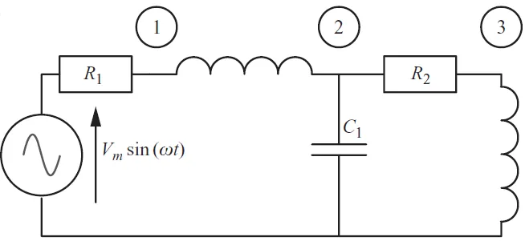

本文档主要介绍 EMTLab 的电磁暂态仿真基本原理，并使用含电压源的 RLC 网络介绍电磁暂态仿真建模求解过程。

## 功能定义
EMTLab 提供的电磁暂态仿真功能。

## 功能说明

### 暂态过程
#### 暂态过程分类
根据暂态过程所涉及的能量转换过程，系统的暂态过程分为机电暂态过程和电磁暂态过程。**机电暂态过程**是由于发电机或电动机的电磁转矩变化而引起的电机转子机械运动的改变，主要涉及到电机的机械能和电网的电能之间的相互作用。**电磁暂态过程**是由电场能量和磁场能量相互作用引起的电压电流变化，电磁暂态过程通常是**微秒到毫秒级**的。电磁暂态过程和机电暂态过程的频率范围如下：

#### 电力系统暂态过程分析方法
电力系统时间尺度跨度大，传统解析法难以评估系统的稳定性和安全性，需要采用时域仿真方法对系统的运行状态进行分析。电力系统的各元件的动态都可以用微分方程表示，系统可以建模一个为微分方程组。电力系统时域仿真就是为系统的微分方程组提供在一些离散时间点的解。电力系统时域仿真方法可以分为电磁暂态仿真和机电暂态仿真。  

#### 电磁暂态仿真和机电暂态仿真对比
电磁暂态仿真中，元件都建模为微分方程，系统模型是微分方程组：  

$$
\frac{\mathrm d \boldsymbol{x}}{dt}=f(\boldsymbol{x})
$$  

机电暂态仿真中，电机等动态元件建模为微分方程，网络建模为代数方程，系统模型是微分-代数方程组：

$$
\left\{\begin{aligned} & \frac{\mathrm{d} \boldsymbol{x}}{\mathrm{d} t}=f(\boldsymbol{x}, \boldsymbol{y}) \\ &(\boldsymbol{x}, \boldsymbol{y})=0 \end{aligned}\right.
$$  

电磁暂态仿真和机电暂态仿真的对比如下表所示：

| 对比项 | 机电暂态仿真 | 电磁暂态仿真 |
| :--- | :--- | :--- | 
| 信号 |  相量 | 瞬时量 | 
| 频率 | 低频(基频) | 高频 | 
| 网络方程 | 代数方程（潮流约束） | 微分方程 | 
| 仿真步长 | 时间步长大(典型值 10ms) | 时间步长小(us 级别) | 
| 计算速度 | 快 | 慢 | 
| 准确性 | 低 | 高 |  

从表格可以看出，只有使用电磁暂态仿真才能准确刻画现代电力电子化电力系统的暂态过程。

### 电磁暂态仿真原理
#### 电磁暂态仿真方法分类
电磁暂态仿真的方法大致可以分为两类：状态变量分析法和节点分析法。

**状态变量分析方法**是利用系统状态变量的数值积分来得到状态变量的值。这种方法中确定状态变量的独立性困难，尤其是系统较大的时候尤其困难。另外，方程的维度高，求解效率低。再次，状态变量分析方法的程序复杂冗长，不易维护。  

**节点分析法**将待求解的微分方程组转换为差分方程组求解。将各个支路上的元件用一个诺顿等效支路来代替。这一操作是针对单个元件进行的，而不像状态变量分析法那样将整个微分方程组作为一个整体进行差分化。**这种方法简单、高效，在商用电磁暂态仿真软件中广泛使用**。下面对基于节点分析的电磁暂态仿真进行介绍，其采用的离散化方法为梯形法。因为**梯形法简单又数值稳定性好，在节点分析法中被广泛用于差分化（离散化）微分方程**。  

 基于节点分析的电磁暂态仿真流程分类：

1. 利用梯形法对电力系统的元件转化为诺顿等效电路。以电感为例，其离散化的过程如下所示。  
   电感微分方程为：  
   $$
   v_{\mathrm{L}}=v_{k}-v_{m}=L \frac{\mathrm d i_{km}}{\mathrm d t}
   $$  
   离散化后得差分方程：
   $$
   i_{km(t)} =i_{k m(t-\Delta t)} + \frac{\Delta t}{2 L}\left(\left(v_{k}-v_{m}\right){(t)}+\left(v_{k}-v_{m}\right){(t-\Delta t)}\right)
   $$  
   整理后的差分方程为：  
   $$
   i_{k n}(t)=I_{\mathrm{hL}}(t-\Delta t)+G_{\mathrm{L}}\left(v_{k}(t)-v_{m}(t)\right)
   $$  
   $$
   G_{\mathrm{L}}=\frac{\Delta t}{2 L}
   $$  
   $$
   I_{\mathrm{hL}}(t-\Delta t)=i_{k m}(t-\Delta t)+G_{\mathrm{L}}\left(v_{k}(t-\Delta t)-v_{m}(t-\Delta t)\right)
   $$  
   根据差分方程，可以得到诺顿等效电路：  

  

2. 将各个元件支路表示为诺顿等效电路后，可建立网络的节点方程。
3. 对网络方程循环循环求解，就可以获得系统的仿真结果，循环的时间从 0 开始到给定的终止时间结束。**网络方程的求解流程**如下：  
   -  在循环开始前，形成节点矩阵 $\boldsymbol G$；
   -  循环开始时，各历史电流 $\boldsymbol I_{\mathrm h}$ 为 0；
   -  在每一次循环中，先计算历史电流以及电流源电流；
   -  然后用网络方程求得节点电压向量；
   -  根据各个支路的电流方程求出这一时刻各支路的电流供下一次循环使用；
   -  当仿真时间到达设定的时间时，仿真结束。
   
    

## 案例
import Tabs from '@theme/Tabs';
import TabItem from '@theme/TabItem';

<Tabs>
<TabItem value="case1" label="电磁暂态仿真建模示例">
下面以一个含电压源的 RLC 网络为例，介绍电磁暂态仿真建模求解过程，其示意图如下所示：  

 

对其进行离散化可得：  

根据离散化后的电路，可以建立网络的节点电压方程  
$$
G U(t)=I_{\mathrm{h}}+i(t)
$$  
其展开形式是：  
$$
\left[\begin{array}{ccc}
\frac{1}{R_{1}}+\frac{\Delta t}{2 L_{1}} & -\frac{\Delta t}{2 L_{1}} & 0 \\
-\frac{\Delta t}{2 L_{1}} & \frac{\Delta t}{2 L_{1}}+\frac{1}{R_{2}}+\frac{2 C_{1}}{\Delta t} & -\frac{1}{R_{2}} \\
0 & -\frac{1}{R_{2}} & \frac{1}{R_{2}}+\frac{\Delta t}{2 L_{2}}
\end{array}\right]\left[\begin{array}{c}
v_{1} \\
v_{2} \\
v_{3}
\end{array}\right]=\left(\begin{array}{c}
\frac{V_{m} \sin (\omega t)}{R_{1}}-I_{h_{L_{1}}} \\
I_{h_{2}}-I_{h_{C_2}} \\
-I_{h_{L_{2}}}
\end{array}\right)
$$
对上述网络方程进行过求解，即可得到系统的电磁暂态仿真结果。

</TabItem>
</Tabs>

## 常见问题 Q&A

为什么电磁暂态仿真会发散

:   
   基于节点分析方法的 EMT 模型可以用下式表示：

   $$ 
   \begin{aligned}\mathbf{I}(t) & =\mathbf{G}_{\mathrm{eq}} \mathbf{U}(t)+\mathbf{I}_{\mathrm{h}}(t) & \\ & =  \mathbf{G}_{\mathrm{eq}} \mathbf{U}(t)+\mathbf{A} \mathbf{I}(t-\Delta t)+\mathbf{B} \mathbf{U}(t-\Delta t) & \end{aligned}  
   $$  

   其中，$\mathbf{I}_{\mathrm{h}}(t)$ 为注入历史电流项；$\mathbf{G}_{\mathrm{eq}}$ 为 EMT 模型的等效导纳矩阵；$\mathbf{A} $， $\mathbf{B}$为参数矩阵，通常为常数矩阵。模型数值收敛的必要条件是其零输入响应收敛。即当 $\mathbf{U}(t) = 0$ 时，上式收敛。此时，参数矩阵 $\mathbf{A}$ 应使得下式成立，否则会造成仿真发散。

   $$
   \begin{aligned} & {\left[\lambda_{i i}\right]=\operatorname{eig}\{\mathbf{A}\}} \\ & {\left[\lambda_{i i}\right] \leq 1} \end{aligned}
   $$

   其中，$\lambda_{i i}$ 为参数矩阵 $\mathbf{A}$ 的特征根，$\left[\lambda_{i i}\right]$为特征根组成的对角阵，$\operatorname{eig}\{\mathbf{A}\}$ 表示求 $\mathbf{A}$ 的特征根对角阵的运算。由此可知，元件不合理的参数设置会影响参数矩阵 $\mathbf{A}$ 的特征根，从而导致仿真的发散。

      

EMTLab 使用什么方法处理数值振荡

:
   梯形积分方法为 A-稳定的（在某步长下零输入响应收敛到 0），但不是 L-稳定的（在步长 →∞ 时仍然收敛到 0），在仿真中可能会出现数值振荡。为了克服数值稳定问题，EMTLab 采用的临界阻尼调整（CDA），在数值突变发生后的两个半步长（$\Delta t/2$）将积分方法变为后向欧拉法。通过采用步长为 $\Delta t/2$ 的后向欧拉法，导纳矩阵 $\mathbf{G}_{\mathrm{eq}}$ 与梯形积分法采用的矩阵相同，只需调整参数矩阵 $\mathbf{A}$， $\mathbf{B}$。

      
