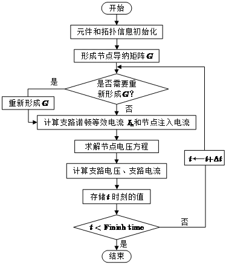
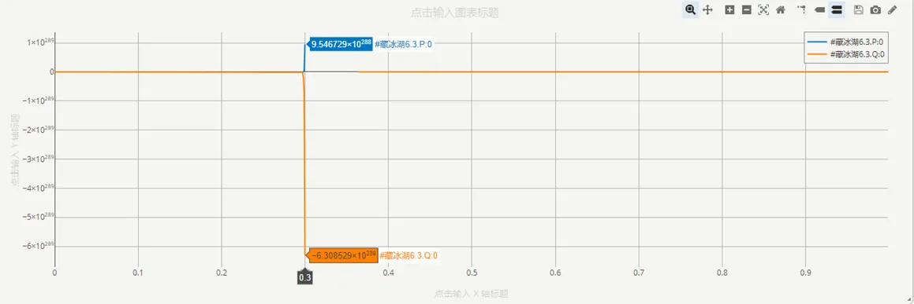

:::warning
1. 这一节文件夹里有冗余文件，请调整。(7月底前完成)
2. 有关数值振荡那里，应该放一个振荡和不振荡的图做对比。(优先级低)
3. 注意按照规范要求调整该文档。(优先级低)
:::

CloudPSS EMTLab 的电磁暂态仿真内核以自研的 **扩展节点分析法** 为基础框架，同时兼容 Dommel 算法模型、改进节点分析法模型和状态空间模型。
本文档主要介绍电磁暂态仿真的基础方法（Dommel算法），并使用含电压源的 RLC 网络介绍电磁暂态仿真的求解过程。研究型用户可通过本文档了解电磁暂态仿真模型的基础构建方法，方便编写自定义模型。

## 暂态过程
### 暂态过程分类

根据所涉及的能量转换过程的不同，电力系统的暂态过程分为**机电暂态**和**电磁暂态**两类。**机电暂态过程**是由于发电机或电动机的电磁转矩变化而引起的电机转子机械运动的改变，主要涉及到电机的机械能和电网的电能之间的相互作用。**电磁暂态过程**是由电场能量和磁场能量相互作用引起的电压电流变化，电磁暂态过程通常是**微秒到毫秒级**的。电磁暂态过程和机电暂态过程的频率范围如下：

### 电力系统暂态过程分析方法

电力系统时间尺度跨度大，传统解析法难以评估系统的稳定性和安全性，需要采用时域仿真方法对系统的运行状态进行仿真分析。电力系统的各元件的动态都可以用微分方程表示，系统可以建模一个为微分方程组。因此，电力系统时域仿真就是为系统的微分方程组提供在一系列离散时间点的解。

电力系统时域仿真方法可以分为电磁暂态仿真和机电暂态仿真。  

### 电磁暂态仿真与机电暂态仿真

从数学模型的角度，电磁暂态仿真中的元件均建模为一个或一组微分方程。完整的系统模型是一组微分方程组：  

$$
\frac{\mathrm d \boldsymbol{x}}{dt}=f(\boldsymbol{x})
$$  

机电暂态仿真中，由于更关注电机的机械能和电磁能之间的作用，因此将电力网络中的传输线、变压器等元件建模为代数方程，忽略电力网络中的电磁暂态，重点将发电机、电动机建模为微分方程。最终，完整的系统模型是微分-代数方程组：

$$
\left\{\begin{aligned} & \frac{\mathrm{d} \boldsymbol{x}}{\mathrm{d} t}=f(\boldsymbol{x}, \boldsymbol{y}) \\ &(\boldsymbol{x}, \boldsymbol{y})=0 \end{aligned}\right.
$$  

电磁暂态仿真和机电暂态仿真的对比如下表所示：

| 对比项 | 机电暂态仿真 | 电磁暂态仿真 |
| :--- | :--- | :--- | 
| 信号 |  相量 | 瞬时量 | 
| 频率 | 低频(基频) | 高频 | 
| 网络方程 | 代数方程（潮流约束） | 微分方程 | 
| 仿真步长 | 时间步长大(典型值 10ms) | 时间步长小(us 级别) | 
| 计算量 | 小 | 大 | 
| 准确性 | 低 | 高 |  

从表格可以看出，只有使用电磁暂态仿真才能准确刻画含高比例新能源、高比例电力电子装置的新型电力系统暂态过程。

## 电磁暂态仿真原理

### 电磁暂态仿真方法分类

电磁暂态仿真算法大致可以分为**状态空间分析法**和**节点分析法**两类。

+ **状态空间分析法（State Space Analysis, SSA）**：指构建系统的状态方程，利用系统状态变量的数值积分来得到状态变量的值。这类方法主要用于设备、小规模系统的仿真分析。

+ **节点分析法（Nodal Analysis，NA）**：将待求解的微分方程组转换为差分方程组，通过构建等效电路的形式，利用电力网络的节点分析法进行求解。具体地，可将各个元件用一个或一组诺顿等效支路来代替。这一操作是针对单个元件进行的，而不像状态变量分析法那样将整个微分方程组作为一个整体进行差分化。该方法由加拿大 H.W. Dommel 教授发明，**这类方法形式简单、高效，在商用电磁暂态仿真软件中广泛使用**。

CloudPSS 所采用的 **扩展节点分析法** 是节点分析法的一种扩展形式。该方法既可以兼容传统的 Dommel 算法，也可兼容状态空间模型和理想支路的接入。

### Dommel 算法介绍

以下是基于节点分析的 Dommel 算法基本原理。

首先，利用梯形积分公式，将电力系统元件的微分方程转化为差分方程，构造诺顿等效电路。
   
以电感为例，其离散化的过程如下所示。  
   电感微分方程为：  
   $$
   v_{\mathrm{L}}=v_{k}-v_{m}=L \frac{\mathrm d i_{km}}{\mathrm d t}
   $$  
   离散化后得差分方程：
   $$
   i_{km(t)} =i_{k m(t-\Delta t)} + \frac{\Delta t}{2 L}\left(\left(v_{k}-v_{m}\right){(t)}+\left(v_{k}-v_{m}\right){(t-\Delta t)}\right)
   $$  
   整理后的差分方程为：  
   $$
   i_{k n}(t)=I_{\mathrm{hL}}(t-\Delta t)+G_{\mathrm{L}}\left(v_{k}(t)-v_{m}(t)\right)
   $$  
   $$
   G_{\mathrm{L}}=\frac{\Delta t}{2 L}
   $$  
   $$
   I_{\mathrm{hL}}(t-\Delta t)=i_{k m}(t-\Delta t)+G_{\mathrm{L}}\left(v_{k}(t-\Delta t)-v_{m}(t-\Delta t)\right)
   $$  
   根据差分方程，可以得到诺顿等效电路：  

     

将各个元件表示为诺顿等效电路后，建立网络的节点电压方程。最后，循环求解网络节点电压方程，可获得系统的时域仿真结果。具体求解流程如下：  
-  **S1** 循环开始前，形成节点电导矩阵 $\boldsymbol G$；
-  **S2** 初始化历史电流向量 $\boldsymbol I_{\mathrm {nh}} = 0$；
-  **S3** 在每一次循环中，先计算各元件支路诺顿等效电流 $I_{\mathrm{h}}$，形成节点注入电流向量 $\boldsymbol I_{\mathrm {nh}}$；
-  **S4** 求解节点电压方程 $\boldsymbol Y\boldsymbol U_{\mathrm n}=\boldsymbol I_{\mathrm {nh}}$， 求得节点电压向量$\boldsymbol U_{\mathrm n}$；
-  **S5** 根据各个支路的差分方程求得这一时刻各支路的支路电压、电流，供下一次循环使用；
-  **S6** 判断仿真时间是否到达终止时间时，如是，则仿真结束，否则返回 **S2**。
   
    

## 案例
import Tabs from '@theme/Tabs';
import TabItem from '@theme/TabItem';

<Tabs>
<TabItem value="case1" label="电磁暂态仿真建模示例">
本案例以一个含非理想电压源的 RLC 网络为例，介绍电磁暂态仿真建模求解过程，其电路图如下所示：  

 

对其进行离散化可得：

根据离散化后的电路，可以建立网络的节点电压方程
$$
G U(t)=I_{\mathrm{h}}+i(t)
$$  
其展开形式是：  
$$
\left[\begin{array}{ccc}
\frac{1}{R_{1}}+\frac{\Delta t}{2 L_{1}} & -\frac{\Delta t}{2 L_{1}} & 0 \\
-\frac{\Delta t}{2 L_{1}} & \frac{\Delta t}{2 L_{1}}+\frac{1}{R_{2}}+\frac{2 C_{1}}{\Delta t} & -\frac{1}{R_{2}} \\
0 & -\frac{1}{R_{2}} & \frac{1}{R_{2}}+\frac{\Delta t}{2 L_{2}}
\end{array}\right]\left[\begin{array}{c}
v_{1} \\
v_{2} \\
v_{3}
\end{array}\right]=\left(\begin{array}{c}
\frac{V_{m} \sin (\omega t)}{R_{1}}-I_{h_{L_{1}}} \\
I_{h_{2}}-I_{h_{C_2}} \\
-I_{h_{L_{2}}}
\end{array}\right)
$$
对上述网络方程进行过求解，即可得到系统的电磁暂态仿真结果。

</TabItem>
</Tabs>

## 常见问题 Q&A

如何保证电磁暂态仿真的收敛性？

:   
   基于节点分析方法的电磁暂态仿真模型可以用下式表示：

   $$ 
   \begin{aligned}\mathbf{I}(t) & =\mathbf{G}_{\mathrm{eq}} \mathbf{U}(t)+\mathbf{I}_{\mathrm{h}}(t) & \\ & =  \mathbf{G}_{\mathrm{eq}} \mathbf{U}(t)+\mathbf{A} \mathbf{I}(t-\Delta t)+\mathbf{B} \mathbf{U}(t-\Delta t) & \end{aligned}  
   $$  

   其中，$\mathbf{I}_{\mathrm{h}}(t)$ 为注入历史电流项；$\mathbf{G}_{\mathrm{eq}}$ 为模型的等效导纳矩阵；$\mathbf{A} $， $\mathbf{B}$为参数矩阵，通常为常数矩阵。模型数值收敛的必要条件是其零输入响应收敛。即当 $\mathbf{U}(t) = 0$ 时，上式收敛。此时，参数矩阵 $\mathbf{A}$ 应使得下式成立，否则会造成仿真发散。

   $$
   \begin{aligned} & {\left[\lambda_{i i}\right]=\operatorname{eig}\{\mathbf{A}\}} \\ & {\left[\lambda_{i i}\right] \leq 1} \end{aligned}
   $$

   其中，$\lambda_{i i}$ 为参数矩阵 $\mathbf{A}$ 的特征根，$\left[\lambda_{i i}\right]$为特征根组成的对角阵，$\operatorname{eig}\{\mathbf{A}\}$ 表示求 $\mathbf{A}$ 的特征根对角阵的运算。由此可知，不合理的元件参数设置会影响参数矩阵 $\mathbf{A}$ 的特征根，从而导致仿真的发散。

      

CloudPSS EMTLab 使用什么方法处理数值振荡？

:
   梯形积分为 A-稳定数值积分方法（在某步长下零输入响应收敛到 0），但不是 L-稳定的（在步长 →∞ 时仍然收敛到 0），在仿真中可能会出现数值振荡。为了克服数值稳定问题，EMTLab 采用临界阻尼调整（Critical Damping Ajustment, CDA）方法，即在数值突变发生后的两个半步长（$\Delta t/2$）将积分方法变为后向欧拉法。通过采用步长为 $\Delta t/2$ 的后向欧拉法，导纳矩阵 $\mathbf{G}_{\mathrm{eq}}$ 与梯形积分法采用的矩阵相同，只需调整参数矩阵 $\mathbf{A}$， $\mathbf{B}$。

      
