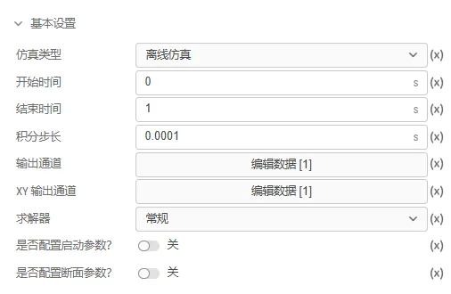
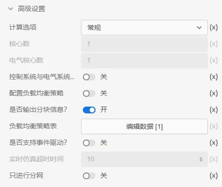
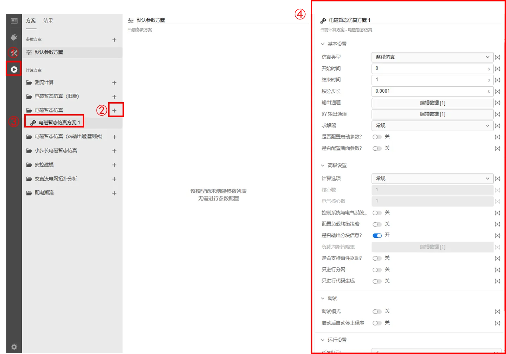
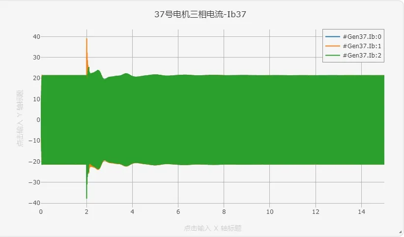

:::warning
1. 补充实时超时参数的说明和运行参数的说明，步长建议那里也调整一下。(7月底前完成)
2. 注意按照规范要求调整该文档。(优先级低)
:::

本文档介绍如何配置电磁暂态仿真的计算方案，包括基础设置、高级设置和运行设置。

## 功能定义

在 **SimStudio 运行标签页**，新建或选择 **电磁暂态仿真** 方案栏下的任一计算方案，即可对选中的电磁暂态仿真方案进行配置。

## 功能说明

电磁暂态仿真方案配置栏包含**基础设置**、**高级设置**和**运行设置** 3 个常规模块。

+ 用户可通过配置 **基础设置** 和 **运行设置** 模块，完成基础仿真时长、积分步长、输出通道、断面启动和计算资源的配置。
  + 量测和输出通道配置方法 详见 [量测及输出系统](../30-meters-and-outputs/index.md) 帮助页。
  + 断面保存和断面启动设置方法 详见 [断面参数设置](../40-snapshot/index.md) 帮助页。
+ 如需使用 **并行加速**、**实时仿真**或**事件驱动**相关功能，则需额外配置 **高级设置** 模块。

<Tabs>
<TabItem value="set1" label="基本设置">
电磁暂态仿真基本设置的参数如下图所示：

| 参数名 | 含义 | 说明 |
| :--- | :--- | :--- | 
| 仿真类型 | 电磁暂态仿真的应用类型 | 可选择**离线仿真**、**实时仿真**或**组网仿真**，默认选择**离线仿真**, 实时仿真相关内容可查看 [电磁暂态实时仿真](../../80-emts-rt/index.md) 帮助文档。**组网仿真**与**实时仿真**依赖 CloudPSS 专有硬件，公网平台暂不支持。 | 
| 开始时间 | 电磁暂态仿真的开始时间 | 默认为 0s。在进行断面启动功能时该参数需要与断面参数进行配合选取。 |
| 结束时间 | 电磁暂态仿真的结束时间 | 当仿真时间达到该值时仿真停止。 |
| 积分步长 | 仿真的积分步长 | 默认为 0.00005s，即 50 微秒。积分步长越小，仿真越精确，但计算量越大，仿真耗时越大，需结合实际情况进行选取。 |
| 输出通道 | 电磁暂态仿真的曲线输出配置 | 配置在结果页面显示的输出曲线，包括配置分辨率（输出频率）、显示方法、通道选择等内容。更多详细内容可查看 [量测及输出系统](../30-meters-and-outputs/index.md) 帮助文档。 |
| 求解器设置 | 求解器设置选项 | 可选择**常规**和**开关/离散事件处理增强**，默认选择**常规**。**常规**选项下系统仿真计算的效率更高。但对于包含由分立开关元件构成的电力电子拓扑，建议选择**开关/离散事件处理增强**，以通过迭代，准确判断单一步长内的同步开关事件。 |
| 是否配置启动参数 | 启动参数的开关 | 默认关闭。开启后，电磁暂态仿真可以从给定潮流断面启动（需额外配置启动参数模块）。更多启动参数说明可查看 [潮流结果写回及初始化](../../60-power-flow/30-initializing-from-power-flow-results/index.md) 帮助文档。 |
| 是否配置断面参数 | 配置断面参数的开关 | 默认关闭。开启后，电磁暂态仿真可以从给定断面开始仿真，详细说明可查看 [断面参数设置](../40-snapshot/index.md) 帮助文档。 |
</TabItem>

<TabItem value="set2" label="高级设置">
电磁暂态仿真高级设置的参数如下图所示：

| 参数名 | 含义 | 说明 |
| :--- | :--- | :--- | 
| 计算选项 | 选择仿真计算加速方式 | 可选择**常规**、**分网并行**、 **CPU Turbo** 或 **CPU Super Turbo**，默认选择**常规**。**常规**即利用单个 CPU 核心完成全部计算；**分网并行**即对电网进行解耦，不同分区分配在多个 CPU 核心中完成计算，利用多核 CPU 加速仿真；**CPU Turbo** 即自动利用多核 CPU 完成计算，该选项会执行自动负载均衡策略；**CPU Super Turbo** 是在 CPU Turbo 的基础上优化计算流程，进一步提升计算效率。并行计算相关配置方法可参考 [电磁暂态仿真并行加速](../../70-parallel-acceleration/index.md) 帮助文档。 |
| 核心数 | 仿真使用的 CPU 核心数 | 计算选项选择**分网并行**、 **CPU Turbo** 或 **CPU Super Turbo** 时可设置，代表 CPU 核心数，默认值为 1。 |
| 电气核心数 | 计算电气系统时使用的 CPU 核心数 | **控制系统与电气系统并行**开关开启时可设置，设置计算电气系统的 CPU 核心数, 如果**电气核心数** = **核心数**，代表控制系统与电气系统串行。 |
| 控制系统与电气系统并行 | 并行开关 | 默认关闭。若开启，则使能控制系统与电气系统的并行计算。 |
| 配置负载均衡策略 | 手动负载均衡策略配置开关 | 默认关闭。若关闭，系统将采用自动负载均衡策略；若开启，需手动配置负载均衡策略表。 |
| 是否输出分块信息 | 输出分块信息开关 | 默认开启。若开启，则在仿真过程中会额外输出分块信息。 |
| 负载均衡策略表 | 手动负载均衡配置表 | 使用该功能时，请先执行**交直流电网拓扑分析**，获取各个分区数据，并根据各个分区计算量和预估耗时，设计负载均衡策略，将分区编号对应填入“分区-核心”映射表。也可以在交直流电网拓扑分析结果页中写入负载均衡信息，将负载均衡策略表设置为拓扑分析后的默认值。更多详细说明可查看 [交直流拓扑分析](../../90-topology-analysis/index.md) 帮助文档 |
| 是否支持事件驱动 | 事件驱动开关 | 默认关闭。若开启，可在仿真过程中添加异步事件。更多事件驱动相关内容可参考 [事件驱动仿真](../../100-event-driven/index.md) 帮助文档。 |
| 实时仿真超时时间 | 实时仿真超时设置 | 仿真类型为**实时仿真**时可配置。更多实时仿真相关内容可查看 [电磁暂态实时仿真](../../80-emts-rt/index.md) 帮助文档  |
| 只进行分网 | 分网选项 | 默认关闭。若开启，仿真则只进行初始化分网，不进行后续仿真。主要用于交直流拓扑分析。更多详细说明可查看 [交直流拓扑分析](../../90-topology-analysis/index.md) 帮助文档 |
</TabItem>

<TabItem value="set3" label="运行设置">
电磁暂态仿真运行设置的参数如下图所示：

| 参数名 | 含义 | 说明 |
| :--- | :--- | :--- | 
| 任务队列 | 任务运行使用的队列 | 默认设置为**默认队列**。如网内存在多台 CloudPSS 设备和多类设备，可自行选择相应的任务队列。 |
| 计算资源 | 任务运行使用的计算资源 | 默认设置为 **1 逻辑核心**。此处的核心数应与 **高级设置**中的**核心数**保持一致。 |
| 优先级 | 任务运行的优先级 | 默认值为 0，即最低优先级 |
| 调试参数 | 任务调试时使用的调试参数 | 默认为空 |
</TabItem>

</Tabs>

## 案例
import Tabs from '@theme/Tabs';
import TabItem from '@theme/TabItem';

<Tabs>
<TabItem value="case1" label="IEEE 39 节点的基本参数设置">
本案例使用 IEEE 39 节点模板算例演示电磁暂态计算方案的基本设置。
- 在 SimStudio 工作台，点击新建电力系统仿真项目。

- 点击左上角的新建图标，选中 IEEE 标准系统，选择 10 机 39 节点标准测试系统，最后点击新建。

- 在**运行标签页**，新建电磁暂态仿真计算方案，选中并开始设置仿真方案：将结束时间设置为 15s，输出通道按照下图进行设置，计算选项为默认的常规选项，选择计算资源为 1 逻辑核心。

- 点击运行按钮，在结果页面可显示出电磁暂态的仿真结果。

</TabItem>
</Tabs>

## 常见问题 Q&A

电磁暂态仿真的积分步长设置为多少较为合理？
:
    积分步长取决于所关注暂态过程的时间常数，比如受同步发电机主导的传统电力系统，时间常数一般在毫秒到秒的时间范围；以电力电子设备和新能源大规模接入的新能源系统时间常数范围为微秒级。一般情况下，若要获得准确、分辨率合理的仿真结果，仿真步长（积分步长）不应超过所模拟系统最小时间常数的 1/10。当然，积分步长越小，仿真精度越高，但所需仿真时间越长。

    以下为典型系统的仿真步长选择建议：
    + 纯交流系统：典型值 50μs，建议选择范围：10 - 100μs
    + 直流输电系统（LCC或MMC型）：建议选择范围：10 - 50μs
    + 电压源型变流器详细模型：一般在 10μs 以下，需要根据开关频率调整
    + 电压源型变流器平均模型：典型值 50μs，建议选择范围：10 - 100μs

