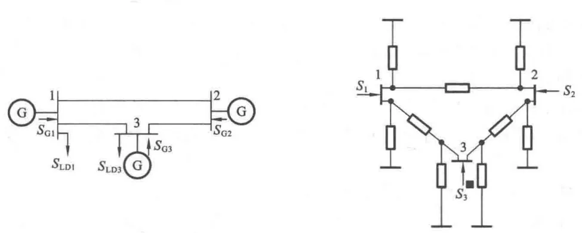
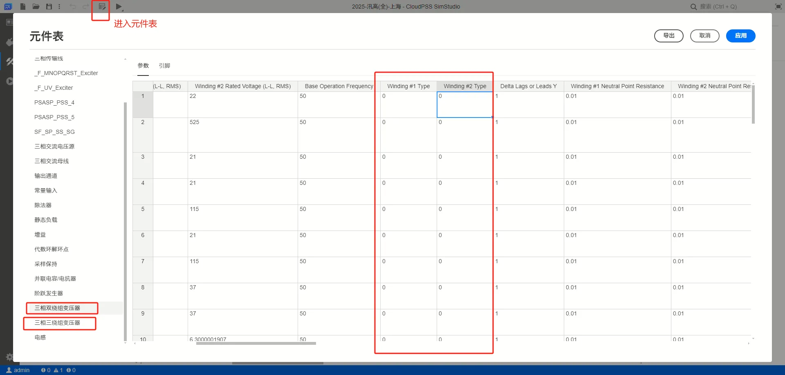

本文档介绍潮流计算的基本概念和 EMTLab 实现潮流计算的基本原理。

## 功能定义
EMTLab 提供的潮流计算功能。

## 功能说明
### 潮流计算基本概念
#### 潮流计算的概念
**潮流**指电力系统中各个节点的电压和各支路的功率的稳态分布，而**潮流计算**是对给定系统运行条件（如各母线上的电压幅值及相角、网络中的功率分布及功率损耗等）计算系统运行状态。潮流计算可以为电磁暂态计算提供系统的初始稳态计算条件，也是研究电流系统规划和运行方案的最基本的计算方法。

#### 潮流计算模型
潮流计算的求解基于电路中的节点电压方程 $\dot{\mathbf{I}}_n=\mathbf{Y}_n\dot{\mathbf{U}}_n$ ：节点导纳矩阵 $\mathbf{Y}_n$ 描述了网络中的元件特性约束和网络拓扑的连接关系，节点电压方程描述了网络中各个节点的电流与电压关系。

但潮流计算的边界条件是复功率，需要建立功率与电压之间的关系，即功率方程（潮流方程）。可以将节点电流用节点功率和电压表示：

$$
\dot{I}_i=\frac{S_i^*}{U_i^*}=\frac{P_i-\mathrm{j}Q_i}{U_i^*}
$$

将电流表达式带入节点电压方程，可得到潮流方程：

$$
P_i-jQ_i=U_i^*\sum_{j=1}^nY_{ij}\dot{U}_j\left(i=1,2,\cdots,n\right)
$$

令 $Y_{ij}=G_{ij}+\mathrm{j}B_{ij}$，$\dot{U}_i=U_i\angle\delta_i=U_ie^{\mathrm{j}\delta i}$，带入潮流方程，将潮流方程用极坐标进行表示：

$$
\begin{aligned}
P_{i}-\mathrm{j}Q_{i}& =U_ie^{-\mathrm{j}\delta i}\sum_{j=1}^n\Bigl(G_{ij}+\mathrm{j}B_{ij}\Bigr)U_je^{\mathrm{j}\delta j}  \\
&=U_i\sum_{j=1}^nU_j\left(G_{ij}+\mathrm{j}B_{ij}\right)e^{-\mathrm{j}\delta ij}\\
&=U_i\sum_{j=1}^nU_j(G_{ij}+jB_{ij})(\cos\delta_{ij}+j\sin\delta_{ij})
\end{aligned}
$$

将实部虚部分开，得到潮流计算中的求解方程：

$$
\begin{cases}P_i=U_i\sum_{j=1}^nU_j(G_{ij}\cos\delta_{ij}+B_{ij}\sin\delta_{ij})\\
\\Q_i=U_i\sum_{j=1}^nU_j(G_{ij}\sin\delta_{ij}-B_{ij}\cos\delta_{ij})\end{cases}
$$

从以上分析可以看出，一个节点包含 4 个运行变量（$P$, $Q$, $U$, $\delta$），对应了 2 个方程。那么对 n 个节点的系统有 4n 个变量，2n 个方程，若每个节点给定 2 个变量值，可通过方程求解剩余的 2n 个未知量。

通过不同的节点变量给定方式，电力系统节点可分为 PQ、PV 和平衡节点
- PQ 节点：节点的有功功率 $P$ 和无功功率 $Q$ 是给定的，节点电压 $U$, $\delta$ 是待求量。
- PV 节点：节点的有功功率 $P$ 和电压幅值 $U$ 是给定的，节点的无功功率 $Q$ 和电压的相位 $\delta$ 是待求量。
- 平衡节点：由于全系统功率必须平衡，功率损耗 $P_{loss}$、$Q_{loss}$ 是状态变量的函数，事先未知。需要一个节点 $P$ 和 $Q$ 不能给定，给定 $U$，$\delta$ 的节点，用于全系统功率平衡，故称为平衡节点。

由于潮流计算方程是一个非线性方程组，直接求解非常困难，在计算机求解中会使用牛顿-拉夫逊法进行求解。

### 潮流计算基本原理
#### 牛顿-拉夫逊法求解潮流

 基于牛顿-拉夫逊的潮流算法的基本步骤可以总结如下：
- 形成节点导纳矩阵；
- 给各节点电压相角赋初值；
- 给各节点电压相角代入式 2、式 3，求出修正方程式的常数项向量；  
- 将节点电压相角带入式 5、式 6，求出雅可比矩阵元素； 
- 求解方程式 7，求节点各相电压相角修正向量；
- 根据式 8，求取节点电压的新值；
- 检查是否收敛，如不收敛，则以各节点电压的新值作为初值自第 3 步重新开始进行下一次迭代，否则转入下一步；
- 计算支路功率分布，PV 节点无功功率和平衡节点注入功率。  

**计算功率不平衡列向量**
$$
\Delta S = {[\Delta P,\Delta Q]^T}{\rm{ = }}{[\Delta {P_1},...,\Delta {P_{{\rm{n - }}1}},{\kern 1pt} \Delta {Q_1},...,\Delta {Q_m},]^T}{\kern 1pt} {\kern 1pt} {\kern 1pt} {\kern 1pt} {\kern 1pt} {\kern 1pt} {\kern 1pt} {\kern 1pt} {\kern 1pt} {\kern 1pt} {\kern 1pt} {\kern 1pt} {\kern 1pt} {\kern 1pt} {\kern 1pt} {\kern 1pt} {\kern 1pt} {\kern 1pt} {\kern 1pt} {\kern 1pt} (1)
$$

式（1）表示了一个有 n 个母线的系统的功率不平衡矩阵，其中有 $m$ 个 PQ 母线，$n-m-1$ 个 PV 母线，1 个平衡母线。   

PQ 母线的功率不平衡量为该节点的功率给定值与用当前电压计算出来的实际功率的偏差，可表示为：

$$
\left\{ \begin{array}{l}
\Delta {P_i} = {P_i} - \left| {{V_i}} \right|\sum\limits_{j = 1}^n {\left| {{V_j}} \right|} ({G_{ij}}\cos {\theta _{ij}} + {B_{ij}}\sin {\theta _{ij}})\\
\Delta {Q_i} = {Q_i} - \left| {{V_i}} \right|\sum\limits_{j = 1}^n {\left| {{V_j}} \right|({G_{ij}}\sin {\theta _{ij}} - {B_{ij}}\cos {\theta _{ij}})} 
\end{array} \right.{\kern 1pt} {\kern 1pt} {\kern 1pt} {\kern 1pt} {\kern 1pt} {\kern 1pt} {\kern 1pt} {\kern 1pt} {\kern 1pt} {\kern 1pt} {\kern 1pt} {\kern 1pt} {\kern 1pt} {\kern 1pt} {\kern 1pt} {\kern 1pt} {\kern 1pt} {\kern 1pt} {\kern 1pt} {\kern 1pt} (2)
$$

其中，$i=1,2,...,m.$

PV 节点电压幅值给定，不作为变量。同时，该点无法预先给定无功功率。PV 节点的无功功率不平衡量不作为约束条件，因此，在迭代过程中只列出 PV 节点的**有功功率偏差方程。**

$$
\Delta {P_i} = {P_i} - \left| {{V_i}} \right|\sum\limits_{j = 1}^n {\left| {{V_j}} \right|} ({G_{ij}}\cos {\theta _{ij}} + {B_{ij}}\sin {\theta _{ij}}){\kern 1pt} {\kern 1pt} {\kern 1pt} {\kern 1pt} {\kern 1pt} {\kern 1pt} {\kern 1pt} {\kern 1pt} {\kern 1pt} {\kern 1pt} {\kern 1pt} {\kern 1pt} {\kern 1pt} (3)
$$

其中，$i=1,2,...,n-m-1.$

**计算雅可比矩阵**
$$
J=\begin{bmatrix}
H & N\\ 
J & L\\
\end{bmatrix} {\kern 1pt} (4)
$$

雅可比矩阵的元素如下所示:

非对角元素：

$$
\left. \begin{array}{l}
{H_{ij}} =  - {V_i}{V_j}({G_{ij}}\sin {\theta _{ij}} - {B_{ij}}\sin {\theta _{ij}})\\
{N_{ij}} =  - {V_i}{V_j}({G_{ij}}\cos {\theta _{ij}} + {B_{ij}}\sin {\theta _{ij}})\\
{J_{ij}} = {V_i}{V_j}({G_{ij}}\cos {\theta _{ij}} + {B_{ij}}\sin {\theta _{ij}})\\
{L_{ij}} =  - {V_i}{V_j}({G_{ij}}\sin {\theta _{ij}} - {B_{ij}}\cos {\theta _{ij}})
\end{array} \right\}{\kern 1pt} {\kern 1pt} {\kern 1pt} {\kern 1pt} {\kern 1pt} {\kern 1pt} {\kern 1pt} {\kern 1pt} {\kern 1pt} {\kern 1pt} {\kern 1pt} {\kern 1pt} {\kern 1pt} (5)
$$

对角元素：

$$
\left. \begin{array}{l}
{H_{ii}} = {Q_{\rm{i}}} + {B_{ii}}V_i^2\\
{N_{ii}} =  - {P_{\rm{i}}} - {G_{ii}}V_i^2\\
{J_{ii}} =  - {P_{\rm{i}}} + {G_{ii}}V_i^2\\
{L_{ii}} =  - {Q_{\rm{i}}} + {B_{ii}}V_i^2
\end{array} \right\}{\kern 1pt} {\kern 1pt} {\kern 1pt} {\kern 1pt} {\kern 1pt} {\kern 1pt} {\kern 1pt} {\kern 1pt} (6)
$$

**基于牛顿-拉夫逊的潮流算法**  

$$
\begin{bmatrix}
{\Delta P}\\ 
{\Delta Q}\\
\end{bmatrix}=\begin{bmatrix}
H & N\\ 
J & L\\
\end{bmatrix}\begin{bmatrix}
{\Delta \theta }\\
{{V^{ - 1}}\Delta V}
\end{bmatrix} {\kern 1pt} {\kern 1pt} {\kern 1pt} {\kern 1pt} {\kern 1pt} {\kern 1pt} {\kern 1pt} {\kern 1pt} {\kern 1pt} {\kern 1pt} {\kern 1pt} {\kern 1pt} (7)
$$

其中 $\Delta V$ 为节点电压幅值的修正量：

由上式可求得第 k + 1 次迭代的修正量：

$$
\begin{bmatrix}
{{\theta ^{(k + 1)}}}\\
{{V^{(k + 1)}}}
\end{bmatrix}=\begin{bmatrix}
{{\theta ^{(k)}}}\\
{{V^{(k)}}}
\end{bmatrix}\begin{bmatrix}
{\Delta {\theta ^{(k + 1)}}}\\
{\Delta {V^{(k + 1)}}}
\end{bmatrix} {\kern 1pt} {\kern 1pt} {\kern 1pt} {\kern 1pt} {\kern 1pt} {\kern 1pt} {\kern 1pt} {\kern 1pt} {\kern 1pt} {\kern 1pt} {\kern 1pt} {\kern 1pt} (8)
$$

这样反复迭代计算，直至所有节点 $\Delta V < \varepsilon$ 和 $\Delta \theta<n$ 为止。

## 常见问题
有哪些常见的潮流仿真报错信息

:
  - 缺少 PV 节点或平衡节点，报错码为： `Buses xxx, and xxx are isolated, with neither a slack bus nor a PV bus found in this area.`
  - 母线间短路，报错码为：`xxx is a short circuit. Try eliminating it.`
  - 元件连接了非母线节点，报错码为：`Pin Pin - of xxx is connected to a non-bus node.`

如果潮流不收敛该如何排查

:
   - 首先根据潮流仿真报错信息检查相应的元件；
   - 如果是 PSASP 转换的算例（[PSASP-CloudPSS 算例转换工具](../../../../software-tools/10-conversion-tools/20-psasp-to-cloudpss/index.md)），并且 PSASP 原算例中含有 Y-D 变压器，可能会出现由于相角问题导致的潮流计算问题，可用以下任意一种方法进行处理：
     - 在计算方案的调试参数中填入 `PF_SKIP_PRE_OFFSET=1`；
     - 在 PSASP-CloudPSS 算例转换时，勾选**变压器强制 Y(G) 接**选项；
     - 在**实现标签页**中点击**元件表**，将三相双绕组变压器和三相三绕组变压器的 `Winding#1 Type` 和 `Winding#2 Type` 均设为 0。

      

     

   - 如果是 BPA 或 PSASP 转换的算例，并且原算例中已有潮流数据，那么可以使用潮流计算方案中的 [功率不平衡量计算](../50-case-study/index.md)，通过功率不平衡量计算得到的表格进行检查，具体检查方法与下点说明的检查方法相同。
   - 通过潮流计算结果表格进行检查（[潮流数据说明](../30-initializing-from-power-flow-results/index.md#潮流数据说明)）：`Buses` 表格的 $P_{res}$ 参数按正序或负序排序，如有大于 10 或小于 -10 的参数，检查连接该母线的同步发电机、三相交流电压源、静态负载、变压器等元件的容量、电压等参数是否设置合理，`Branches` 表格的 $P_{loss}$ 参数按正序或负序排序，如有大于 50 或小于 -50 的参数，检查该元件的容量是否设置的太小。