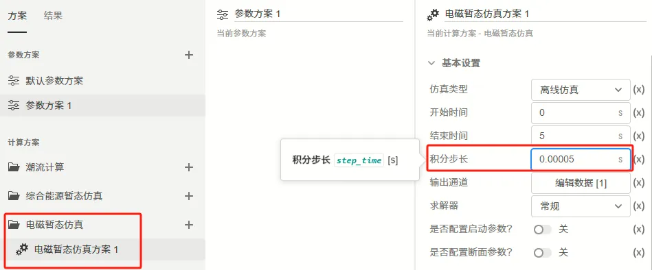
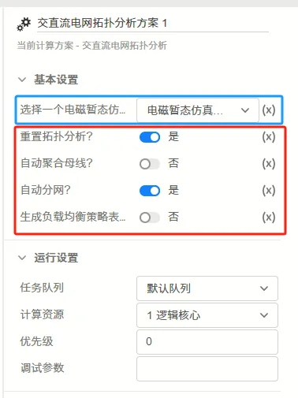
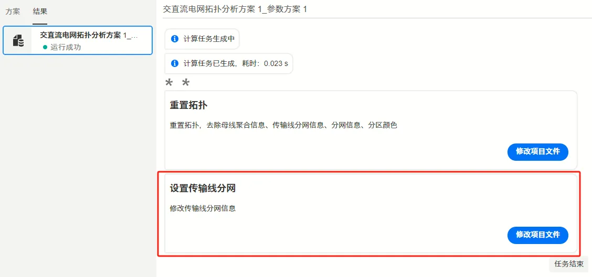
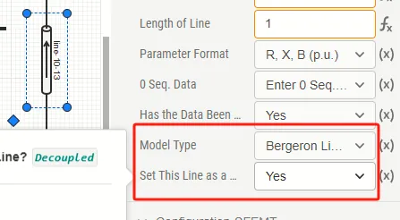
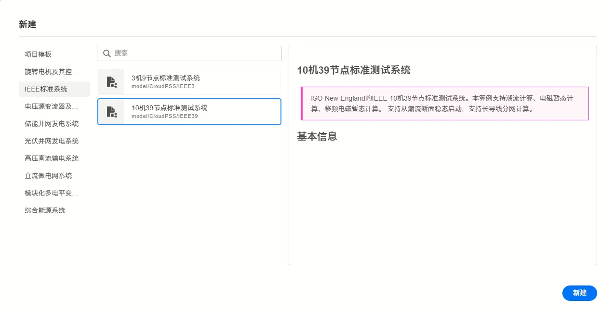
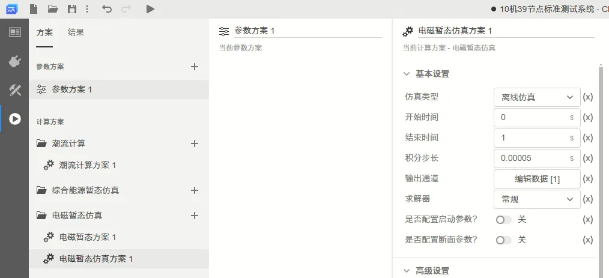
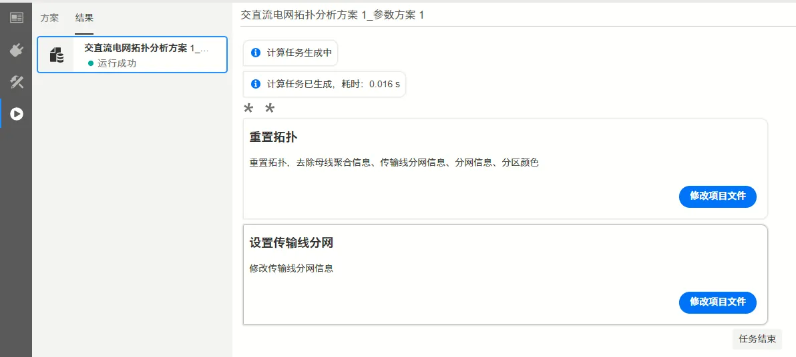

交直流拓扑分析主要用于交直流电网的电磁暂态仿真效率优化，包括分网功能、自动聚合母线、负载均衡三个功能。

其中，分网功能和负载均衡功能需结合[电磁暂态仿真并行加速](../70-parallel-acceleration/index.md)进行使用，电磁暂态仿真的并行加速需要先行调用本节介绍的拓扑分析。需要注意公网(www.cloudpss.net)的用户无法使用该功能。

本节介绍拓扑分析功能的基本原理以及配置方法，并使用模板算例进行演示。

## 功能定义

拓扑分析功能主要用于交直流电网的电磁暂态仿真效率优化，包括分网功能、自动聚合母线、负载均衡三个功能。

其中，分网功能和负载均衡功能需结合[电磁暂态仿真并行加速](../70-parallel-acceleration/index.md)进行使用。

## 功能说明

### 分网功能

自动分网功能主要用于切分电网拓扑，以长传输线为解耦点，将大型输电网分解为若干分区。

分网功能为分网并行计算的前序处理，在完成了分网分区后，可将不同分区放置于不同的处理器核心中，加速仿真计算。

如果需要详细配置各处理器核心放置的分区，请参考[负载均衡配置](#负载均衡配置)部分。

#### 分网功能原理

<!-- 基于Bergeron传输线接口的分网并行的原理请参考[并行仿真基本原理](../70-parallel-acceleration/10-fundamentals/index.md)。 -->

值得注意的是，Bergeron传输线模型要求，波在传输线上的传输时间应**大于或等于仿真步长**，即：

$$
\tau_1=d\sqrt{L_1C_1}\tag{1}
$$

$$
\tau_0=d\sqrt{L_0C_0}\tag{2}
$$

$$
\tau_1\geq\Delta t, \tau_0\geq\Delta t\tag{3}
$$

其中，$\tau_1$为正序、负序波传输时间，$\tau_0$为零序波传输时间，$L_1$, $C_1$, $L_0$, $C_0$为正负序和零序的单位长度电感和电容，$\Delta t$为仿真步长。

因此，当确认了电磁暂态的仿真步长$\Delta t$后，只有部分传输线满足Bergeron建模方式的条件，也只有部分传输线可以作为分网的接口。

这里的分网功能的目的就是找出这些传输线，并将其设置为Bergeron分网接口。

#### 分网功能参数配置

首先，在创建分网功能参数之前，应该先创建一个[电磁暂态仿真方案](../50-emts/20-job-config/index.md)，并设置好```积分步长```。对于交直流电网的仿真，通常可将```积分步长```设为0.00005s。



然后，点击```交直流电网拓扑分析方案```处的```+```号，创建交直流电网拓扑分析方案：


在交直流电网拓扑分析方案中，共有1个电磁暂态计算方案选择栏（下图中蓝色框）和4个功能配置开关（下图中红色框）：



用户需要在电磁暂态计算方案选择栏的下拉框中，选中刚才创建的```电磁暂态仿真方案```，然后在功能配置开关中，打开第三个开关（```自动分网```）。用户只需要配置```基本设置```中的参数，而```运行设置```中的参数按上图进行配置即可，即采用1逻辑核心进行分网运算。

在配置好参数后，点击```启动任务```按钮或使用快捷键```ctrl+R```开始交直流电网拓扑分析计算。完成计算后，结果页面中将出现图4中红框所示的卡片：



点击**设置传输线分网**即可将分网结果写回到模型中。具体而言，所有满足公式$(3)$所示分网要求的传输线将自动设置参数```ModelType```值为1，参数```Decoupled```值为1，如下图所示：



此外，如果需要恢复分网之前的结果，需要在**图3**所示的基本设置中，启用```重置拓扑分析```开关，并在**图4**所示的拓扑分析方案计算结果中，在**重置拓扑**的结果卡中点击```修改项目文件```，即可将所有图5所示的传输线```Decoupled```参数重设到0，即不分网的传输线模型。

注意，重置拓扑时，不会重设传输线类型```ModelType```，即不会修改传输线建模方式是Pi型还是Bergeron型。

### 自动聚合母线
自动聚合母线功能可将电网中的悬空母线进行聚合，可以进一步提高仿真效率。具体可参见[自动聚合母线](./10-bus-merging/index.md)

### 负载均衡配置

负载均衡配置功能可在分网拓扑分析的同时，生成```负载均衡配置策略表```。该策略表定义了每个计算逻辑核心中分配的元件分区，具体可参见[负载均衡配置](./20-load-balancing/index.md)

用户可进一步在并行仿真中修改该策略表，具体可见[并行计算高级参数设置](../70-parallel-acceleration/20-advanced-param-setup/index.md#更多高级设置)。

## 案例

import Tabs from '@theme/Tabs';
import TabItem from '@theme/TabItem';

<Tabs>
<TabItem value="case1" label="10机39节点系统分网并行">

进入Simstudio工作台，点击```新建```按钮，从模板中选择```10机39节点标准测试系统```创建新算例。



在创建的算例中，进入```运行```标签页，创建一个新的```电磁暂态仿真```计算方案，设置仿真步长为0.00005秒，如下图所示：


再创建一个```交直流拓扑分析```计算方案，在```选择一个电磁暂态仿真方案```栏选中刚才创建的**电磁暂态仿真方案1**，并勾选```重置拓扑分析```和```自动分网```两个开关，如下图所示。


点击```启动任务```或使用快捷键```ctrl+R```，开始交直流拓扑分析任务。完成后，返回的结果卡片如下：



点击```设置传输线分网```卡的```修改项目文件```按钮后，回到[实现标签页](../40-simstudio/20-workbench/20-function-zone/30-design-tab/index.md)中，打开 [元件表](../40-simstudio/20-workbench/10-toolbar/index.md#元件表)，找到```三相传输线```，可以看到所有符合分网要求的传输线已设置```ModelType=1```, ```Decoupled=1```，如下图所示。


用户可进一步参考见[并行计算方案配置案例介绍](../70-parallel-acceleration/20-advanced-param-setup/index.md#案例介绍)文档，进行进一步的并行仿真计算设置。


</TabItem>
</Tabs>


## 常见问题
为什么在分网后，线路的模型没有发生改变？
:
    可能是线路的传输时间不满足$\tau_1\geq\Delta t, \tau_0\geq\Delta t$，导致拓扑分析程序判定传输线无法设定为分网Bergeron模型。可以检查以下两个方面：
    - 线路的正序以及零序电抗X、电纳B参数是否过小。
    - 线路的长度是否过短。
    - 选定的电磁暂态仿真方案的仿真步长$\Delta t$是否过小。

为什么在分网后，仿真效率没有提高？ 
:
    拓扑分析功能需要搭配多核并行加速的算法实现仿真效率的提高，具体请参考[电磁暂态仿真并行计算高级参数设置](../70-parallel-acceleration/20-advanced-param-setup/index.md)进行配置。
    
    除时域分析之外，风电接入宽频振荡问题更依赖于频域的阻抗分析。
    针对阻抗特性扫描需求，开发了基于电磁暂态仿真的面向大规模交直流电网的端口阻抗特性扫描模块，用户可针对不同需求可设置不同频率采样方式，在保证精度的同时提升效率。
    