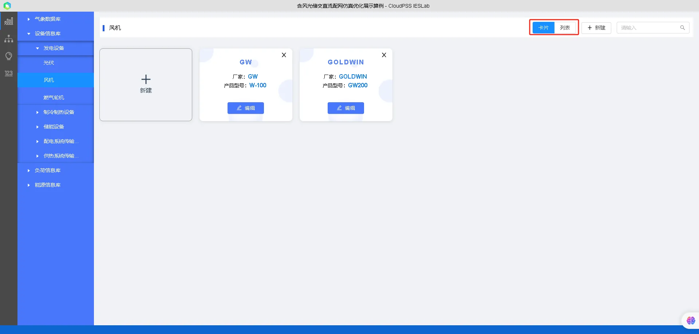
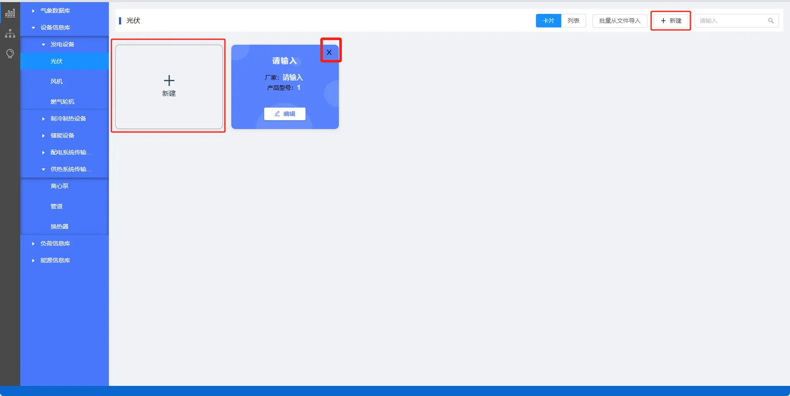
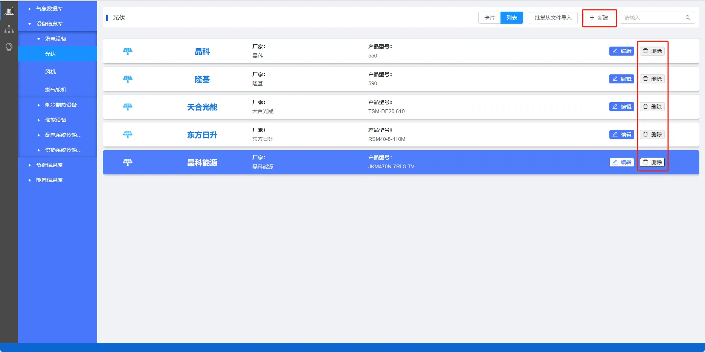
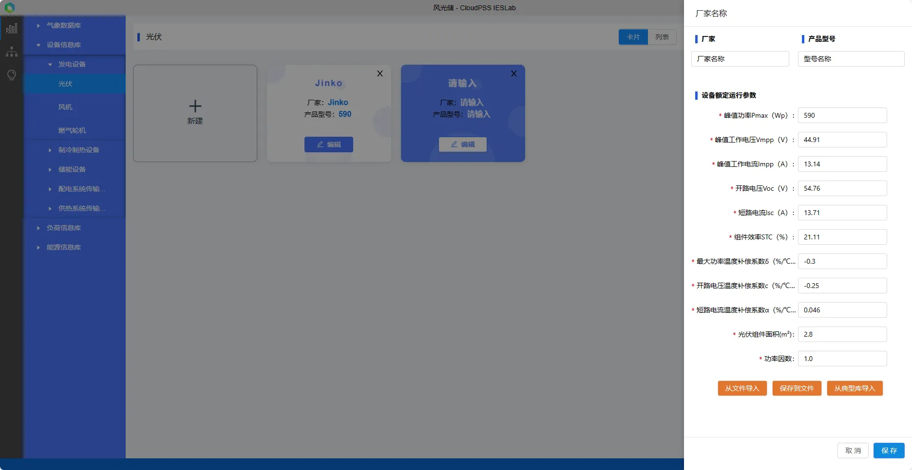
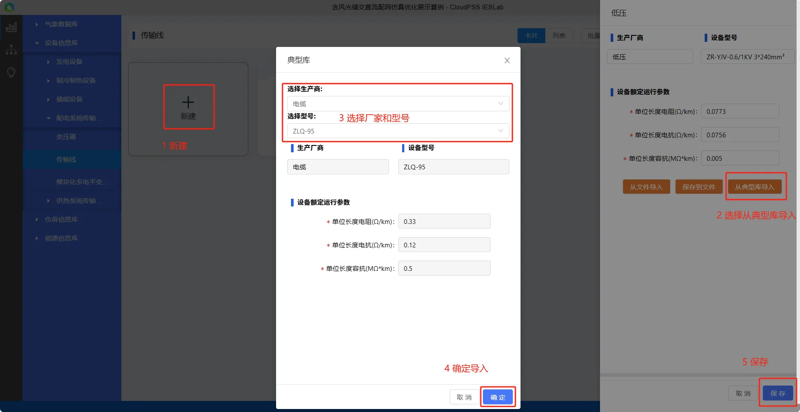

本节主要介绍设备信息库的设备参数录入、编辑、导入及导出等功能使用方法，并对使用过程中遇到的常见问题进行解答。

## 功能定义

该功能主要用于录入目标综合能源系统中所使用的不同型号设备的**额定参数**（比如性能曲线、经济性参数、设备运行约束等，运行边界条件不包括在内），并进行分类管理。这些参数将用于后续拓扑建模时与元件的**设备待选类型**参数进行绑定，同一型号的设备参数可以绑定至多个元件的对应参数上，从而实现设备额定参数数据的复用，简化用户输入。

## 功能说明

### 设备分类

设备信息库中将所有综合能源设备分为发电设备、制冷制热设备、储能设备、配电系统传输设备和供热系统传输设备5类：

| 大类设备 | 子类设备 |
| :--- | :--- |
| 发电设备 | 风机、光伏、燃气轮机 |
| 制冷制热设备 | 燃气锅炉、热泵、热管式太阳能集热器、电压缩制冷机、吸收式制冷机 |
| 储能设备 | 储热水罐、蓄电池 |
| 配电系统传输设备 | 变压器、模块化多电平换流器MMC、传输线 |
| 供热系统传输设备 | 离心泵、管道 |

### 设备管理

打开设备信息库并选择特定子类设备后，进入该类设备的管理页面。默认的显示模式为**卡片模式**，可通过右上方的按钮切换至**列表**模式。

#### 新建与删除

点击右上方的**新建**按钮（**卡片**模式下还可以点击下图中的**新建**卡片），会自动创建一个新的可选设备并弹出设备参数编辑框。如果需要删除设备，在卡片模式下可点击卡片右上角的“**×**”，在列表模式下可点击列表右侧的**删除**按钮，即可进行删除。

#### 设备搜索与筛选

在页面右上方的**搜索输入框**，在输入框中输入厂家、型号等任意关键字，点击放大镜🔍或回车确定，即可进行模糊搜索或筛选（关键字不区分大小写）。清空输入框后，点击放大镜**🔍**或回车确定可显示所有设备。

#### 设备参数编辑

在卡片模式下，点击设备所在的卡片或者**编辑**按钮；在列表模式下点击设备所在的行或**编辑**，即可编辑设备参数信息。

在编辑区域下方有**从文件导入**、**保存到文件**和**从典型库导入**按钮：

1. 点击**保存到文件**会将该设备相关参数另存为 excel 文件。
2. 点击**从文件导入**将会弹出文件选择框，选择相应类别及种类的设备参数excel文件后，平台将会自动校验文件格式，若格式无误会覆盖原设备参数，若格式有误将会提示**表格格式不正确!**。
:::info
用户可以先**保存到文件**，参照导出文件的格式进行修改，再进行**从文件导入**。
:::
3. 点击**从典型库导入**按钮，在弹出的**典型库**对话框中，选择厂商和型号后会自动显示设备参数信息，点击**确定**后，将会**覆盖**当前设备参数。

在完成参数编辑后，点击**保存**完成修改并保存；点击**取消**则放弃修改；点击非编辑区域的左侧空白阴影区域，则会弹出是否保存的确认提示。

## 案例

import Tabs from '@theme/Tabs';
import TabItem from '@theme/TabItem';

<Tabs>
<TabItem value="js" label="案例1">

以典型项目[**含风光储交直流配网仿真项目**中电源设备的**光伏系统**为例，说明设备信息库的用法。

1. 点击“新建”后，输入**厂家和产品型号**名称。

2. 录入设备额定参数
录入最关键的**设备额定运行参数**，额定参数作为设备模型最重要的参数，参与设备出力计算，直接影响设备的性能及系统运行。您可以联系厂家提供相关参数。
对于光伏系统来说，主要参数有：  
   - 峰值功率Pmax（Wp）  
   - 峰值工作电压Vmpp（V）  
   - 峰值工作电流Impp（A）  
   - 开路电压Voc（V）  
   - 短路电流Isc（A）  
   - 组件效率STC（%）  
   - 开路电压温度补偿系数c（%/$^{\circ}$C）  
   - 短路电流温度补偿系数α（%/$^{\circ}$C）  

3. 确认参数并保存
</TabItem>

<TabItem value="c" label="案例2">

以典型项目**含风光储交直流配网仿真项目**中配电系统传输设备的**传输线**为例，说明从典型库导入设备的方法。

1. 点击“新建”，创建新的设备卡片。

2. 从典型库导入
   参数编辑区域右下角选择**从典型库导入**，在弹出框中选择**厂家和型号**，检查参数无误后点击**确定**，覆盖当前设备参数。
   

3. 确认参数并保存
</TabItem>
</Tabs>

## 项目文件下载
 
[含风光储交直流配网仿真项目](../../80-typical-cases/30-ac-dc-hybrid-distribution-system-with-renewables/ac-dc-hybrid-distribution-system-with-renewables.zip)  
[光伏系统-设备参数文件](./PV-JKM590N.xlsx)  
[传输线-设备参数文件](./distribution-line.xlsx)

## 常见问题

设备参数从哪里可以找到呢？  
:    IESLab 平台元件采用主流的稳态简化模型，其设备参数可以从设备厂家官网查找，若设备实际参数过多较为复杂，可进行适当简化以匹配平台模型参数。

平台支持辅机设备吗？  
:    IESLab 平台均采用为简化后的设备模型，包含主辅机系统，一般无需另外建立辅机模型。

平台模型具备通用吗，支持子类设备模型吗？  
:    综合能源系统设备模型建模方式多种多样，设备本身的特性也纷繁复杂。IESLab 平台的设备主要关注**能量流的变化和转换**过程，主要建立能量转换的**通用简化模型**。暂未按照其子特征建立详细的子类模型，如热泵和吸收式制冷机等均为通用的模型，并未按照其热源（驱动源）分类，因此土壤源热泵、水源热泵、空气源热泵均采用通用的热泵模型，均未根据其热源不同，建立不同的换热模型；烟气型溴化锂机组、热水型溴化锂机组、蒸汽型溴化锂机组和烟气热水型溴化锂机组均采用通用的冷热能量转换的吸收式制冷机组模型，并未建立不同工质的物料及换热模型。
    
能否修改设备典型库？  
:   CloudPSS IESLab 官网的典型库不支持修改，对于服务器版本，管理员账户可以修改典型库，修改后该服务器下所有用户即可导入。