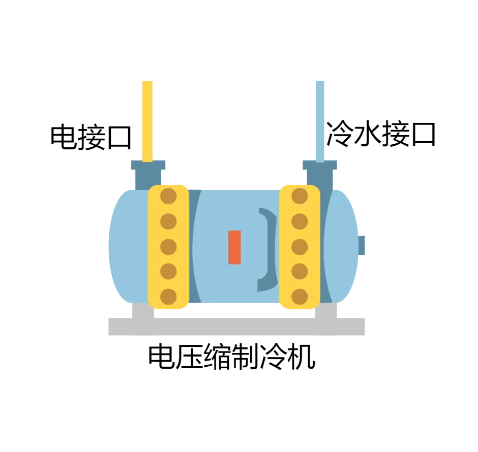

## 元件定义

该元件指电压缩制冷机的设备设施，电压缩制冷机组是指**依靠压缩机提高制冷剂的压力**以实现制冷循环的制冷机。依靠压缩机提高制冷剂的压力以实现制冷循环的制冷机。按所用制冷剂的种类不同，压缩式制冷机分为气体压缩式制冷机和蒸气压缩式制冷机两类。蒸气压缩式制冷机又有氨制冷机和氟利昂制冷机等。气体压缩式制冷机又分为空气制冷机和氦气制冷机等。按所用压缩机种类不同，压缩式制冷机又分为往复式制冷机、离心式制冷机和回转式制冷机（螺杆式制冷机、滚动转子式制冷机）等。蒸汽压缩式制冷机按其系统组成不同分为单级、多级（两级或三级）和复叠式等。

以气体压缩式制冷机为例，压缩机以气体为制冷剂，由压缩机、冷凝器、回热器、膨胀机和冷箱等组成。经压缩机压缩的气体先在冷凝器中被冷却，向冷却水（或空气）放出热量，然后流经回热器被返流气体进一步冷却，并进入膨胀机绝热膨胀，压缩气体的压力和温度同时下降。气体在膨胀机中膨胀时对外作功，成为压缩机输入功的一部分。同时膨胀后的气体进入冷箱，吸取被冷却物体的热量，即达到制冷的目的。此后，气体返流经过回热器，同压缩气体进行热交换后又进入压缩机中被压缩。气体制冷机都应采用回热器，这不但能提高制冷机的经济性而且可以降低膨胀机前压缩气体的温度，因而降低制冷温度。

对不同种类的电压缩制冷机来说，都是通过**消耗电能来制冷**，并未对不同类型的制冷机进行建模，而是采用通用模型，其数学模型如下：

水力模型：  
$$
\Delta p = p_{in} - p_{out} = k \cdot m \cdot |m| / \rho^{2}
$$  
热力模型：  
$$
P \cdot cop = m(h_{in}-h_{out})
$$  
式中 $\Delta p$ 是进出口压差（$\mathrm{kPa}$），$p_{in}$、$p_{out}$ 分别为流体进出口压力（$\mathrm{kPa}$），$k$ 是局部压降系数（$\mathrm{kPa/(m^3 \cdot s^{-1})^2}$）, $m$ 是质量流量（$\mathrm{kg/s}$），$\rho$ 是密度（$\mathrm{kg/m^3}$），$P$ 是额定用电功率（$\mathrm{kW}$），$cop$ 是性能系数，$h_{in}$、$h_{out}$ 分别为工质的进出口比焓（$\mathrm{kJ/kg}$）。

## 元件说明

元件参数标签页包括**属性**、**参数**、**引脚**三类参数，下面对每类参数进行详细说明。

### 属性

CloudPSS 提供了一套统一的元件属性功能，关于元件属性参数的配置，详见 [参数卡](docs/documents/software/10-xstudio/20-simstudio/40-workbench/20-function-zone/30-design-tab/30-param-panel/index.md) 页面。

### 参数

#### 设备参数

| 参数名 | 键值 (key) | 单位 | 备注 | 类型 | 描述 |
| :--- | :--- | :--- | :--: | :--- | :--- |
| 生产厂商 | `manufacturer` |  | 生产厂商 | 文本 | 生产厂商 |
| 设备型号 | `equipType` |  | 设备型号 | 文本 | 设备型号 |
| 局部压降系数 | `LocalPressureDropCoe` | $\mathrm{kPa/(m^3 \cdot s^{-1})^2}$ | 局部压降系数 | 实数 | 局部压降系数 |
| 功率因数 | `PowerFactor` |  | 功率因数 | 实数 | 功率因数，范围为 0-1，一般在 0.9-1 |
| 设备工况 | `OperateParam` |  | 设备工况 | 表格 | 设备多挡位变工况运行参数，为表格，分别录入不同挡位的**性能系数**:`COP`;**制冷功率**  `CoolSupply` |
| 最小供水温度 | `MiniOutletTemp` | ℃ | 最小供水温度 | 实数 | 最小供水温度，运行约束参数在计算时不生效，无意义 |
| 最大供水温度 | `MaxOutletTemp` | ℃ | 最大供水温度 | 实数 | 最大供水温度，运行约束参数在计算时不生效，无意义 |

#### 基础参数

| 参数名 | 键值 (key) | 单位 | 备注 | 类型 | 描述 |
| :--- | :--- | :--- | :--: | :--- | :--- |
| 元件名称 | `CompName` |  | 元件名称 | 文本 | 元件名称 |
| 元件类型 | `CompType` |  | 选择元件类型 | 选择 | 选择**交流元件**时为交流电，选择**直流元件**时为直流电|
| 设备配置台数 | `DeivceNumber` | 台 | 设备配置台数 | 自然数 | 设备配置台数 |
| 待选设备类型 | `DeviceSelection` |  | 从设备库中选择设备类型 | 选择 | **选择数据管理模块录入的设备型号**，的厂家、产品型号、额定运行参数自动绑定为对应设备在数据管理模块中录入的参数。|

#### 仿真参数

在仿真参数中编辑设备的仿真边界条件，主要包含**运行方式**和**运行策略曲线**。

| 参数名 | 键值 (key)  | 单位 | 备注 | 类型 | 描述 |
| :--- | :--- | :--- | :--: | :--- | :--- |
| 出力模式 | `SettingParaType` |  | 选择运行模式 | 选择 | 在输入仿真运行策略前需要指定设备运行模式。有**温度**和**功率**两种模式。若选择**温度**模式，则设备出力根据系统计算得到。若选择**功率**模式，设备出力为用户指定功率，进出口温度根据热功率和流量计算得到。|
| 温度模式运行策略 | `OutletTemp` |  | 配置设备在不同时刻的运行温度 | 表格 | 仅当**出力模式**项为温度模式时生效，在表格中录入**各个时间段对应的出口温度**。 **开始时间**对应每个仿真时刻，**供水温度**为设备出口温度。|
| 功率模式运行策略 | `CoolSupply` |  | 配置设备在不同时刻的功率 | 表格 | 仅当**出力模式**项为功率模式时生效，在表格中录入**各个时间段对应的设备运行策略**。 **开始时间**对应每个仿真时刻，**设备启停运行策略**为设备运行挡位和运行台数的组合，注意设备运行总台数不能超过设备配置台数。|

#### 优化参数

在优化参数中编辑优化条件。

| 参数名 | 键值 (key)  | 单位 | 备注 | 类型 | 描述 |
| :--- | :--- | :--- | :--: | :--- | :--- |
| 是否优化该设备 | `OptimizationChoice` |  | 是否元件的运行方式进行优化 | 选择 | 选择**是**，则设备的运行策略由系统优化得到，不读取仿真参数中设置的运行模式和运行策略；选择**否**，则系统按照仿真参数的运行模式和运行策略运行。|

### 引脚

引脚用于将元件与其他电设备连接，支持**线连接**和**信号名**的连接方式。

引脚的**名称、键值、维度、定义描述**的详细说明如下表所示。

| 引脚名 | 键值 (key)  | 维度 | 描述 |
| :--- | :--: | :--- | :--- |
| 电接口 | `DC/AC` | 1×1 | 可以在引脚处输入相同的字符使得元件与其他电元件相连，当基础参数**元件类型**项是**直流元件**时，键值为**DC**；**元件类型**项是**交流元件**时，键值为**AC**。|
| 水入口 | `Inlet` | 1×1 | 可以在引脚处输入相同的字符使得设备与其他电元件相连|
| 水出口 | `Outlet` | 1×1 | 可以在引脚处输入相同的字符使得设备与其他电元件相连|

## 常见问题

元件模型是否具有代表性？

:   IESLab 平台的设备主要关注**能量流的变化和转换**过程，主要建立能量转换的**通用简化模型**。暂未按照其子特征建立详细的子类模型。

能否优化模型，提升精度？
:   有提升模型精度的计划，建立电压缩制冷机的 COP（Coefficient of Performance，性能系数）与冷却水温度、冷冻水温度、环境温度、负载率等参数的关系模型。

设备的串并联模式有何不同？
:   1. 当设备配置多台时，默认为并联，所有设备型号相同，各支路局部阻力均相同，局部压降相同，各支路流量相同。
:   2. 当不同设备并联时，各支路局部压降相同，总流量为各支路流量之和。
:   3. 当不同设备串联时，各支路流量相同，总局部压降为各设备段的局部压降之和。

电压缩制冷机的交直流元件有什么区别？

:   选择交流时为交流电，选择直流时为直流电
    在能量流计算过程中均为 PQ 节点。

    注意，交流元件和直流元件不能直接相连。

电压缩制冷机元件在建模仿真平台使用时需要配置哪些元件参数？数据管理模块需要配置哪些数据？

:   在对电压缩制冷机元件进行仿真模拟前，务必录入编辑元件的**基础参数**和**仿真参数**；

    在数据管理模块需要配置**电压缩制冷机**的**额定运行参数**。并在基础参数中绑定数据管理模块的电压缩制冷机。

电压缩制冷机元件的运行方式有哪几种配置方式？

:   共有 3 种，其中仿真 2 种，运行优化 1 种模式。

:   1. **仿真：供水温度模式**  
        用户已知电压缩制冷机机组的**冷水出口温度**时，**运行模式**设置为**供水温度**，同时**优化参数**选择“否，使用仿真策略”。  
        此时，电压缩制冷机机组**供冷功率**由进出口温度、流量等参数计算得到，由下游需求决定。
        特别注意：设备运行在温度模式时，设备出力完全由系统计算得到，不受设备配置台数和设备挡位等限制        
:   2. **仿真：功率模式**  
        用户已知电压缩制冷机机组供冷功率时，**运行模式**设置为**制冷功率**，同时**优化参数**选择“否，使用仿真策略”。  
        此时，电压缩制冷机机组的进出口温度根据制冷功率和流量等参数计算得到。 
        特别注意：设备运行在功率模式时，设备出力根据运行策略计算得到，受设备配置台数和设备挡位等限制，设备启停运行策略中，设备运行台数超过配置台数之后的策略无效。
:   3. **运行优化**  
        此时电压缩制冷机元件的出力由系统优化计算得到，但是**不读取仿真参数**，需要将**优化参数**的**是否优化该设备**项设置为**是**即可。

温度和功率策略的开始时刻必须和仿真时刻一致吗？

:   **建议保持一致**。若运行策略的开始时刻与仿真时刻不一致，平台会**自动采用插值和外推算法填充**。    特别注意：对于运行策略，在仿真时刻之外的时间段策略，为**前平推和后平推**，即，策略之前的数值始终为策略的第一个值，策略之后的数值始终为策略里最后一个值。