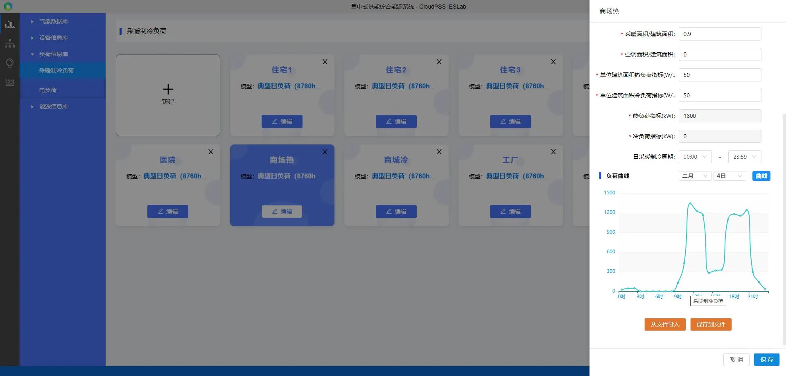
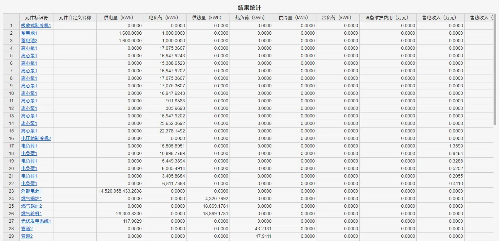
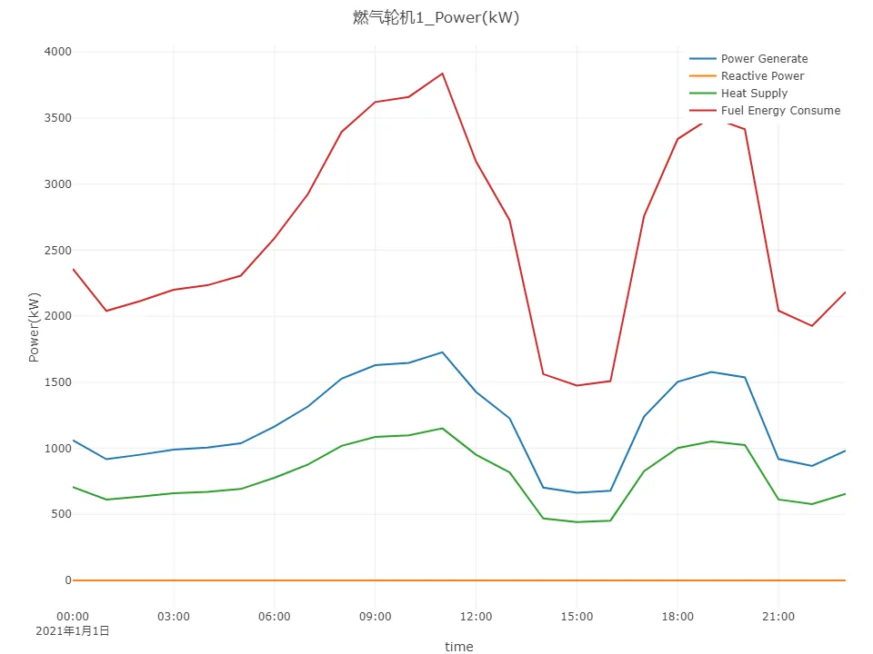
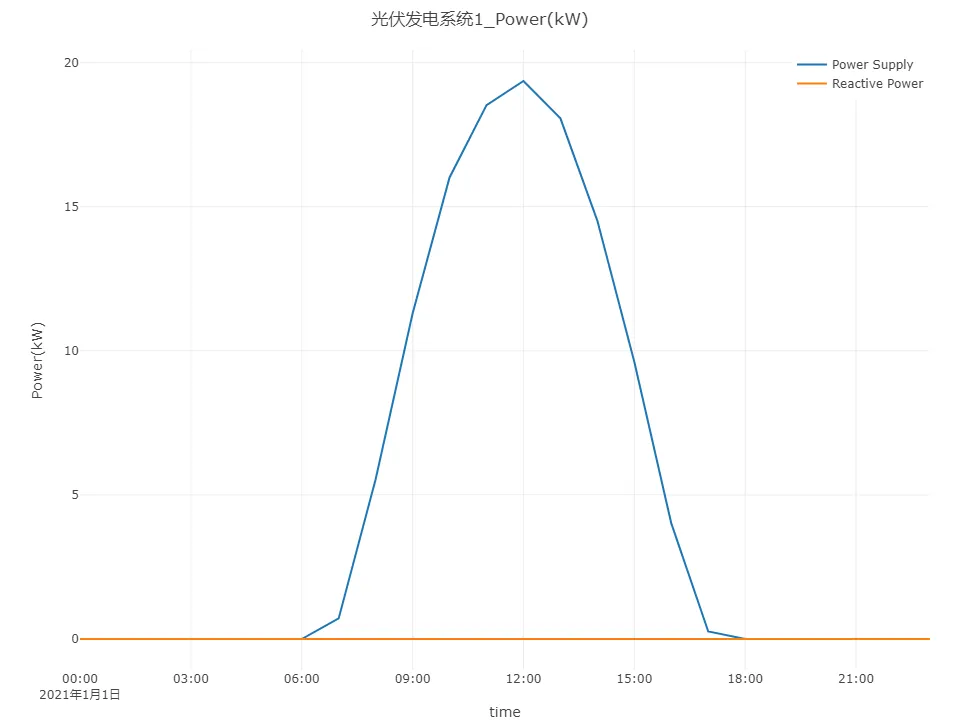

本文主要介绍了分布式供热综合能源系统项目的项目背景、搭建方法和结果分析。

## 项目文件下载
点击下载项目 zip 文件：[**集中式供热的综合能源系统**](./ies-with-centralized-heating.zip)  
项目 zip 文件可以通过**云空间**的项目**导入与导出**功能进行上传，可参考[云空间 - 导入与导出](../../30-cloud-space/index.md#导入与导出)

## 模型描述

选取某集中式综合能源系统作为建模仿真的研究对象，系统中有一个110千伏变电站，变电站探索“多站融合”的模式，即“变电站+分布式能源站+数据中心、充换电站、储能站、基站、屋顶光伏”。主要设备包括可再生能源发电设备（光伏和风电）、蓄电池、燃气轮机、吸收式制冷机、燃气锅炉、电压缩制冷机、变压器、输电线路，并和公共电网连通，集中式与分布式供热综合能源系统的主要区别在于集中式系统中，供热统一由燃气轮机和燃气锅炉提供。系统结构拓扑如下图所示：

*模型拓扑结构图如下：*

## 模型参数及边界条件

1. 载入气象参数，如典型日光照辐射强度参数
2. 输入设备额定参数
3. 输入典型日电、热、冷负荷参数
4. 输入各设备的运行策略

负荷参数

系统负荷主要有电负荷、冬季供暖负荷和夏季制冷负荷，以某负荷用户为例，其典型日下的负荷数据如下表所示：

*电负荷：*

*热负荷：*

## 结果分析：

结果数据统计

燃气轮机出力曲线

可再生能源（光伏和风力发电）在能源结构改革和综合能源系统中发挥了重要作用，由下图可知，可再生能源发电功率波动较大。

