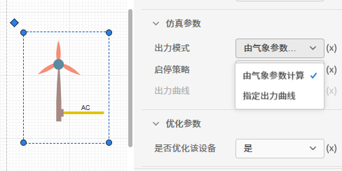

## 元件定义

该元件指水平轴三叶片风力发电机组，风力发电机是将风能转换为机械功，机械功带动转子旋转，最终输出交流电的电力设备。风力发电机一般由风轮、发电机、调向器(尾翼)、塔架、限速安全机构和储能装置等构件组成。

风机的风速功率模型可用分段非线性的特定形状曲线函数来表示：

**二次函数模型**
 $$
 P=0\qquad(u≤u_ci 或 u≥u_co )
 $$

$$
P=\frac{u^2}{(u_R^3-u_{ci}^2 )}P_R-\frac{u_{ci}^2}{(u_R^2-u_ci^2 )}P_R\qquad(u_ci≤u≤u_R)
$$
 
$$
P=P_R\qquad(u_R<u<u_{co} )
$$

**三次函数模型**
 $$
 P=0\qquad(u≤u_ci 或 u≥u_co )
 $$

$$
P=\frac{u^3}{(u_R^3-u_{ci}^3 )}P_R-\frac{u_{ci}^3}{(u_R^3-u_ci^3 )}P_R\qquad(u_ci≤u≤u_R)
$$
 
 $$
 P=P_R\qquad(u_R<u<u_{co} )
 $$

式中，u为风机轮毂高度处的风速；$u_{ci}$为切入风速；$u_{co}$为切出风速；$u_R$为额定风速；$P_R$为额定输出功率

## 元件说明

风机元件参数标签页包括**属性**、**参数**、**引脚**三类参数，下面对每类参数进行详细说明。

### 属性

CloudPSS 提供了一套统一的元件属性功能，关于元件属性参数的配置，详见[元件属性配置](/docs/docs/software/xstudio/simstudio/basic/moduleEncapsulation/index.md)页面。

### 参数

#### 设备参数

| 参数名 | 键值 (key) | 单位 | 备注 | 类型 | 描述 |
| :--- | :--- | :--- | :--: | :--- | :--- |
| 生产厂商 | `manufacturer` |  | 生产厂商 | 文本 | 生产厂商 |
| 设备型号 | `equipType` |  | 设备型号 | 文本 | 设备型号 |
| 风速功率模型 | `TurbinePowerModel` |  | 风速功率模型 | 选择 | 提供三种模型可选，二次曲线模型：`QuadraticPowerCurve`, 三次曲线模型:`CubicPowerCurve`, 厂家功率曲线:`ManufacturerPowerCurve` |
| 轮毂高度 | `HubHeight` | m | 轮毂高度 | 实数 | 轮毂高度 |
| 功率因数 | `PowerFactor` |  | 功率因数 | 实数 | 功率因数，范围为0-1，一般在0.9-1 |
| 额定发电量 | `RatedPowerGenerating` | kW | 额定发电量 | 实数 | 选择二次曲线/三次曲线模型时生效 |
| 额定风速 | `RatedWindSpeed` | m/s | 额定风速 | 实数 | 选择二次曲线/三次曲线模型时生效 |
| 切入风速 | `CutinWindSpeed` | m/s | 切入风速 | 实数 | 选择二次曲线/三次曲线模型时生效 |
| 切出风速 | `CutoutWindSpeed` | m/s | 切出风速 | 实数 | 选择二次曲线/三次曲线模型时生效 |
| 厂家功率曲线 | `PowerCurveData` |  | 厂家提供的风速功率曲线 | 表格 | 厂家提供的风速功率曲线,首行为切入风速及其功率，末行为切出风速及其功率，表格**最少三行**，选择**厂家功率曲线**时生效 |
| 采购成本 | `PurchaseCost` | 万元/台 | 采购成本 | 实数 | 采购成本 |
| 固定运维成本 | `FixedOMCost` | 万元/年 | 固定运维成本 | 实数 | 设备固定运维成本 |
| 可变运维成本 | `VariableOMCost` | 元/kWh | 可变运维成本 | 实数 | 设备可变运维成本 |

#### 基础参数

| 参数名 | 键值 (key) | 单位 | 备注 | 类型 | 描述 |
| :--- | :--- | :--- | :--: | :--- | :--- |
| 元件名称 | `CompName` |  | 元件名称 | 文本 | 元件名称 |
| 元件类型 | `CompType` |  | 选择元件类型 | 选择 | 选择**交流元件**时输出交流电，为**交流系统**；选择**直流元件**时输出直流电，为**直流系统**。 |
| 设备配置台数 | `DeivceNumber` | 台 | 设备配置台数 | 自然数 | 设备配置台数 |
| 待选设备类型 | `DeviceSelection` |  | 从设备库中选择设备类型 | 选择 | **选择数据管理模块录入的设备型号**，将风机元件的厂家、产品型号、额定运行参数自动绑定为对应设备在数据管理模块中录入的参数。|

#### 规划参数

在规划参数中编辑风机的仿真边界条件，主要包含**运行方式**和**运行策略曲线**。

| 参数名 | 键值 (key)  | 单位 | 备注 | 类型 | 描述 |
| :--- | :--- | :--- | :--: | :--- | :--- |
| 出力模式 | `PowerMode` |  | 选择风机的出力模式 | 选择 | 在输入仿真运行策略前需要指定设备运行模式。有**由气象数据计算**和**指定出力曲线**两种模式。若选择**由气象数据计算**，则风机出力根据气象数据计算得到。若用户已经计算或得到了风机的出力曲线，可以修改为**指定出力曲线模式**，在**出力曲线**参数中录入出力曲线即可。|
| 运行策略 | `OperatePara` |  | 配置风机在不同时刻的设备启停策略 | 表格 | 仅当**出力模式**项为气象数据计算时生效，在表格中录入**各个时间段对应的设备启停策略**。 **开始时刻**对应每个仿真时刻，**启停设备台数**不能超过**设备配置台数**。|
| 出力曲线 | `PowerCurve` |  | 自定义风机的出力曲线 | 表格 | 仅当**出力模式**项为**指定出力曲线**时生效，在表格中录入**各个时间段对应的风机的出力**。 **开始时刻**对应每个仿真时刻。|

#### 优化参数

在优化参数中编辑风机的优化参数。

| 参数名 | 键值 (key)  | 单位 | 备注 | 类型 | 描述 |
| :--- | :--- | :--- | :--: | :--- | :--- |
| 是否优化该设备 | `OptimizationChoice` |  | 是否对风机元件的运行方式进行优化 | 选择 | 仅当规划参数组的**出力模式**项为**由气象数据计算**时生效。选择**是**，则设备的运行策略由系统优化得到，不读取规划参数中设置的运行模式和运行策略；选择**否**，则系统按照规划参数的运行模式和运行策略运行。|

### 引脚

风机只有一个**电接口**引脚，用于将风机元件与其他电设备连接，支持**线连接**和**信号名**的连接方式。

引脚的**名称、键值、维度、定义描述**的详细说明如下表所示。

| 引脚名 | 键值 (key)  | 维度 | 描述 |
| :--- | :--: | :--- | :--- |
| 电接口 | `DC/AC` | 1×1 | 可以在引脚处输入相同的字符使得风机与其他电元件相连，当基础参数**元件类型**项是**直流元件**时，键值为**DC**；**元件类型**项是**交流元件**时，键值为**AC**。|

## 常见问题

平台风机出力计算准确吗？  
:    风机的出力涉及多个方面，包括气象条件和风机功率计算模型等。
:    1. 准确的气象数据至关重要，最重要的是风机实际安装地点的测风塔风速数据。但一般缺少测风塔实测数据，可用高精度的风俗数据，而商业软件的风速数据的时间空间精度和分辨率都不够。传统商业软件采用中尺度风速数据，采用大气插值模拟等方法获取特定地点特定高度的风速数据。平台选用中尺度数据，仅供参考。
:    2. 准确的风资源评估尤为重要。一般来说，获取测风塔准确风速后，利用风廓线模型或均匀风模型，收集整理地理地形 GIS 数据、湍流强度、风剪切、风向等边界条件数据，录入到风资源软件（windsim、WT 或 WASP 等）或CFD 软件中，划分网格后利用 RANS 等 CFD 模型，对风机实际地点风速进行准确计算模拟。平台内置风廓线模型，无风资源评估功能。
:    3. 风机功率模型非常重要。一般在可研阶段，主要利用风机厂家提供的动态功率曲线计算风机功率，然后再利用综合折损系数进行折算。 功率曲线是评价风电机组运行特性的重要技术指标，表现为风电机组在不同风速下的发电有功功率大小，功率曲线分为静态功率曲线和动态功率曲线，风速模型视为不随时间变化的稳定值时，按照从切入风速至切出风速的最佳叶尖速比和功率系数，可计算出不同风速对应的功率值，将得到的风速和功率值数据对绘制成功率曲线图，即为风电机组的静态功率曲线。静态功率曲线忽略了风速的湍流特性，是风电机组理想情况下的机组出力特性。当风速模型视为随时间变化的波动值时，将所有风速按照 0.5m/s 进行分组，并计算出每个风速组内所有风速的频率和平均功率值，绘制出的功率曲线图即为风电机组的动态功率曲线。动态功率曲线考虑到了风速的随机性，与静态功率曲线相比，更符合风电机组实际运行情况。风机发电功率受到地形地貌、湍流、障碍物、尾流、风向、空气密度、大气稳定度等诸多因素影响。风机厂家一般会提供0.5m/s间隔的静态功率曲线和特定湍流强度的动态功率平均曲线。
:    4. 平台计算的风机功率为理想出力。实际出力还需要考虑风机的折损。风机的综合折损主要包括：空气密度折减、控制和湍流折减、叶片污染折减、风电机组可利用率折减、风电机组功率曲线保证率折减、场用电、线损等折减、气候影响折减、软件计算误差折减。一般综合折损系数可取 75%。另外，尾流折损一般采用尾流解析模型或 CFD 软件计算，经验值可取 5-10%，因此风电的总体折减系数约70%；平台为理想出力模型，未考虑综合折损。

平台风机是什么类型？
:   平台风机为水平轴三叶片风力发电机组。

风机的交直流元件有什么区别？

:   选择交流时输出交流电，选择直流时输出直流电。在能量流计算过程中均为 PQ 节点。

    注意，交流元件和直流元件不能直接相连。

风机元件在规划设计平台使用时需要配置哪些元件参数？数据管理模块需要配置哪些数据？

:   在对风机元件进行仿真模拟前，务必录入编辑元件的**基础参数**和**规划参数**；

    在数据管理模块需要配置**光伏设备**的**额定运行参数**。并在基础参数中绑定数据管理模块的光伏设备。

风机元件的运行方式有哪几种配置方式？

:   共有 3 种

:   

:   1. **指定出力曲线**

        若用户已经有风机的出力曲线，此时风机元件的运行方式可完全由用户自己设定。  
        只需要将**规划参数**的**出力模式**项设置为**指定出力曲线**，并在**出力曲线**项中录入**各个时间段对应的风机出力**。此时基础参数无效，也无需优化，**优化参数被禁用**。
        
:   2. **出力由气象数据计算得到，运行方式不进行优化**

        此时风机元件的运行方式由气象数据和启停策略计算得到。只需要将**规划参数**的**出力模式**项设置为**由气象数据计算**，配置光伏板的跟踪方式、光伏板倾斜角等与气象有关的参数，并在**运行策略**项中录入**各个时间段对应的设备启停策**即可。 

:   3. **出力由气象数据计算得到，运行方式优化**

        此时风机元件的出力由气象数据计算，但是**不读取规划参数的设备启停策略**，设备启停策略由系统优化得到，主要应用于有弃风弃光的场景，调整设备启停以减小弃风弃光。需要将**优化参数**的**是否优化该设备**项设置为**是**即可。

启停策略和出力曲线的开始时刻必须和仿真时刻一致吗？

:   **建议保持一致**。若启停策略和出力曲线的开始时刻与仿真时刻不一致，平台会**自动采用插值和外推算法填充**。    特别注意：对于启停策略和出力曲线，在仿真时刻之外的时间段策略，为**前平推和后平推**，即，策略之前的数值始终为策略的第一个值，策略之后的数值始终为策略里最后一个值。
