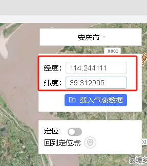

本节主要介绍气象数据库的功能和使用方法，并对使用过程中遇到的常见问题进行解答。

## 功能定义

通过设置项目所在地的位置信息，基于平台内置的气象数据集获取目标位置处的历史年气象数据，并支持用户二次编辑和修改，这些气象数据可用于后续仿真时的新能源出力测算、建筑物热交换量计算等环节。

## 功能说明

在用户从个人中心打开项目后，默认首先进入数据管理模块的气象数据库，如下图所示。

### 地点

当选中**地点**栏时，会在页面中央显示第三方地图插件，用于定位当前项目的位置信息。用户可以通过以下三种方式进行项目定位：

1. 通过搜索或选择目的地城市名进行定位。

2. 输入目的地的经纬度信息。

3. 通过地图组件的拖动、缩放、位移等功能进行手动定位。
   

:::info
地图组件仅在联网环境下才能使用。
:::

确定实际项目地点后，点击**载入气象数据**按钮载入气象数据。因数据量大，等待一段时间后载入气象数据成功后回自动进入**气象数据**栏展示。

### 气象数据

在**气象数据**栏下，中间的表格默认显示 2021-01-01 当天的气象数据，如需切换显示日期可使用右上角的年月日下拉框，平台默认提供了 2016-2021 年的气象数据。下方的图形控件则显示了当前日期不同气象要素的时序变化曲线，用户可通过下方的选择框进行要素类别的切换。

以上的气象数据也支持用户进行二次编辑和修改，通过点击右上方**编辑**按钮，可以使气象数据表格为处可编辑状态，此时用户可以采用类似编辑 excel 表格的形式编辑目标数据，编辑后平台回自动校验用户编辑的**数据合法性**，数据格式不对时会提示**验证错误，请检查格式!**，关闭**编辑**按钮后，平台会自动更新并提示**更新数据成功**。

气象数据页面左上方的工具栏**导出气象数据**按钮可以气象数据导出为 **excel** 文件，并支持用户上传气象数据，具体格式参考导出的文件。

## 常见问题

为什么地点模块空白，不显示地图？  
:   地图插件需要联网使用，若您的服务器设备无法连接 Internet 网络，您可以通过输入项目地经纬度坐标，同样可以载入气象数据。

已有的气象数据如何上传，平台是否会泄露？  
:   1. 需要按照平台默认的格式才能上传。若您的气象数据类别与平台一致，您可以下载已经载入的气象数据文件，将已有的数据替换下载的文件后上传；
    2. 若您在公网使用 IESLab 平台，数据将上传至公有云服务器上您的账户下，为了您的数据安全隐私，建议您购买使用服务器版本，数据将存储至您本地的服务器中，更好地保障您的数据安全。

气象数据上传为什么失败？  
:   上传气象数据需要参考平台默认格式进行修改，并检验数据合法性，如时间和数字格式等。
   
气象数据是否准确？  
:   平台内置**中国大陆区域** 8760 小时数据由 NASA 的 **POWER**（`https://power.larc.nasa.gov`）和 **MERRA2**（`https://gmao.gsfc.nasa.gov/reanalysis/MERRA-2/`）项目提供，NASA地球表面辐照从地球外层的辐照计算得到，受云层及空气质量影响较大，相比于 PVSyst 内置的 **Meteonorm8** 气象数据库，约有 0-10% 的偏差。若用户已计算出准确的发电量，可在拓扑编辑模块的新能源元件（风机和光伏）处，**出力模式**设置为**指定出力曲线**。