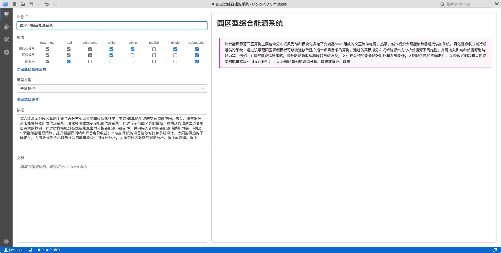

本节以**园区型综合能源系统项目**为例，介绍 SimStudio IES 综合能源系统项目的建模仿真和碳排放流分析方法。

## 项目背景

2020 年中国提出力争于**2030** 年前二氧化碳排放**达到峰值**，争取于**2060** 年前实现**碳中和**。中国生态环境部起草的《碳排放权交易管理办法（试行）》于 2021 年 2 月 1 日起施行，随着碳配额和碳交易等政策的实施，能源电力领域作为碳减排的主战场，急需对系统**碳排放**进行精准管理。本本节以**园区型综合能源系统项目**为例，利用 CloudPSS SimStudio 平台的**稳态能量流及碳排放流**求解器，对园区进行建模仿真，绘制碳排放流桑基图并分析园区碳减排潜力，为碳排放科学化、精准化计算管理提供支撑，绘制碳排放路径，分析减排潜力，并为决策者在碳排放政策、定价等方面提供参考依据。

碳排放管理的关键在于**碳排放的科学计算**，目前碳排放责任主要归为**直接排放的源侧或生产侧**，该方法仍存在较多的不合理和不公平。一般认为**公平合理的碳排放责任分摊机制**，应该满足如下几个原则：1. **碳排放总量守恒**；2. **平等对待**：若参与成员的行为导致直接碳排放增加或减少，则该成员的碳排放责任也响应增加或减少；3. **公平激励**：激励促进“源-网-荷”侧共同参与碳减排。

虽然能源负荷侧并没有直接产生碳排放，但能源生产是为了满足负荷需求，负荷侧是碳排放的“因”，生产侧是碳排放的“果”。有人提出将**碳排放责任归于负荷侧**。目前负荷侧碳排放责任分摊主要有以下几种机制：一是**负荷均摊**，该方法简单粗暴，且满足基本原则；二是从**合作博弈**的角度出发，将全系统碳排放量分摊给所有负荷成员，通过合作博弈如Shapley值和广义核仁等方法分摊=；三是基于电价体系分析负荷对于系统总碳排放的**边际作用**分配碳排放责任；四是**碳轨迹追踪**，通过追踪从源到负荷的全过程，将碳排放责任分配到负荷侧。参考电力潮流，认为虚拟的“碳排放流”伴随着电力潮流传输至用户侧，提出了**碳排放流理论**。

CloudPSS SimStudio 平台在稳态能量流仿真内核基础上，实现了基于有向图论和向量跟踪的碳排放流计算方法，该方法能够定量追踪计算碳排放源对每个设备碳排放的贡献比例和大小。

## 项目描述

该项目为典型的园区型综合能源系统，其中电力系统部分为小型风机 + 屋顶光伏 + 储能的交直流混连系统，热力系统部分为热泵 + 燃气锅炉 + 屋顶太阳能集热器联合供热，并驱动热水型溴化锂吸收式制冷机配合储冷罐联合供冷。拟对园区的碳排放进行跟踪管理，结合碳配额和碳交易等政策，探索碳减排、碳交易的收益、园区用户的碳配额分配和定价。系统结构拓扑如下图所示：

## 仿真模拟

拓扑连接无误并录入仿真边界条件后，

边界条件设置完成后，切换到**运行**模块，在**方案**页面的**计算方案**选择**综合能源系统仿真模拟方案**，设定仿真时间及时间步，并点击**启动任务**启动计算。计算开始后，平台自动跳转到**结果**页面。

## 结果分析

SimStudio IES 在能量流计算的基础上，进一步研发了基于图计算的**碳足迹分析**内核，碳流计算完成后会自动处理结果数据，并自动绘制出**碳流桑基图**，以清晰展示碳排放的结构，有利于分析碳减排潜力和影响碳排放的关键因素，为**碳配额管理、碳排放达标及碳排放定价**提供理论依据。

从碳排放流桑基图中可以发现，主要由新能源电源供能的负荷的碳排放更低，光伏风机附近的直流电负荷的碳排放，低于离光伏风机远的交流住宅和学校负荷，但其负荷值却约为交流住宅和学校负荷的两倍，这是因为新能源电源的电不携带碳，会降低沿途的碳流密度，而交流外部电网主要由传统的火力发电等提供，携带碳。

进一步通过 SDK 获取计算结果，分析各时刻的碳排放密度发现：1. 由锅炉供能的负荷的碳排放，相比热泵等电热设备供热的负荷的碳排放更高，这是因为由于市电本身的碳流密度较低，且电制热电制冷设备的能效水平高，而燃气锅炉的碳流密度高，且设备能效低，因此碳排放较多； 2. 由溴化锂吸收式制冷机供冷的冷负荷相比热负荷则产生了更多的碳排放，这是因为吸收式制冷机的冷热比低于 1， 在换热过程损失了热能，且设备的碳排放责任在负荷侧结算，因此碳排放量进一步升高。