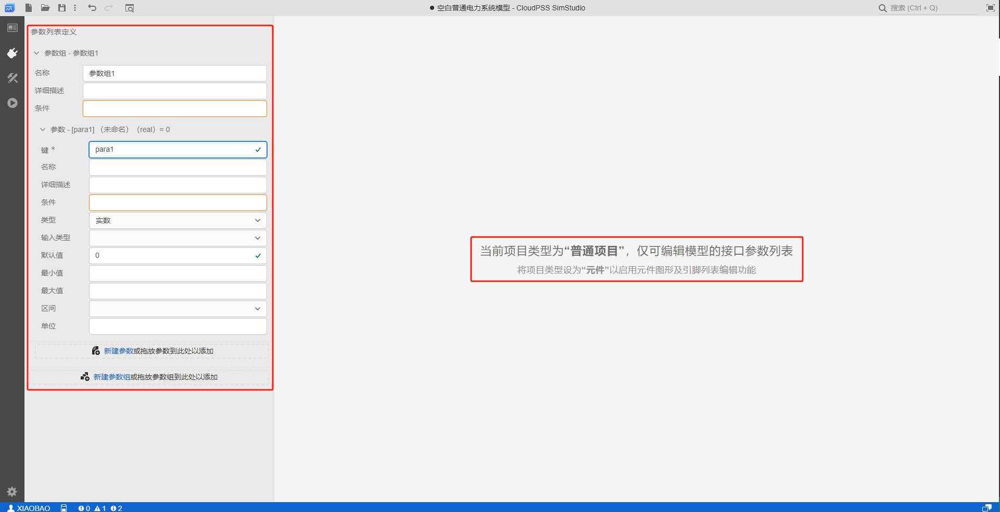

本文档介绍 **SimStudio 工作台** - **接口标签页** 的页面布局和功能概要。本页功能为进阶功能，在阅读前，请先熟悉 CloudPSS SimStudio 的 [参数、变量及引脚体系](../../../basic/parameterSystem/index.md)。 

## 页面功能

**接口标签页**用于定义当前模型的外部接口，包括：
+ 模型的**全局参数**；
+ 模型作为**子模块、元件**使用时的接口参数列表、接口引脚列表和元件图形。

**接口标签页**仅在当前模型类型为**普通模型**或**元件**时才会显示，且布局稍有区别。
+ 选择**普通模型**时，该页面仅提供模型**全局参数**的编辑功能；
+ 选择**元件**时，该页面同时提供模型**接口参数**、**接口引脚**和**元件图形设计**功能。

完整的**接口标签页**包含**参数列表定义**、**引脚列表定义**和**元件图形设计**三个功能区域。

### 参数列表定义 

参数列表定义栏用于配置当前项目的**全局参数**或作为元件使用时的**参数列表**。

参数列表定义栏提供**新建参数组**和**新建参数**功能。一个模型可以包含多个参数组，每个参数组下可以包含多个参数。参数类型包括**实数**、**整数**、**文本**、**布尔**、**选择**、**多选**、**表格**以及**虚拟引脚** 8 种类型。用户可在此处定义参数组的名称、详细描述、条件，以及参数的键、名称、详细描述、条件、类型、默认值等配置选项。参数组或参数的显示与否可**受条件表达式控制**。

列表中参数的作用域为当前项目层级，即在当前打开项目的**实现**、**运行**标签页下的任意参数处都可引用。引用格式为：`$`加`key`（**参数键**）。例如：
+ 定义某参数“电阻”的`key`为`R`，引用时使用`$R`。

参数列表定义主要有两种用法：
+ **用法1**: 用于给**普通模型**类项目添加**全局参数**，配合**参数方案配置**功能进行使用，用于多场景仿真等应用。具体操作方法参见 [参数方案配置](../../../basic/parameterCalculate/index.md) 帮助页。
+ **用法2**: 用于**模块封装**过程中的参数列表定义。具体使用方法参见 [定义元件/模块参数列表](../../../basic/moduleEncapsulation/parameter-list/index.md) 帮助页。

### 引脚列表定义

引脚列表定义栏用于配置当前模型作为元件使用时的引脚列表。该功能仅用于**模块封装**。

:::info 引脚
引脚是元件/模块与模型内部、模型外部的其它模块连接的接口。
特殊情况下，一个元件可以没有对外引脚。
:::

用户可在此处定义引脚名称、数据维数、数据类型、端口连接类型。引脚的显示与否可受条件表达式控制，以便根据不同的参数配置选项来显示不同的对外引脚。

具体使用方法参见 [定义元件/模块引脚列表](../../../basic/moduleEncapsulation/pins-list/index.md) 帮助页。

### 元件图形设计

元件图形设计区用于绘制当前模型作为元件使用时的图标。该功能仅用于**模块封装**。

图标绘制窗口提供了元件图标的绘图工具，支持图形、线、点、引脚、文字等元素的添加，以及线条/填充颜色的图形格式配置。各元素的显示与否可受条件表达式控制，以便根据不同的配置选项来显示不同的元件图标。

具体使用方法参见 [设计元件/模块图标](../../../basic/moduleEncapsulation/icon/index.md) 帮助页。

### 预览

在接口参数、引脚配置和图形设计过程中，可随时点击**工具栏** - **预览**按钮，或在**任意空白处右键**选择**预览**，方便及时预览生成的参数列表、引脚列表和元件图形。用户可在预览对话框中通过互动查看参数、引脚与图形各部分联动是否正常。

## 功能说明

接口标签页主要用于**参数方案配置**和**模块封装**两项功能，相关帮助参见：
+ [参数方案配置](../../../basic/parameterCalculate/index.md)
+ [模块封装](../../../basic/moduleEncapsulation/index.md)

<!-- ## 案例

:::warning
本页不需要案例。
:::

import Tabs from '@theme/Tabs';
import TabItem from '@theme/TabItem';

<Tabs>
<TabItem value="js" label="案例1">

元件项目接口配置

</TabItem>
</Tabs> -->
