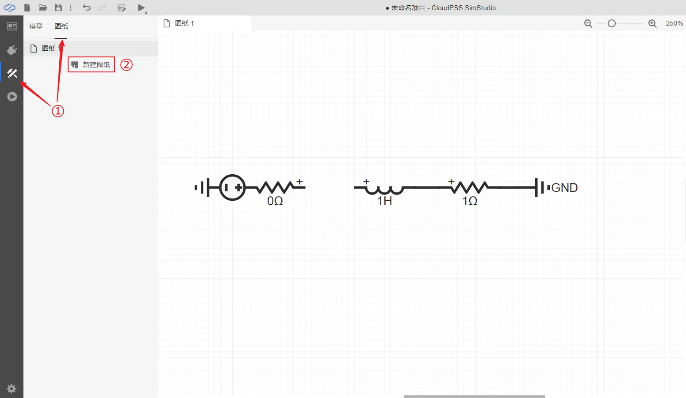
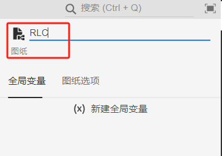
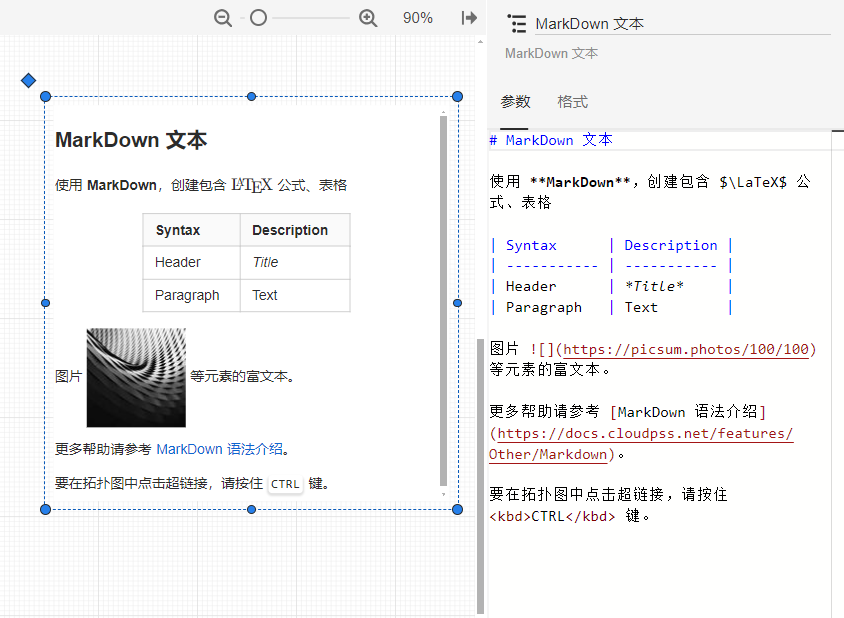

:::danger 批注
1. 注意规范命名，尤其是图片内部的标注、图片题注的命名，要与文字一致。例如，是“超链接”，没有“图纸超链接”这个官方名称。
2. 超链接不仅可以链接图纸，还可链接图纸上的元素（元件、连接线等）。这里的介绍逻辑应该统一介绍“链接”这个概念，教会用户如何获取图纸链接，或者任一元素的链接。
3. 读一下下面这句话，是不是太复杂了。在写帮助文档时，一定不要用长难句。建议把步骤1和2调换一下，这样，用户自然就能看到地址该填写在哪里。
+ 再点击图纸超链接元件并在右侧参数面板的目标地址栏中粘贴刚复制的待链接图纸的地址，该地址即就是图纸再浏览器地址栏#号后面的链接。完成后，双击图纸超链接元件，可直接跳转到所链接的图纸。
1. 分割线那里没写完吧
2. 按键用加粗即可，不用代码框。
:::

本文档介绍 **SimStudio 工作台** - **实现标签页** - **图纸** 相关功能。

## 页面功能

当单张仿真拓扑图过大时，考虑到美观和使用便捷性，可将规模较大的模型拓扑拆分为不同分区，分别放置于不同图纸中。**每个 SimStudio 项目至少包含一个图纸**。

SimStudio 项目中的图纸通过**图纸标签栏**进行统一管理。**图纸标签栏**以列表的形式显示当前项目包含的全部图纸。

## 功能说明

### 添加图纸

点击**实现标签页**左侧资源栏顶部的**图纸**，切换至图纸标签栏，点击**新建图纸**即可添加新的图纸。

一个 SimStudio 项目可添加任意数量的图纸。

### 删除图纸

在图纸标签栏鼠标右键点击待删除的图纸，在弹出菜单中点击**删除**即可删除选中的图纸。图纸删除后，该图纸内的所有元件也将随之删除。

### 重命名图纸

在图纸标签栏选中待重命名的图纸，在右侧属性栏顶部可编辑选中图纸的名称。

<!-- :::warning
图纸名称是图纸的唯一标识符，不能重复。这个对么？？？？？？？
::: -->

### 全局变量

点击图纸上的任意空白区域（取消选中图纸上的元素），在拓扑编辑区右侧属性栏点击**全局变量**标签，进入**全局变量卡**。

全局变量卡提供当前 SimStudio 项目下的全局变量编辑功能。其详细使用方法参见 [参数、变量及引脚体系](../../../../basic/parameterSystem/index.md) 帮助页。

### 图纸选项

点击图纸上的任意空白区域（取消选中图纸上的元素），在拓扑编辑区右侧属性栏点击**图纸选项**标签，进入**图纸选项卡**。

图纸选项卡支持配置图纸样式（背景、网格、分割线、操作习惯等）显示特性。

#### 背景颜色

配置图纸背景颜色。颜色包括主题色和自定义两类。

#### 网格类型

为图纸选择不同的网格底纹，包括隐藏、点阵、网状和双层网状 4 个选项。默认为**双层网状**。

#### 网格颜色

配置网格颜色。

#### 页面分割线

开启状态下，会在图纸中显示页面分割线。默认为**开**。

#### 默认拖拽画布

+ 开启状态下，按住鼠标左键可以拖拽画布；
+ 关闭状态下，按住 `Ctrl + 鼠标左键` 可以拖拽画布。默认为**关**。

#### 元件标签

开启后会在图纸中显示所有元件的标签（`Label`）。默认为**关**。

#### 引脚标签

开启后会在图纸中显示所有元件的**引脚标签**。默认为**开**。

## 辅助工具

SimStudio 还提供了图纸编辑的辅助工具，包括**超链接**、**分割线**和 **MarkDown 文本** 3 种，分别用于图纸上元素的快速定位、区域分隔和标注。

可在模型库的**工具**分组查看所支持的全部辅助工具。

### 超链接

当项目中图纸及图纸上的元素数量繁多时，为方便快速定位到某一特定图纸，SimStudio 提供了**超链接**功能。该功能类似于 Windows 系统的快捷方式，可以链接到图纸或图纸上的任意元素，如元件、连接线等。

**超链接**工具使用方法包含2步：

1. 获取被指向目标元素的**链接**
    + 获取图纸链接
    + 获取图纸上元素链接
2. 添加超链接
    + 在模型标签栏，从模型库的**工具**分组拖拽**超链接**元件至拓扑编辑区；
    + 在拓扑编辑区，点击选中添加的超链接元件，粘贴链接地址到其参数卡的**目标地址栏**。

创建超链接后，双击超链接元件，可快速定位到被指向的目标图纸或元素。

<!--获取被指向元素的与链接后，其使用方法如下。
+ 
+ 在图纸标签栏，鼠标右键点击待链接的图纸，在弹出菜单中点击**复制图纸链接**，即可复制当前图纸的链接；
+ 再点击图纸超链接元件并在右侧参数面板的**目标地址栏**中粘贴刚复制的待链接图纸的地址，该地址即就是图纸再浏览器地址栏#号后面的链接。完成后，双击图纸超链接元件，可直接跳转到所链接的图纸。-->

链接形状：配置超链接元件的形状，可选矩形、圆角矩形、椭圆、双椭圆、三椭圆样式，默认为矩形。

### 分割线

分割线元件用于分隔和组织的图纸，便于用户。其使用方法如下。
+ 在模型标签栏，从模型库的**工具**分组拖拽**分割线**元件至拓扑编辑区；
+ 点击分割线元件配置格式。

### MarkDown 文本

SimStudio 提供了 **MarkDown 文本**元件，支持用户通过 MarkDown 语法在图纸中添加文本、图片、公式、代码等元素，用于为模型添加标注或解释性说明。其使用方法如下。

+ 在模型标签栏，从模型库的**工具**分组拖拽**MarkDown 文本**元件至拓扑编辑区；
+ 在拓扑编辑区，点击选中添加的 MarkDown 文本元件，在其参数卡中输入 MarkDown 文本。

更多 Markdown 语法的帮助参见 [MarkDown 语法介绍](/docs/meta/10-edit-help/10-markdown-intro/index.md) 帮助页。

:::warning 注意

点击 MarkDown 文本元件中的超链接时，需要按住 `Ctrl` 键。

:::

## 常见问题

不同图纸间的元件如何连接？

:   图纸间的元件引脚通过标号进行连接。

<!-- 为什么全局变量设置无效？

:   在使用全局变量过程中，需要注意以下几点：
    1. 全局参数仅用于配置元件参数，因此必须在仿真开始前赋值，参数在仿真过程中不可改变。
    2. 全局变量之间可以互相引用。
    
     -->

