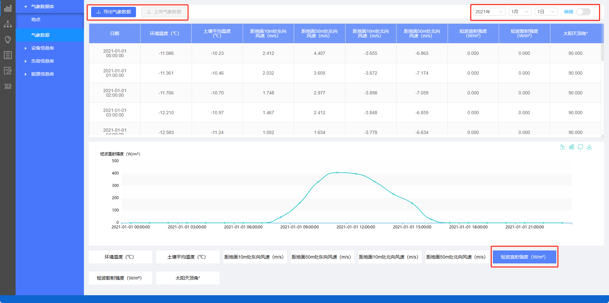
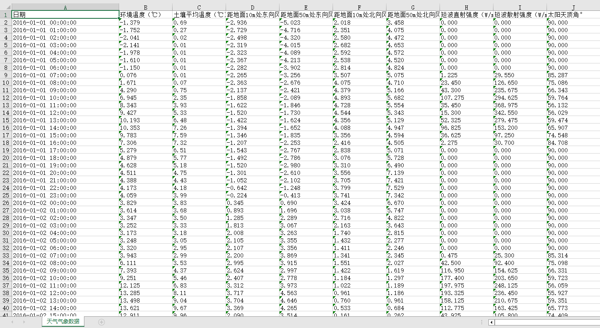

本节主要介绍气象数据库的**地点**和**气象数据**两个子模块功能，并通过常见问题答疑快速熟悉气象数据库的基本使用方法。

## 功能定义
通过地图选点定位，载入气象数据并查看编辑。

## 功能说明

打开项目项目后，首先进入数据管理模块的气象数据库。

气象数据库内置**中国大陆区域**近6年的8760小时数据，如环境温度、太阳辐射强度、风速等气象数据，主要用于新能源如光伏风电的计算，计算前需**载入**气象数据。主要分为**地点**和**气象数据**模块，**地点**模块利用地图插件进行项目地理位置确认，载入气象数据后则在**气象数据**模块查看相应气象数据及编辑。

### 地点

**地点**模块内置地图插件，服务器联网时可以对地图进行拖曳平移缩放等操作。

通过地图右上角的操作框，可以实现项目的选定定位，并载入气象数据。

点击操作框上侧，可以选择或输入项目地点所在城市，并切换到所选择的城市。

在操作框中间可以输入项目GPS经纬度坐标，地图会自动切换到输入的坐标。

确定地图后可以点击**定位**，确定实际项目地点，点击**载入气象数据**按钮载入气象数据。因数据量大，等待一段时间后载入气象数据成功后回自动进入“气象数据”模块展示。

### 气象数据

载入气象数据后，可以选择类别查看。

页面右上角可以切换年月日查看具体时间的气象数据。点击**编辑**，可以编辑气象数据，气象数据表格为可编辑状态，用户编辑后平台回自动校验用户编辑的**数据合法性**，数据格式不对时会提示**验证错误，请检查格式!**，关闭**编辑**按钮后，平台会自动更新并提示**更新数据成功**。

气象数据页面左上方的工具栏**导出气象数据**按钮可以气象数据导出为 **excel** 文件，并支持用户上传气象数据，具体格式参考导出的文件。

## 常见问题

1. 为什么地点模块空白，不显示地图？  
   地图插件需要联网使用，若您的服务器设备无法连接Internet网络，您可以通过输入项目地经纬度坐标，同样可以载入气象数据。

2. 气象数据上传为什么失败？  
   上传气象数据需要参考平台默认格式进行修改，并检验数据合法性，如时间和数字格式等。
   
3. 气象数据是否准确？  
   平台内置**中国大陆区域**近6年8760小时数据由 NASA 的**POWER**(https://power.larc.nasa.gov/) 和**MERRA2** (https://gmao.gsfc.nasa.gov/reanalysis/MERRA-2/) 等项目提供，NASA地球表面辐照从地球外层的辐照计算得到，受云层及空气质量影响较大，相比于 PVSyst 内置的**Meteonorm8**气象数据库，约有0—10%的偏差。若用户已计算出准确的发电量，可在拓扑编辑模块的新能源元件（风机和光伏）处，**出力模式**设置为**指定出力曲线**。