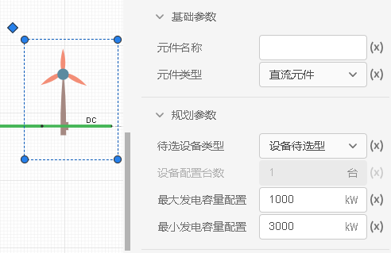

本节主要介绍 IESLab 平台综合能源系统规划优化的基本原理，包括优化模型的构成和优化算法的数学原理。

## 功能定义

IESLab 规划优化平台的方案优选功能，主要面向处于规划设计阶段的园区级至区域级的冷热电耦合供能系统（亦包含单一能源的供能系统），基于特定的优化目标（经济性或环保性）对综合能源系统中的设备进行选型定容，并对其在典型日下的运行方式进行优化。

## 功能说明

### 优化目标

IESLab 规划优化平台基于单目标优化模型，优化目标包括经济性或者环保性两种：

1. 经济性优化目标
   
   经济性优化目标将系统综合成本最小作为目标函数，所谓综合成本，是指考虑了一次性投资成本和年运行支出成本以及项目生命周期影响的等效年度成本。其计算公式可以表示为如下的数学模型：

   $$
    C_{ATC}=C_{inv}+C_{op}+C_{ful}
   $$

   式中，$C_{ATC}$为综合能源系统全生命周期成本，$C_{inv}$为设备投资建设成本，$C_{op}$为年维护成本（主要是设备的可变运维成本及固定运维成本），$C_{ful}$为年能耗成本（购电、购燃料的费用）。其中$C_{ATC}$可以表达为如下的关系式：

   $$
    {C_{inv}} = \sum\limits_{i = 1}^M {\frac{{r{{\left( {1 + r} \right)}^{{T_i}}}}}{{r{{\left( {1 + r} \right)}^{{T_i}}} - 1}}{\phi _i}} 
   $$

   式中$r$是贴现率，$T_i$是系统生命周期年限，$M$代表系统内待规划的设备种类数，$\phi _i$代表第$i$种设备的投资费用。

2. 环保性优化目标

   环保性优化目标将系统运行过程中所排放的二氧化碳、二氧化硫等污染物的总量最小作为目标函数，其计算公式可以表示为如下的数学模型：

   $$
    P_{total}=P_{CO2}+P_{SO2}+P_{NOX}+P_{d}
   $$

   式中，$P_{total}$代表总的年污染物排放量，$P_{CO2}$代表年二氧化碳排放量，$P_{SO2}$代表年二氧化硫排放量，$P_{NOX}$代表年氮化物排放量，$P_{d}$代表年粉尘排放量。

### 约束条件

IESLab 规划优化平台优化模型中的约束条件主要分为能量模型约束条件、设备运行约束条件两大类：

1. 能量模型约束
   
   能量模型约束主要是指设备的能量转换关系模型（比如制冷机组的电冷转换功率的能效比模型）和节点的能量平衡模型（直连的各设备需要满足供用能量的平衡关系）。

2. 设备运行约束条件
   
   设备运行约束条件主要包括设备的容量优化范围、不同类型设备的一些固有运行约束（比如蓄电池的始末容量差、燃料电池的极限功率、外部电源的最大购电量及上网电量等等）

### 决策变量

IESLab 规划优化平台优化模型中的决策变量主要包括设备选型变量、设备容量变量及运行方式变量三大类：

1. 设备选型变量
   
   设备选型变通常量是一个离散型的整数变量，其取值范围取决于该设备对应在**数据管理模块**中的待选设备型号池，如下图所示代表了所有**风机**设备的待选型号池，该案例中包含两种待选型号。

   

2. 设备容量变量
   
   设备容量变量通常也是离散型的整数变量，当设备选型确定时，设备容量变量的取值范围即为在用户指定的容量约束范围内，该设备可以配置的台数范围。以下图为例，用户指定的风机容量范围为**1000~3000kW**，对应上面两种型号的风机（远景的额定功率为**1200kW**，金风的额定功率为**2500kW**），则可配置的台数范围分别是**1~2台**和**1台**。

   

3. 运行方式变量
   
   运行方式变量是指设备在型号和容量确定的情况下，在各典型日上的运行调度方式，比如蓄电池在一天内的充放电策略、冷热机组在一天内的出力曲线等等。

### 模型求解

由于优化目标、约束条件都是线性的，而决策变量存在离散型的整数变量，因此在 IESLab 仿真规划平台采用**混合整数线性规划**的方法进行优化模型求解，在底层使用了商业的**COPT**优化求解器。关于求解器的详细资料可以参见<a href="https://www.shanshu.ai/solver">了解杉数求解器COPT</a>。

## 常见问题

IESLab 规划优化平台的元件模型与 IESLab 建模仿真平台的元件模型是否存在差异？
: IESLab 仿真规划平台主要面向综合能源系统的规划设计场景使用，在这一阶段通常对模型的准确性和精细度要求不高，因此规划优化平台的元件模型主要基于能量平衡关系，不会关注诸如电压、相角、流量、压力等状态参数。而 IESLab 建模仿真平台则面向更加复杂且精细的应用场景，其元件模型的构建需要考虑不同状态参数的耦合关系。

IESLab 规划优化平台可以自动生成系统内各设备及负荷的连接关系（供能方式）吗？
: 针对系统拓扑进行优化是非常复杂的，目前 IESLab 仿真规划平台还不具备这一功能，需要用户先手动搭建起拓扑模型后才能进行优化。