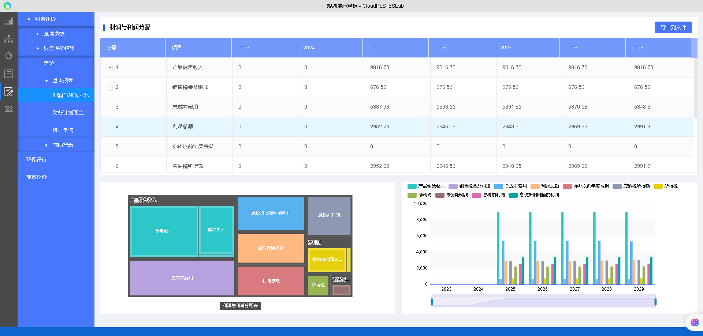

本节介绍了如何基于优化生成的方案结果进行更加细致的**财务评估**，同时查看财务分析得到的**经济性指标和报表**。阅读本文档，用户可以对利用本平台进行财务评估的步骤和过程有更加清晰的了解。

## 功能定义

通过设置项目生命周期、投资组成、资金来源等基础财务参数，利用优化得到的方案配置及运行数据，对项目进行全生命周期的财务评价，获得投资收益率、回报期等关键性财务指标，以及现金流量表等十余种财务报表。

## 功能说明

### 财务参数说明

下面主要对投资组成、资金来源、资产形式、生产成本、流动资金及财务费用、税率及附加等参数的含义进行说明

1. 投资组成
   
   投资组成参数设置页面如下图所示。

   
   
    | 参数名 | 含义 | 说明 |
    | :--- | :--- | :--- |
    | 投资批次及比例 | 表示项目在建设期内各年的投资比例 | 建设期的年限可在项目中心通过编辑项目的生命周期来进行设置，假设项目建设期为 N 年，则用户需编辑前 N-1 年的投资比例，确保不超过100% |
    | 建设投资明细 | 表示项目在建筑工程费、设备购置费、安装工程费和其他费用上的组成明细 | 系统会基于目标优选方案已测算出的设备投资费用生成一个初始投资明细表，用户可以在此基础上进行二次修改 |

2. 资金来源

    资金来源参数设置页面如下图所示。

    

    | 参数名 | 含义 | 说明 |
    | :--- | :--- | :--- |
    | 资本金比例 | 投资项目中自有资金占总投资的百分比 | 默认值**50%**，用户需填入**0~100**间的数值 |
    | 借款年利率 | 一年内借款金额需支付的利息与本金的比例 | 默认值**4.9%**，用户需填入**0~100**间的数值 |
    | 贷款年限 | 借款人用于偿还贷款的时间长度 | 默认值**15**，用户需填入**0~项目生命周期**间的数值 |
    | 宽限期 | 贷款发放后，在此期间内不需偿还本金的时间 | 默认值**2**，用户需填入**0~项目生命周期**间的数值 |
    | 计息次数 | 在一定时间内计算利息的频率 | 默认值**4**，用户需填入**大于0**的数值 |
    | 还款方式 | 贷款偿还方式 | 默认值**等额本金**，可选**等额本金**或者**等额本息** |

3. 资产形式
   
   资产形式参数设置页面如下图所示。

   

   | 参数名 | 含义 | 说明 |
   | :--- | :--- | :--- |
   | 固定资产比例 | 项目总资产中固定资产（如设备、建筑物）所占的比例 | 默认值**95%**，用户需填入**0~100**间的数值 |
   | 残值 | 固定资产使用完毕后的预计残存价值 | 默认值**5%**，用户需填入**0~100**间的数值 |
   | 折旧年限 | 固定资产分摊成本的期限，通常为其预计使用年限 | 默认值**15**，用户需填入**0~项目生命周期**间的数值 |
   | 摊销年限 | 无形资产（如版权、专利）在会计上分摊成本的时间期限 | 默认值**5**，用户需填入**0~项目生命周期**间的数值 |

4. 生产成本

   生产成本参数设置页面如下图所示。

   

   | 参数名 | 含义 | 说明 |
   | :--- | :--- | :--- |
   | 定员 | 项目或组织规定的正式员工人数 | 默认值**4**，用户需填入**大于0**的数值 |
   | 工资 | 员工为其劳动或服务获得的报酬 | 默认值**8**万元，用户需填入**大于0**的数值 |
   | 福利系数 | 员工基本工资之外，用于计算额外福利成本的比率 | 默认值**0**，用户需填入**大于0**的数值 |
   | 保险费率 | 按员工工资计算的公司支付的各种保险成本比例 | 默认值**0.25**，用户需填入**0~100**间的数值 |
   | 材料费 | 在生产或建设过程中消耗的原材料和辅助材料的费用 | 默认值**5**，用户需填入**大于0**的数值 |
   | 其它费用 | 包括运输费、差旅费等在内的非直接材料成本和非劳动成本 | 默认值**1**，用户需填入**大于0**的数值 |

5. 流动资金及财务费用

   流动资金及财务费用参数设置页面如下图所示。

   

   | 参数名 | 含义 | 说明 |
   | :--- | :--- | :--- |
   | 流动资金贷款比例 | 项目流动资金中借款占比，反映贷款依赖程度 | 默认值**70**，用户需填入**0~100**间的数值 |
   | 短期贷款及流动资金利率 | 短期贷款利息成本与流动资金总额的比率 | 默认值**4**，用户需填入**0~100**间的数值 |
   | 应收账款年周转次数 | 一年内应收账款回收成现金的频率 | 默认值**12**，用户需填入**大于0**的数值 |
   | 存货年周转次数 | 一年内公司销售并补充存货的次数 | 默认值**12**，用户需填入**大于0**的数值 |
   | 现金年周转次数 | 一年内现金完成一次收支循环的频率 | 默认值**12**，用户需填入**大于0**的数值 |
   | 应付账款年周转次数 | 一年内项目支付应付账款的频率 | 默认值**12**，用户需填入**大于0**的数值 |

6. 税率及附加
   
   税率及附加参数设置页面如下图所示。

   

   | 参数名 | 含义 | 说明 |
   | :--- | :--- | :--- |
   | 售电增值税税率 | 出售电力所需缴纳的增值税比例 | 默认值**18%**，用户需填入**0~100**间的数值 |
   | 售冷热增值税税率 | 销售冷热能源所适用的增值税比例 | 默认值**12%**，用户需填入**0~100**间的数值 |
   | 燃料增值税税率 | 购买燃料时应缴纳的增值税比率 | 默认值**10%**，用户需填入***0~100**间的数值 |
   | 材料费进项增值税率 | 用于生产的材料购买时可抵扣的增值税比率 | 默认值**17%**，用户需填入**0~100**间的数值 |
   | 法定公积金率 | 公司依法须提取的公积金与利润总额的固定比率 | 默认值**10%**，用户需填入**0~100**间的数值 |
   | 任意公积金率 | 公司自行决定提取的公积金与利润总额的比率 | 默认值**0%**，用户需填入**0~100**间的数值 |
   | 城市维护建设税税率 | 依据增值税、消费税和营业税缴纳的一定比例税费 | 默认值**5%**，用户需填入**0~100**间的数值 |
   | 教育费附加 | 企业基于应缴税额支付的用于教育支出的比率 | 默认值**5%**，用户需填入**0~100**间的数值 |
   | 地方教育附加 | 基于应缴税额的一定比例，专项用于地方教育支出 | 默认值**2%**，用户需填入**0~100**间的数值 |
   | 企业所得税税率 | 企业应缴纳的所得税与其利润总额的比例 | 默认值**25%**，用户需填入**0~100**间的数值 |
   | 基准折现率 | 用于计算现值或净现值时使用的参考利率 | 默认值**8%**，用户需填入**0~100**间的数值 |

### 财务评估结果查看

在完成基础财务参数设置以后，可以进入到**财务评价结果**->**概览**界面，点击右上角的**开始计算**按钮即可进行财务评估。评估的结果主要分为经济性指标和财务报表两类，下图展示了概览界面中的经济性指标组成情况。

在经济性指标方面，主要的指标构成和解释如下：

| 指标名 | 解释 | 
| :--- | :--- | 
| 工程动态投资 | 考虑时间价值的工程项目的总投资额 |
| 总投资收益率 | 项目总收益与总投资额的比率 |
| 资本金利润率 | 投资者投入资本的年利润与资本总额的比率 |
| 年销售收入 | 一年内通过销售产品或服务获得的总收入 |
| 平均总成本费用 | 平均每单位产品的成本，包括固定和变动成本 |
| 资本金内部收益率 | 使资本投资的现值等于零的折现率 |
| 项目投资内部收益率 | 使项目投资现值等于零的折现率 |
| 净现值 | 未来现金流按折现率折算至现在的净值 |
| 投资回报期 | 投资收益回收所需时间 |

在财务报表方面，分为基本报表和辅助报表两大类。主要的报表构成和解释如下：

| 指标名 | 解释 | 
| :--- | :--- | 
| 利润与利润分配表 | 展示公司在某一时间段的盈利能力和利润分配情况 |
| 财务计划现金流量表 | 记录和预测项目在特定时期的现金收入和支出 |
| 资产负债表 | 显示特定时间点项目的资产、负债和股东权益状况 |
| 投资使用计划与资金筹措表 | 列出项目资金的使用目标及筹资计划 |
| 借款还本付息计划表 | 详细说明贷款的还款本金、付息时间和金额 |
| 流动资金估算表 | 对项目短期内流动资产和流动负债的预估 |
| 资产折旧与摊销估算表 | 计算长期资产折旧和无形资产摊销的金额和时间表 |
| 总成本费用估算表 | 汇总项目运营过程中所有预期的成本和费用 |
| 项目总投资现金流量表 | 表示项目从开始到结束的所有投资相关现金流入和流出 |
| 项目资本金现金流量表 | 追踪与项目资本金相关的现金流动情况 |
| 营业收入、税金、附加和增值税估算表 | 项目通过正常经营活动产生的全部收入、计算需缴纳的各种税费和增值税 |

## 常见问题

方案评估模块的财务评价和方案优选模块的经济性优化目标的测算方法有什么区别？
:   方案优选模块的经济性测算是相对比较粗略的，只考虑到了设备投资成本、设备年运维成本、购电以及购燃料等成本，并进行了简单的考虑项目生命周期的投资测算，而方案评估模块的财务评价则是从更加全面的评价维度对整个项目进行了财务分析。通常进行到方案评估模块的财务评价时，需要用户根据实际的设备建设规模对不同的优选方案设定不同的基础财务参数。