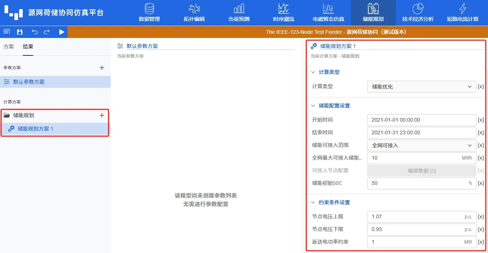
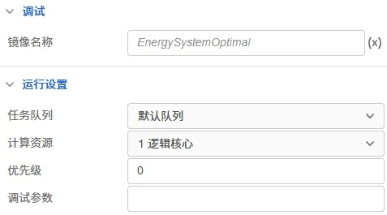

本节主要介绍 DSLab 源网荷储协同仿真平台进行储能规划时需要设置的计算全局参数，包括开始与结束预测时间、储能可接入范围、储能初始 SOC 以及相关约束条件参数设置等。

## 功能定义

设置 DSLab 储能规划的一些计算全局参数。

## 功能说明

在运行标签页，选中计算方案中的**储能规划方案**，可对储能规划方案进行设置。目前源网荷储的储能规划参数组划分为基本设置和运行设置，下面分别对其进行介绍。

### 基本设置

储能规划基本设置的参数包括**计算类型**、**储能配置设置**和**约束条件设置**，如下图所示：

| 参数名 | 含义 | 说明 |
| :--- | :--- | :--- | 
| 计算类型 | 计算的功能类型 | 可选项为**储能规划**（默认值）、**可接入节点列表生成**；可接入节点列表生成为储能可接入范围-自定义可接入节点和容量范围的前置数据预处理，分析生产配电系统拓扑，生成可接入节点配置的默认方案，方便用户编辑 |
| 开始时间 | 系统储能规划的开始时间 | 默认设置为 **2022-01-01 00:00:00** ，输入格式为 `yyyy-mm-dd hh:mm:ss` |
| 结束时间 | 系统储能规划的结束时间 | 默认设置为 **2022-12-31 23:00:00** ，输入格式为 `yyyy-mm-dd hh:mm:ss` |
| 储能可接入范围 | 储能可接入范围的可选项 | 可选项为**全网可接入**(默认值)和**自定义可接入节点和容量范围**|
| 全网最大可接入储能容量 | 全网可接入下，储能容量的限制 | 默认值为 **1**， 单位 **MWh** |
| 可接入节点配置 | 配置可接入储能的节点范围 | 默认为**空**，且不可编辑；当储能可接入范围被选为自定义可接入节点时，自动切换为可编辑模式 |
| 储能初始 SOC | 仿真储能初始 SOC | 默认值为 **50**, 单位 **%** |
| 节点电压上限 | 节点电压上限 | 默认值为1.07, 单位 **p.u.** |
| 节点电压下限 | 节点电压下限 | 默认值为0.93, 单位 **p.u.** |
| 返送电功率约束 | 向上级电网返送电功率约束 | 默认值为1, 单位 **MW** |

### 运行设置

储能规划运行设置的参数如下图所示：

| 参数名 | 含义 | 说明 |
| :--- | :--- | :--- | 
| 镜像名称 | 调试使用的镜像名称 | 默认值为**空** |
| 任务队列 | 任务运行使用的队列 | 默认设置为**默认队列** |
| 计算资源 | 任务运行使用的计算资源 | 默认设置为**1逻辑核心** |
| 优先级 | 任务运行的优先级 | 默认值为 0 |
| 调试参数 | 任务调试时使用的调试参数 | 默认为空 |

## 常见问题

什么时候需要进行**可接入节点列表生成**?
:   可接入节点列表生成为选择**储能可接入范围**为**自定义可接入节点和容量范围**时的前置数据预处理功能，分析生产配电系统拓扑，生成**可接入节点配置**的默认方案，方便用户编辑。用户可采用 excel 的编辑方式对默认参数方案进行修改，如下图所示。用户也可直接进行参数编辑，但需保证名称列的输入与对应拓扑元件名称一致。
