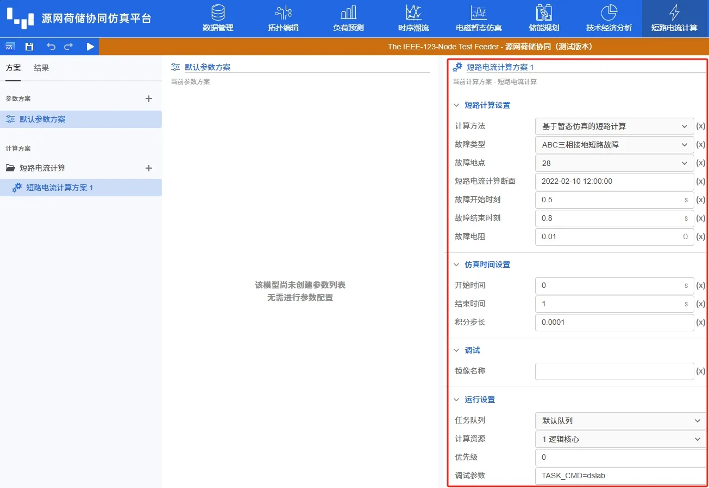
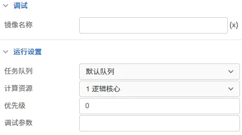

本节主要介绍 DSLab 源网荷储协同仿真平台进行短路电流计算时需要设置的计算全局参数，包括计算方法、故障类型、故障地点、短路电流计算断面以及相关运行参数设置等。

## 功能定义

设置 DSLab 短路电流计算的一些计算全局参数。

## 功能说明

在运行标签页，选中计算方案中的**短路电流计算方案**，可对短路电流计算方案进行设置。目前源网荷储的短路电流计算参数组可划分为计算参数和运行设置，下面分别对其进行介绍。

### 计算参数

短路电流计算的计算参数包括**短路计算设置**和**仿真时间设置**类，如下图所示：

| 参数名 | 含义 | 说明 |
| :--- | :--- | :--- | 
| 计算方法 | 短路电流计算的方法 | 可选项为**基于暂态仿真的短路计算**（默认值）和**基于潮流的短路计算** |
| 故障类型 | 短路故障类型 | 可选项为**A相接地故障**、**B相接地故障**、**C相接地故障**、**AB相接地短路故障**、**BC相接地短路故障**、**C相接地短路故障**和**ABC三相接地短路故障**（默认值） |
| 故障地点 | 短路故障节点 | 可选项为拓扑节点 |
| 短路电流计算断面 | 短路电流计算的断面 | 默认设置为 **2022-02-10 12:00:00** ，输入格式为 `yyyy-mm-dd hh:mm:ss` |
| 故障开始时刻 | 故障开始时刻 | 默认设置为 **0.5**，单位为**s** |
| 故障结束时刻 | 故障结束时刻 | 默认设置为 **0.8**，单位为**s** |
| 故障电阻 | 短路故障节点的电阻 | 默认设置为 30|
| 开始时间 | 仿真开始时间 | 默认设置为 **0**，单位为**s**|
| 结束时间 | 仿真结束时间 | 默认设置为 **1**，单位为**s** |
| 积分步长 | 仿真的积分步长 | 默认设置为 **0.0001** |

### 运行设置

短路电流计算运行设置的参数包括**调试**和**运行设置**类，如下图所示：

| 参数名 | 含义 | 说明 |
| :--- | :--- | :--- | 
| 镜像名称 | 调试使用的镜像名称 | 默认设置为空 |
| 任务队列 | 任务运行使用的队列 | 默认设置为**默认队列** |
| 计算资源 | 任务运行使用的计算资源 | 默认设置为**1逻辑核心** |
| 优先级 | 任务运行的优先级 | 默认值为 0 |
| 调试参数 | 任务调试时使用的调试参数 | 默认为空 |

## 常见问题
