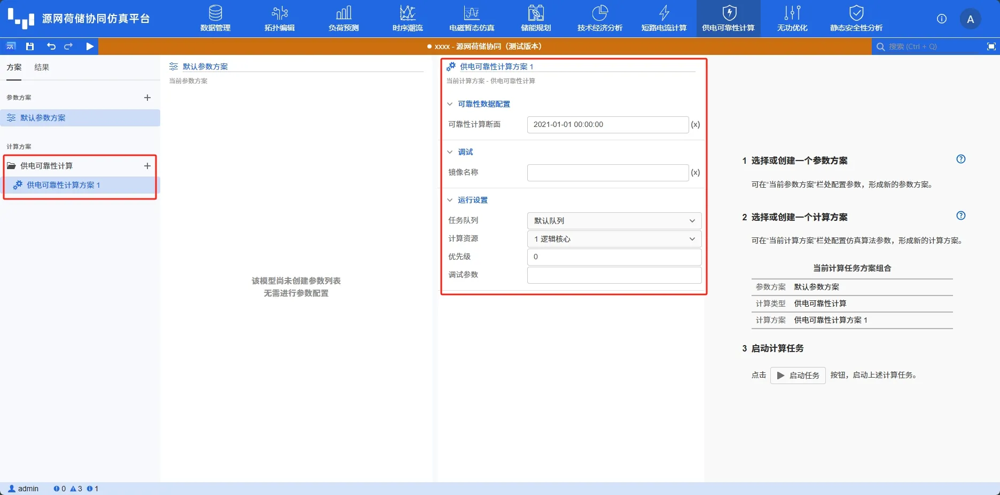
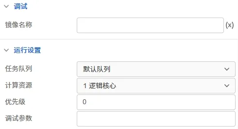

本节主要介绍 DSLab 源网荷储协同仿真平台进行供电可靠性计算时需要设置的计算全局参数，包括可靠性计算断面和相关运行参数设置等。

## 功能定义

设置 DSLab 供电可靠性计算的一些计算全局参数。

## 功能说明

在运行标签页，选中计算方案中的**供电可靠性计算方案**，可对供电可靠性计算方案进行设置。目前源网荷储的供电可靠性计算参数组分为基本设置和运行设置，下面分别对其进行介绍。

### 基本设置

供电可靠性计算基本设置的参数只需要可靠性计算断面，如下图所示：

| 参数名 | 含义 | 说明 |
| :--- | :--- | :--- | 
| 可靠性计算断面 | 可靠性计算的断面 | 默认设置为 **2021-01-01 00:00:00** ，输入格式为 `yyyy-mm-dd hh:mm:ss` |

### 运行设置

供电可靠性计算运行设置的参数包括**调试**与**运行设置**类，如下图所示：

| 参数名 | 含义 | 说明 |
| :--- | :--- | :--- | 
| 镜像名称 | 调试使用的镜像名称 | 默认设置为**空** |
| 任务队列 | 任务运行使用的队列 | 默认设置为**默认队列** |
| 计算资源 | 任务运行使用的计算资源 | 默认设置为**1逻辑核心** |
| 优先级 | 任务运行的优先级 | 默认值为 0 |
| 调试参数 | 任务调试时使用的调试参数 | 默认为空 |

<!-- ## 常见问题 -->

