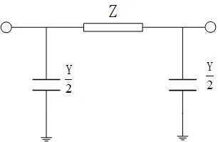

<!-- ## 元件定义

该元件指三相传输线的设备设施，配网系统三相传输线路按结构可分为**架空线路和电缆线路**两大类别，在配网系统中主要起传输电能的作用。元件类型可选交流或直流。

**三相传输线的Π型等值模型：**

$$
Z = ({r_{1} }^{*} + j{x_{1} }^{*})l
$$
$$
\frac{Y}{2} = \frac{jB^{*} }{2} = \frac{jb^{*}l}{2}
$$
式中：Z为阻抗，Y为导纳，${r_{1} }^{*}$为单位长度线路电阻，${x_{1} }^{*}$为单位长度线路电抗；$B^*$为单位长度接地电纳。

 -->

## 元件说明

### 属性

CloudPSS 元件包含统一的**属性**选项，其配置方法详见 [参数卡](docs/documents/software/10-xstudio/20-simstudio/40-workbench/20-function-zone/30-design-tab/30-param-panel/index.md) 页面。

### 参数

<!-- #### 设备参数

| 参数名 | 键值 (key) | 单位 | 备注 | 类型 | 描述 |
| :--- | :--- | :--- | :--: | :--- | :--- |
| 生产厂商 | `manufacturer` |  | 生产厂商 | 文本 | 生产厂商 |
| 设备型号 | `equipType` |  | 设备型号 | 文本 | 设备型号 |
| 单位长度电阻 | `resistanceOfUnitLength` | Ω/km | 单位长度电阻 | 实数 | 单位长度电阻 |
| 单位长度电抗 | `reactanceOfUnitLength` | Ω/km | 单位长度电抗 | 实数 | 单位长度电抗 |
| 单位长度容抗 | `chargingBofUnitLength` | MΩ*km | 单位长度容抗 | 实数 | 单位长度容抗 | -->

#### 基础参数

| 参数名 | 键值 (key) | 单位 | 备注 | 类型 | 描述 |
| :--- | :--- | :--- | :--: | :--- | :--- |
| 元件名称 | `Name` |  | 元件名称 | 文本 | 元件名称 |
| 待选设备类型 | `DeviceSelection` |  | 从设备库中选择设备类型 | 选择 | **选择数据管理模块录入的设备型号**，将自动绑定对应设备的厂家、产品型号和额定运行参数。|
| 线路长度 | `Length` | km | 线路长度 | 正数 | 线路长度 |
| 额定电压 | `Vbase` | kV | 额定电压 | 实数 | 输入额定电压（电压基值） |
| 是否新建 | `IsNew` |  | 是否新建 | 选择 | 是否新建 |
| 3 Phase Current Vector (Sending Terminal) [kA]-Switch | `IsSwitch` |  | 送端电流向量 | 开关 | 暂态仿真输出选择-传输线送端电流量测信号 |
| 3 Phase Current Vector (Receiving Terminal) [kA]-Switch | `IrSwitch` |  | 受端电流向量 | 开关 | 暂态仿真输出选择-传输线受端电流量测信号 |
| RMS Current (Sending Terminal) [kA]-Switch | `IsrmsSwitch` |  | 送端电流均方根值 | 开关 | 暂态仿真输出选择-传输线送端电流有效值量测信号的 |
| RMS Current (Receiving Terminal) [kA]-Switch | `IrrmsSwitch` |  | 受端电流均方根值 | 开关 | 暂态仿真输出选择-传输线受端电流有效值量测信号 |
| Active Power (Sending Terminal) [MW]-Switch | `PsSwitch` |  | 送端有功功率 | 开关 | 暂态仿真输出选择-传输线送端有功功率量测信号 |
| Reactive Power (Sending Terminal) [MVar]-Switch | `QsSwitch` |  | 送端无功功率 | 开关 | 暂态仿真输出选择-传输线送端无功功率量测信号 |
| Active Power (Receiving Terminal) [MW]-Switch | `PrSwitch` |  | 受端有功功率 | 开关 | 暂态仿真输出选择-传输线受端有功功率量测信号 |
| Reactive Power (Receiving Terminal) [MVar]-Switch | `QrSwitch` |  | 受端无功功率 | 开关 | 暂态仿真输出选择-传输线受端无功功率量测信号 |
| Active Power Losses [MW]-Switch | `PlossSwitch` |  | 有功功率线路损耗 | 开关 | 暂态仿真输出选择-传输线有功功率损耗量测信号 |
| Reactive Power Losses [MVar]-Switch | `QlossSwitch` |  | 无功功率线路损耗 | 开关 | 暂态仿真输出选择-传输线无功功率损耗量测信号 |

### 引脚

元件有两个**电接口**引脚，用于与其他电设备连接，支持**线连接**和**信号名**的连接方式。

引脚的**名称、键值、维度、定义描述**的详细说明如下表所示。

| 引脚名 | 键值 (key)  | 维度 | 描述 |
| :--- | :--: | :--- | :--- |
| Sending \(i\) Pin | `0` | 电气 | 3 x 1 | 送端连接端口 |
| Receiving \(j\) Pin | `1` | 电气 | 3 x 1 | 受端连接端口 |

<!-- ## 常见问题

是否区分架空线与地埋电缆？
:   不区分，IESLab 平台的设备主要关注**能量流的变化和转换**过程，主要建立能量转换的**通用简化模型**。暂未按照其子特征建立详细的子类模型。

是否考虑导线类别（铜芯，铝芯等）、电压等级，截面积，热稳定性，传输容量，载流量等参数？
:   不考虑。

是否有长导线模型？
:   不支持。

元件的交直流元件有什么区别？

:   选择交流时为交流电，选择直流时为直流电
    注意，交流元件和直流元件不能直接相连。

为什么结果中，三相传输线的线损非常大？
:   可能是线路参数设置有误，一般三相传输线损失在 10% 以内。 -->
