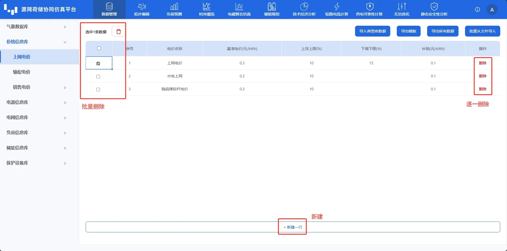
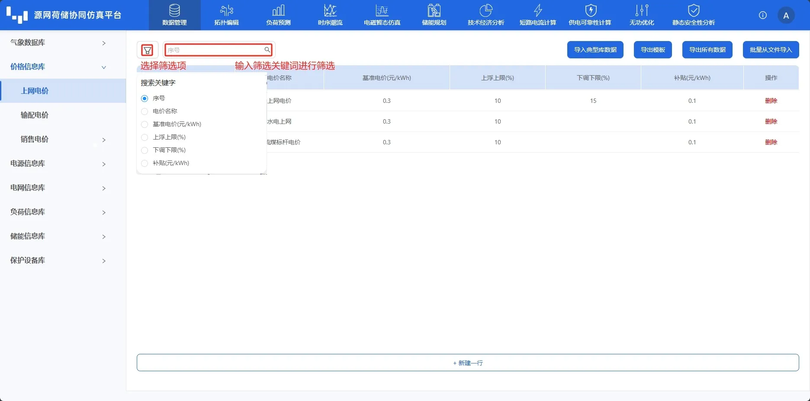
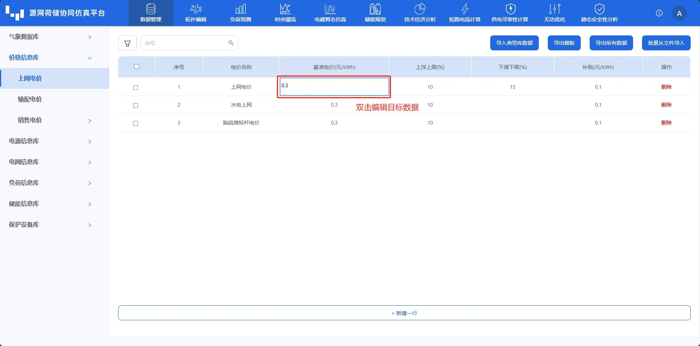
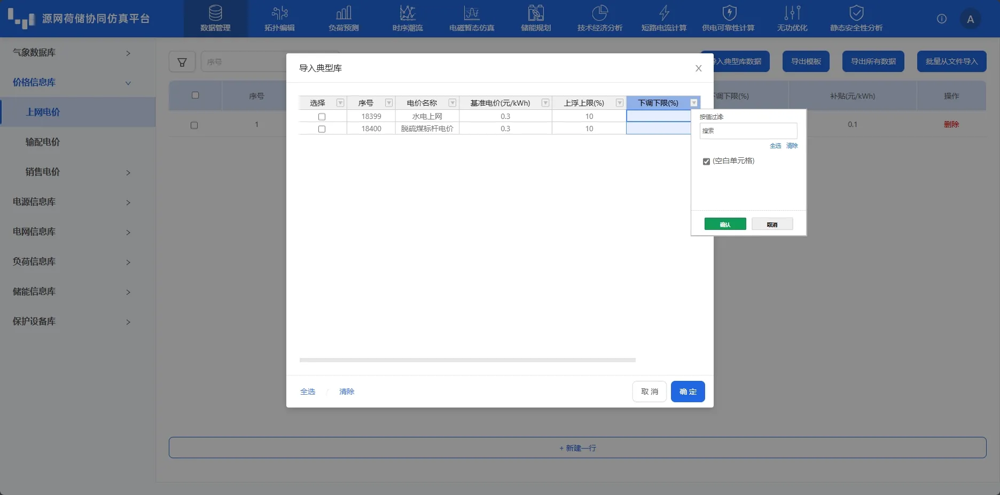
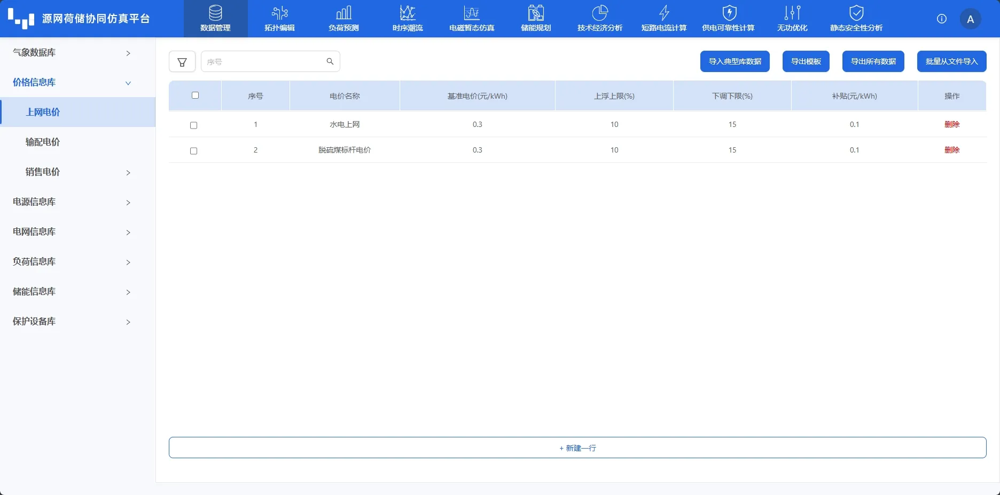
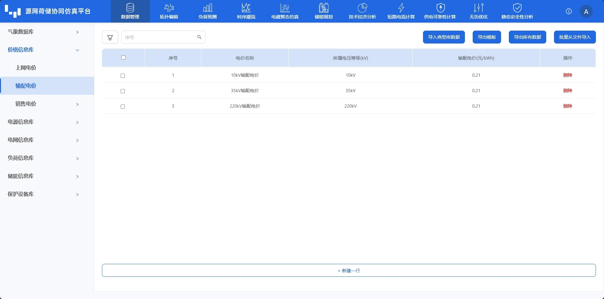
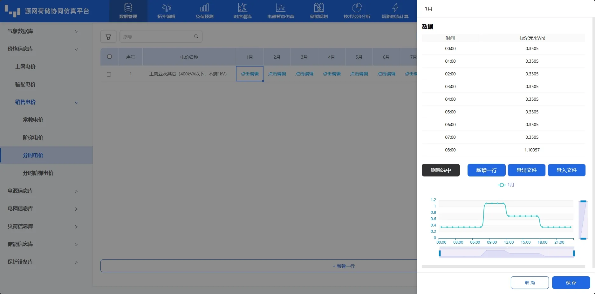
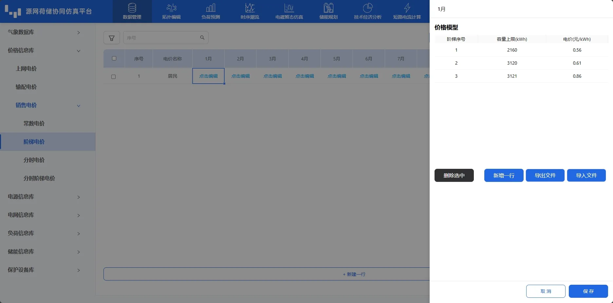
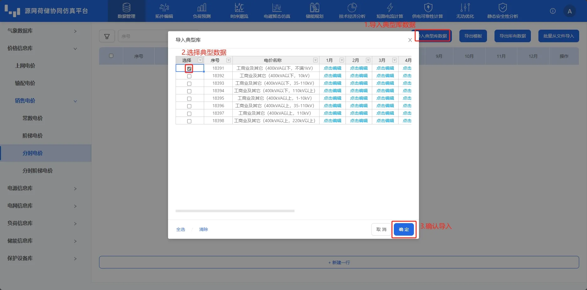

本节主要介绍价格信息库的计价模型、参数录入、编辑、导入及导出等功能使用方法，并通过常见问题答疑快速熟悉价格信息库的基本使用方法。

## 功能定义

用户可在价格信息库中录入、编辑和管理上网电价、输配电价、销售电价（常数电价、阶梯电价、分时电价、分时阶梯电价）等信息，用作拓扑编辑模块元件的价格关联模型。用户可在拓扑编辑模块的元件属性中选择对应价格模型进行绑定。

## 功能说明

### 价格信息管理

#### 新建与删除

打开价格信息库并选择价格类型后，进入价格信息管理页面。点击下方的**新建一行**快捷键，会自动创建一个新的价格模型。

可以通过批量删除或逐一删除的两种方式，删除价格模型，如下图所示。批量删除通过左侧选择框选择要删除的价格模型，并点击上方删除按钮进行删除；逐一删除则通过点击每行右侧的**删除**进行删除。

#### 搜索与筛选

点击页面左上方的**筛选**按钮，在弹出框中选择筛选项。然后在右侧**搜索输入框**中输入关键字，点击放大镜**🔍**或回车确定，即可进行模糊搜索或筛选（关键字不区分大小写）。清空输入框后，点击放大镜**🔍**或回车确定可显示所有信息。

### 价格参数编辑

用户可以采用类似编辑 excel 表格的形式编辑目标数据，编辑后平台回自动校验用户编辑的**数据合法性**，数据格式不对时会提示**验证错误，请检查格式!**。用户在编辑完数据后，单击空白区域，平台会自动保存编辑数据。

#### 导出与导入
在编辑区域右上方有**导入典型库数据**、**导出模板**、**导出所有数据**和**批量从文件导入**快捷键。

点击**导出模板**和**导出所有数据**会将价格数据模板或所有价格数据另存为 excel 文件。

点击**批量从文件导入**将会弹出文件选择框，选择价格参数 excel 文件后，平台将会自动校验文件格式，若格式无误会导入价格参数；若格式有误将会提示**表格格式不正确!**。用户可以先**导出模板**，参照导出模板的格式进行修改，再进行**批量从文件导入**。

点击右上方的**导入典型库数据**快捷键，在弹出的**典型库**选择框中，选择价格模型，点击**确定**导入选择模型。用户可以通过列名单元格中下拉选项框，输入关键字进行筛选，如下图所示。

### 上网电价

上网电价是发电企业与购电方进行上网电能结算的价格。\[2019\]1658 号文规定，自 2020 年 1 月 1 日起，取消煤电联动机制,改为“基准价+上下浮动”市场价格机制。基准价中包含脱硫、脱硝、除尘电价，由市场形成的上网电价,其包含脱硫、脱硝、除尘和超低排放电价。发改价格\[2021\]833号文明确规定2021年起，新核准备案的陆上风电、光伏项目实行平价上网，按当地燃煤发电基准价执行，可自愿通过参与市场化交易形成上网电价。

### 输配电价

输配电价是指电网企业提供输配电服务所收取的价格。

### 销售电价

销售电价模型平台提供了分月**常数电价**、**分时电价**、**阶梯电价**和**分时阶梯电价**。电网的计价模型则用于计算项目支出。

特别地，平台提供**两部制**电费计价模式，两部制电价分成**基本电价**与**电度电价**两部。基本电价一般是按照工业企业的变压器容量或最大需量作为计算电价的依据；电度电价，是按用实际用电量（有功电量）计算的电价。其中，平台的需量电费计价模型绑定**常数电价**，按照电负荷最大需量计算基础电费，最大需量的基本电费=需量电费计价模型×最大需量。

常数电价：即单一制电价，只按用户的用电量（有功电量）计收电费，其中电价中有的还实行峰谷分时电价。它适用于居民生活用电、照明用电、商业用电、非工业用电和普通工业用电等。

分时电价：即两部制电价中的一部分，按用户的有功用电量计收电费。在电度电价中，有的还实行峰谷分时电价及丰枯季节电价。适用于居民生活用电、商业用电、普通工业用电、大工业用户。

阶梯电价：根据用户用电量的不同，将用户划分为不同的阶梯，每个阶梯对应不同的电价。一般来说，低阶梯对应较低的电价，高阶梯对应较高的电价，用户消费超过某个阶梯后，按照该阶梯的电价计费。

分时阶梯电价：在阶梯电价的基础上，根据时间段的不同划分成不同的阶梯，每个阶梯对应不同的电价。这种模式能够更好地反映电力供需的变化情况，让用户在电力供应充足的时段使用电力，从而减轻电网负荷压力，降低用电成本。

## 案例

import Tabs from '@theme/Tabs';
import TabItem from '@theme/TabItem';

<Tabs>
<TabItem value="py" label="分时阶梯电价">

以典型项目的**分时阶梯电价**为例，说明相关用法。

1. 点击**导入典型库数据**后，选择工商业及其它（400kVA 以下，不满 1kV）并确定导入。
   
2. 编辑电价参数
分时阶梯电价计费规则较为复杂，在分时和阶梯电价的基础上，根据时间段的不同划分成不同的阶梯，每个阶梯对应不同的电价。这种模式能够更好地反映电力供需的变化情况，让用户在电力供应充足的时段使用电力，从而减轻电网负荷压力，降低用电成本。

3. 保存

</TabItem>
</Tabs>

## 文件下载

点击下载 zip 文件：[分时阶梯电价.xlsx](./tiered-time-limited-electricity-tariff.xlsx)

## 常见问题

典型库中是否包含所有城市的电价信息，能够自动补全？  
:    平台典型库内置了部分典型的电价信息，暂不支持自动补全所有城市的电价信息。
