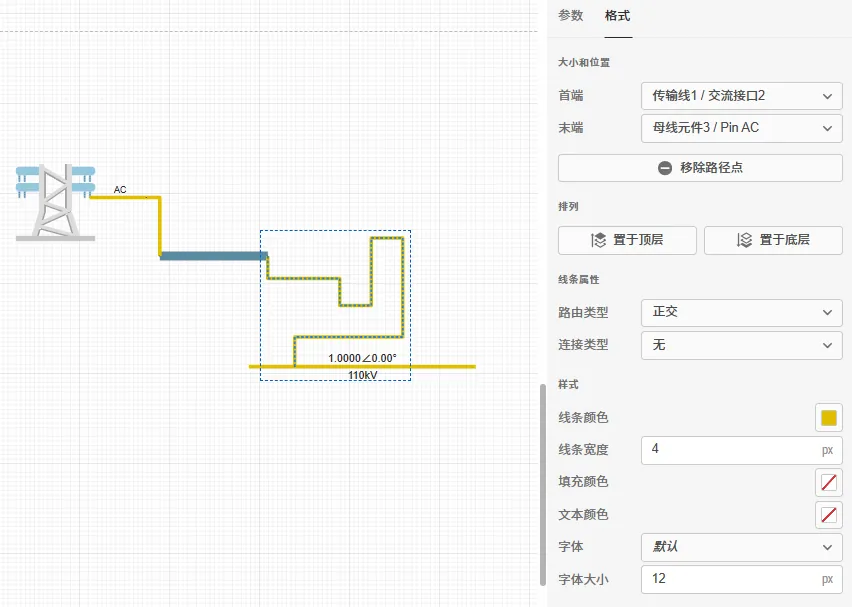
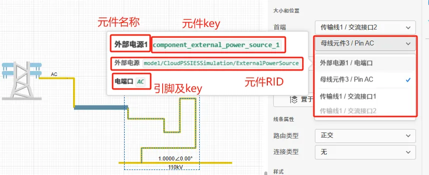
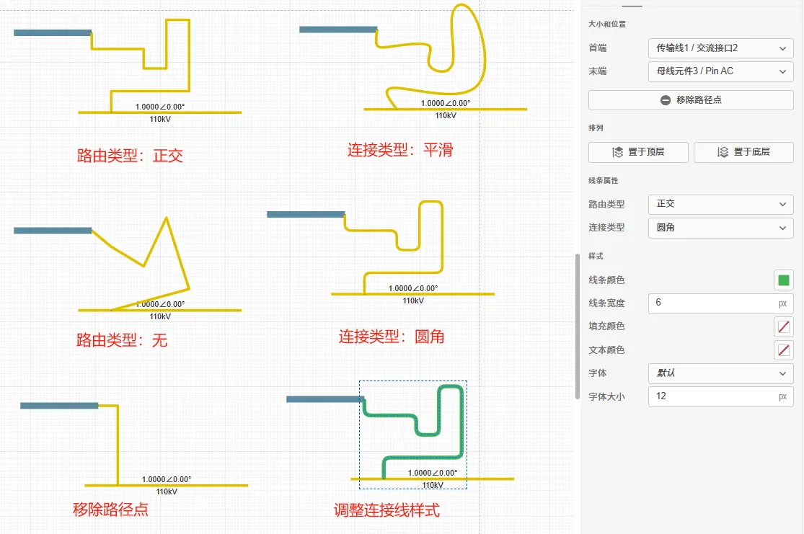
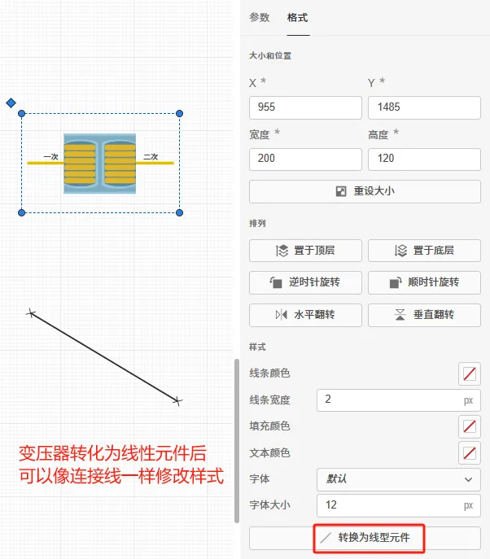
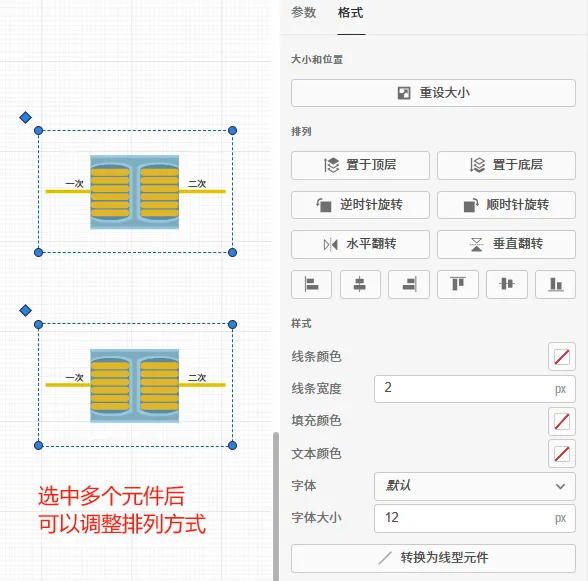

## 功能定义

格式卡主要负责对图纸中的连线和元件的格式进行设置。

## 功能说明

### 连线格式

打开算例项目，点击鼠标右键后选中元件与元件之间的连接线后右侧的属性配置区内会出现连线的格式卡。

#### 大小和位置

###### 首端/末端

可以选择连线的首末端，选项是当前图纸中所有元件的引脚，由元件标签名称/引脚`key`组成，鼠标悬停在选项上会显示出该引脚的元件标签名称、元件的`key`、元件类型、元件的`RID`、元件的引脚、元件的引脚、元件引脚的`key`。

###### 移除路径点

选中连线后在连线路径上单击鼠标左键可以在该处设置路径点，左键常按路径点可以拖动调整位置。点击移除路径点可以消除这条连线的所有路径点。

#### 排列

###### 置于顶/底层

调整元件所在的图层。

#### 线条属性

###### 路由类型

可选`无`或者`正交`，当连线的路由类型选择为`无`时，路径点之间会直接通过线段连接。

选择为`正交`时，路径点之间通过正交（水平或垂直）线段连接。

###### 连接类型

用于设置连接线的样式，可选`无`、`正交`或者`平滑`，当连线的连接类型选择为`无`时，连接线是线段；选择为`圆角`时，连线拐角处为圆角；选择`平滑`时，连接线为光滑的曲线。

#### 样式

连线样式主要包含线条颜色、线条宽度设置。

### 元件格式

点击鼠标右键后选中图纸中的元件后右侧的属性配置区内会出现元件的格式卡。

#### 大小和位置

用户可通过 `X` 和 `Y` 来修改元件在图纸中的位置，`X` 和 `Y` 是元件左上角顶点的坐标。图纸左上角顶点的坐标为 `X = 0`、`Y = 0`。

通过**宽度**和**高度**修改元件的大小，点击**重设大小**恢复元件默认大小。

:::info
由于 SimStudio 内置模型库中所有元件的大小都是 5 的整倍数，所有建议用户在修改元件大小的位置是配置为 5 的整数倍。
:::

#### 排列

当不同元件重叠在一起时，排列功能可以设置它们的重叠先后顺序，选择置于顶层或置于底层。排列功能还可以设置元件的旋转角度，可以点击顺时针旋转、逆时针旋转、水平翻转和垂直翻转按钮。

当框选多个元件及其间的连线时，排列功能可以设置它们的对齐方式和分布方式，如左对齐、水平居中、右对齐、顶端对齐、居中对齐、底端对齐、横向等距分布或纵向等距分布等。

#### 样式

##### 线条颜色

修改元件边框线条的颜色。

##### 线条宽度

修改元件边框线条的粗细。

##### 填充颜色

可以对元件的底色进行填充。

##### 文本颜色

修改元件内文字及元件标签名称的颜色。

##### 字体

修改元件内文字及元件标签名称的字体。

##### 字号

修改元件内文字及元件标签名称的字体大小。

##### 转换为线性元件

点击后可将该元件转换为连线。

## 常见问题

多端口元件能转换为线性元件吗？

:   多端口元件可以转换为线性元件，但是只有两个引脚可以连接，其余引脚无法连接，无法通过拓扑校验，因此多端口元件不支持被转换为线性元件。
